# Database Design - XR Future Forests Lab

## Overview

This document describes the PostgreSQL database schema for the XR Future Forests Lab. The database is organized into six schemas:

- **shared**: Reference tables used across all domains (locations, species, campaigns, plots, management and disturbance events)
- **pointclouds**: LiDAR scan data, scanner hardware, and processing variants
- **trees**: Tree measurement and simulation data with multi-stem support, phenology, deadwood, and ground vegetation
- **sensor**: Environmental sensor hardware and time-series readings
- **environments**: Environmental variants from sensor data or simulations
- **imagery**: Aerial and ground-based imagery with spatial metadata

### Key Design Principles

- **Schema Organization**: PostgreSQL schemas organize related tables for clarity and access control
- **Variant-Based Lineage**: Point clouds, trees, and environments use variant patterns for temporal tracking
- **Junction Tables**: Explicit junction tables link shared tables (ProcessParameters, AuditLog) to domain-specific variants
- **PostGIS Integration**: Geometry columns for spatial data (locations, tree positions, sensor placement)
- **Field-Level Auditing**: Comprehensive change tracking across all variant tables with IP and user agent tracking
- **External Integration**: Support for Aquarius API time-series data via ExternalID/ExternalMetadata columns
- **Sensor-Tree Linking**: Direct relationships between environmental sensors and individual trees for growth monitoring
- **Plot-Based Organization**: Sub-plot divisions within locations for detailed spatial analysis and research grids
- **Event Tracking**: Management and natural disturbance events linked to locations, plots, and individual trees

### Complete ERD Reference

For a comprehensive view of the entire database structure in a single diagram, see **[database_erd.dbml](./database-erd.dbml)** - visualize at [dbdiagram.io](https://dbdiagram.io/)

---

## Schema Organization

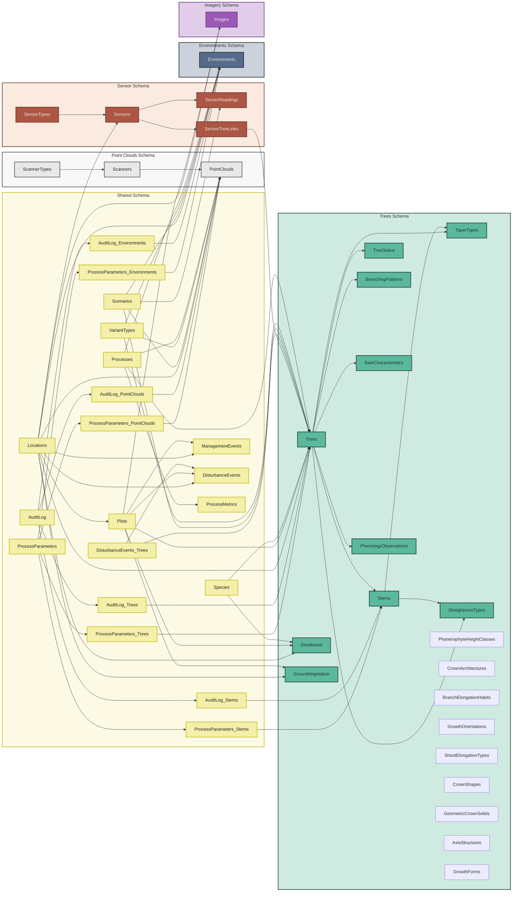
```mermaid
graph LR
    subgraph shared ["Shared Schema"]
        SL[Locations]
        SPL[Plots]
        SS[Species]
        SC[Scenarios]
        SVT[VariantTypes]
        SME[ManagementEvents]
        SDE[DisturbanceEvents]
        SDET[DisturbanceEvents_Trees]
        SAL[AuditLog]
        SP[Processes]
        SPP[ProcessParameters]
        SPM[ProcessMetrics]
        SPPPC[ProcessParameters_PointClouds]
        SPPT[ProcessParameters_Trees]
        SPPE[ProcessParameters_Environments]
        SPPS[ProcessParameters_Stems]
        SALPC[AuditLog_PointClouds]
        SALT[AuditLog_Trees]
        SALE[AuditLog_Environments]
        SALS[AuditLog_Stems]
    end

    subgraph pointclouds ["Point Clouds Schema"]
        PCST[ScannerTypes]
        PCS[Scanners]
        PCV[PointClouds]
    end

    subgraph trees ["Trees Schema"]
        TV[Trees]
        TST[Stems]
        TTS[TreeStatus]
        TTT[TaperTypes]
        TST2[StraightnessTypes]
        TBP[BranchingPatterns]
        TBC[BarkCharacteristics]
        TPH[PhenologyObservations]
        TDW[Deadwood]
        TGV[GroundVegetation]
        TPHC[PhanerophyteHeightClasses]
        TCA[CrownArchitectures]
        TBEH[BranchElongationHabits]
        TGO[GrowthOrientations]
        TSET[ShootElongationTypes]
        TCS[CrownShapes]
        TGCS[GeometricCrownSolids]
        TAS[AxisStructures]
        TGF[GrowthForms]
    end

    subgraph sensor ["Sensor Schema"]
        S[Sensors]
        SR[SensorReadings]
        SST[SensorTypes]
        STL[SensorTreeLinks]
    end

    subgraph environments ["Environments Schema"]
        EV[Environments]
    end

    subgraph imagery ["Imagery Schema"]
        IM[Images]
    end

    %% Junction table connections
    SPP --> SPPPC
    SPP --> SPPT
    SPP --> SPPE
    SPP --> SPPS
    SAL --> SALPC
    SAL --> SALT
    SAL --> SALE
    SAL --> SALS
    SPPPC --> PCV
    SPPT --> TV
    SPPE --> EV
    SPPS --> TST
    SALPC --> PCV
    SALT --> TV
    SALE --> EV
    SALS --> TST

    %% Cross-schema relationships
    SL --> SPL
    SL --> PCV
    SL --> TV
    SL --> S
    SL --> EV
    SL --> IM
    SL --> SME
    SL --> SDE
    SL --> TDW
    SL --> TGV
    SPL --> TV
    SPL --> SME
    SPL --> SDE
    SPL --> TDW
    SPL --> TGV
    SPL --> IM
    SS --> TV
    SS --> TDW
    SST --> S
    S --> SR
    S --> STL
    STL --> TV
    TV --> TST
    TV --> TTS
    TV --> TTT
    TV --> TST2
    TV --> TBP
    TV --> TBC
    TV --> TPH
    SDET --> SDE
    SDET --> TV
    PCST --> PCS
    PCS --> PCV
    TST --> TTT
    TST --> TST2
    SC --> PCV
    SC --> TV
    SC --> SR
    SC --> EV
    SVT --> PCV
    SVT --> TV
    SVT --> EV
    SP --> PCV
    SP --> TV
    SP --> EV
    SP --> SPM

    classDef sharedNodes fill:#F4EFA9,stroke:#c7bb1a,stroke-width:2px,color:#242424
    classDef pointcloudsNodes fill:#e8e8e8,stroke:#4f4f4f,stroke-width:2px,color:#242424
    classDef treesNodes fill:#5CB89C,stroke:#19392f,stroke-width:2px,color:#19392f
    classDef sensorNodes fill:#AD5643,stroke:#673428,stroke-width:2px,color:#e8e8e8
    classDef environmentsNodes fill:#566b8a,stroke:#181d26,stroke-width:2px,color:#e8e8e8
    classDef imageryNodes fill:#9B59B6,stroke:#6C3483,stroke-width:2px,color:#e8e8e8

    classDef sharedSubgraph fill:#F4EFA9,fill-opacity:0.3,stroke:#c7bb1a,stroke-width:2px
    classDef pointcloudsSubgraph fill:#e8e8e8,fill-opacity:0.3,stroke:#4f4f4f,stroke-width:2px
    classDef treesSubgraph fill:#5CB89C,fill-opacity:0.3,stroke:#19392f,stroke-width:2px
    classDef sensorSubgraph fill:#eeb896,fill-opacity:0.3,stroke:#673428,stroke-width:2px
    classDef environmentsSubgraph fill:#566b8a,fill-opacity:0.3,stroke:#181d26,stroke-width:2px
    classDef imagerySubgraph fill:#9B59B6,fill-opacity:0.3,stroke:#6C3483,stroke-width:2px

    class SL,SPL,SS,SC,SVT,SME,SDE,SDET,SAL,SP,SPP,SPM,SPPPC,SPPT,SPPE,SPPS,SALPC,SALT,SALE,SALS sharedNodes
    class PCST,PCS,PCV pointcloudsNodes
    class TV,TST,TTS,TTT,TST2,TBP,TBC,TPH,TDW,TGV treesNodes
    class S,SR,SST,STL sensorNodes
    class EV environmentsNodes
    class IM imageryNodes

    class shared sharedSubgraph
    class pointclouds pointcloudsSubgraph
    class trees treesSubgraph
    class sensor sensorSubgraph
    class environments environmentsSubgraph
    class imagery imagerySubgraph
```

---

## SHARED SCHEMA

Contains reference tables used across all domains, providing consistent data definitions and relationships throughout the forest monitoring system.

### Locations and Environmental Context

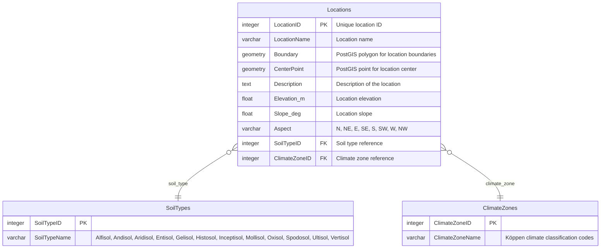
```mermaid
erDiagram
    Locations {
        integer LocationID PK "Unique location ID"
        varchar LocationName "Location name"
        geometry Boundary "PostGIS polygon for location boundaries"
        geometry CenterPoint "PostGIS point for location center"
        text Description "Description of the location"
        float Elevation_m "Location elevation"
        float Slope_deg "Location slope"
        varchar Aspect "N, NE, E, SE, S, SW, W, NW"
        integer SoilTypeID FK "Soil type reference"
        integer ClimateZoneID FK "Climate zone reference"
    }

    SoilTypes {
        integer SoilTypeID PK
        varchar SoilTypeName "Alfisol, Andisol, Aridisol, Entisol, Gelisol, Histosol, Inceptisol, Mollisol, Oxisol, Spodosol, Ultisol, Vertisol"
    }

    ClimateZones {
        integer ClimateZoneID PK
        varchar ClimateZoneName "Köppen climate classification codes"
    }

    Locations }o--|| SoilTypes : "soil_type"
    Locations }o--|| ClimateZones : "climate_zone"
```

### Species Reference

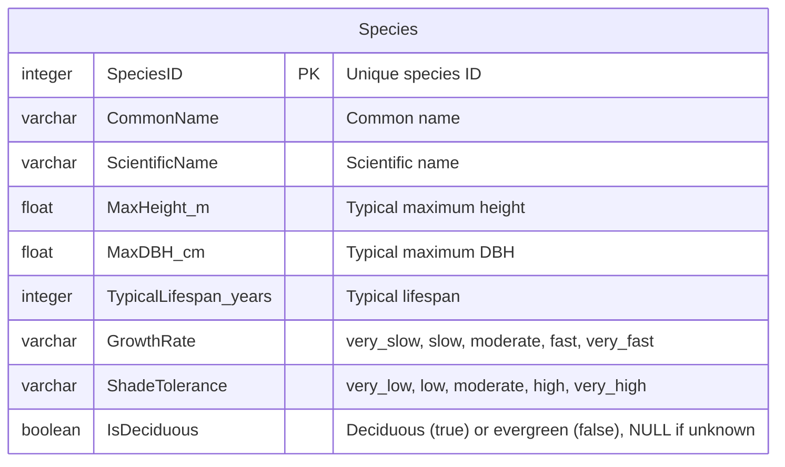
```mermaid
erDiagram
    Species {
        integer SpeciesID PK "Unique species ID"
        varchar CommonName "Common name"
        varchar ScientificName "Scientific name"
        float MaxHeight_m "Typical maximum height"
        float MaxDBH_cm "Typical maximum DBH"
        integer TypicalLifespan_years "Typical lifespan"
        varchar GrowthRate "very_slow, slow, moderate, fast, very_fast"
        varchar ShadeTolerance "very_low, low, moderate, high, very_high"
        boolean IsDeciduous "Deciduous (true) or evergreen (false), NULL if unknown"
    }
```

### Scenarios and Variant Types

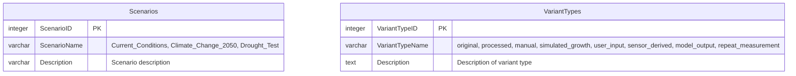
```mermaid
erDiagram
    Scenarios {
        integer ScenarioID PK
        varchar ScenarioName "Current_Conditions, Climate_Change_2050, Drought_Test"
        varchar Description "Scenario description"
    }

    VariantTypes {
        integer VariantTypeID PK
        varchar VariantTypeName "original, processed, manual, simulated_growth, user_input, sensor_derived, model_output, repeat_measurement"
        text Description "Description of variant type"
    }
```

### Campaigns (Data Collection Events)

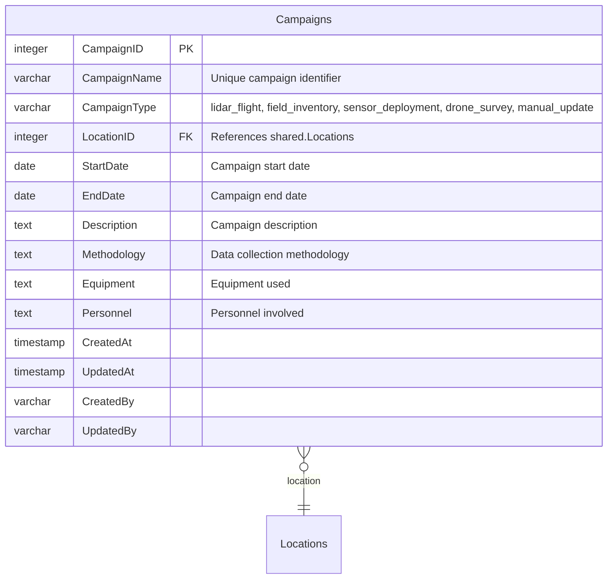
```mermaid
erDiagram
    Campaigns {
        integer CampaignID PK
        varchar CampaignName "Unique campaign identifier"
        varchar CampaignType "lidar_flight, field_inventory, sensor_deployment, drone_survey, manual_update"
        integer LocationID FK "References shared.Locations"
        date StartDate "Campaign start date"
        date EndDate "Campaign end date"
        text Description "Campaign description"
        text Methodology "Data collection methodology"
        text Equipment "Equipment used"
        text Personnel "Personnel involved"
        timestamp CreatedAt
        timestamp UpdatedAt
        varchar CreatedBy
        varchar UpdatedBy
    }

    Campaigns }o--|| Locations : "location"
```

The Campaigns table enables tracking of data collection events (inventory campaigns, LiDAR flights) and links measurements to their source campaign for full data provenance.

### Plots (Sub-Plot Divisions)

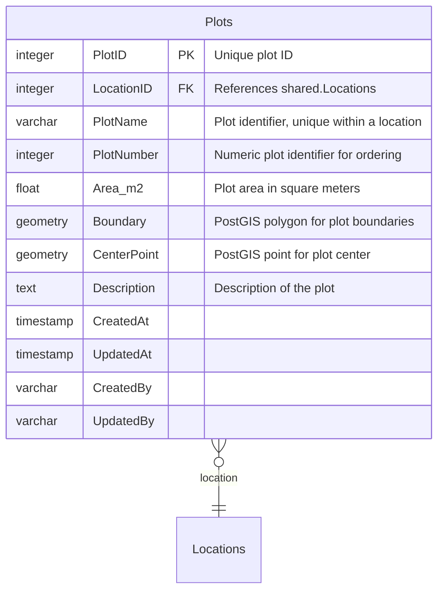
```mermaid
erDiagram
    Plots {
        integer PlotID PK "Unique plot ID"
        integer LocationID FK "References shared.Locations"
        varchar PlotName "Plot identifier, unique within a location"
        integer PlotNumber "Numeric plot identifier for ordering"
        float Area_m2 "Plot area in square meters"
        geometry Boundary "PostGIS polygon for plot boundaries"
        geometry CenterPoint "PostGIS point for plot center"
        text Description "Description of the plot"
        timestamp CreatedAt
        timestamp UpdatedAt
        varchar CreatedBy
        varchar UpdatedBy
    }

    Plots }o--|| Locations : "location"
```

Plots represent sub-divisions within locations for detailed research grids. Each plot has a unique name within its parent location, enforced by a `UNIQUE(LocationID, PlotName)` constraint. Plots are referenced by trees, deadwood, ground vegetation, management events, disturbance events, and imagery.

### Management Events

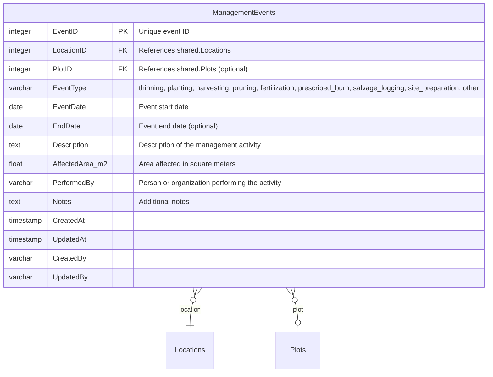
```mermaid
erDiagram
    ManagementEvents {
        integer EventID PK "Unique event ID"
        integer LocationID FK "References shared.Locations"
        integer PlotID FK "References shared.Plots (optional)"
        varchar EventType "thinning, planting, harvesting, pruning, fertilization, prescribed_burn, salvage_logging, site_preparation, other"
        date EventDate "Event start date"
        date EndDate "Event end date (optional)"
        text Description "Description of the management activity"
        float AffectedArea_m2 "Area affected in square meters"
        varchar PerformedBy "Person or organization performing the activity"
        text Notes "Additional notes"
        timestamp CreatedAt
        timestamp UpdatedAt
        varchar CreatedBy
        varchar UpdatedBy
    }

    ManagementEvents }o--|| Locations : "location"
    ManagementEvents }o--o| Plots : "plot"
```

The ManagementEvents table tracks forest management activities such as thinning, planting, harvesting, and prescribed burns. Events are linked to a location and optionally to a specific plot. Date range validation ensures `EndDate >= EventDate`.

### Disturbance Events

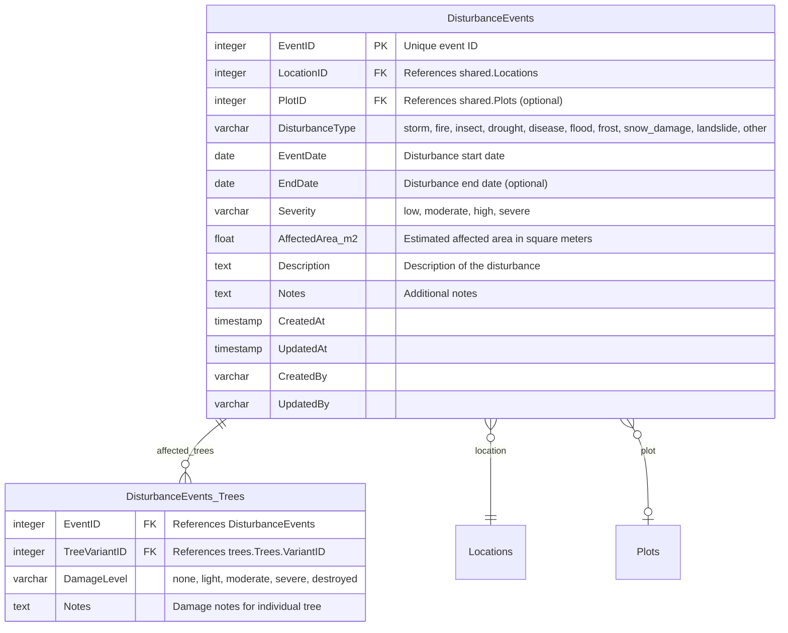
```mermaid
erDiagram
    DisturbanceEvents {
        integer EventID PK "Unique event ID"
        integer LocationID FK "References shared.Locations"
        integer PlotID FK "References shared.Plots (optional)"
        varchar DisturbanceType "storm, fire, insect, drought, disease, flood, frost, snow_damage, landslide, other"
        date EventDate "Disturbance start date"
        date EndDate "Disturbance end date (optional)"
        varchar Severity "low, moderate, high, severe"
        float AffectedArea_m2 "Estimated affected area in square meters"
        text Description "Description of the disturbance"
        text Notes "Additional notes"
        timestamp CreatedAt
        timestamp UpdatedAt
        varchar CreatedBy
        varchar UpdatedBy
    }

    DisturbanceEvents_Trees {
        integer EventID FK "References DisturbanceEvents"
        integer TreeVariantID FK "References trees.Trees.VariantID"
        varchar DamageLevel "none, light, moderate, severe, destroyed"
        text Notes "Damage notes for individual tree"
    }

    DisturbanceEvents ||--o{ DisturbanceEvents_Trees : "affected_trees"
    DisturbanceEvents }o--|| Locations : "location"
    DisturbanceEvents }o--o| Plots : "plot"
```

The DisturbanceEvents table records natural disturbance events (storms, fire, insect outbreaks, etc.) affecting forest areas. The **DisturbanceEvents_Trees** junction table links individual disturbance events to affected trees with per-tree damage assessment. The composite primary key is `(EventID, TreeVariantID)`.

### Process Management and Algorithm Tracking

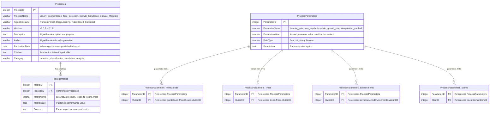
```mermaid
erDiagram
    Processes {
        integer ProcessID PK
        varchar ProcessName "LiDAR_Segmentation, Tree_Detection, Growth_Simulation, Climate_Modeling"
        varchar AlgorithmName "RandomForest, DeepLearning, RulesBased, Statistical"
        varchar Version "v1.0.2, v2.1.0"
        text Description "Algorithm description and purpose"
        varchar Author "Algorithm developer/organization"
        date PublicationDate "When algorithm was published/released"
        text Citation "Academic citation if applicable"
        varchar Category "detection, classification, simulation, analysis"
    }

    ProcessParameters {
        integer ParameterID PK
        varchar ParameterName "learning_rate, max_depth, threshold, growth_rate, interpolation_method"
        varchar ParameterValue "Actual parameter value used for this variant"
        varchar DataType "float, int, string, boolean"
        text Description "Parameter description"
    }

    ProcessParameters_PointClouds {
        integer ParameterID FK "References ProcessParameters"
        integer VariantID FK "References pointclouds.PointClouds.VariantID"
    }

    ProcessParameters_Trees {
        integer ParameterID FK "References ProcessParameters"
        integer VariantID FK "References trees.Trees.VariantID"
    }

    ProcessParameters_Environments {
        integer ParameterID FK "References ProcessParameters"
        integer VariantID FK "References environments.Environments.VariantID"
    }

    ProcessParameters_Stems {
        integer ParameterID FK "References ProcessParameters"
        integer StemID FK "References trees.Stems.StemID"
    }

    ProcessMetrics {
        integer MetricID PK
        integer ProcessID FK "References Processes"
        varchar MetricName "accuracy, precision, recall, f1_score, rmse"
        float MetricValue "Published performance value"
        text Source "Paper, report, or source of metric"
    }

    Processes ||--o{ ProcessMetrics : "has_metrics"
    ProcessParameters ||--o{ ProcessParameters_PointClouds : "parameter_links"
    ProcessParameters ||--o{ ProcessParameters_Trees : "parameter_links"
    ProcessParameters ||--o{ ProcessParameters_Environments : "parameter_links"
    ProcessParameters ||--o{ ProcessParameters_Stems : "parameter_links"
```

**Junction Table Design**: Process parameters use explicit junction tables to link with domain-specific variants, providing clear foreign key relationships while maintaining flexibility for cross-schema operations.

### Field-Level Change Tracking

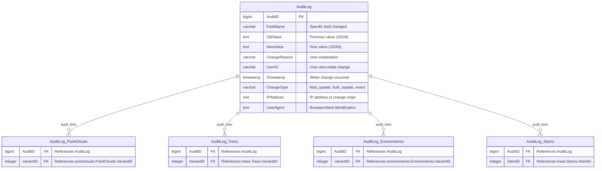
```mermaid
erDiagram
    AuditLog {
        bigint AuditID PK
        varchar FieldName "Specific field changed"
        text OldValue "Previous value (JSON)"
        text NewValue "New value (JSON)"
        varchar ChangeReason "User explanation"
        varchar UserID "User who made change"
        timestamp Timestamp "When change occurred"
        varchar ChangeType "field_update, bulk_update, revert"
        inet IPAddress "IP address of change origin"
        text UserAgent "Browser/client identification"
    }

    AuditLog_PointClouds {
        bigint AuditID FK "References AuditLog"
        integer VariantID FK "References pointclouds.PointClouds.VariantID"
    }

    AuditLog_Trees {
        bigint AuditID FK "References AuditLog"
        integer VariantID FK "References trees.Trees.VariantID"
    }

    AuditLog_Environments {
        bigint AuditID FK "References AuditLog"
        integer VariantID FK "References environments.Environments.VariantID"
    }

    AuditLog_Stems {
        bigint AuditID FK "References AuditLog"
        integer StemID FK "References trees.Stems.StemID"
    }

    AuditLog ||--o{ AuditLog_PointClouds : "audit_links"
    AuditLog ||--o{ AuditLog_Trees : "audit_links"
    AuditLog ||--o{ AuditLog_Environments : "audit_links"
    AuditLog ||--o{ AuditLog_Stems : "audit_links"
```

The AuditLog system provides granular change tracking for individual field modifications across all variant tables through explicit junction tables.

**Key Features**:

- **Junction Table Design**: Explicit relationships through dedicated junction tables
- **Granular Logging**: Each field change creates a separate audit entry with full before/after context
- **Revert Capability**: Changes can be undone using audit log data without creating new variants
- **User Attribution**: All changes tracked to specific authenticated users with IP address and user agent

### Utility Views

- **`recent_changes`**: Latest database modifications across all schemas
- **`user_activity_summary`**: User activity statistics and change patterns

---

## POINTCLOUDS SCHEMA

Manages LiDAR scan data, scanner hardware, and processing variants through a unified variant-based approach.

### Scanner Types and Hardware

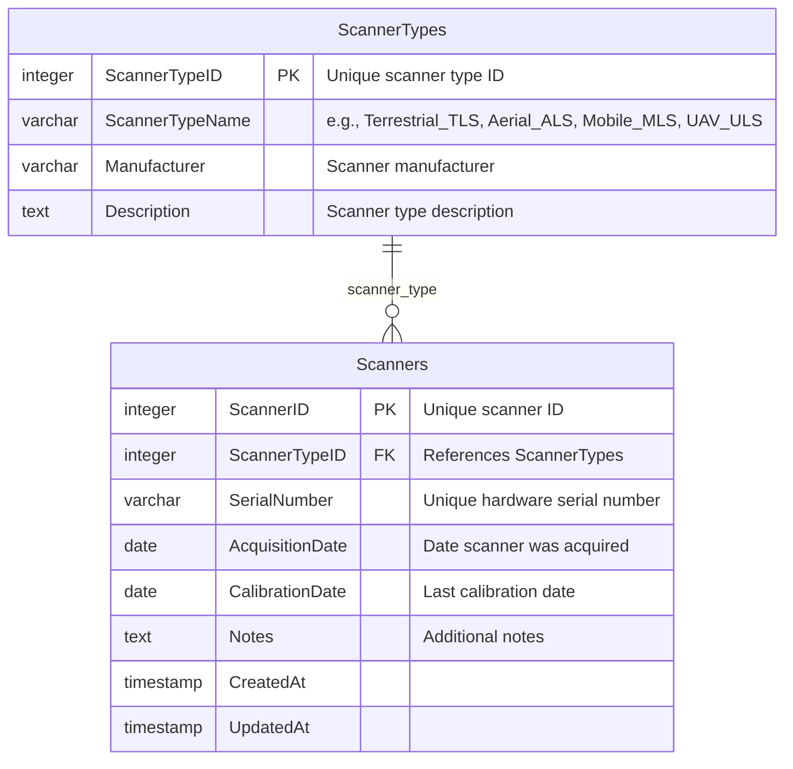
```mermaid
erDiagram
    ScannerTypes {
        integer ScannerTypeID PK "Unique scanner type ID"
        varchar ScannerTypeName "e.g., Terrestrial_TLS, Aerial_ALS, Mobile_MLS, UAV_ULS"
        varchar Manufacturer "Scanner manufacturer"
        text Description "Scanner type description"
    }

    Scanners {
        integer ScannerID PK "Unique scanner ID"
        integer ScannerTypeID FK "References ScannerTypes"
        varchar SerialNumber "Unique hardware serial number"
        date AcquisitionDate "Date scanner was acquired"
        date CalibrationDate "Last calibration date"
        text Notes "Additional notes"
        timestamp CreatedAt
        timestamp UpdatedAt
    }

    ScannerTypes ||--o{ Scanners : "scanner_type"
```

The ScannerTypes table classifies LiDAR scanner categories (terrestrial, aerial, mobile, UAV) while the Scanners table tracks individual scanner hardware instances with serial numbers, acquisition dates, and calibration records.

### Point Cloud Variants

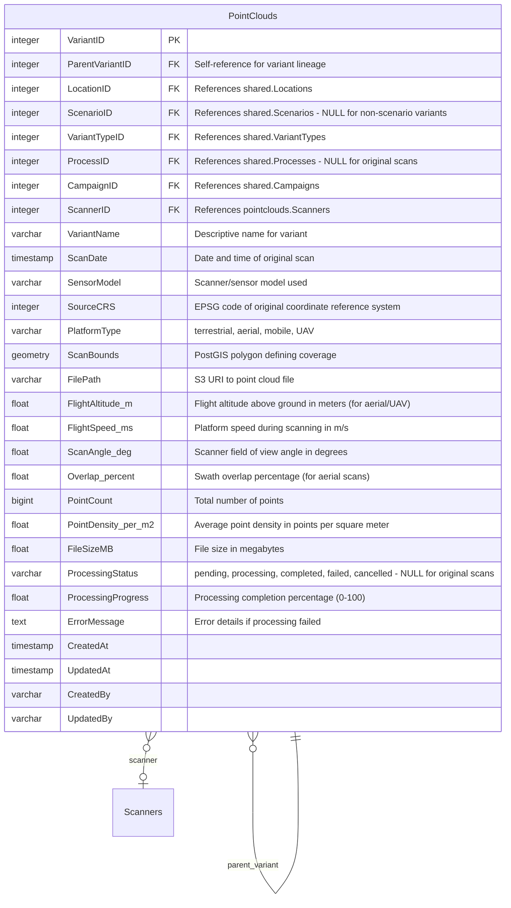
```mermaid
erDiagram
    PointClouds {
        integer VariantID PK
        integer ParentVariantID FK "Self-reference for variant lineage"
        integer LocationID FK "References shared.Locations"
        integer ScenarioID FK "References shared.Scenarios - NULL for non-scenario variants"
        integer VariantTypeID FK "References shared.VariantTypes"
        integer ProcessID FK "References shared.Processes - NULL for original scans"
        integer CampaignID FK "References shared.Campaigns"
        integer ScannerID FK "References pointclouds.Scanners"
        varchar VariantName "Descriptive name for variant"
        timestamp ScanDate "Date and time of original scan"
        varchar SensorModel "Scanner/sensor model used"
        integer SourceCRS "EPSG code of original coordinate reference system"
        varchar PlatformType "terrestrial, aerial, mobile, UAV"
        geometry ScanBounds "PostGIS polygon defining coverage"
        varchar FilePath "S3 URI to point cloud file"
        float FlightAltitude_m "Flight altitude above ground in meters (for aerial/UAV)"
        float FlightSpeed_ms "Platform speed during scanning in m/s"
        float ScanAngle_deg "Scanner field of view angle in degrees"
        float Overlap_percent "Swath overlap percentage (for aerial scans)"
        bigint PointCount "Total number of points"
        float PointDensity_per_m2 "Average point density in points per square meter"
        float FileSizeMB "File size in megabytes"
        varchar ProcessingStatus "pending, processing, completed, failed, cancelled - NULL for original scans"
        float ProcessingProgress "Processing completion percentage (0-100)"
        text ErrorMessage "Error details if processing failed"
        timestamp CreatedAt
        timestamp UpdatedAt
        varchar CreatedBy
        varchar UpdatedBy
    }

    PointClouds }o--|| PointClouds : "parent_variant"
    PointClouds }o--o| Scanners : "scanner"
```

### Utility Views

- **`processing_lineage`**: Tracks point cloud processing history and variant relationships

---

## TREES SCHEMA

Manages tree measurement and simulation data through variants with multi-stem support.

### Tree Status and Morphology Reference Tables

```mermaid
erDiagram
    TreeStatus {
        integer TreeStatusID PK
        varchar TreeStatusName "healthy, stressed, declining, dead"
        text Description
    }

    TaperTypes {
        integer TaperTypeID PK
        varchar TaperTypeName "Cylinder, Cone, Paraboloid, Neiloid"
        text Description "Form description"
        float TypicalTaperRatioMin "Typical minimum taper ratio"
        float TypicalTaperRatioMax "Typical maximum taper ratio"
    }

    StraightnessTypes {
        integer StraightnessTypeID PK
        varchar StraightnessName "Straight, Slight_sweep, Moderate_sweep, Severe_sweep"
        text Description "Curvature description"
        float DeviationAngleMin "Minimum deviation angle in degrees"
        float DeviationAngleMax "Maximum deviation angle in degrees"
    }

    BranchingPatterns {
        integer BranchingPatternID PK
        varchar BranchingPatternName "Alternate, Opposite, Whorled, Spiral, Random"
        text Description "Branching arrangement description"
    }

    BarkCharacteristics {
        integer BarkCharacteristicID PK
        varchar BarkCharacteristicName "Smooth, Furrowed, Plated, Exfoliating"
        text Description "Bark texture description"
        text TypicalSpecies "Examples: e.g., Fagus, Quercus, Pinus, Platanus"
    }
```

### Trees and Stems

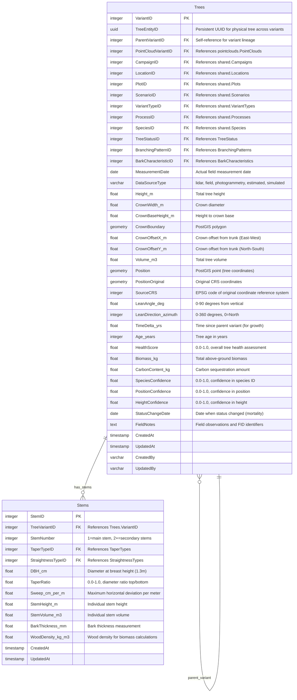
```mermaid
erDiagram
    Trees {
        integer VariantID PK
        uuid TreeEntityID "Persistent UUID for physical tree across variants"
        integer ParentVariantID FK "Self-reference for variant lineage"
        integer PointCloudVariantID FK "References pointclouds.PointClouds"
        integer CampaignID FK "References shared.Campaigns"
        integer LocationID FK "References shared.Locations"
        integer PlotID FK "References shared.Plots"
        integer ScenarioID FK "References shared.Scenarios"
        integer VariantTypeID FK "References shared.VariantTypes"
        integer ProcessID FK "References shared.Processes"
        integer SpeciesID FK "References shared.Species"
        integer TreeStatusID FK "References TreeStatus"
        integer BranchingPatternID FK "References BranchingPatterns"
        integer BarkCharacteristicID FK "References BarkCharacteristics"
        date MeasurementDate "Actual field measurement date"
        varchar DataSourceType "lidar, field, photogrammetry, estimated, simulated"
        float Height_m "Total tree height"
        float CrownWidth_m "Crown diameter"
        float CrownBaseHeight_m "Height to crown base"
        geometry CrownBoundary "PostGIS polygon"
        float CrownOffsetX_m "Crown offset from trunk (East-West)"
        float CrownOffsetY_m "Crown offset from trunk (North-South)"
        float Volume_m3 "Total tree volume"
        geometry Position "PostGIS point (tree coordinates)"
        geometry PositionOriginal "Original CRS coordinates"
        integer SourceCRS "EPSG code of original coordinate reference system"
        float LeanAngle_deg "0-90 degrees from vertical"
        integer LeanDirection_azimuth "0-360 degrees, 0=North"
        float TimeDelta_yrs "Time since parent variant (for growth)"
        integer Age_years "Tree age in years"
        float HealthScore "0.0-1.0, overall tree health assessment"
        float Biomass_kg "Total above-ground biomass"
        float CarbonContent_kg "Carbon sequestration amount"
        float SpeciesConfidence "0.0-1.0, confidence in species ID"
        float PositionConfidence "0.0-1.0, confidence in position"
        float HeightConfidence "0.0-1.0, confidence in height"
        date StatusChangeDate "Date when status changed (mortality)"
        text FieldNotes "Field observations and FID identifiers"
        timestamp CreatedAt
        timestamp UpdatedAt
        varchar CreatedBy
        varchar UpdatedBy
    }

    Stems {
        integer StemID PK
        integer TreeVariantID FK "References Trees.VariantID"
        integer StemNumber "1=main stem, 2+=secondary stems"
        integer TaperTypeID FK "References TaperTypes"
        integer StraightnessTypeID FK "References StraightnessTypes"
        float DBH_cm "Diameter at breast height (1.3m)"
        float TaperRatio "0.0-1.0, diameter ratio top/bottom"
        float Sweep_cm_per_m "Maximum horizontal deviation per meter"
        float StemHeight_m "Individual stem height"
        float StemVolume_m3 "Individual stem volume"
        float BarkThickness_mm "Bark thickness measurement"
        float WoodDensity_kg_m3 "Wood density for biomass calculations"
        timestamp CreatedAt
        timestamp UpdatedAt
    }

    Trees ||--o{ Stems : "has_stems"
    Trees }o--|| Trees : "parent_variant"
```

### Tree Morphology Lookup Tables

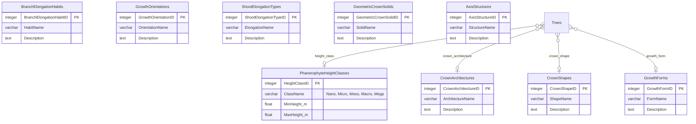
```mermaid
erDiagram
    PhanerophyteHeightClasses {
        integer HeightClassID PK
        varchar ClassName "Nano, Micro, Meso, Macro, Mega"
        float MinHeight_m
        float MaxHeight_m
    }

    CrownArchitectures {
        integer CrownArchitectureID PK
        varchar ArchitectureName
        text Description
    }

    BranchElongationHabits {
        integer BranchElongationHabitID PK
        varchar HabitName
        text Description
    }

    GrowthOrientations {
        integer GrowthOrientationID PK
        varchar OrientationName
        text Description
    }

    ShootElongationTypes {
        integer ShootElongationTypeID PK
        varchar ElongationName
        text Description
    }

    CrownShapes {
        integer CrownShapeID PK
        varchar ShapeName
        text Description
    }

    GeometricCrownSolids {
        integer GeometricCrownSolidID PK
        varchar SolidName
        text Description
    }

    AxisStructures {
        integer AxisStructureID PK
        varchar StructureName
        text Description
    }

    GrowthForms {
        integer GrowthFormID PK
        varchar FormName
        text Description
    }

    Trees }o--o| PhanerophyteHeightClasses : "height_class"
    Trees }o--o| CrownArchitectures : "crown_architecture"
    Trees }o--o| CrownShapes : "crown_shape"
    Trees }o--o| GrowthForms : "growth_form"
```

**Note**: The trees schema uses a variant-based approach for temporal tracking rather than a separate TreeSimulations table. Growth simulations are represented as new tree variants with ParentVariantID linkage.

### Phenology Observations

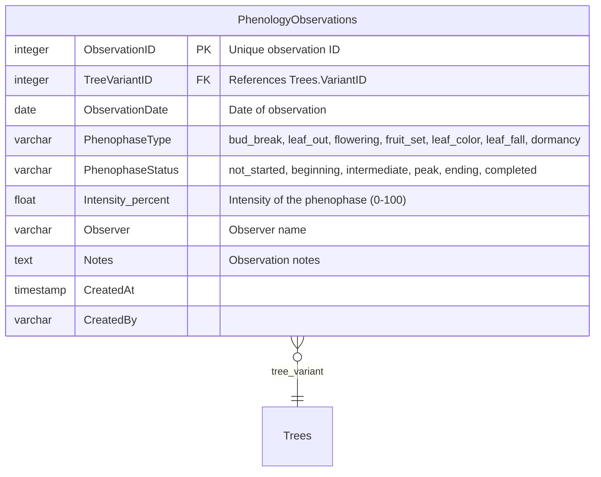
```mermaid
erDiagram
    PhenologyObservations {
        integer ObservationID PK "Unique observation ID"
        integer TreeVariantID FK "References Trees.VariantID"
        date ObservationDate "Date of observation"
        varchar PhenophaseType "bud_break, leaf_out, flowering, fruit_set, leaf_color, leaf_fall, dormancy"
        varchar PhenophaseStatus "not_started, beginning, intermediate, peak, ending, completed"
        float Intensity_percent "Intensity of the phenophase (0-100)"
        varchar Observer "Observer name"
        text Notes "Observation notes"
        timestamp CreatedAt
        varchar CreatedBy
    }

    PhenologyObservations }o--|| Trees : "tree_variant"
```

The PhenologyObservations table tracks seasonal development phases for individual trees, recording the type and status of phenological events (bud break, leaf out, flowering, etc.) along with intensity measurements and observer information.

### Deadwood Inventory

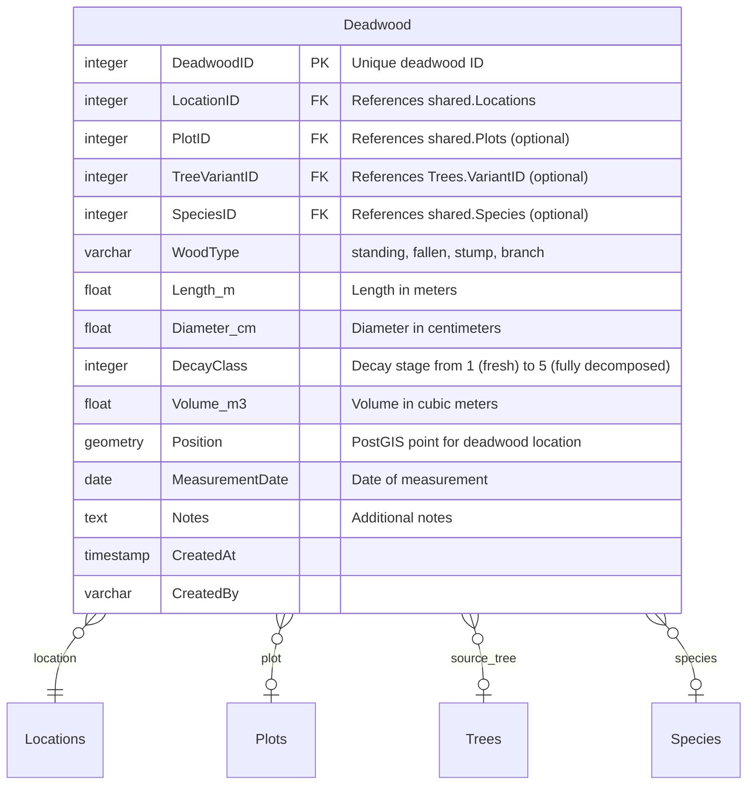
```mermaid
erDiagram
    Deadwood {
        integer DeadwoodID PK "Unique deadwood ID"
        integer LocationID FK "References shared.Locations"
        integer PlotID FK "References shared.Plots (optional)"
        integer TreeVariantID FK "References Trees.VariantID (optional)"
        integer SpeciesID FK "References shared.Species (optional)"
        varchar WoodType "standing, fallen, stump, branch"
        float Length_m "Length in meters"
        float Diameter_cm "Diameter in centimeters"
        integer DecayClass "Decay stage from 1 (fresh) to 5 (fully decomposed)"
        float Volume_m3 "Volume in cubic meters"
        geometry Position "PostGIS point for deadwood location"
        date MeasurementDate "Date of measurement"
        text Notes "Additional notes"
        timestamp CreatedAt
        varchar CreatedBy
    }

    Deadwood }o--|| Locations : "location"
    Deadwood }o--o| Plots : "plot"
    Deadwood }o--o| Trees : "source_tree"
    Deadwood }o--o| Species : "species"
```

The Deadwood table records dead wood inventory including standing dead trees, fallen logs, stumps, and branches. Each record can optionally reference the tree variant it originated from and the species. Decay class uses a 1-5 scale from fresh to fully decomposed.

### Ground Vegetation Surveys

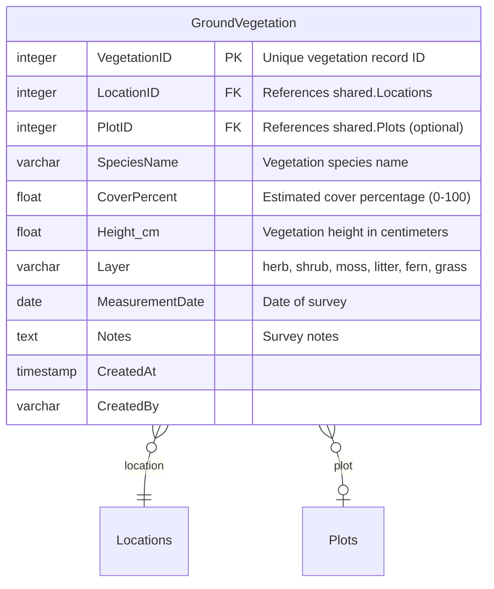
```mermaid
erDiagram
    GroundVegetation {
        integer VegetationID PK "Unique vegetation record ID"
        integer LocationID FK "References shared.Locations"
        integer PlotID FK "References shared.Plots (optional)"
        varchar SpeciesName "Vegetation species name"
        float CoverPercent "Estimated cover percentage (0-100)"
        float Height_cm "Vegetation height in centimeters"
        varchar Layer "herb, shrub, moss, litter, fern, grass"
        date MeasurementDate "Date of survey"
        text Notes "Survey notes"
        timestamp CreatedAt
        varchar CreatedBy
    }

    GroundVegetation }o--|| Locations : "location"
    GroundVegetation }o--o| Plots : "plot"
```

The GroundVegetation table stores ground vegetation survey records organized by location, plot, and vegetation layer. Cover percentage is constrained between 0 and 100.

### Utility Views

- **`trees_with_metrics`**: Aggregated view showing trees with computed metrics (stem count, total volume, crown metrics)

---

## SENSOR SCHEMA

Manages sensor hardware installations and time-series sensor readings.

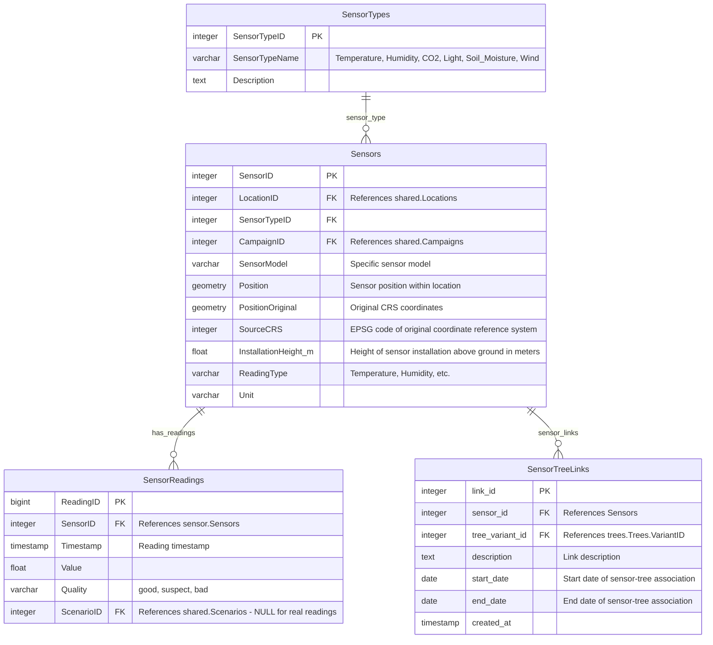
```mermaid
erDiagram
    SensorTypes {
        integer SensorTypeID PK
        varchar SensorTypeName "Temperature, Humidity, CO2, Light, Soil_Moisture, Wind"
        text Description
    }

    Sensors {
        integer SensorID PK
        integer LocationID FK "References shared.Locations"
        integer SensorTypeID FK
        integer CampaignID FK "References shared.Campaigns"
        varchar SensorModel "Specific sensor model"
        geometry Position "Sensor position within location"
        geometry PositionOriginal "Original CRS coordinates"
        integer SourceCRS "EPSG code of original coordinate reference system"
        float InstallationHeight_m "Height of sensor installation above ground in meters"
        varchar ReadingType "Temperature, Humidity, etc."
        varchar Unit
    }

    SensorReadings {
        bigint ReadingID PK
        integer SensorID FK "References sensor.Sensors"
        timestamp Timestamp "Reading timestamp"
        float Value
        varchar Quality "good, suspect, bad"
        integer ScenarioID FK "References shared.Scenarios - NULL for real readings"
    }

    SensorTreeLinks {
        integer link_id PK
        integer sensor_id FK "References Sensors"
        integer tree_variant_id FK "References trees.Trees.VariantID"
        text description "Link description"
        date start_date "Start date of sensor-tree association"
        date end_date "End date of sensor-tree association"
        timestamp created_at
    }

    SensorTypes ||--o{ Sensors : "sensor_type"
    Sensors ||--o{ SensorReadings : "has_readings"
    Sensors ||--o{ SensorTreeLinks : "sensor_links"
```

---

## ENVIRONMENTS SCHEMA

Manages environmental variants that can be derived from sensor combinations, user input, or hybrid approaches.

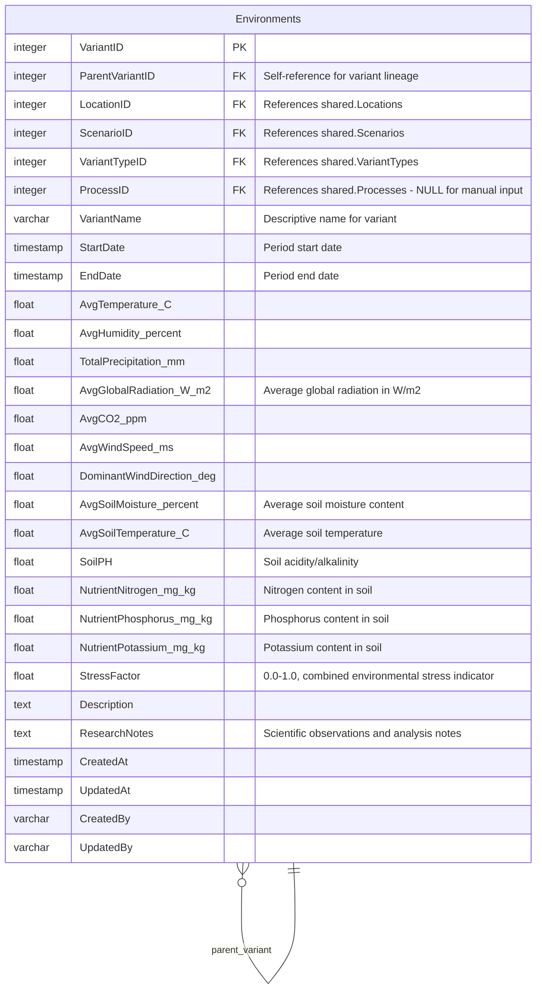
```mermaid
erDiagram
    Environments {
        integer VariantID PK
        integer ParentVariantID FK "Self-reference for variant lineage"
        integer LocationID FK "References shared.Locations"
        integer ScenarioID FK "References shared.Scenarios"
        integer VariantTypeID FK "References shared.VariantTypes"
        integer ProcessID FK "References shared.Processes - NULL for manual input"
        varchar VariantName "Descriptive name for variant"
        timestamp StartDate "Period start date"
        timestamp EndDate "Period end date"
        float AvgTemperature_C
        float AvgHumidity_percent
        float TotalPrecipitation_mm
        float AvgGlobalRadiation_W_m2 "Average global radiation in W/m2"
        float AvgCO2_ppm
        float AvgWindSpeed_ms
        float DominantWindDirection_deg
        float AvgSoilMoisture_percent "Average soil moisture content"
        float AvgSoilTemperature_C "Average soil temperature"
        float SoilPH "Soil acidity/alkalinity"
        float NutrientNitrogen_mg_kg "Nitrogen content in soil"
        float NutrientPhosphorus_mg_kg "Phosphorus content in soil"
        float NutrientPotassium_mg_kg "Potassium content in soil"
        float StressFactor "0.0-1.0, combined environmental stress indicator"
        text Description
        text ResearchNotes "Scientific observations and analysis notes"
        timestamp CreatedAt
        timestamp UpdatedAt
        varchar CreatedBy
        varchar UpdatedBy
    }

    Environments }o--|| Environments : "parent_variant"
```

### Utility Views

- **`active_environments`**: Current environmental variants with latest data
- **`location_environment_summary`**: Environmental conditions aggregated by location

---

## IMAGERY SCHEMA

Manages aerial and ground-based imagery with spatial metadata and camera parameters.

```mermaid
erDiagram
    Images {
        integer ImageID PK "Unique image ID"
        integer LocationID FK "References shared.Locations"
        integer PlotID FK "References shared.Plots (optional)"
        integer CampaignID FK "References shared.Campaigns (optional)"
        timestamp CaptureDate "Date and time of image capture"
        text FilePath "Path or URI to image file"
        varchar FileFormat "jpg, png, tiff, raw, geotiff"
        varchar Resolution_px "Image resolution in pixels (e.g., 4000x3000)"
        varchar CameraModel "Camera model used"
        geometry Position "Camera position in WGS84 (EPSG:4326)"
        float Altitude_m "Camera altitude above ground in meters"
        float Heading_deg "Camera heading (0=North, clockwise, 0-360)"
        float Pitch_deg "Camera pitch angle (-90 to 90 degrees)"
        float Roll_deg "Camera roll angle (-180 to 180 degrees)"
        float GroundSampleDistance_cm "Ground sample distance in cm per pixel"
        text Description "Image description"
        timestamp CreatedAt
        timestamp UpdatedAt
        varchar CreatedBy
        varchar UpdatedBy
    }

    Images }o--|| Locations : "location"
    Images }o--o| Plots : "plot"
    Images }o--o| Campaigns : "campaign"
```

The Images table stores aerial and ground-based imagery with full spatial metadata including camera position, orientation (heading, pitch, roll), altitude, and ground sample distance. Images are linked to locations and optionally to specific plots and data collection campaigns.
