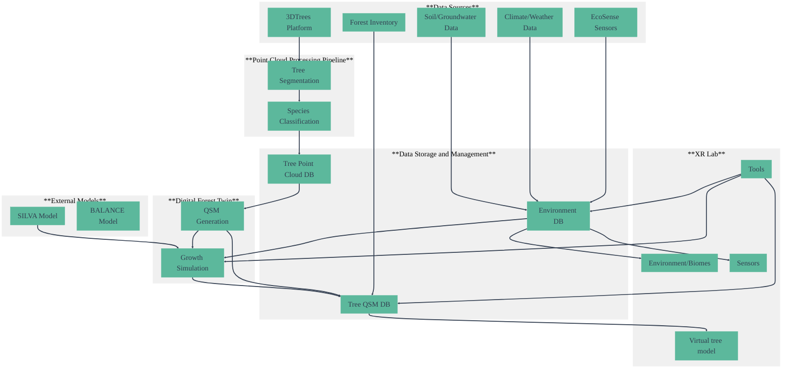

# XR Future Forests Lab

A comprehensive research initiative developing cutting-edge extended reality (XR) applications for forest and environmental sciences at the University of Freiburg.

## Project Overview

The XR Future Forest Lab aims to create **digital twins of forests** that can be visualized and experienced through **immersive XR technologies**. The project combines advanced data acquisition, analysis, and modeling to simulate forest growth, management processes, and environmental changes and their impact on the forest over time.

### Key Information

- **Duration**: 2023-2029
- **Funding**: Eva Mayr-Stihl Foundation (€1.5 million)
- **Research Site**: 127-hectare Mathislewald forest, University of Freiburg
- **Institution**: Faculty of Environment and Natural Resources, University of Freiburg

### Objectives

- Create comprehensive digital twins of forest ecosystems
- Develop immersive XR applications for forest visualization
- Enable simulation of forest growth and management scenarios
- Provide innovative tools for research, education, and forest management
- Bridge the gap between forest science and cutting-edge technology

## System Architecture

## Team

### Lead

- **Prof. Dr. Thomas Purfürst**: Chair of Forest Operations, Project Spokesperson
- **Prof. Dr. Thomas Seifert**: Chair of Forest Growth and Dendroecology
- **Prof. Dr. Teja Kattenborn**: Professor of Sensor-Based Geoinformatics
- **Dr. Christian Scharinger**: Head of XRLab, Project Coordinator
- **Andreas Friedrich**: Administration

### Core Researchers

- **Paul Lakos**: XR Game Developer
- **Tom Jaksztat**: Software Development & System Integration
- **Salim Soltani**: Data Engineer
- **Joachim Maack**: GIS Lecturer
- **Maximilian Sperlich**: Geospatial Data Scientist & System Integration

### Associated Researchers

- **Daniel Lusk**: LiDAR Data Management and Processing
- **Julian Frey**: Quantitative Structure Models (QSM)
- **Katja Kröner**: Tree Growth Models

## Components

### XR Lab

**Responsible Team**: XRLab (Dr. Christian Scharinger)

The central hub where all components converge. The XR Lab develops immersive visualization applications that bring digital forest twins to life, enabling users to experience and interact with forest data in unprecedented ways.

**Capabilities**:
- Real-time forest visualization and interaction
- Multi-user collaborative environments
- Educational simulation scenarios
- Research data exploration tools

### Point Cloud Processing

**Responsible Team**: Department of Sensor-Based Geoinformatics (Prof. Dr. Teja Kattenborn)

The foundation of the digital forest twin, transforming raw LiDAR and photogrammetric data into structured forest information.

**Key Features**:

- **3DTrees Online Platform**: Web-based interface for point cloud upload and processing
- **Automated Tree Segmentation**: Individual tree identification from forest point clouds
- **Species Classification**: Machine learning-based tree species identification
- **Quality Control**: Validation and accuracy assessment of processed data

**Technology Stack**: Python, R, CloudCompare, lidR, Machine Learning algorithms

### Digital Forest Twin

**Responsible Team**: Department of Forest Growth and Dendroecology (Prof. Dr. Thomas Seifert)

Creates mathematical representations of individual trees and forest ecosystems for growth simulation.

#### Quantitative Structure Model (QSM)

#### Tree/Forest Growth Models

- **SILVA**: Individual tree growth simulator ([OptForests Toolkit](https://www.optforests.eu/toolkit/models/silva))
- **BALANCE**: Stand-level forest growth model ([TUM Archive](https://webarchiv.it.ls.tum.de/waldwachstum.wzw.tum.de/forschung/modelle/balance/index.html))

### Application Conceptualization

#### Teaching

- **Sensor Network Visualization**: Experience EcoSense sensor networks and ecosystem fluxes (e.g., Hartheim site)
- **Remote Sensing Education**: "Experience" LiDAR and other 3D data through immersive exploration
- **Forest Management Training**: Practice forestry decisions in risk-free virtual environments
- **Temporal Dynamics**: Visualize long-term forest changes in accelerated time

#### Research

- **Invisible Processes**: Visualize hidden forest processes (sap flow, root competition, nutrient flows)
- **Data Exploration**: Interactive analysis of complex forest datasets
- **Hypothesis Testing**: Test management scenarios before real-world implementation
- **Multi-scale Analysis**: Examine forests from tree level to landscape scale

#### Communication

- **Faculty Collaboration**: Platform for visualizing research from Excellence Clusters, RTGs, SFBs
- **Stakeholder Engagement**: Communicate forest research to policymakers and the public
- **Interdisciplinary Outreach**: Bridge forest science with other disciplines
- **Public Education**: Make forest science accessible to broader audiences

### Data management

Centralized data storage of point clouds, QSM and auxiliary data

- uploaded and processed point clouds from 3Dtrees
- QSMs derived from processed point clouds or as results from forest models
- Sensor data from EcoSense
- Auxiliary data for digital forest twin:
  - Climate data
  - Weather data
  - Soil data
  - Ground water

## Technical Specifications

### Hardware Requirements
- **XR Headsets**: Meta Quest, HTC Vive, Microsoft HoloLens
- **Computing**: High-performance GPUs for real-time rendering
- **Storage**: Distributed cloud storage for large point cloud datasets
- **Networking**: High-bandwidth connections for collaborative sessions

### Software Stack
- **Frontend**: Unity 3D, Unreal Engine, WebXR
- **Backend**: Python, R, C++ for data processing
- **Database**: PostgreSQL/PostGIS for spatial data
- **Cloud**: Scalable processing infrastructure

## Project Milestones

- **2024**: XR Lab setup and initial tool integration
- **2025**: 3DTrees platform enhancement and first digital twins *(Current)*
- **2026**: Growth model integration and QSM refinement
- **2027**: Advanced XR applications and educational tools
- **2028**: External partnerships and knowledge transfer
- **2029**: Project consolidation and sustainability planning

## Getting Involved

### For Researchers
- Collaborate on forest digitization projects
- Access XR tools for data visualization
- Contribute to open-source components

### For Students
- Participate in XR development projects
- Use tools for thesis research
- Join interdisciplinary learning experiences

### For Industry Partners
- Explore commercial applications
- Contribute datasets and use cases
- Develop joint research initiatives

## Resources & Links

- **Project Website**: [XR Future Forest Lab](https://uni-freiburg.de/enr-geosense/research/xr-future-forest-lab/)
- **University**: [Faculty of Environment and Natural Resources](https://uni-freiburg.de/enr-geosense/)
- **Funding**: [Eva Mayr-Stihl Foundation](https://eva-mayr-stihl-stiftung.de/en)
- **Research Forest**: Mathislewald, University of Freiburg

## Contact

**Project Coordination**: Dr. Christian Scharinger  
**Email**: [contact information]  
**Address**: Faculty of Environment and Natural Resources, University of Freiburg

==-

*Building the forest of the future through immersive technology and interdisciplinary collaboration.*
