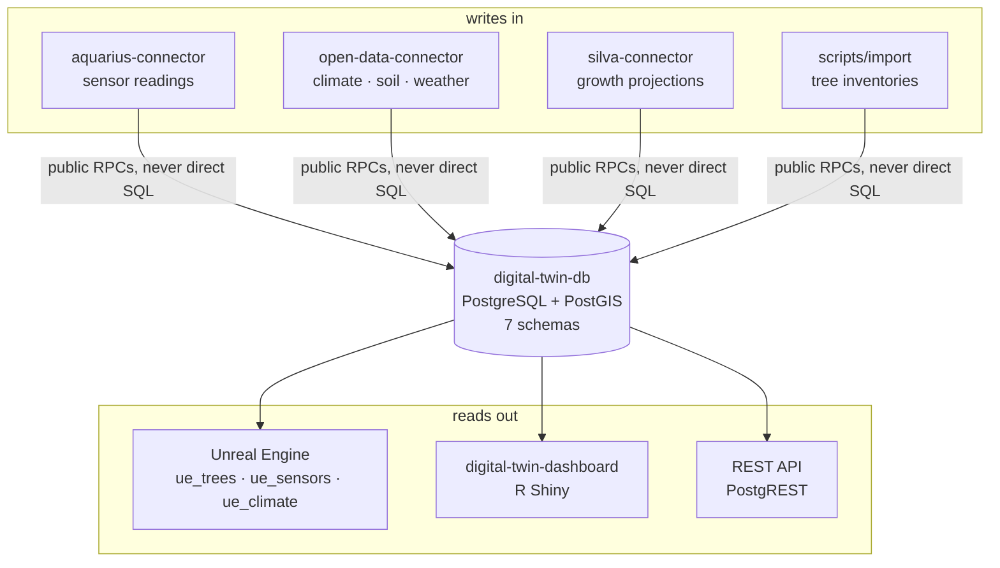
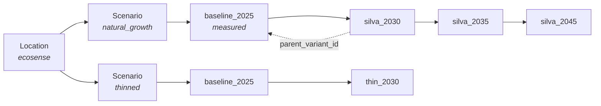

# digital-twin-db

The data tier of the forest digital twin — a self-hosted Supabase stack over PostgreSQL/PostGIS
that holds the forest, its measurements, and every version of it through time.

[](https://doi.org/10.5281/zenodo.21509858)
[](https://www.gnu.org/licenses/agpl-3.0)

A forest twin is not one dataset. It is tree inventories, LiDAR scans, sensor time series,
imagery, growth projections and site conditions, all describing the same trees at different
moments and from different instruments. This repo is the schema that lets them coexist
without any one of them overwriting another — and the API that serves any of it to a VR
scene, an R dashboard or an analysis script from a single flat query.

## Where this sits


```mermaid
flowchart TB
    subgraph IN["writes in"]
        AQ["aquarius-connector<br/>sensor readings"]
        OD["open-data-connector<br/>climate · soil · weather"]
        SV["silva-connector<br/>growth projections"]
        IMP["scripts/import<br/>tree inventories"]
    end
    DB[("digital-twin-db<br/>PostgreSQL + PostGIS<br/>7 schemas")]
    subgraph OUT["reads out"]
        UE["Unreal Engine<br/>ue_trees · ue_sensors · ue_climate"]
        DASH["digital-twin-dashboard<br/>R Shiny"]
        API["REST API<br/>PostgREST"]
    end
    AQ & OD & SV & IMP -- "public RPCs, never direct SQL" --> DB
    DB --> UE & DASH & API
```

Connectors reach the database **only** through public RPCs over REST — no credentials, no
SQL, no package dependency in either direction. That boundary is why a new data provider is a
new connector repo rather than a change here.

## The idea that shapes the schema

**Location → Scenario → Variant.**


```mermaid
flowchart LR
    L["Location<br/><i>ecosense</i>"] --> S1["Scenario<br/><i>natural_growth</i>"]
    L --> S2["Scenario<br/><i>thinned</i>"]
    S1 --> V1["baseline_2025<br/><i>measured</i>"] --> V2["silva_2030"] --> V3["silva_2035"] --> V4["silva_2045"]
    S2 --> W1["baseline_2025"] --> W2["thin_2030"]
    V2 -. "parent_variant_id" .-> V1
```

A **Location** is a site. It owns its own **Scenarios** (management regimes, unique per
location). Each Scenario owns a chain of **Variants** — one per time step or projection,
linked by `parent_variant_id`.

`trees.Trees`, `pointclouds.PointClouds` and `environments.Environments` all key off that
hierarchy through `variant_id` / `variant_type_id`. That is what makes
`GET /ue_trees?variant_id=eq.<id>` return "the forest as it looked, or will look, at time X"
in one flat query — and it is why **every query against `trees.trees` must filter on variant**,
since a measured tree sits there alongside its projections.

Full model and query patterns: [docs/variant-scenario-model.md](docs/variant-scenario-model.md).

## Seven schemas

| Schema | Holds |
|--------|-------|
| `shared` | Species, Locations, Plots, Campaigns, SoilTypes, ClimateZones, Scenarios, VariantTypes, ManagementEvents, DisturbanceEvents, Processes, AuditLog |
| `trees` | Trees (persistent `TreeEntityID`), Stems, PhenologyObservations, QSMs + QSMCylinders, TreePartTypes + TreeGraphEdges, Roots, CrownFoliageProfiles, classification tables |
| `pointclouds` | PointClouds with S3 paths, ScannerTypes, Scanners; processing variants and quality metrics |
| `sensor` | Sensors, SensorReadings, SensorTreeLinks |
| `environments` | Environments — temperature, humidity, soil moisture, nutrients, from sensors, manual entry or models |
| `imagery` | Images with spatial metadata and camera parameters |
| `forest_floor` | Deadwood, GroundVegetation — plot-level surveys, not tied to a tree |

The `trees` QSM, part-type, graph-edge, root and crown-profile tables line up with the
CityGML-conformant conceptual tree model of Ambarwari et al. (2024) — see
[docs/citygml-qsm-mapping.md](docs/citygml-qsm-mapping.md).

Most tables carry **row-level security** and **audit logging** with user attribution, on the
tables whose individual field values change after entry: `trees.Trees`, `trees.Stems`,
`trees.PhenologyObservations`, `environments.Environments`, `pointclouds.PointClouds`.

## What the stack gives you

PostgreSQL + PostGIS, PostgREST (auto-generated REST from the schema), a realtime WebSocket
server, GoTrue auth with RLS, an S3-compatible storage API for point clouds, Deno edge
functions, and Supabase Studio.

## Initialization is schema-only

`docker compose up -d` gives you schemas, indexes, constraints, RLS policies, audit
functions, API views, and reference data (species, soil types, climate zones) loaded from
CSV — and **empty user tables**. Trees, sensors and readings are a separate, deliberate
import step.

| Files | What they do |
|-------|--------------|
| `10-baseline-schema.sql` | Point-in-time schema snapshot (2026-07-17) |
| `11`–`29`, `32`+ | Additive schema changes made since that snapshot — each adds, never restructures an earlier file's objects |
| `30`–`31` | Load the lookup CSVs and register their refresh functions |

The gap around 30–31 is historical: the baseline consolidated the *former* 10–29 and 32–37
files, which had accreted into a replay problem — later files kept restructuring what
earlier ones created, so a fresh init replayed the project's history instead of producing
today's schema. The two lookup files were data, not schema, so they were left in place and
new schema files fill the numbers freed on either side.

Keeping lookups in CSV means species or locations can be edited and refreshed without
rebuilding the database. **A data fix in a lookup table needs both a migration and the CSV**
— change only one and the next rebuild reverts it.

Schema history lives in `supabase/migrations/` (Supabase CLI); the workflow is in
[AGENTS.md](AGENTS.md).

## Quick start

```bash
cd docker
docker compose up -d      # ~30 s until all services report healthy
docker compose ps
```

| Access point | URL |
|--------------|-----|
| Supabase Studio | <http://localhost:54323> |
| REST API (Kong) | <http://localhost:8000/rest/v1> |
| PostgreSQL | `localhost:5432` (Supavisor pooler) |

Importing data, API usage, `psql` access, requesting jobs, reset, operation and troubleshooting are in
**[RUNBOOK.md](RUNBOOK.md)**.

`docker/.env` holds database passwords, JWT secrets and API keys. It is gitignored — never
commit it, and regenerate everything before any deployment.

## Documentation

| You want | Read |
|----------|------|
| Install, import, API, reset, troubleshooting | [RUNBOOK.md](RUNBOOK.md) |
| Schema data dictionary, API spec, data access, deployment | [docs/](docs/README.md) |
| Why the variant model, the CityGML alignment, provenance design, scaling decisions | XR Future Forests Lab knowledge hub — `03-DATA-TIER/digital-twin-database` |
| Unreal integration | knowledge hub — `05-PRESENTATION-TIER/data-fetcher-guide` |
| Contributing | [CONTRIBUTING.md](CONTRIBUTING.md) |
| Release history | [CHANGELOG.md](CHANGELOG.md) |

## License

Licensed under the
[GNU Affero General Public License v3.0 or later](https://www.gnu.org/licenses/agpl-3.0).
You are free to use, study, modify, and redistribute this software. If you run a modified
version on a server that users interact with over a network, you must make the modified
source available to those users. See [LICENSE](LICENSE).

## Citation

[](https://doi.org/10.5281/zenodo.21509858)

If you use this database or its schema in a publication, please cite it. See
[CITATION.cff](CITATION.cff) for machine-readable metadata, or:

> Sperlich, M. (2026). Digital Twin Database: Forest Inventory Schema (PostgreSQL/PostGIS).
> University of Freiburg.
> https://gitlab.uni-freiburg.de/xr-future-forests-lab/digital-twin-db
