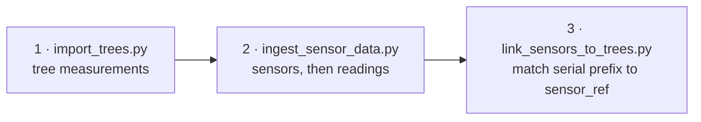

# Runbook — digital-twin-db

Bring the stack up, load data into it, query it, and recover it. For what the database is and
the variant model that shapes it, see [README.md](README.md).

---

## 1. Start the stack

```bash
cd docker
docker compose up -d      # ~30 s
docker compose ps         # every service should read "healthy"
```

| Access point | URL |
|--------------|-----|
| Supabase Studio | <http://localhost:54323> |
| REST API (Kong) | <http://localhost:8000/rest/v1> |
| PostgreSQL | `localhost:5432` — Supavisor pooler |

`docker/.env` carries the passwords, JWT secrets and API keys. Gitignored; regenerate
everything before any deployment.

If a service shows `Exit` or `Restarting`:

```bash
docker compose logs <service-name>
```

Deeper container issues: [docs/docker/README.md](docs/docker/README.md),
[docs/docker/TROUBLESHOOTING.md](docs/docker/TROUBLESHOOTING.md).

Full local setup: [docs/local-deployment-guide.md](docs/local-deployment-guide.md).

---

## 2. Python environment

```bash
conda env create -f environment.yml
conda activate digital-twin
```

`environment.yml` pulls `pylometree` from the University of Freiburg GitLab, which needs
university access. Outside the university, comment that line out and skip volume-calibration
features.

---

## 3. Load data

The database initialises empty of user data. Import in this order so foreign keys resolve:



### Trees

```bash
python scripts/import/import_trees.py data/imports/ecosense_trees_import.csv    # 1,495 trees
python scripts/import/import_trees.py data/imports/mathisle_trees_import.csv    # 730 trees
python scripts/import/import_trees.py <csv> --dry-run                           # validate only
```

Preparing your own CSV — column mapping, coordinate transform, unit conversion, species
lookup, with worked Python and R examples:
[data/templates/DATA_PREPARATION_GUIDE.md](data/templates/DATA_PREPARATION_GUIDE.md).

### Sensors — any provider

Ingestion is provider-agnostic. `ingest_sensor_data.py` loads sensors and readings from any
CSV or JSON via the two source-agnostic bulk RPCs (`bulk_upsert_sensors`,
`bulk_insert_readings`). Both are **idempotent** — re-running the same export is always safe.

```bash
python scripts/import/ingest_sensor_data.py sensors  data/imports/my_sensors.csv --dry-run
python scripts/import/ingest_sensor_data.py sensors  data/imports/my_sensors.csv
python scripts/import/ingest_sensor_data.py readings data/imports/my_readings.json

# different column names in the source
python scripts/import/ingest_sensor_data.py sensors data/imports/vendor_export.csv \
    --mapping data/imports/vendor_mapping.json

python scripts/import/link_sensors_to_trees.py
```

A mapping file is a flat JSON object of `{"source_column": "rpc_field_name"}`.
`ingest_sensor_data.py --help` lists required fields, `position` vs `latitude`/`longitude`,
and the valid `quality` values.

Aquarius is one such provider; its sync lives in
[aquarius-connector](https://gitlab.uni-freiburg.de/xr-future-forests-lab/aquarius-connector)
and talks to this database through the same two RPCs.

### Reference data

Lookups live as CSVs in `data/lookups/` and refresh without a rebuild:

```bash
python scripts/admin/refresh_lookups.py            # all tables
python scripts/admin/refresh_lookups.py species    # one table
python scripts/admin/refresh_lookups.py --list
```

> **A data fix needs both the migration and the CSV.** Correcting a value only in a migration
> means the next rebuild reverts it, because init reloads from CSV. Change both.

Table reference: [data/README.md](data/README.md). All scripts:
[scripts/README.md](scripts/README.md).

### Scenarios and growth variants

Scenarios are location-scoped and created per site by the seed scripts, not loaded from a
global CSV. Copy the pattern in `scripts/seed/ecosense_baseline_variant.sql`: it creates the
scenario and assigns baseline trees to `baseline_2025`. Growth variants on top are written by
`silva-connector`, chained via `parent_variant_id`.

`VariantTypes` (original, simulated_growth, repeat_measurement, …) load from
`data/lookups/variant_types.csv` on init.

Model and query patterns: [docs/variant-scenario-model.md](docs/variant-scenario-model.md).

---

## 4. Query it

### REST

```bash
export ANON_KEY=...    # from docker/.env

curl "http://localhost:8000/rest/v1/species" -H "apikey: $ANON_KEY"
curl "http://localhost:8000/rest/v1/ue_trees?variant_id=eq.2" -H "apikey: $ANON_KEY"
```

**Always filter on variant.** `trees.trees` holds measured trees alongside their SILVA
projections; an unfiltered query multiplies your stand.

Endpoint reference: [docs/api-spec.md](docs/api-spec.md). Query patterns per client:
[docs/data-access-guide.md](docs/data-access-guide.md).

### psql

`dftdb-db` publishes no host port, so admin work goes through the container:

```bash
docker exec -it dftdb-db psql -U postgres
```

```sql
\dn                          -- list schemas
\dt trees.*                  -- list tables in a schema
SELECT * FROM shared.species LIMIT 5;
```

For a file: `MSYS_NO_PATHCONV=1 docker exec -i dftdb-db psql -U postgres < file.sql`.

Host-side Python scripts connect through `scripts/utils/db.py` in the `digital-twin` conda
environment.

### Unreal

Base URL `http://<HOST>:8000/rest/v1`, ANON_KEY from `docker/.env`. The tree-placement
endpoint is `/rest/v1/ue_trees` — a flat, pre-joined view carrying lat/lon, species name,
height, DBH and scenario in one query. Blueprint setup and PCG integration are in the
knowledge hub, `05-PRESENTATION-TIER/data-fetcher-guide`.

---

## 5. Triggering a connector run

Jobs are queued through a Postgres RPC on `/rest/v1/`, not an Edge Function. See
[docs/requesting-a-job.md](docs/requesting-a-job.md).

**This repo ships no custom Edge Functions and is not expected to.** The Deno runtime has no
conda, no R, no Blender and no PDAL, so it cannot execute the work this project runs; and Kong
routes `/functions/v1/` with only the `cors` plugin while `/rest/v1/` gets `key-auth` and
`acl`, so every function would hand-roll authentication that PostgREST provides for free.
`docker/volumes/functions/` holds only the platform's own `main/` router and `hello/` example.

---

## 6. Reset and rebuild

**The `db` image bakes `docker/volumes/db/init/`.** A bare `up -d` reuses the old baked SQL;
after any schema change, rebuild the image.

```bash
cd docker && docker compose build db && docker compose up -d db     # schema change
```

Full rebuild from committed sources, reproducible:

```bash
# 0. back up first (see §7)
# 1. wipe volumes, rebuild the baked image, boot (init scripts run on first boot)
cd docker
docker compose down -v --remove-orphans
docker compose build db
docker compose up -d
cd ..

# 2. trees
python scripts/import/import_trees.py data/imports/ecosense_trees_import.csv
python scripts/import/import_trees.py data/imports/mathisle_trees_import.csv

# 3. baseline variants (schema-owning DDL runs as supabase_admin, not postgres)
docker exec -i dftdb-db psql -U supabase_admin -d postgres < scripts/seed/ecosense_baseline_variant.sql
docker exec -i dftdb-db psql -U supabase_admin -d postgres < scripts/seed/mathisle_baseline_variant.sql

# 4. sensors + readings, then link
python scripts/import/ingest_sensor_data.py sensors  data/imports/my_sensors.csv
python scripts/import/ingest_sensor_data.py readings data/imports/my_readings.json
python scripts/import/link_sensors_to_trees.py
```

The Python importers connect as `postgres` for DML; that is fine. Growth variants come from
`silva-connector` afterwards.

**Missing tables after a fresh start** = the image was not rebuilt. **Studio or Kong not
reachable** = `analytics` is not healthy yet; `docker compose restart analytics`, wait ~15 s,
then `restart studio kong`. **Port already in use** = find the holder (`netstat -ano |
findstr :5432` / `ss -tlnp | grep 5432`) or change the mapping in `docker/.env`.
**Volumes fail after a Docker Desktop restart on Windows** = stale WSL bind-mount paths;
persistent state is on named volumes for exactly this reason, restart Docker Desktop and
`up -d`.

Symptom-by-symptom: [docs/troubleshooting.md](docs/troubleshooting.md); container-level:
[docs/docker/TROUBLESHOOTING.md](docs/docker/TROUBLESHOOTING.md).

---

## 7. Operate

### Health

```bash
docker compose ps                                              # every service "healthy"
docker compose exec db pg_isready -U postgres
curl -s -o /dev/null -w "%{http_code}\n" http://localhost:8000/rest/v1/ -H "apikey: $ANON_KEY"   # 200
python scripts/utils/check_db_schema.py
```

### Logs

```bash
docker compose logs -f                                         # everything, live
docker compose logs --tail 500 db | grep -i error
docker compose logs --no-color > logs-$(date +%Y%m%d).log
docker stats
```

### Backup and restore

```bash
docker exec dftdb-db pg_dump -U postgres -d postgres -Fc -f /tmp/backup.dump
docker cp dftdb-db:/tmp/backup.dump ./backup-$(date +%Y%m%d-%H%M%S).dump

# restore into a running stack: stop the app services, keep db
docker compose stop studio kong auth rest realtime storage
docker exec -i dftdb-db pg_restore -U postgres -d postgres --clean --if-exists /tmp/backup.dump
docker compose up -d
```

On the server a `dt-db-backup` systemd timer does this nightly (installed 2026-09-10 — until
then there was no backup at all).

### Rotating credentials

The database password and API keys live in `docker/.env` here, but **three other places
hold copies**. Rotate the database first, then every consumer, then verify; there is no CI
and no secret store, so nothing else will tell you a consumer broke.

| # | Destination | Keys | Notes |
|---|---|---|---|
| 1 | `digital-twin-db/docker/.env` | `POSTGRES_PASSWORD`, `ANON_KEY`, `SERVICE_ROLE_KEY`, `JWT_SECRET` | Source of truth. Changing `JWT_SECRET` invalidates both API keys — regenerate them with `python scripts/utils/generate_jwt.py` |
| 2 | `aquarius-connector/.env` | `SERVICE_ROLE_KEY`, `SUPABASE_URL` | REST client; a stale key fails every sync |
| 3 | silva-connector | `PGPASSWORD` in the shell (or `docker/.env`) | libpq as `postgres`; see `silva-connector/docker/.env.example` |
| 4 | `digital-twin-dashboard/docker/.env` | `DB_PASSWORD`, `POOLER_TENANT_ID` | Through `dftdb-pooler`; the tenant id must match this stack's |

After step 1 recreate the stack — a `restart` is not enough, env is baked at container
creation:

```bash
cd docker && docker compose up -d --force-recreate
```

Verify: the API (`curl …/rest/v1/species?limit=1` → 200), `python -m
aquarius_connector.find_active_sensors` in aquarius-connector (read-only), a silva-connector
`--dry-run`, and `docker logs dtdash-shiny --tail 20` after recreating the dashboard.

### Emergency

```bash
cd docker && docker compose down && docker compose up -d      # full stack restart
```

Rollback to the last backup: the restore recipe above.

---

## 8. Production

Deployment to `dt.unr.uni-freiburg.de` — TLS, Kong routing, NFS-backed `PGDATA`, and the
constraints that shaped them: [docs/deployment-guide.md](docs/deployment-guide.md).
Requesting jobs from there: [docs/requesting-a-job.md](docs/requesting-a-job.md).

Traps recorded there, because each cost days:

- **The API is served at `/db/` on 443** because a campus ACL blocks every other port; only
  `rest`, `auth` and `storage` are proxied — Studio is not, it needs an SSH tunnel.
- **Never name a compose service something campus DNS also resolves.** The service name
  `auth` resolved to a university web host, and Kong sent every `/auth/v1/` request off the
  machine for a week. A dev machine cannot reproduce this class of bug.
- **`nginx.conf` is a single-file bind mount**: a reload does nothing and `nginx -t` passes
  on the stale file — force-recreate the container.
- **The TLS certificate renews on `dt-renew-ssl.timer`**; verify it actually renewed before
  2026-12-01 rather than trusting a green timer (XRFF-421).
- **`GOTRUE_DISABLE_SIGNUP` is still `false`** — the signup endpoint is open (XRFF-435).

---

## 9. Reference

### Environment variables (`docker/.env`, from `docker/.env.example`)

Secrets — change before any use:

| Variable | Generate with | Purpose |
|---|---|---|
| `POSTGRES_PASSWORD` | `openssl rand -base64 32` | PostgreSQL superuser |
| `JWT_SECRET` | `openssl rand -base64 32` | JWT signing secret |
| `ANON_KEY`, `SERVICE_ROLE_KEY` | `python scripts/utils/generate_jwt.py` | Supabase role JWTs |
| `DASHBOARD_PASSWORD` | `openssl rand -base64 32` | Studio login |
| `SECRET_KEY_BASE` | `openssl rand -base64 48` | Realtime / Supavisor session key (≥ 64 chars) |
| `VAULT_ENC_KEY` | `openssl rand -hex 16` | Supavisor vault key (32 hex) |
| `PG_META_CRYPTO_KEY` | `openssl rand -base64 32` | pg-meta |
| `LOGFLARE_PUBLIC_ACCESS_TOKEN`, `LOGFLARE_PRIVATE_ACCESS_TOKEN` | two different random strings ≥ 20 chars | Logflare |

Configuration: `POSTGRES_HOST=db`, `POSTGRES_PORT=5432`, `POSTGRES_DB=postgres`,
`DASHBOARD_USERNAME=supabase`; `KONG_HTTP_PORT=8000`, `KONG_HTTPS_PORT=8443`,
`POOLER_PROXY_PORT_TRANSACTION=6543`, `POOLER_TENANT_ID=digital-forest-twin-local`,
`POOLER_DEFAULT_POOL_SIZE=20`, `POOLER_MAX_CLIENT_CONN=100`. Provider credentials
(Aquarius, …) live in the connector repos, never here.

### Service start order (from `docker-compose.yml`)

```
vector → db → analytics → { studio, kong, auth, rest, realtime, meta, edge-functions, supavisor }
                       └→ storage (needs rest + imgproxy)
```

If studio or kong will not start, check `analytics` first.

### Ports (dev)

| Service | Host | Container |
|---|---|---|
| Studio | 54323 | 3000 |
| Kong (REST, Auth, Storage, Realtime) | 8000 / 8443 | 8000 / 8443 |
| Postgres via Supavisor | 5432 | 5432 |
| Supavisor transaction pooler | 6543 | 6543 |
| Mail (inbucket, dev only — forwards nothing) | 2500 / 9000 | 2500 / 9000 |
| Analytics (Logflare) | 4000 | 4000 |

On the server Kong is on **8001** and Postgres on **5433**; the public surface is 443 only.
