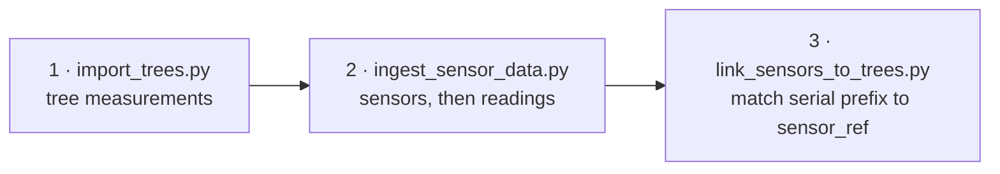

# Runbook — digital-twin-db

Bring the stack up, load data into it, query it, and recover it. For what the database is and
the variant model that shapes it, see [README.md](README.md).

---

## 1. Start the stack

```bash
cd docker
docker compose up -d      # ~30 s
docker compose ps         # every service should read "healthy"
```

| Access point | URL |
|--------------|-----|
| Supabase Studio | <http://localhost:54323> |
| REST API (Kong) | <http://localhost:8000/rest/v1> |
| PostgreSQL | `localhost:5432` — Supavisor pooler |

`docker/.env` carries the passwords, JWT secrets and API keys. Gitignored; regenerate
everything before any deployment.

If a service shows `Exit` or `Restarting`:

```bash
docker compose logs <service-name>
```

Deeper container issues: [docs/docker/README.md](docs/docker/README.md),
[docs/docker/TROUBLESHOOTING.md](docs/docker/TROUBLESHOOTING.md).

Full local setup: [docs/local-deployment-guide.md](docs/local-deployment-guide.md).

---

## 2. Python environment

```bash
conda env create -f environment.yml
conda activate digital-twin
```

`environment.yml` pulls `pylometree` from the University of Freiburg GitLab, which needs
university access. Outside the university, comment that line out and skip volume-calibration
features.

---

## 3. Load data

The database initialises empty of user data. Import in this order so foreign keys resolve:



### Trees

```bash
python scripts/import/import_trees.py data/imports/ecosense_trees_import.csv    # 1,495 trees
python scripts/import/import_trees.py data/imports/mathisle_trees_import.csv    # 730 trees
python scripts/import/import_trees.py <csv> --dry-run                           # validate only
```

Preparing your own CSV — column mapping, coordinate transform, unit conversion, species
lookup, with worked Python and R examples:
[data/templates/DATA_PREPARATION_GUIDE.md](data/templates/DATA_PREPARATION_GUIDE.md).

### Sensors — any provider

Ingestion is provider-agnostic. `ingest_sensor_data.py` loads sensors and readings from any
CSV or JSON via the two source-agnostic bulk RPCs (`bulk_upsert_sensors`,
`bulk_insert_readings`). Both are **idempotent** — re-running the same export is always safe.

```bash
python scripts/import/ingest_sensor_data.py sensors  data/imports/my_sensors.csv --dry-run
python scripts/import/ingest_sensor_data.py sensors  data/imports/my_sensors.csv
python scripts/import/ingest_sensor_data.py readings data/imports/my_readings.json

# different column names in the source
python scripts/import/ingest_sensor_data.py sensors data/imports/vendor_export.csv \
    --mapping data/imports/vendor_mapping.json

python scripts/import/link_sensors_to_trees.py
```

A mapping file is a flat JSON object of `{"source_column": "rpc_field_name"}`.
`ingest_sensor_data.py --help` lists required fields, `position` vs `latitude`/`longitude`,
and the valid `quality` values.

Aquarius is one such provider; its sync lives in
[aquarius-connector](https://gitlab.uni-freiburg.de/xr-future-forests-lab/aquarius-connector)
and talks to this database through the same two RPCs.

### Reference data

Lookups live as CSVs in `data/lookups/` and refresh without a rebuild:

```bash
python scripts/admin/refresh_lookups.py            # all tables
python scripts/admin/refresh_lookups.py species    # one table
python scripts/admin/refresh_lookups.py --list
```

> **A data fix needs both the migration and the CSV.** Correcting a value only in a migration
> means the next rebuild reverts it, because init reloads from CSV. Change both.

Table reference: [data/README.md](data/README.md). All scripts:
[scripts/README.md](scripts/README.md).

### Scenarios and growth variants

Scenarios are location-scoped and created per site by the seed scripts, not loaded from a
global CSV. Copy the pattern in `scripts/seed/ecosense_baseline_variant.sql`: it creates the
scenario and assigns baseline trees to `baseline_2025`. Growth variants on top are written by
`silva-connector`, chained via `parent_variant_id`.

`VariantTypes` (original, simulated_growth, repeat_measurement, …) load from
`data/lookups/variant_types.csv` on init.

Model and query patterns: [docs/variant-scenario-model.md](docs/variant-scenario-model.md).

---

## 4. Query it

### REST

```bash
export ANON_KEY=...    # from docker/.env

curl "http://localhost:8000/rest/v1/species" -H "apikey: $ANON_KEY"
curl "http://localhost:8000/rest/v1/ue_trees?variant_id=eq.2" -H "apikey: $ANON_KEY"
```

**Always filter on variant.** `trees.trees` holds measured trees alongside their SILVA
projections; an unfiltered query multiplies your stand.

Endpoint reference: [docs/api-spec.md](docs/api-spec.md). Query patterns per client:
[docs/data-access-guide.md](docs/data-access-guide.md).

### psql

`dftdb-db` publishes no host port, so admin work goes through the container:

```bash
docker exec -it dftdb-db psql -U postgres
```

```sql
\dn                          -- list schemas
\dt trees.*                  -- list tables in a schema
SELECT * FROM shared.species LIMIT 5;
```

For a file: `MSYS_NO_PATHCONV=1 docker exec -i dftdb-db psql -U postgres < file.sql`.

Host-side Python scripts connect through `scripts/utils/db.py` in the `digital-twin` conda
environment.

### Unreal

Base URL `http://<HOST>:8000/rest/v1`, ANON_KEY from `docker/.env`. The tree-placement
endpoint is `/rest/v1/ue_trees` — a flat, pre-joined view carrying lat/lon, species name,
height, DBH and scenario in one query. Blueprint setup and PCG integration are in the
knowledge hub, `05-PRESENTATION-TIER/data-fetcher-guide`.

---

## 5. Triggering a connector run

Jobs are queued through a Postgres RPC on `/rest/v1/`, not an Edge Function. See
[docs/requesting-a-job.md](docs/requesting-a-job.md).

**This repo ships no custom Edge Functions and is not expected to.** The Deno runtime has no
conda, no R, no Blender and no PDAL, so it cannot execute the work this project runs; and Kong
routes `/functions/v1/` with only the `cors` plugin while `/rest/v1/` gets `key-auth` and
`acl`, so every function would hand-roll authentication that PostgREST provides for free.
`docker/volumes/functions/` holds only the platform's own `main/` router and `hello/` example.

---

## 6. Reset and recovery

```bash
cd docker
docker compose down -v                 # stop and remove containers + volumes
rm -rf volumes/db/data                 # remove persistent data
docker compose up -d                   # fresh
```

There is also a scripted reset — run it without arguments first to see what it will do.

**The analytics container needs the `_supabase` database.** If it fails to start, check the
database logs before assuming the whole stack is broken:

```bash
docker compose logs db
```

**Port already in use:** find the holder and either stop it or change the mapping in
`docker-compose.yml`.

Full procedures: [docs/runbook.md](docs/runbook.md).
Symptom-by-symptom: [docs/troubleshooting.md](docs/troubleshooting.md).

---

## 7. Production

Deployment to `dt.unr.uni-freiburg.de` — TLS, Kong routing, NFS-backed `PGDATA`, and the
constraints that shaped them: [docs/deployment-guide.md](docs/deployment-guide.md).

Two traps recorded there, because both cost days:

- **The API is served at `/db/` on 443** because a campus ACL blocks every other port.
- **Never name a compose service something campus DNS also resolves.** The service name
  `auth` resolved to a university web host, and Kong sent every `/auth/v1/` request off the
  machine for a week. A dev machine cannot reproduce this class of bug.
