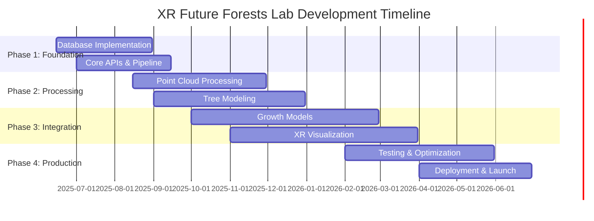

# XR Future Forests Lab - Project Plan & TODO

> **Status**: Updated June 2025 based on completed architecture and database design documentation

## Project Phases Overview

---

## PHASE 1: Foundation & Core Infrastructure (Jun - Sep 2025)

### 1.1 Database Implementation ✅ DESIGN COMPLETED

#### 1.1.1 Point Cloud Database Implementation

**Priority**: HIGH | **Duration**: 3 weeks | **Dependencies**: None

**Description**: Implement the Point Cloud DB schema based on completed design. Set up PostgreSQL with PostGIS extensions and create tables for point clouds, segmentation results, and classification outputs.

**Tech Stack**: PostgreSQL 15+, PostGIS 3.3+, pgPointCloud extension

**Deliverables**:

- [ ] ~~Design schema~~ ✅ COMPLETED
- [ ] Implement PostgreSQL database with PostGIS and pgPointCloud extensions
- [ ] Create tables: Locations, PointClouds, PointCloudSegmentationResults, TreeClassificationResults, Species
- [ ] Set up spatial indexes for efficient querying
- [ ] Implement file storage strategy (S3/MinIO + metadata in DB)
- [ ] Create database migration scripts and version control

#### 1.1.2 Tree Database Implementation

**Priority**: HIGH | **Duration**: 4 weeks | **Dependencies**: Point Cloud DB

**Description**: Implement the comprehensive Tree DB schema supporting scenarios, variants, and detailed structural modeling with branches, twigs, and leaves.

**Tech Stack**: PostgreSQL 15+, PostGIS 3.3+, JSON fields for flexible data

**Deliverables**:

- [ ] ~~Design schema~~ ✅ COMPLETED  
- [ ] Implement all Tree DB tables (Trees, TreeVariants, TreeStructures, etc.)
- [ ] Set up referential integrity and constraints
- [ ] Create indexes for performance optimization
- [ ] Implement data validation rules and triggers
- [ ] Set up temporal data tracking for growth simulations

#### 1.1.3 Environment Database Implementation

**Priority**: MEDIUM | **Duration**: 2 weeks | **Dependencies**: None

**Description**: Implement time-series environmental data storage using TimescaleDB extension for sensor readings and environmental snapshots.

**Tech Stack**: PostgreSQL 15+, TimescaleDB 2.11+, PostGIS 3.3+

**Deliverables**:

- [ ] ~~Design schema~~ ✅ COMPLETED
- [ ] Install and configure TimescaleDB extension
- [ ] Create tables: Sensors, SensorReadings, EnvironmentalSnapshots
- [ ] Set up time-series partitioning and retention policies
- [ ] Implement data quality checks and anomaly detection triggers

### 1.2 Core API Development

#### 1.2.1 Data Ingestion API

**Priority**: HIGH | **Duration**: 3 weeks | **Dependencies**: All databases

**Description**: Implement RESTful APIs for data ingestion from various sources (3DTrees, EcoSense sensors, weather data, forest inventory).

**Tech Stack**: Python 3.11+, FastAPI 0.100+, Pydantic v2, SQLAlchemy 2.0+, Alembic

**Deliverables**:

- [ ] Set up FastAPI project structure with async support
- [ ] Implement point cloud upload endpoints with file validation
- [ ] Create sensor data ingestion endpoints (batch and streaming)
- [ ] Build weather/climate data import APIs
- [ ] Implement forest inventory data upload
- [ ] Add comprehensive input validation and error handling
- [ ] Set up OpenAPI documentation generation

#### 1.2.2 Database Access Layer

**Priority**: HIGH | **Duration**: 2 weeks | **Dependencies**: Database implementation

**Description**: Create unified database access layer with SQLAlchemy models and repository patterns.

**Tech Stack**: SQLAlchemy 2.0+, Asyncpg, PostGIS SQLAlchemy

**Deliverables**:

- [ ] Create SQLAlchemy models for all database tables
- [ ] Implement repository pattern for database operations
- [ ] Set up database connection pooling and async operations
- [ ] Create database migration management system
- [ ] Implement comprehensive error handling and logging
- [ ] Add database health checks and monitoring

#### 1.2.3 Authentication & Authorization

**Priority**: MEDIUM | **Duration**: 2 weeks | **Dependencies**: Core APIs

**Description**: Implement secure authentication and role-based authorization system for API access.

**Tech Stack**: JWT tokens, bcrypt, FastAPI Security, OAuth2

**Deliverables**:

- [ ] Set up JWT-based authentication system
- [ ] Implement role-based access control (RBAC)
- [ ] Create user management endpoints
- [ ] Add API rate limiting and throttling
- [ ] Implement audit logging for all operations
- [ ] Set up secure password policies

### 1.3 DevOps & Infrastructure

#### 1.3.1 Containerization & Orchestration

**Priority**: HIGH | **Duration**: 2 weeks | **Dependencies**: Core APIs

**Description**: Containerize all services and set up orchestration for development and production environments.

**Tech Stack**: Docker 24+, Docker Compose, Kubernetes (optional), Helm charts

**Deliverables**:

- [ ] Create Dockerfiles for all services
- [ ] Set up Docker Compose for local development
- [ ] Implement multi-stage builds for optimization
- [ ] Create Kubernetes manifests for production deployment
- [ ] Set up CI/CD pipeline with GitHub Actions
- [ ] Implement automated testing in containers

#### 1.3.2 Monitoring & Logging

**Priority**: MEDIUM | **Duration**: 1 week | **Dependencies**: Containerization

**Description**: Set up comprehensive monitoring, logging, and alerting systems.

**Tech Stack**: Prometheus, Grafana, ELK Stack (Elasticsearch, Logstash, Kibana), Jaeger

**Deliverables**:

- [ ] Set up structured logging with ELK stack
- [ ] Implement Prometheus metrics collection
- [ ] Create Grafana dashboards for system monitoring
- [ ] Set up distributed tracing with Jaeger
- [ ] Configure alerting rules and notifications
- [ ] Implement health check endpoints for all services

---

## PHASE 2: Data Processing & Modeling (Aug 2025 - Dec 2025)

### 2.1 Point Cloud Processing Pipeline

#### 2.1.1 3DTrees Platform Integration

**Priority**: HIGH | **Duration**: 4 weeks | **Dependencies**: Data Ingestion API

**Description**: Integrate with 3DTrees platform for automated point cloud processing, including tree segmentation and species classification.

**Tech Stack**: Python 3.11+, PDAL 2.5+, Open3D 0.17+, scikit-learn, TreeLearn, 3DFin

**Deliverables**:

- [ ] Implement PDAL-based point cloud processing pipeline
- [ ] Integrate TreeLearn for automated tree segmentation
- [ ] Set up 3DFin integration for feature extraction
- [ ] Create species classification ML pipeline
- [ ] Implement quality control and validation metrics
- [ ] Set up batch and real-time processing workflows
- [ ] Add progress tracking and job management

#### 2.1.2 Point Cloud Quality Assessment

**Priority**: MEDIUM | **Duration**: 2 weeks | **Dependencies**: 3DTrees Integration

**Description**: Implement automated quality assessment for point cloud data and processing results.

**Tech Stack**: NumPy, SciPy, Open3D, custom validation algorithms

**Deliverables**:

- [ ] Implement point cloud density and coverage metrics
- [ ] Create automated outlier detection algorithms
- [ ] Build segmentation quality assessment tools
- [ ] Set up classification accuracy validation
- [ ] Implement comparative analysis with field measurements
- [ ] Create quality reporting and visualization tools

### 2.2 Tree Structure Modeling

#### 2.2.1 Quantitative Structure Model (QSM) Pipeline

**Priority**: HIGH | **Duration**: 6 weeks | **Dependencies**: Point cloud processing

**Description**: Implement comprehensive QSM generation pipeline supporting multiple tools and algorithms for creating detailed tree structure models.

**Tech Stack**: Python, R, TreeQSM (MATLAB), rTwig, SimpleForest, Open3D

**Deliverables**:

- [ ] Evaluate and benchmark QSM tools (TreeQSM, rTwig, SimpleForest)
- [ ] Implement automated QSM generation pipeline
- [ ] Create QSM quality assessment and validation framework
- [ ] Build conversion tools between different QSM formats
- [ ] Implement mesh generation from QSM data
- [ ] Set up batch processing for multiple trees
- [ ] Create QSM comparison and analysis tools

#### 2.2.2 Procedural Tree Modeling

**Priority**: MEDIUM | **Duration**: 4 weeks | **Dependencies**: QSM Pipeline

**Description**: Implement L-system and DeepTree-based procedural modeling for tree generation and growth simulation.

**Tech Stack**: Python, PyTorch/TensorFlow, L-Py (L-system Python), custom neural networks

**Deliverables**:

- [ ] Research and implement DeepTree neural model architecture
- [ ] Set up L-system framework for procedural generation
- [ ] Create hybrid modeling approach combining QSM and procedural methods
- [ ] Implement parameter estimation from point cloud data
- [ ] Build model training and validation pipelines
- [ ] Create tree structure interpolation and extrapolation tools

#### 2.2.3 3D Model Generation & Optimization

**Priority**: HIGH | **Duration**: 4 weeks | **Dependencies**: QSM Pipeline, Procedural Modeling

**Description**: Convert tree structure models to optimized 3D meshes suitable for XR visualization with multiple levels of detail.

**Tech Stack**: Blender API, Open3D, Three.js tools, glTF-Transform, Draco compression

**Deliverables**:

- [ ] Implement automated mesh generation from QSM/procedural models
- [ ] Create LOD (Level of Detail) generation pipeline
- [ ] Set up texture generation and material assignment
- [ ] Implement glTF/GLB export with Draco compression
- [ ] Build 3D Tiles generation for large-scale visualization
- [ ] Create model validation and quality assessment tools
- [ ] Implement streaming optimization for XR applications

---

## PHASE 3: Advanced Integration (Oct 2025 - Mar 2026)

### 3.1 Growth Model Integration

#### 3.1.1 SILVA Model Integration

**Priority**: HIGH | **Duration**: 6 weeks | **Dependencies**: Tree DB, QSM Pipeline

**Description**: Integrate SILVA individual tree growth model for simulating tree development over time.

**Tech Stack**: R, Python, rpy2 (R-Python interface), SILVA model package

**Deliverables**:

- [ ] Set up SILVA model environment and dependencies
- [ ] Create Python wrapper for SILVA model execution
- [ ] Implement parameter mapping from Tree DB to SILVA format
- [ ] Build batch simulation processing for multiple scenarios
- [ ] Create growth result validation and visualization
- [ ] Set up temporal data management for growth sequences
- [ ] Implement model calibration and parameter optimization

#### 3.1.2 BALANCE Model Integration

**Priority**: MEDIUM | **Duration**: 4 weeks | **Dependencies**: SILVA Integration

**Description**: Integrate BALANCE stand-level forest growth model for landscape-scale simulations.

**Tech Stack**: R, Python, BALANCE model components, spatial analysis libraries

**Deliverables**:

- [ ] Set up BALANCE model framework
- [ ] Implement stand-level data aggregation from Tree DB
- [ ] Create scenario-based simulation workflows
- [ ] Build result disaggregation back to individual trees
- [ ] Implement multi-scale validation (tree vs. stand level)
- [ ] Create comparative analysis between SILVA and BALANCE

#### 3.1.3 Environmental Model Integration

**Priority**: MEDIUM | **Duration**: 3 weeks | **Dependencies**: Environment DB, Growth models

**Description**: Integrate environmental data and climate scenarios into growth modeling workflows.

**Tech Stack**: Python, R, climate data APIs, interpolation libraries

**Deliverables**:

- [ ] Implement climate scenario generation and management
- [ ] Create environmental parameter interpolation for tree locations
- [ ] Build environmental stress factor calculations
- [ ] Implement drought, temperature, and soil condition modeling
- [ ] Create environmental scenario comparison tools
- [ ] Set up automated environmental data updates

### 3.2 XR Visualization Development

#### 3.2.1 Unity XR Application Core

**Priority**: HIGH | **Duration**: 8 weeks | **Dependencies**: 3D Model Pipeline

**Description**: Develop core Unity XR application for immersive forest visualization and interaction.

**Tech Stack**: Unity 2023.3+, XR Interaction Toolkit, Universal Render Pipeline (URP), C#

**Deliverables**:

- [ ] Set up Unity XR project with multi-platform support (Quest, PICO, HoloLens)
- [ ] Implement core scene management and navigation systems
- [ ] Create asset loading and streaming system for large forests
- [ ] Build user interface and interaction systems
- [ ] Implement performance optimization and LOD management
- [ ] Create save/load system for user sessions
- [ ] Set up cross-platform compatibility testing

#### 3.2.2 Real-time Data Synchronization

**Priority**: HIGH | **Duration**: 4 weeks | **Dependencies**: Unity Core, Core APIs

**Description**: Implement real-time data synchronization between XR application and backend systems.

**Tech Stack**: WebSocket, SignalR, Unity Networking, JSON serialization

**Deliverables**:

- [ ] Implement WebSocket client for real-time data updates
- [ ] Create efficient data serialization/deserialization
- [ ] Build incremental scene updates for performance
- [ ] Implement conflict resolution for concurrent users
- [ ] Set up offline mode with data synchronization
- [ ] Create data caching and prefetching strategies

#### 3.2.3 Collaborative Multi-user Features

**Priority**: MEDIUM | **Duration**: 4 weeks | **Dependencies**: Real-time Sync

**Description**: Enable collaborative multi-user experiences in XR with shared sessions and interactions.

**Tech Stack**: Unity Netcode, Mirror Networking, voice chat integration

**Deliverables**:

- [ ] Implement multi-user session management
- [ ] Create avatar systems and user presence indicators
- [ ] Build shared interaction and annotation tools
- [ ] Implement voice chat and spatial audio
- [ ] Create session recording and playback features
- [ ] Set up user permission and access control

### 3.3 Advanced Analytics & AI

#### 3.3.1 AI-Powered Tree Health Assessment

**Priority**: MEDIUM | **Duration**: 6 weeks | **Dependencies**: Point cloud processing, ML pipelines

**Description**: Develop machine learning models for automated tree health assessment using point cloud and environmental data.

**Tech Stack**: PyTorch, scikit-learn, computer vision libraries, point cloud ML tools

**Deliverables**:

- [ ] Create training dataset from historical tree health data
- [ ] Implement computer vision models for health assessment
- [ ] Build feature extraction pipelines from point clouds
- [ ] Create health prediction models with uncertainty quantification
- [ ] Implement early warning systems for tree stress
- [ ] Set up model validation and accuracy monitoring

#### 3.3.2 Predictive Forest Analytics

**Priority**: LOW | **Duration**: 4 weeks | **Dependencies**: Growth models, AI Health Assessment

**Description**: Develop predictive analytics for forest management decisions and risk assessment.

**Tech Stack**: Python, time series analysis libraries, machine learning frameworks

**Deliverables**:

- [ ] Implement forest risk assessment models
- [ ] Create management scenario optimization tools
- [ ] Build climate change impact prediction models
- [ ] Create economic impact assessment tools
- [ ] Implement biodiversity and ecosystem service modeling
- [ ] Set up decision support system interfaces

---

## PHASE 4: Testing, Optimization & Deployment (Feb 2026 - Jun 2026)

### 4.1 Testing & Quality Assurance

#### 4.1.1 Comprehensive Testing Framework

**Priority**: HIGH | **Duration**: 6 weeks | **Dependencies**: All previous phases

**Description**: Implement comprehensive testing framework covering unit, integration, performance, and user acceptance testing.

**Tech Stack**: pytest, Jest, Unity Test Runner, Selenium, performance testing tools

**Deliverables**:

- [ ] Create unit test suites for all backend services
- [ ] Implement integration tests for data pipelines
- [ ] Build automated UI testing for XR applications
- [ ] Create performance benchmarking and regression tests
- [ ] Set up continuous integration testing
- [ ] Implement user acceptance testing protocols

#### 4.1.2 Scientific Validation & Accuracy Assessment

**Priority**: HIGH | **Duration**: 4 weeks | **Dependencies**: Testing framework

**Description**: Validate scientific accuracy of models and ensure research-grade quality of results.

**Tech Stack**: R, Python statistical libraries, validation frameworks

**Deliverables**:

- [ ] Validate QSM accuracy against field measurements
- [ ] Test growth model predictions against historical data
- [ ] Verify environmental model accuracy
- [ ] Conduct cross-validation studies
- [ ] Implement statistical significance testing
- [ ] Create accuracy reporting and confidence intervals

### 4.2 Performance Optimization

#### 4.2.1 Backend Performance Optimization

**Priority**: MEDIUM | **Duration**: 3 weeks | **Dependencies**: Testing framework

**Description**: Optimize backend performance for handling large datasets and concurrent users.

**Tech Stack**: Profiling tools, database optimization, caching strategies

**Deliverables**:

- [ ] Profile and optimize database queries
- [ ] Implement advanced caching strategies
- [ ] Optimize point cloud processing pipelines
- [ ] Implement horizontal scaling solutions
- [ ] Create performance monitoring dashboards
- [ ] Set up automated performance alerts

#### 4.2.2 XR Performance Optimization

**Priority**: HIGH | **Duration**: 4 weeks | **Dependencies**: Unity XR Core

**Description**: Optimize XR application performance for smooth user experience across different hardware.

**Tech Stack**: Unity Profiler, graphics optimization tools, platform-specific optimizations

**Deliverables**:

- [ ] Optimize rendering performance for VR frame rates
- [ ] Implement dynamic quality adjustment
- [ ] Create platform-specific optimization profiles
- [ ] Optimize memory usage and garbage collection
- [ ] Implement advanced culling and LOD systems
- [ ] Create performance testing on target hardware

### 4.3 Production Deployment

#### 4.3.1 Cloud Infrastructure Setup

**Priority**: HIGH | **Duration**: 4 weeks | **Dependencies**: Performance optimization

**Description**: Set up production-ready cloud infrastructure with scalability and reliability.

**Tech Stack**: AWS/Azure/GCP, Kubernetes, Terraform, monitoring tools

**Deliverables**:

- [ ] Design cloud architecture for production deployment
- [ ] Set up Infrastructure as Code (IaC) with Terraform
- [ ] Implement auto-scaling and load balancing
- [ ] Create backup and disaster recovery procedures
- [ ] Set up monitoring and alerting systems
- [ ] Implement security hardening and compliance

#### 4.3.2 Deployment Pipeline & Operations

**Priority**: HIGH | **Duration**: 3 weeks | **Dependencies**: Cloud infrastructure

**Description**: Implement automated deployment pipeline and operational procedures.

**Tech Stack**: CI/CD tools, configuration management, monitoring systems

**Deliverables**:

- [ ] Create automated CI/CD pipeline
- [ ] Implement blue-green deployment strategy
- [ ] Set up configuration management
- [ ] Create operational runbooks and procedures
- [ ] Implement automated rollback procedures
- [ ] Set up production monitoring and maintenance

---

## ONGOING: Cross-cutting Concerns

### Documentation & Knowledge Management

**Priority**: MEDIUM | **Ongoing throughout project**

**Key Updates Based on Completed Work**:

- [ ] ~~Architecture design~~ ✅ COMPLETED
- [ ] ~~Database design~~ ✅ COMPLETED
- [ ] API documentation with OpenAPI
- [ ] User manuals and training materials
- [ ] Deployment and operations guides
- [ ] Scientific methodology documentation
- [ ] Code documentation and developer guides

### Security & Data Protection

**Priority**: HIGH | **Ongoing throughout project**

**Deliverables**:

- [ ] Security assessment and penetration testing
- [ ] GDPR compliance implementation
- [ ] Data encryption and secure transmission
- [ ] Access control and audit logging
- [ ] Vulnerability scanning and patching
- [ ] Security training and awareness

### Research Integration & Collaboration

**Priority**: MEDIUM | **Ongoing throughout project**

**Deliverables**:

- [ ] Research collaboration protocols
- [ ] Data sharing and publication guidelines
- [ ] Integration with existing research workflows
- [ ] Scientific validation methodologies
- [ ] Conference presentations and publications
- [ ] Community engagement and feedback

---

## Resource Requirements & Dependencies

### Team Structure Recommendation

- **Backend Development**: 2-3 developers (Python, PostgreSQL, APIs)
- **XR Development**: 1-2 developers (Unity, C#, XR platforms)
- **Data Science/ML**: 1-2 specialists (Python, R, ML frameworks)
- **DevOps/Infrastructure**: 1 specialist (Docker, Kubernetes, cloud platforms)
- **QA/Testing**: 1 specialist (automated testing, validation)
- **Project Management**: 1 coordinator

### Critical Dependencies

- Access to point cloud datasets for testing and validation
- SILVA and BALANCE model licenses and access
- XR hardware for testing (Quest, PICO, HoloLens)
- Cloud infrastructure budget for production deployment
- Research collaboration agreements

### Risk Mitigation Strategies

- Regular milestone reviews and scope adjustments
- Parallel development tracks where possible
- Early prototype development for validation
- Incremental delivery and testing approach
- Fallback options for complex integrations
- Regular stakeholder communication and feedback loops

---

## Next Steps & Immediate Actions

### Week 1-2 (June 15-28, 2025)

1. **Set up development environment**
   - Install PostgreSQL 15+ with PostGIS and TimescaleDB
   - Set up Python 3.11+ development environment
   - Configure Docker and Docker Compose

2. **Begin database implementation**
   - Start with Point Cloud DB tables
   - Create initial database migration scripts
   - Set up database connection and basic testing

3. **Project setup**
   - Initialize Git repository with proper structure
   - Set up CI/CD pipeline skeleton
   - Create project documentation structure

### Month 1 (July 2025)

1. **Complete Phase 1.1 - Database Implementation**
2. **Begin Phase 1.2 - Core API Development**
3. **Establish development workflows and coding standards**
4. **Set up initial monitoring and logging infrastructure**

This project plan provides a comprehensive roadmap that builds upon the completed architecture and database design work, ensuring efficient development progression with clear milestones, dependencies, and deliverables.
