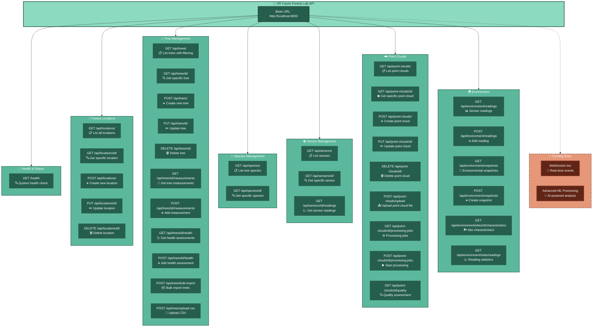

# API Reference - Visual Overview

> **Quick Reference**: Visual overview of all available API endpoints  
> **Interactive Version**: <http://localhost:8000/docs> (when system is running)  
> **Related**: [Developer Guide](./developer_guide.md) | [System Introduction](./system_introduction.md)

This document provides a quick visual reference for all API endpoints in the XR Future Forests Lab system.

## 🌐 **API Endpoint Overview**

### **Current Implemented Endpoints**



## 📋 **Endpoint Details**

### **Health Check Endpoints**

| Method | Endpoint | Description | Response |
|--------|----------|-------------|----------|
| GET | `/health` | System status check | `{"status": "healthy", "service": "XR Future Forests Lab API", "version": "1.0.0"}` |

**Example Usage:**

```bash
curl http://localhost:8000/health
```

### **Location Management Endpoints**

| Method | Endpoint | Description | Request Body | Response |
|--------|----------|-------------|--------------|----------|
| GET | `/api/locations/` | Get all forest locations | None | Array of location objects |
| GET | `/api/locations/{id}` | Get specific location by ID | None | Single location object |
| POST | `/api/locations/` | Create new location | Location data (JSON) | Created location object |

#### **Location Data Structure**

**Request Schema (POST /api/locations/)**:

```json
{
  "location_name": "string",
  "description": "string (optional)",
  "plot_boundary": {
    "type": "Polygon",
    "coordinates": [[[longitude, latitude], ...]]
  },
  "center_point": {
    "type": "Point", 
    "coordinates": [longitude, latitude]
  }
}
```

**Response Schema**:

```json
{
  "id": "uuid",
  "location_name": "string",
  "description": "string",
  "plot_boundary": {
    "type": "Polygon",
    "coordinates": [[[longitude, latitude], ...]]
  },
  "center_point": {
    "type": "Point",
    "coordinates": [longitude, latitude]
  },
  "created_at": "datetime",
  "updated_at": "datetime"
}
```

### **Tree Management Endpoints**

| Method | Endpoint | Description | Request Body | Response |
|--------|----------|-------------|--------------|----------|
| GET | `/api/trees/` | List trees with optional filtering | None | Array of tree objects |
| GET | `/api/trees/{id}` | Get specific tree by ID | None | Single tree object |
| POST | `/api/trees/` | Create new tree record | Tree data (JSON) | Created tree object |
| PUT | `/api/trees/{id}` | Update existing tree | Tree update data (JSON) | Updated tree object |
| DELETE | `/api/trees/{id}` | Delete tree record | None | Success message |
| GET | `/api/trees/{id}/measurements` | Get all measurements for a tree | None | Array of measurement objects |
| POST | `/api/trees/{id}/measurements` | Add new measurement | Measurement data (JSON) | Created measurement object |
| GET | `/api/trees/{id}/health` | Get health assessments for a tree | None | Array of health assessment objects |
| POST | `/api/trees/{id}/health` | Add new health assessment | Health assessment data (JSON) | Created assessment object |
| POST | `/api/trees/bulk-import` | Import multiple trees | Bulk import data (JSON) | Import result summary |
| POST | `/api/trees/upload-csv` | Upload trees from CSV file | CSV file + location_id | Import result summary |

#### **Tree Data Structure**

**Request Schema (POST /api/trees/)**:

```json
{
  "location_id": "integer",
  "species_id": "integer", 
  "tree_tag": "string (optional)",
  "latitude": "number (optional)",
  "longitude": "number (optional)",
  "elevation_m": "number (optional)",
  "initial_height_m": "number (optional)",
  "initial_dbh_cm": "number (optional)",
  "initial_crown_width_m": "number (optional)",
  "initial_volume_m3": "number (optional)",
  "initial_capture_date": "datetime (optional)"
}
```

**Tree Query Parameters (GET /api/trees/)**:

- `location_id`: Filter by location ID
- `species_name`: Filter by species name
- `min_dbh`, `max_dbh`: DBH range filtering
- `min_height`, `max_height`: Height range filtering
- `health_status`: Filter by health status
- `limit`: Maximum results (default: 100)
- `offset`: Results to skip (default: 0)

**Tree Measurement Schema (POST /api/trees/{id}/measurements)**:

```json
{
  "measurement_date": "datetime (optional, defaults to now)",
  "height_m": "number (optional)",
  "dbh_cm": "number (optional)",
  "crown_width_m": "number (optional)",
  "crown_height_m": "number (optional)",
  "health_status": "string (optional)",
  "measurement_method": "string (optional)",
  "measurement_quality": "string (optional)",
  "notes": "string (optional)",
  "measured_by": "string (optional)"
}
```

### **Species Management Endpoints**

| Method | Endpoint | Description | Request Body | Response |
|--------|----------|-------------|--------------|----------|
| GET | `/api/species/` | Get all tree species | None | Array of species objects |
| GET | `/api/species/{id}` | Get specific species by ID | None | Single species object |

#### **Species Data Structure**

**Response Schema**:

```json
{
  "id": "uuid",
  "common_name": "string",
  "scientific_name": "string",
  "family": "string",
  "description": "string (optional)",
  "growth_characteristics": "object (optional)",
  "created_at": "datetime",
  "updated_at": "datetime"
}
```

### **Sensor Management Endpoints**

| Method | Endpoint | Description | Request Body | Response |
|--------|----------|-------------|--------------|----------|
| GET | `/api/sensors/` | Get all sensors | None | Array of sensor objects |
| GET | `/api/sensors/{id}` | Get specific sensor by ID | None | Single sensor object |
| GET | `/api/sensors/{id}/readings` | Get readings for a sensor | None | Array of reading objects |

#### **Sensor Data Structure**

**Response Schema**:

```json
{
  "id": "uuid",
  "location_id": "uuid",
  "sensor_type": "string",
  "status": "string",
  "installation_date": "datetime",
  "last_maintenance": "datetime (optional)",
  "metadata": "object (optional)"
}
```

### **Point Cloud Management Endpoints**

| Method | Endpoint | Description | Request Body | Response |
|--------|----------|-------------|--------------|----------|
| GET | `/api/point-clouds/` | Get all point clouds | None | Array of point cloud objects |
| POST | `/api/point-clouds/` | Create point cloud record | Point cloud data (JSON) | Created point cloud object |
| GET | `/api/point-clouds/{id}` | Get specific point cloud by ID | None | Single point cloud object |
| PUT | `/api/point-clouds/{id}` | Update point cloud | Point cloud update data (JSON) | Updated point cloud object |
| DELETE | `/api/point-clouds/{id}` | Delete point cloud | None | Success message |
| POST | `/api/point-clouds/upload` | Upload point cloud file | Multipart form data | Upload response |
| GET | `/api/point-clouds/{id}/processing-jobs` | Get processing jobs | None | Array of job objects |
| POST | `/api/point-clouds/{id}/processing-jobs` | Start processing job | Job parameters (JSON) | Job object |
| GET | `/api/point-clouds/{id}/segmentation-jobs` | Get segmentation jobs | None | Array of job objects |
| POST | `/api/point-clouds/{id}/segmentation-jobs` | Start segmentation job | Job parameters (JSON) | Job object |
| GET | `/api/point-clouds/{id}/classification-jobs` | Get classification jobs | None | Array of job objects |
| POST | `/api/point-clouds/{id}/classification-jobs` | Start classification job | Job parameters (JSON) | Job object |
| GET | `/api/point-clouds/{id}/quality` | Get quality assessment | None | Quality assessment object |
| POST | `/api/point-clouds/{id}/quality` | Run quality assessment | None | Quality assessment object |

### **Environment Management Endpoints**

| Method | Endpoint | Description | Request Body | Response |
|--------|----------|-------------|--------------|----------|
| GET | `/api/environment/readings` | Get sensor readings | None | Array of reading objects |
| POST | `/api/environment/readings` | Add sensor reading | Reading data (JSON) | Created reading object |
| GET | `/api/environment/readings/{id}` | Get specific reading | None | Single reading object |
| POST | `/api/environment/readings/bulk` | Bulk add readings | Bulk reading data (JSON) | Bulk response object |
| GET | `/api/environment/snapshots` | Get environmental snapshots | None | Array of snapshot objects |
| POST | `/api/environment/snapshots` | Create snapshot | Snapshot data (JSON) | Created snapshot object |
| GET | `/api/environment/snapshots/{id}` | Get specific snapshot | None | Single snapshot object |
| GET | `/api/environment/sites/{id}/characteristics` | Get site characteristics | None | Site characteristics object |
| POST | `/api/environment/sites/{id}/characteristics` | Add site characteristics | Characteristics data (JSON) | Created characteristics object |
| PUT | `/api/environment/sites/{id}/characteristics` | Update site characteristics | Characteristics data (JSON) | Updated characteristics object |
| GET | `/api/environment/stats/readings` | Get reading statistics | None | Statistics object |
| GET | `/api/environment/locations/{id}/summary` | Get location summary | None | Location summary object |

#### **Environmental Data Structures**

**Sensor Reading Schema**:

```json
{
  "id": "uuid",
  "location_id": "uuid",
  "sensor_type": "string",
  "parameter_type": "string",
  "value": "number",
  "unit": "string",
  "timestamp": "datetime",
  "quality_flag": "string (optional)"
}
```

**Environmental Snapshot Schema**:

```json
{
  "id": "uuid",
  "location_id": "uuid",
  "timestamp": "datetime",
  "temperature_c": "number (optional)",
  "humidity_percent": "number (optional)",
  "soil_moisture_percent": "number (optional)",
  "light_intensity_lux": "number (optional)",
  "wind_speed_ms": "number (optional)",
  "precipitation_mm": "number (optional)"
}
```

## 🚀 **Future API Endpoints (In Development)**

### **Real-time Events**

```bash
# Planned WebSocket endpoints
WebSocket /ws/events                  # Real-time event stream
WebSocket /ws/location/{id}/updates   # Location-specific updates
WebSocket /ws/sensors/{id}/stream     # Live sensor data stream
```

### **Advanced ML Processing**

```bash
# Planned ML/AI endpoints
POST   /api/ml/tree-detection         # AI-powered tree detection from point clouds
POST   /api/ml/species-classification # Automated species classification
GET    /api/ml/growth-predictions     # Tree growth modeling predictions
POST   /api/ml/health-assessment      # AI-powered health assessment
```

## 🔄 **Response Status Codes**

| Status Code | Meaning | When It Occurs |
|-------------|---------|----------------|
| **200** | OK | Successful GET request |
| **201** | Created | Successful POST request (resource created) |
| **400** | Bad Request | Invalid request data or malformed JSON |
| **404** | Not Found | Requested resource doesn't exist |
| **422** | Validation Error | Request data doesn't match expected schema |
| **500** | Internal Server Error | Server-side error (database connection, etc.) |

## 🛠️ **Interactive API Testing**

### **Using Swagger UI (Recommended)**

1. **Start the system**: `docker-compose up -d`
2. **Open browser**: <http://localhost:8000/docs>
3. **Interactive testing**: Click on any endpoint to test it directly

### **Using Postman**

1. **Import** the API base URL: `http://localhost:8000`
2. **Create requests** for each endpoint
3. **Set headers**: `Content-Type: application/json` for POST requests

### **Using Python Requests**

```python
import requests
import json

# Base URL
BASE_URL = "http://localhost:8000"

# Test health endpoint
response = requests.get(f"{BASE_URL}/health")
print(response.json())

# Test species endpoint
response = requests.get(f"{BASE_URL}/api/species/")
print(f"Species count: {len(response.json())}")

# Test sensors endpoint
response = requests.get(f"{BASE_URL}/api/sensors/")
print(f"Sensors count: {len(response.json())}")

# Test location creation
location_data = {
    "location_name": "Python Test Location",
    "description": "Created via Python requests",
    "plot_boundary": {
        "type": "Polygon",
        "coordinates": [[[7.8516, 48.0089], [7.8520, 48.0089], [7.8520, 48.0092], [7.8516, 48.0092], [7.8516, 48.0089]]]
    },
    "center_point": {
        "type": "Point",
        "coordinates": [7.8518, 48.0090]
    }
}

response = requests.post(
    f"{BASE_URL}/api/locations/",
    json=location_data,
    headers={"Content-Type": "application/json"}
)
print(response.status_code)
print(response.json())
```

## 📚 **Related Documentation**

- **[Interactive API Docs](http://localhost:8000/docs)**: Live, testable API documentation
- **[API Overview](./overview.md)**: Complete endpoint reference and examples
- **[Development Guide](../guides/development.md)**: How to extend and modify APIs  
- **[System Architecture](../architecture/system-architecture.md)**: Understanding the technology stack
- **[Database Design](../architecture/database-design.md)**: Data models and relationships

---

**💡 Quick Tip**: Always test new endpoints using the interactive documentation at `/docs` before integrating them into your applications!

**🔗 Quick Links**:

- **🌐 Live API**: <http://localhost:8000/docs>
- **📊 API Status**: All documented endpoints are fully implemented and ready for use
- **🎯 Total Endpoints**: 50+ endpoints across 6 main domains

*Last updated: June 2025*
