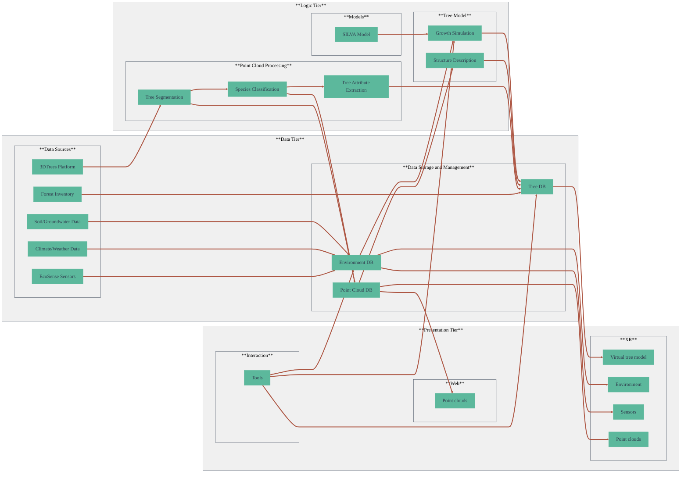

## System Architecture

### Architecture Overview

The XR Future Forests Lab system follows a **three-tier architecture** designed to handle the complex workflow from raw forest data to immersive XR experiences. This modular approach ensures scalability, maintainability, and clear separation of concerns across data management, processing, and visualization layers.

#### Data Tier

The **Data Tier** serves as the foundation of our digital forest ecosystem, encompassing both data acquisition and storage components.

##### Data Sources

The primary data input comes from the **3DTrees Platform**, which provides high-resolution point clouds of forest environments. These point clouds form the spatial backbone of our digital forest twins, capturing the three-dimensional structure of trees and forest environments in unprecedented detail.

Additionally, we incorporate **Forest Inventory** data consisting of traditional forestry measurements including tree height, diameter at breast height (DBH), and other biometric parameters. This ground-truth data serves as validation for our automated processing algorithms and provides essential inputs for growth modeling.

##### Data Storage and Management

Efficient data storage and management are crucial for handling the massive datasets generated by our forest monitoring activities. We utilize a combination of relational and spatial databases to store point clouds, tree attributes, and environmental data. This setup enables efficient querying, retrieval, and analysis of data across different dimensions.

- **Point Cloud DB**: Stores raw and processed point cloud data from the 3DTrees Platform.
- **Tree DB**: Contains detailed information about individual trees, including species, size, and health metrics.
- **Environment DB**: Integrates data from EcoSense sensors and other sources, providing a comprehensive view of the forest environment.

#### Logic Tier

The **Logic Tier** is where the core processing and analytical functions occur, transforming raw data into meaningful information and simulations.

##### Point Cloud Processing

At the heart of our digital forest twin is the point cloud processing pipeline, which converts raw LiDAR and photogrammetric data into structured forest information. This pipeline includes:

- **Tree Segmentation**: Identifying individual trees within the point cloud data.
- **Species Classification**: Using machine learning algorithms to classify tree species based on their attributes.
- **Tree Attribute Extraction**: Deriving quantitative metrics for each tree, such as height, crown width, and volume.

These processes are essential for creating accurate and detailed digital representations of forest ecosystems.

##### Models

We employ various models to simulate and predict forest dynamics, including:

- **SILVA Model**: A widely used individual tree growth simulator that predicts tree growth based on environmental conditions and management practices.
- **BALANCE Model**: A stand-level forest growth model that simulates the growth of forest stands over time.

These models are integrated into our system to provide insights into forest growth patterns and the impact of different management scenarios.

##### Tree Model

The tree model component focuses on creating detailed representations of individual trees, incorporating data from the point cloud processing and growth models. This includes:

- **Structure Description**: Defining the physical structure of each tree, including trunk, branches, and leaves.
- **Growth Simulation**: Modeling how trees grow and change over time in response to environmental factors and management interventions.

#### Presentation Tier

The **Presentation Tier** is where users interact with the digital forest twins through immersive XR applications and other visualization tools.

##### XR

XR applications provide an immersive experience, allowing users to explore and interact with the digital forest twins in a virtual environment. This includes:

- **Virtual Tree Model**: A 3D representation of individual trees that can be explored and manipulated in XR.
- **Environment Simulation**: Visualizing the forest environment, including terrain, weather, and other ecological factors.
- **Sensor Data Visualization**: Integrating data from EcoSense sensors to provide real-time feedback on environmental conditions.

##### Web

Web-based interfaces provide accessible visualization tools for researchers and stakeholders who may not have access to XR hardware:

- **Point Cloud Visualization**: Browser-based tools for viewing and analyzing point cloud data

##### Interaction

Interactive tools bridge the gap between data visualization and active forest management, enabling users to:

- **Scenario Testing**: Modify forest management parameters and observe predicted outcomes
- **Data Manipulation**: Adjust environmental variables and growth model inputs
- **Simulation Control**: Start, pause, and control forest growth simulations across different time scales

This three-tier architecture ensures that our system can handle the complex data flows and processing requirements of digital forest twins while providing intuitive interfaces for researchers, educators, and forest managers to interact with and learn from the data.
