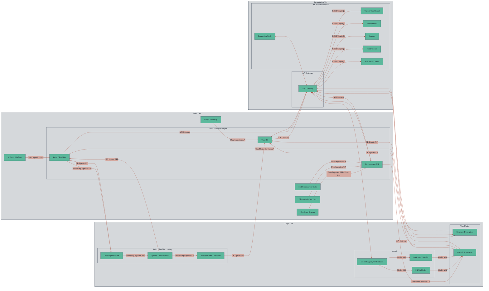

# Architecture

## **Data Tier**

### **3DTrees Platform**
**Description:**  
Primary provider of high-resolution terrestrial or airborne LiDAR point cloud data, capturing the 3D structure of forest plots for further analysis and modeling[1][4][5].

- **Data In:**  
  Raw point cloud files (e.g., LAS/LAZ) uploaded or streamed.
- **API:**  
  **Data Ingestion API**  
  *Example:*  
  `POST /api/data-ingest/pointcloud` with file upload.
- **Data Out:**  
  Data is stored in the **Point Cloud DB** for downstream processing and analysis.

### **EcoSense Sensors**
**Description:**  
Network of environmental sensors (e.g., temperature, humidity, soil moisture) providing real-time or periodic measurements for environmental monitoring.

- **Data In:**  
  Sensor readings sent in real-time or batches.
- **API:**  
  **Data Ingestion API** (supports streaming, e.g., MQTT/WebSocket)  
  *Example:*  
  MQTT topic: `ecosense/sensor/reading`  
  Payload: `{ "sensor_id": "123", "timestamp": "...", "type": "soil_moisture", "value": 0.23 }`
- **Data Out:**  
  Data is stored in the **Environment DB** and can trigger events or alerts via the **Event Bus**.

### **Climate/Weather Data**
**Description:**  
External or internal sources providing climate variables (e.g., rainfall, temperature, wind) relevant for forest growth modeling.

- **Data In:**  
  Periodic batch import or API pull from weather services.
- **API:**  
  **Data Ingestion API**  
  *Example:*  
  `POST /api/data-ingest/weather` with JSON payload.
- **Data Out:**  
  Data stored in **Environment DB** for use in growth models and scenario analysis.

### **Soil/Groundwater Data**
**Description:**  
Datasets or live feeds describing soil composition, moisture, and groundwater levels, essential for simulating tree and ecosystem health.

- **Data In:**  
  Uploaded datasets or sensor streams.
- **API:**  
  **Data Ingestion API**  
  *Example:*  
  `POST /api/data-ingest/soil` with CSV or JSON.
- **Data Out:**  
  Stored in **Environment DB** for modeling and visualization.

### **Forest Inventory**
**Description:**  
Traditional field survey data (e.g., DBH, tree height, species) used for ground-truthing, validation, and model calibration[1].

- **Data In:**  
  Field survey uploads (CSV, Excel, app-based).
- **API:**  
  **Data Ingestion API**  
  *Example:*  
  `POST /api/data-ingest/inventory` with CSV file.
- **Data Out:**  
  Structured records in **Tree DB** for validation and as model input.

### **Point Cloud DB**
**Description:**  
Spatial database optimized for storage, indexing, and retrieval of massive 3D point cloud datasets, supporting efficient spatial queries and downstream processing[4][5].

- **Data In:**  
  Raw and processed point cloud data from ingestion and processing pipelines.
- **API:**  
  **DB Update API**, **Processing Pipeline API**  
  *Example:*  
  `PUT /api/pointcloud/{id}` (metadata/status update)  
  `GET /api/process/result/{job_id}` (retrieve processed data)
- **Data Out:**  
  Provides point cloud data to processing pipeline, tree modeling, and visualization clients.

### **Tree DB**
**Description:**  
Database for storing individual tree records, including species, biometric data, health status, and relationships, supporting both attribute queries and spatial analysis.

- **Data In:**  
  Tree attribute data from processing pipeline, field inventory, or user edits.
- **API:**  
  **DB Update API**  
  *Example:*  
  `PUT /api/tree/{tree_id}` with `{ "species": "Fagus sylvatica", "height": 23.4 }`
- **Data Out:**  
  Supplies tree data to models, simulations, and client applications.

### **Environment DB**
**Description:**  
Time-series or spatial database for storing environmental sensor data, weather records, and other variables relevant to forest growth and simulation.

- **Data In:**  
  Sensor, weather, and soil data from various sources.
- **API:**  
  **DB Update API**  
  *Example:*  
  `PUT /api/environment/{env_id}` with `{ "temperature": 19.2, "humidity": 0.65 }`
- **Data Out:**  
  Supplies environmental context to growth models and visualization clients.

---

## **Logic Tier**

### **Point Cloud Processing**
**Description:**  
Automated pipeline for tree segmentation, species classification, and attribute extraction from point clouds using advanced algorithms and ML models[2][3][5][7].

- **Data In:**  
  Point cloud data from **Point Cloud DB**.
- **API:**  
  **Processing Pipeline API**  
  *Example:*  
  `POST /api/process/segment` with `{ "pointcloud_id": "abc123" }`
- **Data Out:**  
  Segmented/classified tree data to **Tree DB**; processed point clouds to **Point Cloud DB**.

### **Model Registry/Orchestrator**
**Description:**  
Service for registering, managing, and orchestrating simulation and growth models, allowing dynamic selection and execution of models.

- **Data In:**  
  Model definitions, configurations, user-triggered simulation requests.
- **API:**  
  **Model/Simulation Control API**  
  *Example:*  
  `POST /api/model/register` (register new model)  
  `POST /api/model/run` (start simulation)
- **Data Out:**  
  Simulation results to **Tree DB**, **Environment DB**, and client applications via **API Gateway**.

### **SILVA/BALANCE Models**
**Description:**  
Domain-specific simulation engines for predicting tree and stand growth under various management and environmental scenarios.

- **Data In:**  
  Tree and environmental data, simulation parameters.
- **API:**  
  **Model/Simulation Control API**  
  *Example:*  
  `POST /api/model/run` with `{ "model": "SILVA", "tree_ids": [...], "climate_scenario": "A2" }`
- **Data Out:**  
  Growth projections and scenario results to **Tree DB**, **Environment DB**, and visualization clients.

### **Tree Model**
**Description:**  
Service for generating, updating, and simulating the 3D structure and growth of individual trees, supporting both static and dynamic representations.

- **Data In:**  
  Tree structure and environmental data.
- **API:**  
  **Model/Simulation Control API**  
  *Example:*  
  `POST /api/tree-model/update` with `{ "tree_id": "xyz", "action": "remove_branch" }`
- **Data Out:**  
  Updated 3D tree models (e.g., glTF) to **API Gateway** for XR/Web clients.

---

## **Presentation Tier**

### **API Gateway**
**Description:**  
Central entry point that routes all client requests to backend services, handles authentication, rate limiting, and aggregates responses for the presentation layer.

- **Data In:**  
  Requests from XR/Web/Interaction clients (e.g., queries, edits, simulation controls).
- **API:**  
  **REST/GraphQL API**
  *Example:*  
  `GET /api/tree/123` (REST),  
  `query { tree(id: 123) { species, height } }` (GraphQL)
- **Data Out:**  
  Returns requested data, simulation results, or acknowledgments to clients; pushes real-time updates via **Event Bus**.

### **XR/Web/Interaction Clients**
**Description:**  
User-facing applications for immersive visualization, scenario testing, and direct manipulation of the digital forest twin.

- **Data In:**  
  Receives tree, environment, and point cloud data from **API Gateway**.
- **API:**  
  **REST/GraphQL API**, **Event Bus**
  *Example:*  
  `GET /api/pointcloud/abc123` (REST),  
  WebSocket: `{ "event": "tree_updated", "tree_id": "xyz" }`
- **Data Out:**  
  Sends user actions (e.g., edit tree, run scenario) to **API Gateway**.
  *Example:*  
  `POST /api/tree/xyz/action` with `{ "action": "remove", "reason": "disease" }`

### **Interaction Tools**
**Description:**  
Specialized interfaces (in XR or web) for scenario management, editing tree/environment attributes, and controlling simulations.

- **Data In:**  
  Receives feedback and updated system state via **API Gateway** and **Event Bus**.
- **API:**  
  **Scenario/Model Control API**, **REST/GraphQL API**
  *Example:*  
  `POST /api/scenario/run` with `{ "scenario": "drought", "duration": 12 }`
- **Data Out:**  
  Sends scenario or model control commands; triggers updates in backend.

---

## **API and Interface Types Explained**

### **What is an API?**
An **API** (Application Programming Interface) is a set of rules and protocols that allows different software components to communicate and exchange data or functions. It acts as a contract between systems, specifying how requests and responses should be structured and what operations are available.

**Key Elements of an API:**
- **Endpoints:** URLs or paths for accessing specific functions or data.
- **Methods:** Operations like GET (retrieve), POST (create), PUT (update), DELETE (remove).
- **Request/Response Formats:** Data structures (often JSON or XML) for communication.
- **Parameters/Headers:** Additional data for filtering, authentication, etc.
- **Status Codes:** Indicate the result of a request (e.g., 200 OK, 404 Not Found).

### **Types of APIs in Your Architecture**

#### **1. Data Ingestion API**
- **Purpose:**  
  Handles the intake of new data from external sources (e.g., sensors, field uploads, external datasets).
- **How it works:**  
  Provides endpoints for batch uploads (e.g., CSV, LAS/LAZ files) and streaming data (e.g., sensor feeds via WebSocket or MQTT).
- **Example:**  
  `/api/data-ingest/upload` for batch; `/api/data-ingest/stream` for real-time sensor data.

#### **2. Processing Pipeline API**
- **Purpose:**  
  Manages the submission, monitoring, and results of data processing tasks (e.g., tree segmentation, classification).
- **How it works:**  
  Exposes endpoints to submit jobs, check status, and retrieve results. May use asynchronous processing and notify clients upon completion.
- **Example:**  
  `/api/process/submit` (POST a new job); `/api/process/status/{job_id}` (GET job status).

#### **3. DB Update API**
- **Purpose:**  
  Allows authorized components or clients to create, update, or delete records in the databases (e.g., Tree DB, Environment DB).
- **How it works:**  
  Provides endpoints for CRUD operations on database records, ensuring data integrity and access control.
- **Example:**  
  `/api/tree/{id}` (PUT to update tree attributes); `/api/environment/{id}` (DELETE to remove a record).

#### **4. Model/Simulation Control API**
- **Purpose:**  
  Allows clients (e.g., interaction tools) to trigger, pause, or modify model runs and simulations.
- **How it works:**  
  Endpoints for starting/stopping simulations, updating parameters, and retrieving results.
- **Example:**  
  `/api/model/run` (POST to start simulation); `/api/model/{id}/pause` (POST to pause).

#### **5. Event Bus**
- **Purpose:**  
  Enables real-time, asynchronous communication between components (e.g., sensor updates, simulation events, feedback to clients).
- **How it works:**  
  Uses publish/subscribe protocols (e.g., MQTT, Kafka, WebSockets). Components subscribe to topics and receive messages as events occur.
- **Example:**  
  Topic `sensor-updates` broadcasts new sensor readings to all interested clients.

#### **6. REST/GraphQL API**
- **Purpose:**  
  Provides standardized web-based access to backend services and data for clients (XR, web, tools).
- **How it works:**  
  - **REST:** Uses HTTP methods (GET, POST, etc.) and endpoints for each resource. Each call is stateless and independent[7].
  - **GraphQL:** Allows clients to specify exactly what data they need in a single query, reducing over-fetching or under-fetching.
- **Example:**  
  REST: `/api/tree/123` (GET tree with ID 123).  
  GraphQL: `query { tree(id: 123) { species, height, health } }`

### **API Type Comparison Table**

| API Type                     | Purpose/Flow                          | Typical Protocols          | Example Use Case/Call                                                                                  |
|------------------------------|---------------------------------------|----------------------------|-------------------------------------------------------------------------------------------------------|
| Data Ingestion API           | Import new data into system           | HTTP (REST), MQTT, WebSocket | `POST /api/data-ingest/pointcloud` with LAS file (batch); MQTT/WebSocket for real-time sensor         |
| Processing Pipeline API      | Manage processing jobs (async/sync)   | HTTP (REST), WebSocket     | `POST /api/process/segment` to start segmentation; `GET /api/process/status/{job_id}` for status      |
| DB Update API                | CRUD operations on data stores        | HTTP (REST), GraphQL       | `PUT /api/tree/xyz` to update tree attributes; `DELETE /api/environment/abc` to remove record         |
| Model/Simulation Control API | Control models/simulations            | HTTP (REST), gRPC, WebSocket | `POST /api/model/run` to start growth simulation; `POST /api/tree-model/update` for structure change  |
| Event Bus                    | Real-time, async notifications        | WebSocket, MQTT, Kafka     | WebSocket/MQTT topic `tree-updates`; client receives `{ "event": "tree_removed", ... }`               |
| REST/GraphQL API             | General data access and manipulation  | HTTP (REST), GraphQL       | `GET /api/tree/123` (REST); `query { tree(id: 123) { species } }` (GraphQL)                          |
---
