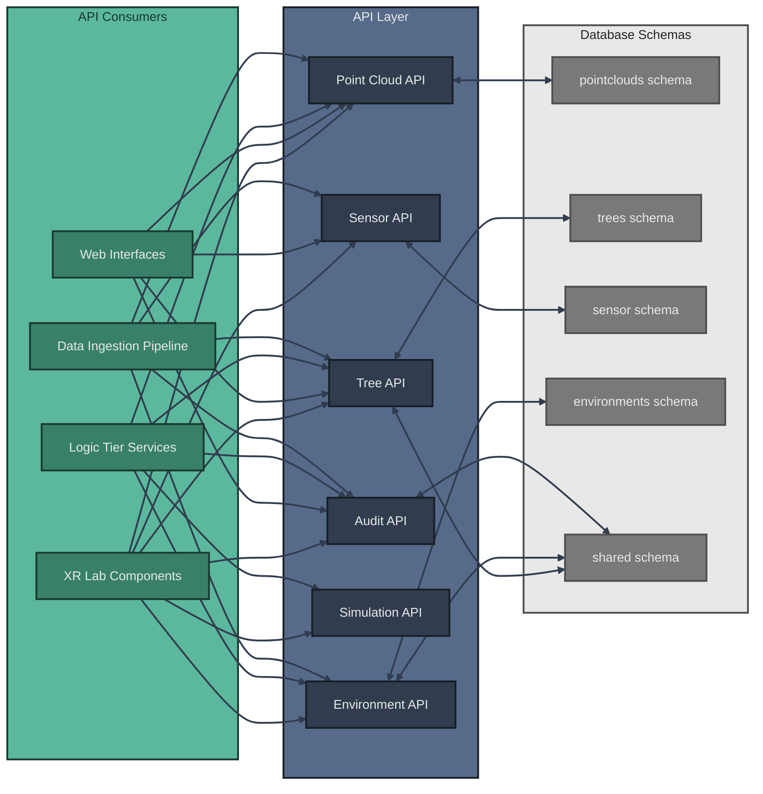

# API Architecture

The XR Future Forests Lab implements a comprehensive API layer that enables seamless data flow between the three architectural tiers. This API layer abstracts database operations and provides standardized interfaces for all system components.

## API Overview

## Core APIs

### Audit API

The Audit API provides field-level change tracking and history management across all variant tables, complementing the variant-based versioning system.

- **GET /api/audit/{table_name}/{record_id}/history** - Retrieve change history for specific records with filtering options
- **POST /api/audit/{table_name}/{record_id}/revert** - Revert field modifications using audit log data
- **GET /api/audit/users/{user_id}/activity** - Track user attribution for all modifications
- **POST /api/audit/bulk-operations** - Handle bulk change operations with consolidated audit entries

### Point Cloud API

The Point Cloud API manages all LiDAR data operations, providing endpoints for:

- **POST /api/pointclouds** - Create base `PointCloud` records upon file upload
- **GET /api/pointclouds/{point_cloud_id}/variants** - Manage `PointCloudVariants` with processing status tracking
- **PATCH /api/pointclouds/{variant_id}** - Update processing parameters with audit trail
- **GET /api/pointclouds/{variant_id}/history** - Track processing parameter changes
- **GET /api/pointclouds** - Query point clouds by location, date range, or processing status
- **GET /api/pointclouds/{variant_id}/results** - Retrieve processing results and confidence scores

### Tree API

The Tree API serves as the primary interface for forest inventory data, supporting:

- **GET /api/trees/{variant_id}** - Retrieve tree variant with full lineage tracking
- **POST /api/trees** - Create new tree variants
- **PUT /api/trees/{variant_id}** - Update complete tree variant records
- **DELETE /api/trees/{variant_id}** - Remove tree variants
- **PATCH /api/trees/{variant_id}** - Update specific fields with automatic audit logging
- **GET /api/trees/{variant_id}/history** - Retrieve complete change history
- **POST /api/trees/{variant_id}/revert** - Revert specific field changes
- **GET /api/trees/qr/{qr_code}** - QR code-based tree lookup for field applications
- **POST /api/trees/{variant_id}/simulation-results** - Store growth simulation results
- **GET /api/trees** - Query trees by species and location with spatial filtering

### Sensor API

The Sensor API handles environmental monitoring infrastructure:

- **GET /api/sensors/{sensor_id}** - Retrieve sensor installation records and metadata
- **POST /api/sensors** - Create new sensor installations
- **PUT /api/sensors/{sensor_id}** - Update sensor metadata
- **DELETE /api/sensors/{sensor_id}** - Remove sensor installations
- **POST /api/sensors/{sensor_id}/readings** - High-throughput ingestion of `SensorReadings` time-series data
- **GET /api/sensors/{sensor_id}/status** - Real-time sensor status monitoring and alerting
- **GET /api/sensors/{sensor_id}/readings** - Retrieve historical data with aggregation and statistical queries

### Environment API

The Environment API consolidates environmental context data:

- **GET /api/environments/{variant_id}** - Retrieve environment variants from sensor aggregations
- **POST /api/environments** - Create new environment variants
- **PUT /api/environments/{variant_id}** - Update complete environment variant records
- **DELETE /api/environments/{variant_id}** - Remove environment variants
- **PATCH /api/environments/{variant_id}** - Update environmental measurements with audit trail
- **GET /api/environments/{variant_id}/history** - Track environmental parameter changes
- **GET /api/environments/scenarios/{scenario_id}** - Support scenario-based environmental modeling
- **GET /api/environments/{variant_id}/context** - Provide environmental context for growth simulations
- **POST /api/environments/user-defined** - Integrate user-defined environmental parameters with change tracking

### Simulation API

The Simulation API orchestrates growth modeling workflows:

- **POST /api/simulations/models/{model_type}** - Interface with external models (SILVA and other tree-based models)
- **GET /api/simulations/parameters** - Retrieve simulation parameter sets and scenarios
- **POST /api/simulations/parameters** - Create new simulation parameter configurations
- **PUT /api/simulations/parameters/{parameter_set_id}** - Update simulation parameter sets
- **POST /api/simulations/{simulation_id}/coordinate** - Coordinate data flow between Tree and Environment APIs
- **GET /api/simulations/{simulation_id}/progress** - Track simulation progress and status
- **POST /api/simulations/{simulation_id}/results** - Store simulation results as TreeVariants
