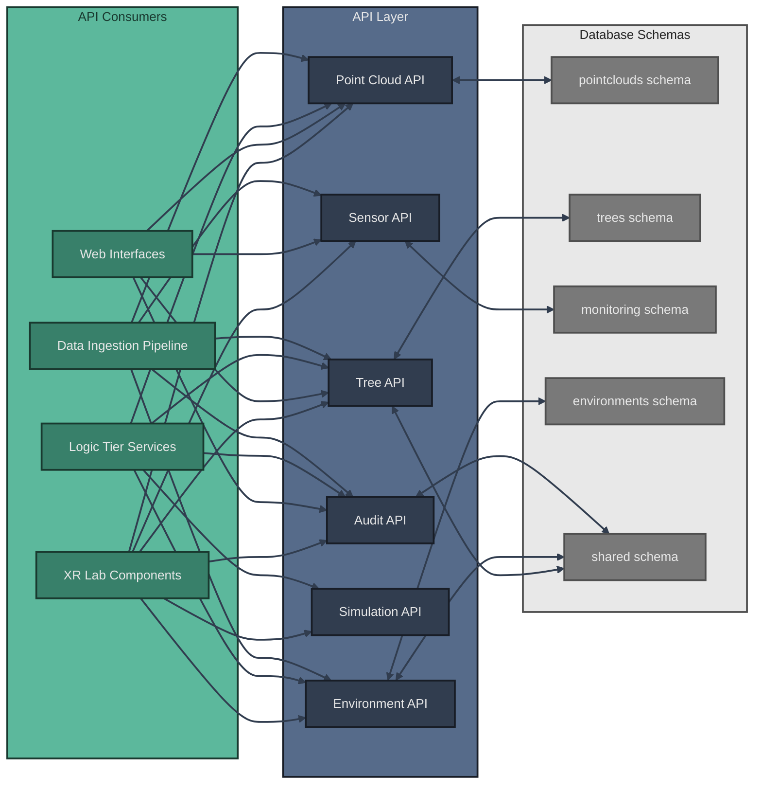

# API Architecture

The XR Future Forests Lab implements a comprehensive API layer that enables seamless data flow between the three architectural tiers. This API layer abstracts database operations and provides standardized interfaces for all system components.

## API Overview



## Core APIs

### Audit API

The Audit API provides field-level change tracking and history management across all variant tables, complementing the variant-based versioning system.

**Key Functionality**:

- **Recording field changes** automatically during PATCH operations
- **Retrieving change history** for specific records with filtering options
- **Reverting field modifications** using audit log data
- **User attribution tracking** for all modifications
- **Bulk change operations** with consolidated audit entries

### Point Cloud API

The Point Cloud API manages all LiDAR data operations, providing endpoints for:

- **Creating base `PointCloud` records** upon file upload
- **Managing `PointCloudVariants`** with processing status tracking
- **PATCH /api/pointclouds/{variant_id}** - Update processing parameters with audit trail
- **GET /api/pointclouds/{variant_id}/history** - Track processing parameter changes
- **Querying point clouds** by location, date range, or processing status
- **Retrieving processing results** and confidence scores

### Tree API

The Tree API serves as the primary interface for forest inventory data, supporting:

- **CRUD operations on `TreeVariants`** with full lineage tracking
- **PATCH /api/trees/{variant_id}** - Update specific fields with automatic audit logging
- **GET /api/trees/{variant_id}/history** - Retrieve complete change history
- **POST /api/trees/{variant_id}/revert** - Revert specific field changes
- **QR code-based tree lookup** for field applications
- **Growth simulation result storage** and retrieval
- **Species and location-based queries** with spatial filtering

### Sensor API

The Sensor API handles environmental monitoring infrastructure:

- **Managing `Sensors`** installation records and metadata
- **High-throughput ingestion** of `SensorReadings` time-series data
- **Real-time sensor status monitoring** and alerting
- **Historical data aggregation** and statistical queries

### Environment API

The Environment API consolidates environmental context data:

- **Creating and managing `EnvironmentVariants`** from sensor aggregations
- **PATCH /api/environments/{variant_id}** - Update environmental measurements with audit trail
- **GET /api/environments/{variant_id}/history** - Track environmental parameter changes
- **Supporting scenario-based environmental modeling**
- **Providing environmental context** for growth simulations
- **Integrating user-defined environmental parameters** with change tracking

### Simulation API

The Simulation API orchestrates growth modeling workflows:

- **Interfacing with external models** (SILVA, BALANCE)
- **Managing simulation parameter sets** and scenarios
- **Coordinating data flow** between Tree and Environment APIs
- **Tracking simulation progress** and storing results as TreeVariants

## API Design Principles

This API architecture ensures consistent data access patterns while maintaining the flexibility needed for diverse use cases across XR visualization, web interfaces, and scientific modeling applications.

### Key Design Features

- **Schema Abstraction**: Each API directly maps to specific database schemas while hiding implementation details
- **Field-Level Audit Integration**: Automatic change tracking for all PATCH operations across variant tables
- **Cross-Schema Integration**: Tree and Environment APIs can access shared schema data for location and species information
- **Multi-Consumer Support**: APIs serve diverse clients from XR components to data ingestion pipelines
- **Temporal Data Handling**: Support for variant-based data with full temporal tracking and lineage
- **Audit Trail Management**: Complete change history with user attribution and revert capabilities
- **Real-time Capabilities**: High-throughput sensor data ingestion with streaming support
- **Spatial Query Support**: Geographic filtering and spatial operations for forest inventory queries

### API Response Formats

All PATCH operations return responses including audit information:

```json
{
  "variant_id": 123,
  "fields_updated": ["Height_m", "DBH_cm"],
  "audit_entries": [
    {
      "audit_id": 456,
      "field_name": "Height_m",
      "old_value": 14.2,
      "new_value": 15.5,
      "timestamp": "2025-06-27T10:30:00Z"
    }
  ],
  "message": "Updated 2 fields with audit logging"
}
```

### Future Considerations

- **OpenAPI Specification**: Consider creating detailed OpenAPI/Swagger specifications for each API
- **Authentication & Authorization**: Implement role-based access control for different user types
- **Rate Limiting**: Add throttling for high-volume operations like sensor data ingestion
- **Caching Strategy**: Implement intelligent caching for frequently accessed tree and environment data
- **Versioning**: Plan API versioning strategy to support evolution while maintaining backward compatibility
