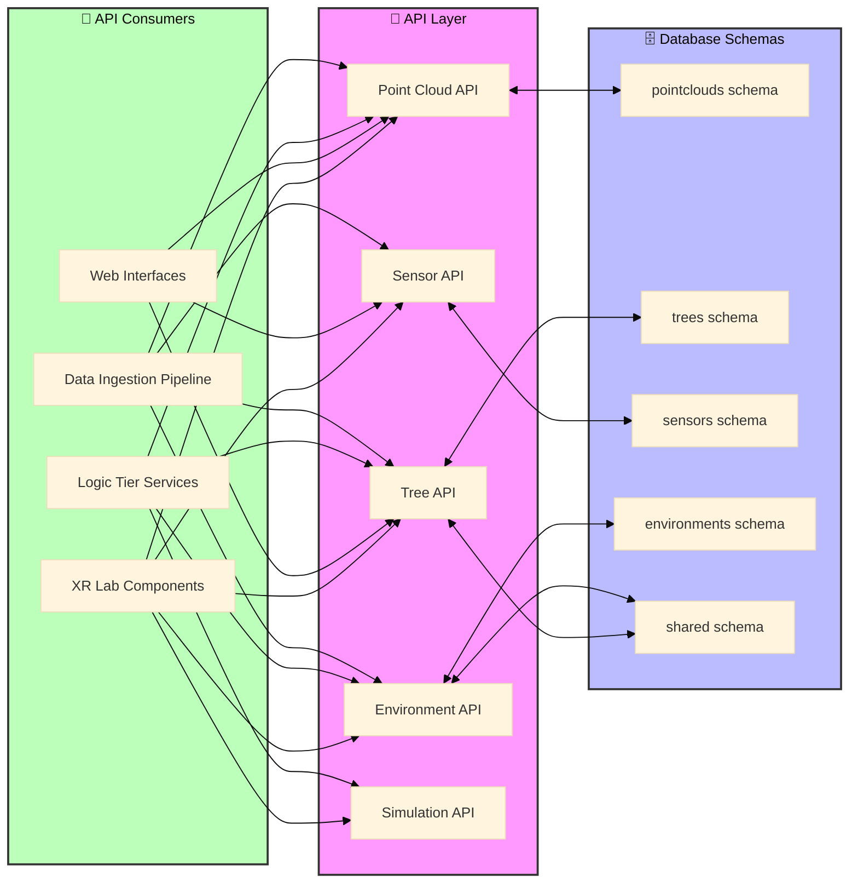

# API Architecture

The XR Future Forests Lab implements a comprehensive API layer that enables seamless data flow between the three architectural tiers. This API layer abstracts database operations and provides standardized interfaces for all system components.

## API Overview

## Core APIs

### Point Cloud API

The Point Cloud API manages all LiDAR data operations, providing endpoints for:

- **Creating base `PointCloud` records** upon file upload
- **Managing `PointCloudVariants`** with processing status tracking
- **Querying point clouds** by location, date range, or processing status
- **Retrieving processing results** and confidence scores

### Tree API

The Tree API serves as the primary interface for forest inventory data, supporting:

- **CRUD operations on `TreeVariants`** with full lineage tracking
- **QR code-based tree lookup** for field applications
- **Growth simulation result storage** and retrieval
- **Species and location-based queries** with spatial filtering

### Sensor API

The Sensor API handles environmental monitoring infrastructure:

- **Managing `Sensors`** installation records and metadata
- **High-throughput ingestion** of `SensorReadings` time-series data
- **Real-time sensor status monitoring** and alerting
- **Historical data aggregation** and statistical queries

### Environment API

The Environment API consolidates environmental context data:

- **Creating and managing `EnvironmentVariants`** from sensor aggregations
- **Supporting scenario-based environmental modeling**
- **Providing environmental context** for growth simulations
- **Integrating user-defined environmental parameters**

### Simulation API

The Simulation API orchestrates growth modeling workflows:

- **Interfacing with external models** (SILVA, BALANCE)
- **Managing simulation parameter sets** and scenarios
- **Coordinating data flow** between Tree and Environment APIs
- **Tracking simulation progress** and storing results as TreeVariants

## API Design Principles

This API architecture ensures consistent data access patterns while maintaining the flexibility needed for diverse use cases across XR visualization, web interfaces, and scientific modeling applications.

### Key Design Features

- **Schema Abstraction**: Each API directly maps to specific database schemas while hiding implementation details
- **Cross-Schema Integration**: Tree and Environment APIs can access shared schema data for location and species information
- **Multi-Consumer Support**: APIs serve diverse clients from XR components to data ingestion pipelines
- **Temporal Data Handling**: Support for variant-based data with full temporal tracking and lineage
- **Real-time Capabilities**: High-throughput sensor data ingestion with streaming support
- **Spatial Query Support**: Geographic filtering and spatial operations for forest inventory queries

### Future Considerations

- **OpenAPI Specification**: Consider creating detailed OpenAPI/Swagger specifications for each API
- **Authentication & Authorization**: Implement role-based access control for different user types
- **Rate Limiting**: Add throttling for high-volume operations like sensor data ingestion
- **Caching Strategy**: Implement intelligent caching for frequently accessed tree and environment data
- **Versioning**: Plan API versioning strategy to support evolution while maintaining backward compatibility
