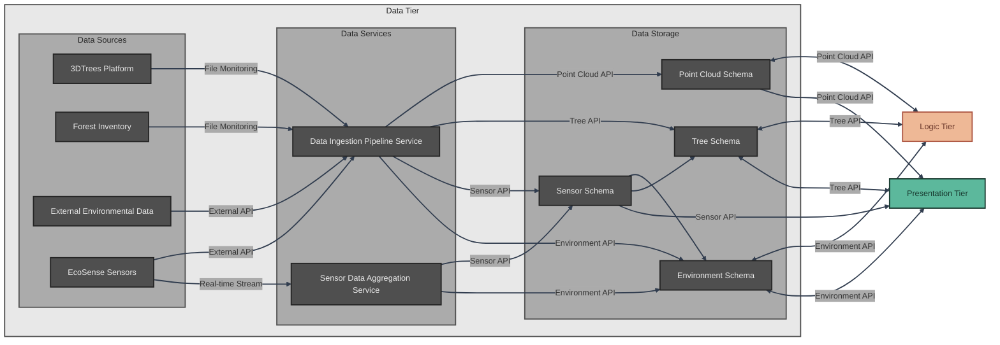
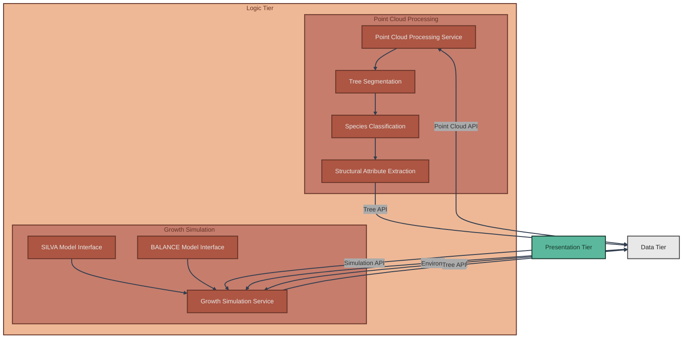
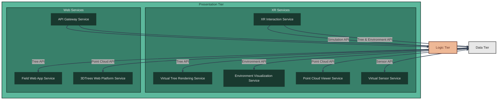
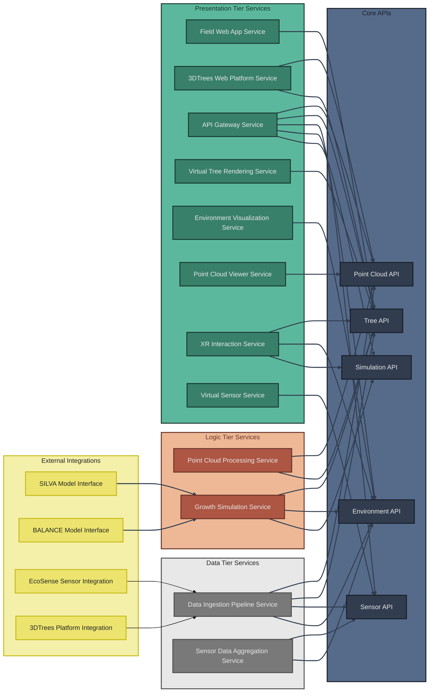

# Architecture

## System Overview

```mermaid
%%{
init: {
'theme': 'base',
'themeVariables': {
'fontSize': '14px',
'secondaryColor': '#ababab'
}
}
}%%
flowchart LR

subgraph DATA["Data Tier"]
D1[Data Sources]
D2[Data Storage]
end

subgraph LOGIC["Logic Tier"]
L1[Point Cloud Processing]
L2[Tree Growth Simulation]
end

subgraph PRESENTATION["Presentation Tier"]
P2[XR Forest]
P3[Web Interface]
P1[API Gateway]
end

DATA <--> LOGIC
PRESENTATION --> LOGIC
PRESENTATION <--> DATA

%% Subgraph styling - light colors
classDef dataTier fill:#e8e8e8,stroke:#4f4f4f,stroke-width:2px,color:#242424
classDef logicTier fill:#eeb896,stroke:#673428,stroke-width:2px,color:#673428
classDef presentationTier fill:#5CB89C,stroke:#19392f,stroke-width:2px,color:#19392f

%% Node styling - darkest colors
classDef dataNode fill:#797979,stroke:#4f4f4f,stroke-width:2px,color:#e8e8e8
classDef logicNode fill:#AD5643,stroke:#673428,stroke-width:2px,color:#e8e8e8
classDef presentationNode fill:#38806a,stroke:#19392f,stroke-width:2px,color:#e8e8e8

class DATA dataTier
class D1,D2 dataNode
class LOGIC logicTier
class L1,L2 logicNode
class PRESENTATION presentationTier
class P1,P2,P3 presentationNode

linkStyle 0,1,2 stroke:#313D4F,stroke-width:2px
```

The XR Future Forests Lab follows a modern three-tier architecture designed to seamlessly integrate forest data acquisition, processing, and immersive visualization. This architecture enables the creation of comprehensive digital forest twins that can be experienced through cutting-edge XR technologies.

The **Data Tier** serves as the foundation, managing both data acquisition from diverse sources and robust storage infrastructure. It handles data ingestion from external services like EcoSense environmental sensors, forest inventory systems, and the 3DTrees platform, while maintaining a sophisticated PostgreSQL database with PostGIS extensions for spatial data management. This tier acts as both a data sink and source, providing bi-directional data flow to support real-time updates and historical analysis.

The **Logic Tier** forms the analytical backbone of the system, processing raw forest data into actionable insights. It encompasses advanced point cloud processing for tree segmentation and species classification, as well as sophisticated growth simulation models that predict forest development under various scenarios. This tier transforms disparate data sources into coherent forest models, enabling both scientific analysis and immersive visualization.

The **Presentation Tier** brings the digital forest to life through immersive XR experiences and accessible web interfaces. Users can explore virtual forests, visualize invisible ecological processes like sap flow and nutrient cycling, and interact with growth simulation parameters to understand forest dynamics. The tier supports multiple interaction modalities, from fully immersive XR environments to field-accessible web applications for real-time forest monitoring.

The architecture's strength lies in its interconnected design: the Data Tier provides comprehensive information to both Logic and Presentation tiers, while the Logic Tier accepts user input from the Presentation Tier to drive interactive simulations. This creates a dynamic ecosystem where data flows seamlessly between acquisition, processing, and visualization, enabling unprecedented insights into forest ecosystems.

---

## Data Tier Architecture

The Data Tier Architecture forms the foundational layer of the XR Future Forests Lab, orchestrating the complex flow of forest data from diverse sources into a unified, spatially-aware database system. This tier is strategically divided into three key components: data sources, ingestion infrastructure, and storage systems.

*Data Sources* represent the diverse ecosystem of forest information providers. The 3DTrees Platform delivers high-resolution LiDAR point clouds as file uploads, while Forest Inventory systems provide structured tree measurement data. EcoSense Sensors continuously stream real-time environmental measurements through dedicated APIs, and External Environmental Data sources contribute broader contextual information such as weather patterns and climate data. This heterogeneous data landscape requires sophisticated coordination to maintain data integrity and temporal consistency.

**Data Ingestion** is managed by the **Data Ingestion Pipeline Service** that acts as an intelligent orchestrator for all incoming data streams. This service continuously monitors file-based sources like 3DTrees and Forest Inventory for new uploads, while maintaining active connections to API-based sources like EcoSense Sensors and external environmental services. The ingestion pipeline handles data validation, format standardization, and temporal alignment before routing information to appropriate database schemas, ensuring consistent data quality across all sources. Additionally, the **Sensor Data Aggregation Service** processes high-frequency sensor readings in real-time, performing quality assessment and temporal aggregation to create meaningful environmental context.

**Data Storage** implements the comprehensive database design detailed in the database schema documentation, organized into four specialized schemas. The Point Cloud Schema manages LiDAR scan metadata and processing results, maintaining file references and spatial bounds through the `PointClouds` base table and `PointCloudVariants` for different processing results. The Tree Schema serves as the central repository for individual tree information through `TreeVariants`, supporting both measured and simulated data with full temporal tracking and QR code integration for field applications. The Sensor Schema manages physical sensor installations through the `Sensors` table and time-series environmental measurements via `SensorReadings`, acting as an intelligent intermediary that aggregates real-time sensor readings and distributes relevant information to both Tree and Environment schemas based on measurement context. The Environment Schema consolidates environmental conditions through `EnvironmentVariants` that can be derived from sensor data, user input, or hybrid approaches, providing essential context for growth modeling and XR visualization.

This architecture enables seamless bi-directional data flow to both Logic and Presentation tiers, supporting real-time updates for immersive experiences while maintaining the historical depth necessary for scientific analysis and growth modeling.

---

## Logic Tier Architecture

The Logic Tier Architecture serves as the analytical engine of the XR Future Forests Lab, transforming raw forest data into actionable insights through sophisticated processing pipelines and predictive modeling. This tier bridges the gap between data acquisition and visualization, enabling both automated analysis and user-driven forest simulations.

**Point Cloud Processing** is implemented by the **Point Cloud Processing Service** which orchestrates the core computational workflow that converts raw LiDAR data into structured forest information through a variant-based processing system. Upon upload through the 3DTrees platform, the system creates a base `PointCloud` record and the service automatically initiates processing variants: Tree Segmentation creates a "Processing_Result" variant with individual tree identification, Species Classification generates additional variants with species-specific attributes, and Structural Attribute Extraction produces final variants containing precise measurements including height, diameter at breast height (DBH), crown dimensions, and crown base height. Each processing step is tracked through the `PointCloudVariants` table with status monitoring (pending, processing, completed, failed) and confidence scores for segmentation and classification. This variant-based approach ensures processing lineage is maintained while derived tree attributes flow into the Tree Schema through `TreeVariants` that reference their originating `PointCloudVariant` via the `PointCloudVariantID` field.

**Growth Simulation** is managed by the **Growth Simulation Service** which leverages external forest growth models to predict tree and forest development under various scenarios. The service integrates with established models like SILVA (individual tree growth) and BALANCE (stand-level growth) to provide scientifically validated projections. Environmental conditions from the Environment Schema and current tree states from the Tree Schema serve as input parameters, while the Growth Simulation Service prepares data formats specific to each model's requirements. A key innovation is the integration of user interaction from the XR Presentation Tier, allowing researchers and forest managers to modify environmental parameters, adjust management practices, or test climate scenarios in real-time. Simulation results are automatically saved back to the Tree Schema as temporal variants, with the `ModelType` field recording which growth model was used and `TimeDelta_yrs` tracking the projected time progression. This enables users to visualize forest evolution and compare different management strategies within the immersive XR environment through the standardized Simulation API.

This dual-component architecture ensures both automated efficiency and interactive flexibility, supporting the lab's mission to combine rigorous scientific analysis with innovative visualization technologies.

---

## Presentation Tier Architecture

The Presentation Tier Architecture represents the culmination of the XR Future Forests Lab vision, transforming complex forest data into immersive experiences and accessible interfaces that serve diverse user communities from researchers to field practitioners. This tier strategically balances cutting-edge XR technologies with practical web-based tools to maximize accessibility and impact.

**XR Services** form the heart of the forest visualization ecosystem, creating unprecedented immersive experiences that make invisible forest processes tangible and interactive. The **Virtual Tree Rendering Service** renders individual trees with scientific accuracy, incorporating real measurements from the Tree Schema to create photorealistic 3D representations that users can examine at any scale. The **Environment Visualization Service** brings abstract environmental data to life, visualizing wind patterns, water flow, CO₂ circulation, and nutrient cycling as dynamic, interactive phenomena within the virtual forest space. The **Virtual Sensor Service** allows users to deploy and interact with digital representations of EcoSense sensors, enabling hands-on learning about environmental monitoring techniques and data collection methodologies. The **Point Cloud Viewer Service** provides direct access to raw LiDAR data within the XR environment, allowing users to toggle between processed tree models and original scan data for educational and validation purposes.

The **XR Interaction Service** serves as the bridge between user intent and system response, enabling real-time modification of forest parameters and growth scenarios. Users can manipulate environmental variables, remove or replace trees, adjust management practices, and observe immediate visual feedback of their decisions. These interactions seamlessly integrate with the Growth Simulation Service in the Logic Tier through the standardized APIs, creating a dynamic feedback loop where user experiments drive scientific modeling and visualization updates.

**Web Services** ensure broad accessibility and specialized functionality for different user groups. The **Field Web App Service** empowers forest practitioners to access tree information instantly by scanning QR codes attached to individual trees, pulling comprehensive data including growth history, health status, and predicted development trajectories through the Tree API. Each tree's QR code links directly to its `TreeVariants` record, providing immediate access to current measurements, processing confidence scores, and growth model predictions. The **3DTrees Web Platform Service** provides browser-based visualization of uploaded point clouds, with the ability to overlay segmentation results through color-coded point classification and display simplified virtual tree models derived from processing algorithms via the Point Cloud API. The **API Gateway Service** provides unified access point for all system APIs with security, routing, and monitoring capabilities.

---

## API Layer

The XR Future Forests Lab implements a comprehensive API layer that enables seamless data flow between the three architectural tiers. The API layer provides five core APIs (Point Cloud, Tree, Sensor, Environment, and Simulation) that abstract database operations and provide standardized interfaces for all system components.

For detailed API specifications, endpoint definitions, and integration patterns, see the [API Architecture Documentation](api.md).

---

## Service Architecture

The XR Future Forests Lab implements a distributed service architecture where specialized services operate across all three tiers to deliver comprehensive forest monitoring, analysis, and visualization capabilities. These services consume the core APIs to provide the actual functionality that powers the system.

**Service Distribution Across Tiers:**

- **Data Tier Services**: Handle data ingestion, validation, and aggregation at the storage layer
- **Logic Tier Services**: Implement computational algorithms for processing and simulation
- **Presentation Tier Services**: Provide user interfaces and visualization capabilities
- **External Services**: Interface with third-party systems and scientific models

### Data Tier Services

**Data Ingestion Pipeline Service** orchestrates the collection, validation, and initial processing of data from diverse forest monitoring sources, including file monitoring for 3DTrees Platform uploads and API integration with EcoSense sensors.

**Sensor Data Aggregation Service** processes high-frequency sensor data into meaningful environmental context, handling real-time streams with quality assessment and temporal aggregation to create EnvironmentVariants.

### Logic Tier Services

**Point Cloud Processing Service** transforms raw LiDAR data into structured forest information through automated tree segmentation, species classification, and structural analysis pipelines.

**Growth Simulation Service** orchestrates forest growth modeling using external scientific models (SILVA, BALANCE), managing scenarios and processing results into temporal TreeVariants.

### Presentation Tier Services

**Web Services** provide browser-based interfaces:

- **Field Web App Service**: Mobile-optimized forest inventory access with QR code scanning
- **3DTrees Web Platform Service**: Point cloud visualization and processing management
- **API Gateway Service**: Unified access point with security, routing, and monitoring

**XR Services** deliver immersive forest experiences:

- **Virtual Tree Rendering Service**: Creates photorealistic 3D tree models for XR
- **Environment Visualization Service**: Transforms environmental data into visible phenomena
- **Point Cloud Viewer Service**: Immersive LiDAR data visualization
- **XR Interaction Service**: Manages user interactions and parameter modifications
- **Virtual Sensor Service**: Interactive digital representations of monitoring equipment

For detailed service specifications and functionality, see the [Service Architecture Documentation](services.md).
