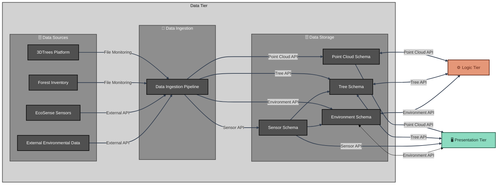
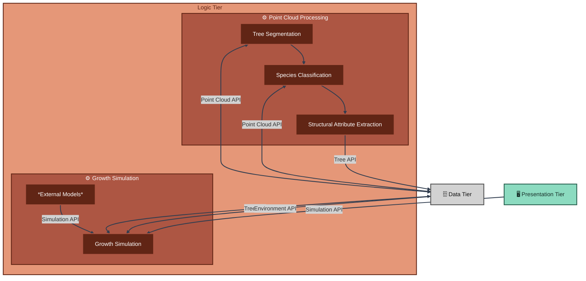
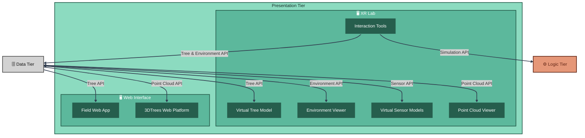

# Architecture

## System Overview

```mermaid
%%{
init: {
'theme': 'base',
'themeVariables': {
'fontSize': '14px',
'secondaryColor': '#d2d2d2'
}
}
}%%
flowchart LR

subgraph DATA["🗄️ Data Tier"]
D1[Data Sources]
D2[Data Storage]
end

subgraph LOGIC["⚙️ Logic Tier"]
L1[Point Cloud Processing]
L2[Tree Growth Simulation]
end

subgraph PRESENTATION["🖥️ Presentation Tier"]
P2[XR Forest]
P3[Web Interface]
P1[API Gateway]
end

DATA <--> LOGIC
PRESENTATION --> LOGIC
PRESENTATION <--> DATA

%% Subgraph styling - light colors
classDef dataTier fill:#d2d2d2,stroke:#505050,stroke-width:2px,color:#0f0f0f
classDef logicTier fill:#e59778,stroke:#612515,stroke-width:2px,color:#612515
classDef presentationTier fill:#8cdbc0,stroke:#265e4d,stroke-width:2px,color:#183029

%% Node styling - darkest colors
classDef dataNode fill:#505050,stroke:#8e8e8e,stroke-width:2px,color:#ffffff
classDef logicNode fill:#612515,stroke:#ad5643,stroke-width:2px,color:#ffffff
classDef presentationNode fill:#265e4d,stroke:#5cb89c,stroke-width:2px,color:#ffffff

class DATA dataTier
class D1,D2 dataNode
class LOGIC logicTier
class L1,L2 logicNode
class PRESENTATION presentationTier
class P1,P2,P3 presentationNode

linkStyle 0,1,2 stroke:#313d4f,stroke-width:2px
```

The XR Future Forests Lab follows a modern three-tier architecture designed to seamlessly integrate forest data acquisition, processing, and immersive visualization. This architecture enables the creation of comprehensive digital forest twins that can be experienced through cutting-edge XR technologies.

The **Data Tier** serves as the foundation, managing both data acquisition from diverse sources and robust storage infrastructure. It handles data ingestion from external services like EcoSense environmental sensors, forest inventory systems, and the 3DTrees platform, while maintaining a sophisticated PostgreSQL database with PostGIS extensions for spatial data management. This tier acts as both a data sink and source, providing bi-directional data flow to support real-time updates and historical analysis.

The **Logic Tier** forms the analytical backbone of the system, processing raw forest data into actionable insights. It encompasses advanced point cloud processing for tree segmentation and species classification, as well as sophisticated growth simulation models that predict forest development under various scenarios. This tier transforms disparate data sources into coherent forest models, enabling both scientific analysis and immersive visualization.

The **Presentation Tier** brings the digital forest to life through immersive XR experiences and accessible web interfaces. Users can explore virtual forests, visualize invisible ecological processes like sap flow and nutrient cycling, and interact with growth simulation parameters to understand forest dynamics. The tier supports multiple interaction modalities, from fully immersive XR environments to field-accessible web applications for real-time forest monitoring.

The architecture's strength lies in its interconnected design: the Data Tier provides comprehensive information to both Logic and Presentation tiers, while the Logic Tier accepts user input from the Presentation Tier to drive interactive simulations. This creates a dynamic ecosystem where data flows seamlessly between acquisition, processing, and visualization, enabling unprecedented insights into forest ecosystems.

---

## Data Tier Architecture

The Data Tier Architecture forms the foundational layer of the XR Future Forests Lab, orchestrating the complex flow of forest data from diverse sources into a unified, spatially-aware database system. This tier is strategically divided into three key components: data sources, ingestion infrastructure, and storage systems.

*Data Sources* represent the diverse ecosystem of forest information providers. The 3DTrees Platform delivers high-resolution LiDAR point clouds as file uploads, while Forest Inventory systems provide structured tree measurement data. EcoSense Sensors continuously stream real-time environmental measurements through dedicated APIs, and External Environmental Data sources contribute broader contextual information such as weather patterns and climate data. This heterogeneous data landscape requires sophisticated coordination to maintain data integrity and temporal consistency.

**Data Ingestion** is managed by a centralized Data Ingestion Pipeline that acts as an intelligent orchestrator for all incoming data streams. This service continuously monitors file-based sources like 3DTrees and Forest Inventory for new uploads, while maintaining active connections to API-based sources like EcoSense Sensors and external environmental services. The ingestion pipeline handles data validation, format standardization, and temporal alignment before routing information to appropriate database schemas, ensuring consistent data quality across all sources.

**Data Storage** implements the comprehensive database design detailed in the database schema documentation, organized into four specialized schemas. The Point Cloud Schema manages LiDAR scan metadata and processing results, maintaining file references and spatial bounds. The Tree Schema serves as the central repository for individual tree information, supporting both measured and simulated data with full temporal tracking. The Sensor Schema acts as an intelligent intermediary, aggregating real-time sensor readings and distributing relevant information to both Tree and Environment schemas based on measurement context. The Environment Schema consolidates environmental conditions essential for growth modeling and XR visualization.

This architecture enables seamless bi-directional data flow to both Logic and Presentation tiers, supporting real-time updates for immersive experiences while maintaining the historical depth necessary for scientific analysis and growth modeling.

---

## Logic Tier Architecture

The Logic Tier Architecture serves as the analytical engine of the XR Future Forests Lab, transforming raw forest data into actionable insights through sophisticated processing pipelines and predictive modeling. This tier bridges the gap between data acquisition and visualization, enabling both automated analysis and user-driven forest simulations.

**Point Cloud Processing** represents the core computational workflow that converts raw LiDAR data into structured forest information. Upon upload through the 3DTrees platform, the system automatically initiates a sequential processing pipeline: Tree Segmentation identifies individual trees within forest point clouds using advanced algorithms, Species Classification applies machine learning models to determine tree species based on structural characteristics, and Structural Attribute Extraction derives precise measurements including height, diameter at breast height (DBH), crown dimensions, and crown base height. This automated pipeline ensures consistent, objective analysis across all point cloud datasets, with segmentation and classification results stored in the Point Cloud Schema and derived tree attributes flowing into the Tree Schema for comprehensive forest inventory management.

**Growth Simulation** leverages external forest growth models to predict tree and forest development under various scenarios. The system integrates with established models like SILVA (individual tree growth) and BALANCE (stand-level growth) to provide scientifically validated projections. Environmental conditions from the Environment Schema and current tree states from the Tree Schema serve as input parameters, while the Growth Simulation component prepares data formats specific to each model's requirements. A key innovation is the integration of user interaction from the XR Presentation Tier, allowing researchers and forest managers to modify environmental parameters, adjust management practices, or test climate scenarios in real-time. Simulation results are automatically saved back to the Tree Schema as temporal variants, enabling users to visualize forest evolution and compare different management strategies within the immersive XR environment through the standardized Simulation API.

This dual-component architecture ensures both automated efficiency and interactive flexibility, supporting the lab's mission to combine rigorous scientific analysis with innovative visualization technologies.

---

## Presentation Tier Architecture

The Presentation Tier Architecture represents the culmination of the XR Future Forests Lab vision, transforming complex forest data into immersive experiences and accessible interfaces that serve diverse user communities from researchers to field practitioners. This tier strategically balances cutting-edge XR technologies with practical web-based tools to maximize accessibility and impact.

**XR Lab** forms the heart of the forest visualization ecosystem, creating unprecedented immersive experiences that make invisible forest processes tangible and interactive. The Virtual Tree Model component renders individual trees with scientific accuracy, incorporating real measurements from the Tree Schema to create photorealistic 3D representations that users can examine at any scale. The Environment Viewer brings abstract environmental data to life, visualizing wind patterns, water flow, CO₂ circulation, and nutrient cycling as dynamic, interactive phenomena within the virtual forest space. Virtual Sensor Models allow users to deploy and interact with digital representations of EcoSense sensors, enabling hands-on learning about environmental monitoring techniques and data collection methodologies. The Point Cloud Viewer provides direct access to raw LiDAR data within the XR environment, allowing users to toggle between processed tree models and original scan data for educational and validation purposes.

The **Interaction Tools** component serves as the bridge between user intent and system response, enabling real-time modification of forest parameters and growth scenarios. Users can manipulate environmental variables, remove or replace trees, adjust management practices, and observe immediate visual feedback of their decisions. These interactions seamlessly integrate with the Simulation API in the Logic Tier through the standardized Interaction API, creating a dynamic feedback loop where user experiments drive scientific modeling and visualization updates.

**Web Interface** components ensure broad accessibility and specialized functionality for different user groups. The Field App empowers forest practitioners to access tree information instantly by scanning QR codes attached to individual trees, pulling comprehensive data including growth history, health status, and predicted development trajectories through the Tree API. The 3DTrees Web Platform serves users by providing browser-based visualization of uploaded point clouds, with the ability to overlay segmentation results through color-coded point classification and display simplified virtual tree models derived from processing algorithms via the Processing API.
