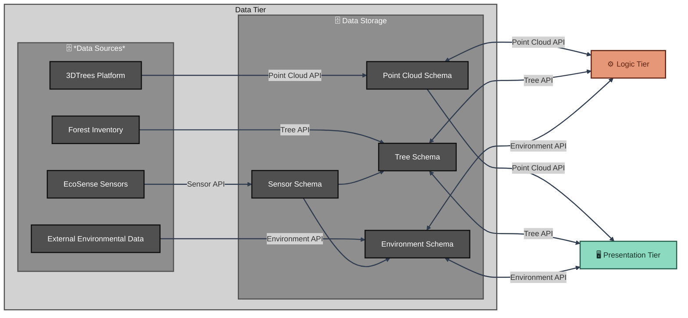
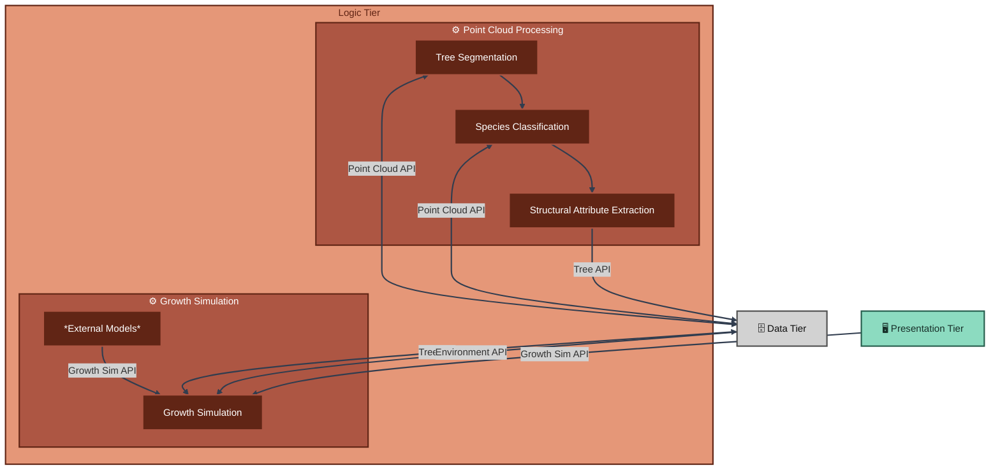
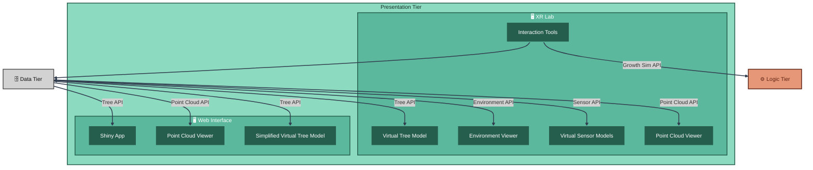

# Architecture

## System Overview

```mermaid
%%{
init: {
'theme': 'base',
'themeVariables': {
'fontSize': '14px',
'secondaryColor': '#d2d2d2'
}
}
}%%
flowchart LR
subgraph DATA["🗄️ Data Tier"]
D1[*Data Sources*]
D2[Data Storage]
end

subgraph LOGIC["⚙️ Logic Tier"]
L1[Point Cloud Processing]
L2[Tree Growth Simulation]
end

subgraph PRESENTATION["🖥️ Presentation Tier"]
P2[XR Forest]
P3[Web Interface]
P1[API Gateway]
end

DATA <--> LOGIC
PRESENTATION --> LOGIC
PRESENTATION <--> DATA

%% Subgraph styling - light colors
classDef dataTier fill:#d2d2d2,stroke:#505050,stroke-width:2px,color:#0f0f0f
classDef logicTier fill:#e59778,stroke:#612515,stroke-width:2px,color:#612515
classDef presentationTier fill:#8cdbc0,stroke:#265e4d,stroke-width:2px,color:#183029

%% Node styling - darkest colors
classDef dataNode fill:#505050,stroke:#8e8e8e,stroke-width:2px,color:#ffffff
classDef logicNode fill:#612515,stroke:#ad5643,stroke-width:2px,color:#ffffff
classDef presentationNode fill:#265e4d,stroke:#5cb89c,stroke-width:2px,color:#ffffff

class DATA dataTier
class D1,D2 dataNode
class LOGIC logicTier
class L1,L2 logicNode
class PRESENTATION presentationTier
class P1,P2,P3 presentationNode

linkStyle 0,1,2 stroke:#313d4f,stroke-width:2px
```

---

## Data Tier Architecture

```mermaid
%%{
init: {
'theme': 'base',
'themeVariables': {
'fontSize': '14px',
'secondaryColor': '#d2d2d2'
}
}
}%%
flowchart LR
subgraph DATA_TIER["Data Tier"]
subgraph SOURCES["🗄️ *Data Sources*"]
S1[3DTrees Platform]
S5[Forest Inventory]
S3[External Environmental Data]
S2[EcoSense Sensors]
end

subgraph STORAGE["🗄️ Data Storage"]
SC1[Point Cloud Schema]
SC2[Tree Schema]
SC3[Sensor Schema]
SC4[Environment Schema]
end
end

LOGIC_REF["⚙️ Logic Tier"]


PRESENTATION_REF["🖥️ Presentation Tier"]

S1 -->|Point Cloud API| SC1
S2 -->|Sensor API| SC3
S3 -->|Environment API| SC4
S5 -->|Tree API| SC2

SC3 --> SC4
SC3 --> SC2

SC1 <-->|Point Cloud API| LOGIC_REF
SC2 <-->|Tree API| LOGIC_REF
SC4 <-->|Environment API| LOGIC_REF
SC1 -->|Point Cloud API| PRESENTATION_REF
SC2 <-->|Tree API| PRESENTATION_REF
SC4 <-->|Environment API| PRESENTATION_REF

%% Higher level tiers - light colors
classDef dataBack fill:#d2d2d2,stroke:#505050,stroke-width:2px,color:#0f0f0f
classDef logicTier fill:#e59778,stroke:#612515,stroke-width:2px,color:#612515
classDef presentationTier fill:#8cdbc0,stroke:#265e4d,stroke-width:2px,color:#183029

%% Mid-level subgraphs - medium colors  
classDef dataTier fill:#8e8e8e,stroke:#505050,stroke-width:2px,color:#ffffff

%% Nodes - darkest colors
classDef dataNode fill:#505050,stroke:#0f0f0f,stroke-width:2px,color:#ffffff
classDef logicNode fill:#612515,stroke:#ad5643,stroke-width:2px,color:#ffffff
classDef presentationNode fill:#265e4d,stroke:#5cb89c,stroke-width:2px,color:#ffffff

class DATA_TIER dataBack
class SOURCES,STORAGE dataTier
class S1,S2,S3,S5,SC1,SC2,SC3,SC4 dataNode
class LOGIC_REF logicTier
class L_REF logicNode
class PRESENTATION_REF presentationTier
class P_REF presentationNode

linkStyle 0,1,2,3,4,5,6,7,8,9,10,11 stroke:#313d4f,stroke-width:2px
```

---

## Logic Tier Architecture

```mermaid
%%{
init: {
'theme': 'base',
'themeVariables': {
'fontSize': '14px',
'secondaryColor': '#d2d2d2'
}
}
}%%
flowchart TD
DATA_REF["🗄️ Data Tier"]


subgraph LOGIC_TIER["Logic Tier"]
subgraph PROCESSING["⚙️ Point Cloud Processing"]
PC1[Tree Segmentation]
PC2[Species Classification]
PC3[Structural Attribute Extraction]
end

subgraph MODELS["⚙️ Growth Simulation"]
X1[*External Models*]
X2[Growth Simulation]
end

end

PRESENTATION_REF["🖥️ Presentation Tier"]

PC1 --> PC2
PC2 --> PC3
PC1 <-->|Point Cloud API| DATA_REF
PC2 <-->|Point Cloud API| DATA_REF
PC3 -->|Tree API| DATA_REF
X1 -->|Growth Sim API| X2
DATA_REF <-->|Tree API| X2
DATA_REF -->|Environment API| X2
PRESENTATION_REF -->|Growth Sim API| X2


classDef logicBack fill:#e59778,stroke:#612515,stroke-width:2px,color:#612515
classDef dataTier fill:#d2d2d2,stroke:#505050,stroke-width:2px,color:#0f0f0f
classDef logicTier fill:#ad5643,stroke:#612515,stroke-width:2px,color:#ffffff
classDef presentationTier fill:#8cdbc0,stroke:#265e4d,stroke-width:2px,color:#183029
classDef dataNode fill:#505050,stroke:#0f0f0f,stroke-width:2px,color:#ffffff
classDef logicNode fill:#612515,stroke:#ad5643,stroke-width:2px,color:#ffffff
classDef presentationNode fill:#265e4d,stroke:#5cb89c,stroke-width:2px,color:#ffffff

class LOGIC_TIER logicBack
class DATA_REF dataTier
class SC1,SC2,SC4 dataNode
class PROCESSING,MODELS logicTier
class PC1,PC2,PC3,X1,X2 logicNode
class PRESENTATION_REF presentationTier
class P_REF presentationNode

linkStyle 0,1,2,3,4,5,6,7,8 stroke:#313d4f,stroke-width:2px
```

---

## Presentation Tier Architecture

```mermaid
%%{
init: {
'theme': 'base',
'themeVariables': {
'fontSize': '14px',
'secondaryColor': '#d2d2d2'
}
}
}%%
flowchart TD

DATA_REF["🗄️ Data Tier"]
LOGIC_REF["⚙️ Logic Tier"]

subgraph PRESENTATION_TIER["Presentation Tier"]

subgraph XR["🖥️ XR Lab"]
XR1[Virtual Tree Model]
XR2[Environment Viewer]
XR3[Virtual Sensor Models]
XR4[Point Cloud Viewer]
I1[Interaction Tools]
end

subgraph WEB["🖥️ Web Interface"]
W1[Shiny App]
W2[Point Cloud Viewer]
W3[Simplified Virtual Tree Model]
end

end

DATA_REF -->|Tree API| W1
DATA_REF -->|Point Cloud API| W2
DATA_REF -->|Tree API| W3
DATA_REF <-->|Tree API| XR1
DATA_REF <-->|Environment API| XR2
DATA_REF <-->|Sensor API| XR3
DATA_REF <-->|Point Cloud API| XR4
I1 --> DATA_REF
I1 -->|Growth Sim API| LOGIC_REF

classDef presentationBack fill:#8cdbc0,stroke:#265e4d,stroke-width:2px,color:#183029
classDef dataTier fill:#d2d2d2,stroke:#505050,stroke-width:2px,color:#0f0f0f
classDef logicTier fill:#e59778,stroke:#612515,stroke-width:2px,color:#612515
classDef presentationTier fill:#5cb89c,stroke:#265e4d,stroke-width:2px,color:#ffffff
classDef dataNode fill:#505050,stroke:#0f0f0f,stroke-width:2px,color:#ffffff
classDef logicNode fill:#612515,stroke:#ad5643,stroke-width:2px,color:#ffffff
classDef presentationNode fill:#265e4d,stroke:#5cb89c,stroke-width:2px,color:#ffffff

class PRESENTATION_TIER presentationBack
class DATA_REF dataTier
class SC1,SC2,SC3,SC4 dataNode
class LOGIC_REF logicTier
class DT1,DT2,MR logicNode
class WEB,XR presentationTier
class APIGW,XR1,XR2,XR3,XR4,W1,W2,W3,I1 presentationNode

linkStyle 0,1,2,3,4,5,6,7,8 stroke:#313d4f,stroke-width:2px
```
