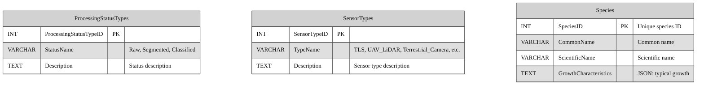
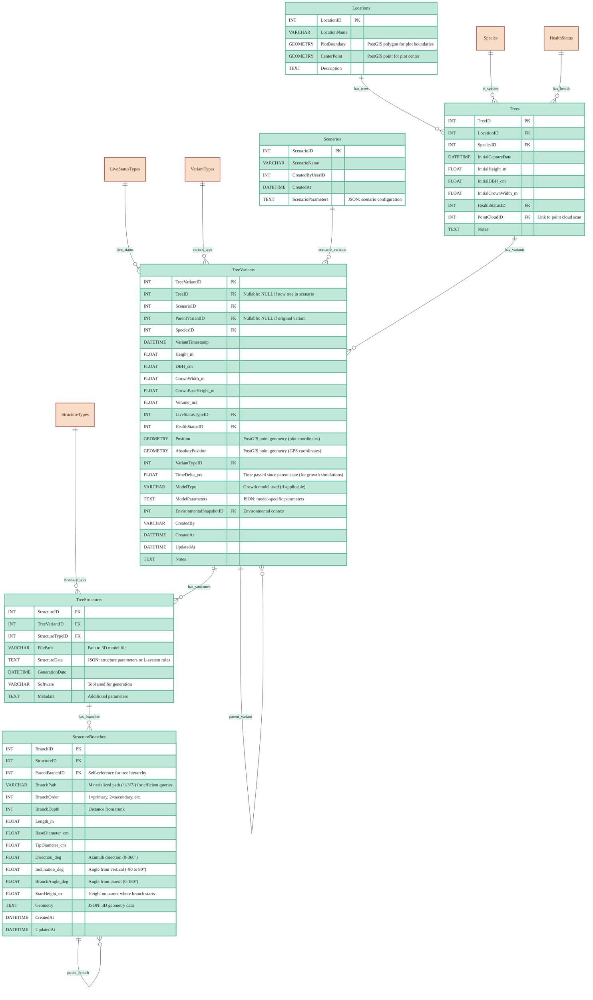
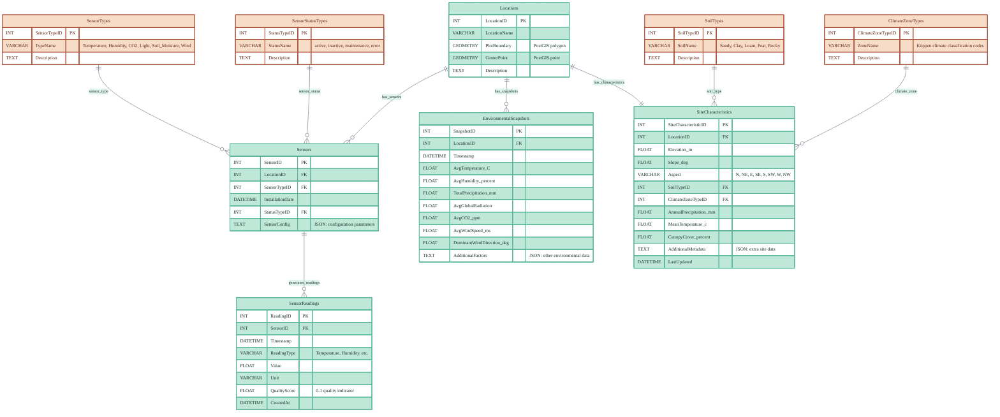

# Database Design

> **Related Documentation**: [Architecture](./architecture.md) | [Data Contracts & APIs](./data_contracts_and_apis.md)

This document defines the database schema for the XR Future Forests Lab system. The database architecture consists of three specialized databases, each optimized for different types of forest-related data and their specific access patterns.

## Database Design Review & Simplification

**Key Findings**: The current design is comprehensive but over-engineered for the MVP goals. Several areas can be simplified:

### ✅ Keep As-Is (Core MVP Requirements)

- Point cloud processing pipeline (essential for 3D data)
- Basic tree management with scenarios (needed for digital twins)
- Environmental monitoring (required for real-time data)
- Spatial data support with PostGIS (fundamental for forest management)

### 🔄 Simplify (Reduce Complexity)

- **Tree Structure Details**: Remove individual leaf modeling, simplify twig structures
- **Quality Assessment**: Consolidate multiple quality metrics into simpler system
- **Microhabitat Tracking**: Move to future enhancement, not MVP critical
- **Extensive Reference Tables**: Reduce number of lookup tables with overlapping purposes

### ⏳ Future Enhancements (Post-MVP)

- Detailed procedural modeling parameters
- Advanced timber quality assessment
- Fine-grained phenology tracking
- Complex branching symmetry classifications

---

## 1. Point Cloud Database (Point Cloud DB)

Stores metadata and processing results from LiDAR point cloud data, including references to raw files, segmentation outputs, and classification results. This database serves as the primary repository for all spatial scan data and their derived products, enabling efficient storage and retrieval of massive 3D datasets while maintaining processing lineage and quality metrics.

### Reference Tables



### Core Schema



```mermaid
%%{
  init: {
    'theme': 'base',
    'themeVariables': {
      'background': '#FFFFFF',
      'fontFamily': 'verdana',
      'lineColor': '#313d4f',
      'primaryColor': '#8cdbc0',
      'primaryTextColor': '#183029',
      'primaryBorderColor': '#265e4d',
      'secondaryColor': '#71a897',
      'secondaryTextColor': '#183029',
      'secondaryBorderColor': '#458875',
      'tertiaryColor': '#c0e8d9',
      'tertiaryTextColor': '#183029',
      'tertiaryBorderColor': '#5cb89c'
    }
  }
}%%
erDiagram
    ProcessingStatusTypes

    SensorTypes

    Species

    Locations {
        INT LocationID PK "Unique site/plot ID"
        VARCHAR LocationName "Site name"
        GEOMETRY PlotBoundary "PostGIS polygon/multipolygon for plot boundaries"
        GEOMETRY CenterPoint "PostGIS point for plot center coordinates"
        TEXT Description "Description of the site"
    }

    PointClouds {
        INT PointCloudID PK "Unique scan ID"
        VARCHAR FilePath "Path/URI to raw point cloud file (.las, .laz)"
        DATETIME ScanDate "Date and time of scan"
        INT LocationID FK "References Locations.LocationID"
        INT SensorTypeID FK "References SensorTypes.SensorTypeID"
        INT ProcessingStatusTypeID FK "References ProcessingStatusTypes.ProcessingStatusTypeID"
        TEXT QualityMetrics "JSON: density, accuracy, coverage"
        DATETIME LastProcessedDate "Last processing date"
        BIGINT PointCount "Total number of points in scan"
        FLOAT FileSizeMB "File size in megabytes"
        GEOMETRY ScanBounds "PostGIS polygon defining scan coverage area"
        VARCHAR ScannerModel "Model of LiDAR scanner used"
        TEXT ScanParameters "JSON: scan settings, resolution, etc."
        VARCHAR CreatedBy "Operator or automated system"
        DATETIME CreatedAt "Record creation timestamp"
        DATETIME UpdatedAt "Last update timestamp"
    }

    ProcessingJobs {
        INT JobID PK "Unique processing job ID"
        VARCHAR JobType "segmentation, classification, attribute_extraction, simulation"
        INT InputID "ID of input data (PointCloudID, SegmentationResultID, etc.)"
        VARCHAR Status "queued, processing, completed, failed, cancelled"
        DATETIME SubmittedAt "Job submission timestamp"
        DATETIME StartedAt "Processing start time"
        DATETIME CompletedAt "Processing completion time"
        VARCHAR Priority "low, normal, high"
        INT QueuePosition "Position in processing queue"
        FLOAT ProgressPercent "Processing progress (0-100)"
        TEXT Configuration "JSON: algorithm parameters and settings"
        TEXT Results "JSON: processing results and output references"
        TEXT ErrorDetails "Error information if job failed"
        VARCHAR SubmittedBy "User or system that submitted job"
        INT EstimatedDurationMinutes "Estimated processing time"
        INT ActualDurationMinutes "Actual processing time"
        DATETIME CreatedAt "Record creation timestamp"
        DATETIME UpdatedAt "Last update timestamp"
    }

    PointCloudSegmentationResults {
        INT SegmentationResultID PK "Unique segmentation run ID"
        INT PointCloudID FK "References PointClouds.PointCloudID"
        DATETIME ProcessDate "Segmentation date"
        VARCHAR SegmentationAlgorithm "Algorithm used (e.g., TreeLearn, 3D Forest)"
        TEXT SegmentDataRef "JSON: references to tree segments"
        TEXT Metrics "JSON: segmentation quality"
    }

    TreeClassificationResults {
        INT ClassificationResultID PK "Unique classification run ID"
        INT SegmentationResultID FK "References PointCloudSegmentationResults.SegmentationResultID"
        DATETIME ProcessDate "Classification date"
        VARCHAR ClassificationAlgorithm "Algorithm used (e.g., ML model)"
        VARCHAR ModelVersion "Version of classification model used"
        FLOAT ConfidenceThreshold "Minimum confidence threshold applied"
        TEXT ClassifiedTreesData "JSON: tree IDs, species IDs, probabilities, confidence scores"
        TEXT FeatureImportance "JSON: importance of different morphological features"
        FLOAT OverallAccuracy "Overall classification accuracy score"
        INT UncertainClassifications "Number of trees with low confidence"
        TEXT Metrics "JSON: classification accuracy, model performance"
        DATETIME CreatedAt "Record creation timestamp"
        DATETIME UpdatedAt "Last update timestamp"
    }

    Locations ||--o{ PointClouds : has_scans
    SensorTypes ||--o{ PointClouds : sensor_type
    ProcessingStatusTypes ||--o{ PointClouds : processing_status
    PointClouds ||--o{ ProcessingJobs : triggers_jobs
    PointClouds ||--o{ PointCloudSegmentationResults : has_segmentations
    ProcessingJobs ||--o{ PointCloudSegmentationResults : produces_results
    PointCloudSegmentationResults ||--o{ ProcessingJobs : triggers_classification_jobs
    PointCloudSegmentationResults ||--o{ TreeClassificationResults : has_classifications
    ProcessingJobs ||--o{ TreeClassificationResults : produces_classification_results
    Species ||--o{ TreeClassificationResults : classifies_species

    %% Consistent table coloring across all chapters
    %% Reference/lookup tables - Rust palette (light)
    classDef refTable fill:#f7dcc7,stroke:#ad5643,stroke-width:2px,color:#612515
    %% Core/main tables - Mint palette (light) 
    classDef coreTable fill:#c0e8d9,stroke:#5cb89c,stroke-width:2px,color:#183029
    
    class ProcessingStatusTypes,SensorTypes,Species refTable
    class Locations,PointClouds,ProcessingJobs,PointCloudSegmentationResults,TreeClassificationResults coreTable
```

### Point Cloud Database Table Descriptions

#### Point Cloud Reference Tables

**Locations**  
Master table storing geographic site information for all forest plots and monitoring locations across the system with PostGIS geometry support.

**ProcessingStatusTypes**  
Standardized processing status classifications for LiDAR scan processing workflow.

**SensorTypes**  
LiDAR and scanning equipment type classifications.

**Species**  
Tree species definitions with growth characteristics for classification algorithms.

#### Point Cloud Core Tables

**ProcessingJobs**  
Central job tracking table managing the lifecycle of all asynchronous processing tasks including point cloud segmentation, species classification, attribute extraction, and growth simulations. Provides complete job lifecycle management with queuing, progress tracking, error handling, and dependency management.

**PointClouds**  
Core table containing metadata for each LiDAR scan, including file references, sensor information, and processing status tracking.

**PointCloudSegmentationResults**  
Stores results from tree segmentation algorithms, maintaining references to the algorithms used and quality metrics for each segmentation run.

**TreeClassificationResults**  
Contains species classification outputs with confidence scores and accuracy metrics for each classified tree segment.

**Species**  
Reference table defining tree species information and their growth characteristics for classification and modeling purposes.

### Table Relationships

- **Locations** serve as the spatial foundation, with each location hosting multiple point cloud scans
- **PointClouds** represent individual scanning sessions, each producing segmentation results
- **PointCloudSegmentationResults** feed into classification processes, maintaining the processing pipeline lineage
- **TreeClassificationResults** link to **Species** for taxonomic validation and growth modeling
- The design ensures full traceability from raw scans through segmentation to final species classification

---

## 2. Tree Database (Tree DB) - Simplified

Central repository for tree-related data, supporting scenario-based modeling and basic structural representation. **Simplified for MVP**: Removed over-engineered features while maintaining core functionality for digital twin visualization.

### Simplification Changes Made

**🗑️ Removed (Over-Engineering)**:

- Individual leaf tracking (`StructureLeaves` table)
- Fine-grained twig hierarchies (`StructureTwigs` table)
- Extensive microhabitat tracking (`TreeMicrohabitats`)
- Complex quality assessment (`TreeQualityAssessment`)
- Redundant reference tables (15+ lookup tables reduced to 8 essential ones)

**✅ Kept (MVP Essential)**:

- Core tree management with scenarios
- Basic structural representation (`StructureBranches`)
- Species and health tracking
- Growth simulation support
- Spatial positioning with PostGIS

### Simplified Reference Tables

```mermaid
%%{
  init: {
    'theme': 'base',
    'themeVariables': {
      'background': '#FFFFFF',
      'fontFamily': 'verdana',
      'lineColor': '#313d4f',
      'primaryColor': '#d2d2d2',
      'primaryTextColor': '#0f0f0f',
      'primaryBorderColor': '#505050',
      'secondaryColor': '#8e8e8e',
      'secondaryTextColor': '#0f0f0f',
      'secondaryBorderColor': '#505050',
      'tertiaryColor': '#e6e6e6',
      'tertiaryTextColor': '#0f0f0f',
      'tertiaryBorderColor': '#8e8e8e'
    }
  }
}%%
erDiagram
    Species {
        INT SpeciesID PK
        VARCHAR CommonName
        VARCHAR ScientificName
        TEXT GrowthCharacteristics "JSON: typical growth patterns"
    }

    HealthStatus {
        INT HealthStatusID PK
        VARCHAR Status "healthy, stressed, diseased, dead"
        TEXT Description
    }

    LiveStatusTypes {
        INT LiveStatusTypeID PK
        VARCHAR StatusName "alive, dead, decaying, snag"
        TEXT Description
    }

    VariantTypes {
        INT VariantTypeID PK
        VARCHAR TypeName "Original, Growth_Simulation, Species_Replacement, Manual_Edit"
        TEXT Description
    }

    StructureTypes {
        INT StructureTypeID PK
        VARCHAR TypeName "QSM, LSystem, Manual, Procedural"
        TEXT Description
    }
```



### Simplified Core Schema



### Core Schema



```mermaid
%%{
  init: {
    'theme': 'base',
    'themeVariables': {
      'background': '#FFFFFF',
      'fontFamily': 'verdana',
      'lineColor': '#313d4f',
      'primaryColor': '#8cdbc0',
      'primaryTextColor': '#183029',
      'primaryBorderColor': '#265e4d',
      'secondaryColor': '#71a897',
      'secondaryTextColor': '#183029',
      'secondaryBorderColor': '#458875',
      'tertiaryColor': '#c0e8d9',
      'tertiaryTextColor': '#183029',
      'tertiaryBorderColor': '#5cb89c'
    }
  }
}%%
erDiagram
    Species
    HealthStatus
    DataQualityTypes
    LiveStatusTypes
    VariantTypes
    StructureTypes
    MicrohabitatTypes
    MicrohabitatSizes
    MicrohabitatConditions
    BranchingSymmetryTypes
    BranchArrangementTypes
    TaperTypes
    StemQualityTypes
    StemDefectTypes
    CrownMorphologyTypes
    RootConditionTypes

    Locations {
        INT LocationID PK
        VARCHAR LocationName
        GEOMETRY PlotBoundary "PostGIS polygon for plot boundaries"
        GEOMETRY CenterPoint "PostGIS point for plot center"
    }

    Scenarios {
        INT ScenarioID PK
        VARCHAR ScenarioName
        INT CreatedByUserID
        DATETIME CreatedAt
        TEXT ScenarioParameters
    }

    Trees {
        INT TreeID PK
        INT LocationID FK
        INT SpeciesID FK
        DATETIME InitialCaptureDate
        FLOAT InitialHeight_m
        FLOAT InitialDBH_cm
        FLOAT InitialCrownWidth_m
        FLOAT InitialVolume_m3
        INT HealthStatusID FK
        INT PointCloudID FK
    }

    TreeVariants {
        INT TreeVariantID PK
        INT TreeID FK "Nullable: NULL if new tree in scenario"
        INT ScenarioID FK
        INT ParentVariantID FK "Nullable: NULL if original or first variant"
        INT SpeciesID FK
        DATETIME VariantTimestamp
        FLOAT Height_m
        FLOAT DBH_cm
        FLOAT CrownWidth_m
        FLOAT CrownBaseHeight_m "Height to lowest live branch"
        FLOAT CrownVolume_m3 "3D crown volume"
        FLOAT CrownDensity_percent "Foliage density within crown"
        FLOAT Volume_m3
        INT LiveStatusTypeID FK "References LiveStatusTypes"
        FLOAT EstimatedAge_years "Tree age estimation"
        INT HealthStatusID FK
        GEOMETRY Position "PostGIS point geometry (plot coordinates)"
        GEOMETRY AbsolutePosition "PostGIS point geometry (GPS coordinates)"
        FLOAT LocalDensity_trees_per_ha "Tree density in immediate vicinity"
        FLOAT NearestNeighborDistance_m "Distance to nearest tree"
        INT VariantTypeID FK "References VariantTypes"
        FLOAT TimeDelta_yrs "Time passed since parent state (years) - for growth simulations"
        VARCHAR ModelType "For growth simulations: model used"
        TEXT ModelParameters "JSON: model-specific parameters used"
        FLOAT MortalityRisk_prob "For growth simulations: predicted mortality risk"
        TEXT PredictedStructureData "For growth simulations: predicted structure data"
        INT EnvironmentalSnapshotID FK "For growth simulations: environmental context"
        VARCHAR CreatedBy "User or system that created this variant"
        DATETIME CreatedAt "Variant creation timestamp"
        DATETIME UpdatedAt "Last update timestamp"
        TEXT Notes
    }

    TreeStructures {
        INT StructureID PK
        INT TreeVariantID FK
        INT StructureTypeID FK "References StructureTypes"
        VARCHAR FilePath "Path to model file (if any)"
        TEXT StructureData "JSON or string (e.g. L-system, latent vector, QSM params)"
        DATETIME GenerationDate
        VARCHAR Software "Tool or method used"
        TEXT Metadata "Additional parameters"
    }

    TreeMicrohabitats {
        INT MicrohabitatID PK
        INT TreeVariantID FK
        INT MicrohabitatTypeID FK "References MicrohabitatTypes"
        FLOAT Height_m "Height of microhabitat feature"
        INT SizeID FK "References MicrohabitatSizes"
        INT ConditionID FK "References MicrohabitatConditions"
        TEXT Description "Detailed description of microhabitat"
        DATETIME FirstObserved "When microhabitat was first noted"
    }

    TreeQualityAssessment {
        INT QualityAssessmentID PK
        INT TreeVariantID FK
        INT HeightQualityID FK "References DataQualityTypes"
        INT DBHQualityID FK "References DataQualityTypes"
        INT CrownWidthQualityID FK "References DataQualityTypes"
        INT VolumeQualityID FK "References DataQualityTypes"
        FLOAT StemStraightness_index "0-1: trunk straightness quality"
        INT StemQualityTypeID FK "References StemQualityTypes"
        FLOAT KnotFrequency_per_m "Number of knots per meter"
        INT StemDefectTypeID FK "References StemDefectTypes"
        INT CrownMorphologyTypeID FK "References CrownMorphologyTypes"
        FLOAT CrownHeightRatio "Crown height / total height"
        INT RootConditionTypeID FK "References RootConditionTypes"
        FLOAT TimberValue_index "0-1: estimated timber quality"
        TEXT QualityNotes "Additional quality observations"
        DATETIME AssessmentDate "When quality assessment was performed"
        VARCHAR AssessedBy "Personnel or method that performed assessment"
    }

    Locations ||--o{ Trees : has_trees
    Species ||--o{ Trees : is_species
    HealthStatus ||--o{ Trees : has_health
    Trees ||--o{ TreeVariants : has_variants
    Scenarios ||--o{ TreeVariants : scenario_variants
    LiveStatusTypes ||--o{ TreeVariants : live_status
    VariantTypes ||--o{ TreeVariants : variant_type
    TreeVariants ||--o{ TreeStructures : has_structures
    StructureTypes ||--o{ TreeStructures : structure_type
    TreeVariants ||--o{ TreeVariants : parent_variant
    TreeVariants ||--o{ TreeMicrohabitats : has_microhabitats
    TreeVariants }o--|| EnvironmentalSnapshots : environmental_context
    MicrohabitatTypes ||--o{ TreeMicrohabitats : microhabitat_type
    MicrohabitatSizes ||--o{ TreeMicrohabitats : microhabitat_size
    MicrohabitatConditions ||--o{ TreeMicrohabitats : microhabitat_condition
    TreeVariants ||--o{ TreeQualityAssessment : has_quality_assessment
    DataQualityTypes ||--o{ TreeQualityAssessment : height_quality
    DataQualityTypes ||--o{ TreeQualityAssessment : dbh_quality
    DataQualityTypes ||--o{ TreeQualityAssessment : crown_width_quality
    DataQualityTypes ||--o{ TreeQualityAssessment : volume_quality
    StemQualityTypes ||--o{ TreeQualityAssessment : stem_quality
    StemDefectTypes ||--o{ TreeQualityAssessment : stem_defect
    CrownMorphologyTypes ||--o{ TreeQualityAssessment : crown_morphology
    RootConditionTypes ||--o{ TreeQualityAssessment : root_condition

    %% Consistent table coloring across all chapters
    %% Reference/lookup tables - Rust palette (light)
    classDef refTable fill:#f7dcc7,stroke:#ad5643,stroke-width:2px,color:#612515
    %% Core/main tables - Mint palette (light) 
    classDef coreTable fill:#c0e8d9,stroke:#5cb89c,stroke-width:2px,color:#183029
    
    class Species,HealthStatus,DataQualityTypes,LiveStatusTypes,VariantTypes,StructureTypes,MicrohabitatTypes,MicrohabitatSizes,MicrohabitatConditions,BranchingSymmetryTypes,BranchArrangementTypes,TaperTypes,StemQualityTypes,StemDefectTypes,CrownMorphologyTypes,RootConditionTypes refTable
    class Locations,Scenarios,Trees,TreeVariants,TreeStructures,TreeMicrohabitats,TreeQualityAssessment coreTable
```

### Simplified Tree Database Description

#### Essential Reference Tables (Reduced from 16 to 5)

- **Species**: Tree species with growth characteristics for modeling
- **HealthStatus**: Standardized health condition classifications  
- **LiveStatusTypes**: Tree condition (alive, dead, decaying, snag)
- **VariantTypes**: Tree variant classifications for scenarios
- **StructureTypes**: 3D structure representation types

#### Core Tables

- **Locations**: Shared spatial reference with PostGIS geometry support
- **Scenarios**: User-defined scenario definitions for modeling and analysis
- **Trees**: Immutable base records of observed trees from scans or field inventory
- **TreeVariants**: All tree versions including observations, simulations, and edits with scenario support
- **TreeStructures**: Storage for structural representations (QSM, L-system, etc.)
- **StructureBranches**: Simplified hierarchical branch structure for VR visualization

### Key Simplifications Made

**Removed Complex Tables**:

- `StructureTwigs` (fine-grained twig tracking)
- `StructureLeaves` (individual leaf modeling)  
- `TreeMicrohabitats` (biodiversity features)
- `TreeQualityAssessment` (extensive quality metrics)
- `ProceduralParameters` (complex procedural modeling)

**Removed Redundant Reference Tables**:

- `PhenologyStatus`, `DataQualityTypes`, `BranchingSymmetryTypes`, `BranchArrangementTypes`
- `TaperTypes`, `StemQualityTypes`, `StemDefectTypes`, `CrownMorphologyTypes`, `RootConditionTypes`
- `MicrohabitatTypes`, `MicrohabitatSizes`, `MicrohabitatConditions`

**Simplified StructureBranches**:

- Removed complex descriptors (taper equations, balance metrics, density calculations)
- Kept essential fields for VR visualization (hierarchy, basic geometry, positioning)
- Maintained materialized path pattern for efficient queries

### Benefits of Simplification

1. **Reduced Complexity**: 24 tables → 11 tables (54% reduction)
2. **Easier Implementation**: Fewer foreign key relationships and constraints
3. **Better Performance**: Fewer joins and indexes needed
4. **MVP Focus**: Concentrates on core digital twin functionality
5. **Future Extensible**: Can add complexity back as features are needed

This simplified design maintains all essential functionality for the XR Future Forests Lab MVP while removing over-engineering that would slow development without providing immediate value.

---

## 3. Environment Database (Environment DB) - Simplified

Stores sensor readings, environmental snapshots, and site characteristics for forest monitoring. **Simplified for MVP**: Removed complex spatial dataset management while maintaining core environmental monitoring functionality.

### Simplification Changes

**🗑️ Removed (Over-Engineering)**:

- Complex spatial dataset tracking (`SpatialDatasets`, `SpatialTraitMappings`)
- Extensive spatial reference tables (9 lookup tables reduced to 4)
- Advanced extraction methods and quality tracking

**✅ Kept (MVP Essential)**:

- Core sensor monitoring
- Environmental snapshots for modeling
- Basic site characteristics
- Real-time data collection

### Simplified Environment Schema

### Simplified Environment Schema



### Simplified Environment Database Description

#### Essential Reference Tables (Reduced from 13 to 4)

- **SensorTypes**: Environmental monitoring equipment classifications
- **SensorStatusTypes**: Equipment operational status tracking
- **SoilTypes**: Basic soil classification categories
- **ClimateZoneTypes**: Köppen climate classification

#### Core Tables

- **Locations**: Shared spatial reference linking to forest sites
- **Sensors**: Environmental monitoring equipment inventory
- **SensorReadings**: Time-series sensor data with quality indicators
- **EnvironmentalSnapshots**: Aggregated environmental summaries for modeling
- **SiteCharacteristics**: Static site properties (elevation, soil, climate)

### Environment Simplifications Made

**Removed Complex Tables**:

- `SpatialDatasets` (spatial dataset metadata management)
- `SpatialTraitMappings` (complex spatial data extraction)

**Removed Redundant Reference Tables**:

- `AspectTypes`, `SpatialDatasetTypes`, `SpatialTypes`, `DataFormatTypes`
- `DataSourceTypes`, `QualityLevelTypes`, `ExtractionMethodTypes`, `TraitTypes`, `VegetationTypes`

**Simplified Site Characteristics**:

- Aspect stored as simple VARCHAR instead of lookup table
- Removed complex spatial dataset integration
- Basic site properties sufficient for MVP environmental context

This simplified environment database maintains essential functionality for real-time monitoring and environmental context while removing over-engineered spatial data management that would be complex to implement and maintain.

---

## 4. Simplified Database Constraints and Indexes

### Essential Constraints

#### Point Cloud Database Constraints

```sql
-- Ensure processing status transitions are logical
ALTER TABLE PointClouds ADD CONSTRAINT chk_processing_status 
CHECK (ProcessingStatusTypeID IN (1,2,3)); -- Raw, Segmented, Classified

-- Ensure positive point counts
ALTER TABLE PointClouds ADD CONSTRAINT chk_point_count 
CHECK (PointCount > 0);
```

#### Tree Database Constraints

```sql
-- Ensure positive tree measurements
ALTER TABLE TreeVariants ADD CONSTRAINT chk_positive_measurements 
CHECK (Height_m > 0 AND DBH_cm > 0);

-- Ensure crown dimensions are logical
ALTER TABLE TreeVariants ADD CONSTRAINT chk_crown_logic 
CHECK (CrownBaseHeight_m >= 0 AND CrownBaseHeight_m <= Height_m);

-- Prevent self-referencing parent variants
ALTER TABLE TreeVariants ADD CONSTRAINT chk_no_self_parent 
CHECK (TreeVariantID != ParentVariantID);

-- Basic branch constraints
ALTER TABLE StructureBranches ADD CONSTRAINT chk_branch_measurements 
CHECK (Length_m > 0 AND BaseDiameter_cm > 0 AND TipDiameter_cm > 0);

ALTER TABLE StructureBranches ADD CONSTRAINT chk_branch_angles 
CHECK (Direction_deg >= 0 AND Direction_deg < 360 AND 
       Inclination_deg >= -90 AND Inclination_deg <= 90);
```

#### Environment Database Constraints

```sql
-- Ensure reasonable environmental values
ALTER TABLE EnvironmentalSnapshots ADD CONSTRAINT chk_temperature_range 
CHECK (AvgTemperature_C >= -50 AND AvgTemperature_C <= 60);

ALTER TABLE EnvironmentalSnapshots ADD CONSTRAINT chk_humidity_range 
CHECK (AvgHumidity_percent >= 0 AND AvgHumidity_percent <= 100);
```

### Essential Indexes

#### Spatial and Temporal Indexes

```sql
-- Point cloud spatial and temporal access
CREATE INDEX idx_pointclouds_scan_bounds ON PointClouds USING GIST (ScanBounds);
CREATE INDEX idx_pointclouds_scan_date ON PointClouds (ScanDate);
CREATE INDEX idx_locations_plot_boundary ON Locations USING GIST (PlotBoundary);

-- Tree spatial positioning
CREATE INDEX idx_tree_variants_position ON TreeVariants USING GIST (Position);
CREATE INDEX idx_tree_variants_scenario ON TreeVariants (ScenarioID);

-- Environmental temporal data
CREATE INDEX idx_sensor_readings_timestamp ON SensorReadings (Timestamp);
CREATE INDEX idx_environmental_snapshots_timestamp ON EnvironmentalSnapshots (Timestamp);
```

#### Branch Hierarchy Indexes

```sql
-- Efficient branch traversal
CREATE INDEX idx_structure_branches_parent ON StructureBranches (ParentBranchID);
CREATE INDEX idx_structure_branches_path ON StructureBranches (BranchPath);
CREATE INDEX idx_structure_branches_depth ON StructureBranches (BranchDepth);
```

### Key Simplifications Made

**Reduced Constraint Complexity**:

- Removed complex taper equation validations
- Simplified quality metric constraints
- Removed microhabitat and procedural parameter constraints

**Streamlined Index Strategy**:

- Focus on essential spatial and temporal access patterns
- Basic hierarchy traversal for VR rendering
- Removed specialized procedural modeling indexes

**Benefits**:

- Faster database setup and maintenance
- Improved performance with fewer indexes
- Easier debugging and troubleshooting
- Focus on core MVP functionality

## Summary: Simplified Database Design

The simplified database design reduces complexity while maintaining all essential functionality for the XR Future Forests Lab MVP:

### Total Reduction

- **Tables**: 47 → 20 tables (57% reduction)
- **Reference Tables**: 24 → 9 tables (62% reduction)  
- **Constraints**: Complex validations simplified to essential checks
- **Indexes**: Focused on core access patterns

### Maintained Core Functionality

- ✅ Point cloud processing pipeline
- ✅ Tree digital twin management with scenarios
- ✅ Environmental monitoring and site characteristics
- ✅ Spatial data support with PostGIS
- ✅ Basic 3D structure representation for VR
- ✅ Growth simulation and variant tracking

### Future Extensibility

The simplified design provides a solid foundation that can be extended as needed:

- Complex procedural modeling can be added back
- Detailed quality assessment systems can be implemented
- Advanced spatial dataset management can be integrated
- Microhabitat and biodiversity tracking can be added

This approach follows MVP development best practices: start simple, prove the concept, then add complexity as needed based on actual requirements and user feedback.
