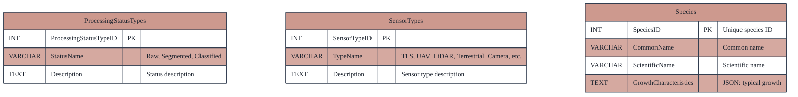
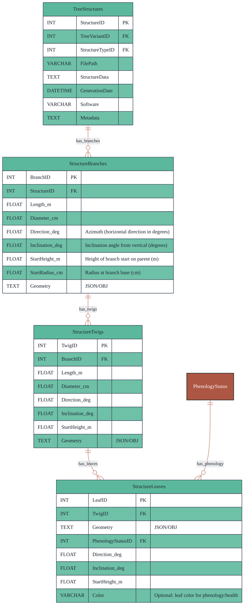

```mermaid
%%{
  init: {
    'theme': 'base',
    'themeVariables': {
      'background': '#FFFFFF',
      'fontFamily': 'verdana',
      'lineColor': '#ad5643',
      'primaryColor': '#cd998e',
      'primaryTextColor': '#1d242f',
      'primaryBorderColor': '#313d4f',
      'secondaryColor': '#d6aaa1',
      'secondaryTextColor': '#1d242f',
      'secondaryBorderColor': '#ad5643',
      'tertiaryColor': '#d5d8db',
      'tertiaryTextColor': '#1d242f',
      'tertiaryBorderColor': '#313d4f'
    }
  }
}%%
erDiagram
    Species {
        INT SpeciesID PK
        VARCHAR CommonName
        VARCHAR ScientificName
        TEXT GrowthCharacteristics
    }

    HealthStatus {
        INT HealthStatusID PK
        VARCHAR Status
        TEXT Description
    }

    PhenologyStatus {
        INT PhenologyStatusID PK
        VARCHAR Status
        TEXT Description
    }

    DataQualityTypes {
        INT QualityTypeID PK
        VARCHAR QualityType "Direct_Measurement, Point_Cloud_Derived, Model_Estimated"
        TEXT Description
    }

    LiveStatusTypes {
        INT LiveStatusTypeID PK
        VARCHAR StatusName "alive, dead, decaying, snag"
        TEXT Description "Live status description"
    }

    VariantTypes {
        INT VariantTypeID PK
        VARCHAR TypeName "Original, Growth_Simulation, Species_Replacement, Manual_Edit, New"
        TEXT Description "Variant type description"
    }

    StructureTypes {
        INT StructureTypeID PK
        VARCHAR TypeName "QSM, LSystem, DeepTree, Manual, Procedural"
        TEXT Description "Structure type description"
    }

    MicrohabitatTypes {
        INT MicrohabitatTypeID PK
        VARCHAR TypeName "cavity, dead_branch, epiphyte, bark_feature, root_buttress"
        TEXT Description "Microhabitat type description"
    }

    MicrohabitatSizes {
        INT SizeID PK
        VARCHAR SizeName "small, medium, large"
        TEXT Description "Size description"
    }

    MicrohabitatConditions {
        INT ConditionID PK
        VARCHAR ConditionName "active, inactive, developing"
        TEXT Description "Condition description"
    }

    StemQualityTypes {
        INT StemQualityTypeID PK
        VARCHAR QualityName "excellent, good, fair, poor"
        TEXT Description "Stem quality description"
    }

    StemDefectTypes {
        INT DefectTypeID PK
        VARCHAR DefectName "sweep, crook, fork, rot, damage"
        TEXT Description "Defect type description"
    }

    CrownMorphologyTypes {
        INT MorphologyTypeID PK
        VARCHAR MorphologyName "symmetrical, asymmetrical, suppressed, dominant"
        TEXT Description "Crown morphology description"
    }

    RootConditionTypes {
        INT RootConditionTypeID PK
        VARCHAR ConditionName "healthy, stressed, damaged, exposed"
        TEXT Description "Root condition description"
    }
```

# Database Design

> **Related Documentation**: [Architecture](./architecture.md) | [Data Contracts & APIs](./data_contracts_and_apis.md)

This document defines the database schema for the XR Future Forests Lab system. The database architecture consists of three specialized databases, each optimized for different types of forest-related data and their specific access patterns.

---

## 1. Point Cloud Database (Point Cloud DB)

Stores metadata and processing results from LiDAR point cloud data, including references to raw files, segmentation outputs, and classification results. This database serves as the primary repository for all spatial scan data and their derived products, enabling efficient storage and retrieval of massive 3D datasets while maintaining processing lineage and quality metrics.

### Reference Tables



### Core Schema



```mermaid
%%{
  init: {
    'theme': 'base',
    'themeVariables': {
      'background': '#FFFFFF',
      'fontFamily': 'verdana',
      'lineColor': '#ad5643',
      'primaryColor': '#5cb89c',
      'primaryTextColor': '#1d242f',
      'primaryBorderColor': '#313d4f',
      'secondaryColor': '#d6aaa1',
      'secondaryTextColor': '#1d242f',
      'secondaryBorderColor': '#ad5643',
      'tertiaryColor': '#d5d8db',
      'tertiaryTextColor': '#1d242f',
      'tertiaryBorderColor': '#313d4f'
    }
  }
}%%
erDiagram
    ProcessingStatusTypes

    SensorTypes

    Species

    Locations {
        INT LocationID PK "Unique site/plot ID"
        VARCHAR LocationName "Site name"
        GEOMETRY PlotBoundary "PostGIS polygon/multipolygon for plot boundaries"
        GEOMETRY CenterPoint "PostGIS point for plot center coordinates"
        TEXT Description "Description of the site"
    }

    PointClouds {
        INT PointCloudID PK "Unique scan ID"
        VARCHAR FilePath "Path/URI to raw point cloud file (.las, .laz)"
        DATETIME ScanDate "Date and time of scan"
        INT LocationID FK "References Locations.LocationID"
        INT SensorTypeID FK "References SensorTypes.SensorTypeID"
        INT ProcessingStatusTypeID FK "References ProcessingStatusTypes.ProcessingStatusTypeID"
        TEXT QualityMetrics "JSON: density, accuracy, coverage"
        DATETIME LastProcessedDate "Last processing date"
        BIGINT PointCount "Total number of points in scan"
        FLOAT FileSizeMB "File size in megabytes"
        GEOMETRY ScanBounds "PostGIS polygon defining scan coverage area"
        VARCHAR ScannerModel "Model of LiDAR scanner used"
        TEXT ScanParameters "JSON: scan settings, resolution, etc."
        VARCHAR CreatedBy "Operator or automated system"
        DATETIME CreatedAt "Record creation timestamp"
        DATETIME UpdatedAt "Last update timestamp"
    }

    ProcessingJobs {
        INT JobID PK "Unique processing job ID"
        VARCHAR JobType "segmentation, classification, attribute_extraction, simulation"
        INT InputID "ID of input data (PointCloudID, SegmentationResultID, etc.)"
        VARCHAR Status "queued, processing, completed, failed, cancelled"
        DATETIME SubmittedAt "Job submission timestamp"
        DATETIME StartedAt "Processing start time"
        DATETIME CompletedAt "Processing completion time"
        VARCHAR Priority "low, normal, high"
        INT QueuePosition "Position in processing queue"
        FLOAT ProgressPercent "Processing progress (0-100)"
        TEXT Configuration "JSON: algorithm parameters and settings"
        TEXT Results "JSON: processing results and output references"
        TEXT ErrorDetails "Error information if job failed"
        VARCHAR SubmittedBy "User or system that submitted job"
        INT EstimatedDurationMinutes "Estimated processing time"
        INT ActualDurationMinutes "Actual processing time"
        DATETIME CreatedAt "Record creation timestamp"
        DATETIME UpdatedAt "Last update timestamp"
    }

    PointCloudSegmentationResults {
        INT SegmentationResultID PK "Unique segmentation run ID"
        INT PointCloudID FK "References PointClouds.PointCloudID"
        DATETIME ProcessDate "Segmentation date"
        VARCHAR SegmentationAlgorithm "Algorithm used (e.g., TreeLearn, 3D Forest)"
        TEXT SegmentDataRef "JSON: references to tree segments"
        TEXT Metrics "JSON: segmentation quality"
    }

    TreeClassificationResults {
        INT ClassificationResultID PK "Unique classification run ID"
        INT SegmentationResultID FK "References PointCloudSegmentationResults.SegmentationResultID"
        DATETIME ProcessDate "Classification date"
        VARCHAR ClassificationAlgorithm "Algorithm used (e.g., ML model)"
        VARCHAR ModelVersion "Version of classification model used"
        FLOAT ConfidenceThreshold "Minimum confidence threshold applied"
        TEXT ClassifiedTreesData "JSON: tree IDs, species IDs, probabilities, confidence scores"
        TEXT FeatureImportance "JSON: importance of different morphological features"
        FLOAT OverallAccuracy "Overall classification accuracy score"
        INT UncertainClassifications "Number of trees with low confidence"
        TEXT Metrics "JSON: classification accuracy, model performance"
        DATETIME CreatedAt "Record creation timestamp"
        DATETIME UpdatedAt "Last update timestamp"
    }

    Locations ||--o{ PointClouds : has_scans
    SensorTypes ||--o{ PointClouds : sensor_type
    ProcessingStatusTypes ||--o{ PointClouds : processing_status
    PointClouds ||--o{ ProcessingJobs : triggers_jobs
    PointClouds ||--o{ PointCloudSegmentationResults : has_segmentations
    ProcessingJobs ||--o{ PointCloudSegmentationResults : produces_results
    PointCloudSegmentationResults ||--o{ ProcessingJobs : triggers_classification_jobs
    PointCloudSegmentationResults ||--o{ TreeClassificationResults : has_classifications
    ProcessingJobs ||--o{ TreeClassificationResults : produces_classification_results
    Species ||--o{ TreeClassificationResults : classifies_species

    %% Color reference/lookup tables differently
    classDef refTable fill:#ad5643,stroke:#333,stroke-width:2px,color:#fff
    class ProcessingStatusTypes,SensorTypes,Species refTable
```

### Point Cloud Database Table Descriptions

#### Point Cloud Reference Tables

**Locations**  
Master table storing geographic site information for all forest plots and monitoring locations across the system with PostGIS geometry support.

**ProcessingStatusTypes**  
Standardized processing status classifications for LiDAR scan processing workflow.

**SensorTypes**  
LiDAR and scanning equipment type classifications.

**Species**  
Tree species definitions with growth characteristics for classification algorithms.

#### Point Cloud Core Tables

**ProcessingJobs**  
Central job tracking table managing the lifecycle of all asynchronous processing tasks including point cloud segmentation, species classification, attribute extraction, and growth simulations. Provides complete job lifecycle management with queuing, progress tracking, error handling, and dependency management.

**PointClouds**  
Core table containing metadata for each LiDAR scan, including file references, sensor information, and processing status tracking.

**PointCloudSegmentationResults**  
Stores results from tree segmentation algorithms, maintaining references to the algorithms used and quality metrics for each segmentation run.

**TreeClassificationResults**  
Contains species classification outputs with confidence scores and accuracy metrics for each classified tree segment.

**Species**  
Reference table defining tree species information and their growth characteristics for classification and modeling purposes.

### Table Relationships

- **Locations** serve as the spatial foundation, with each location hosting multiple point cloud scans
- **PointClouds** represent individual scanning sessions, each producing segmentation results
- **PointCloudSegmentationResults** feed into classification processes, maintaining the processing pipeline lineage
- **TreeClassificationResults** link to **Species** for taxonomic validation and growth modeling
- The design ensures full traceability from raw scans through segmentation to final species classification

---

## 2. Tree Database (Tree DB)

Central repository for all tree-related data, supporting scenario-based modeling, variant management, growth simulation, and detailed structural representation. This database enables both data-driven (QSM) and generative (L-system, DeepTree, etc.) models in a unified structure, supports fine-grained modeling of branches, twigs, and leaves, and maintains complete history and lineage of all tree variants across different scenarios and time periods.

### Reference Tables



### Core Schema



```mermaid
%%{
  init: {
    'theme': 'base',
    'themeVariables': {
      'background': '#FFFFFF',
      'fontFamily': 'verdana',
      'lineColor': '#ad5643',
      'primaryColor': '#5cb89c',
      'primaryTextColor': '#1d242f',
      'primaryBorderColor': '#313d4f',
      'secondaryColor': '#d6aaa1',
      'secondaryTextColor': '#1d242f',
      'secondaryBorderColor': '#ad5643',
      'tertiaryColor': '#d5d8db',
      'tertiaryTextColor': '#1d242f',
      'tertiaryBorderColor': '#313d4f'
    }
  }
}%%
erDiagram
    Species
    HealthStatus
    DataQualityTypes
    LiveStatusTypes
    VariantTypes
    StructureTypes
    MicrohabitatTypes
    MicrohabitatSizes
    MicrohabitatConditions
    StemQualityTypes
    StemDefectTypes
    CrownMorphologyTypes
    RootConditionTypes

    Locations {
        INT LocationID PK
        VARCHAR LocationName
        GEOMETRY PlotBoundary "PostGIS polygon for plot boundaries"
        GEOMETRY CenterPoint "PostGIS point for plot center"
    }

    Scenarios {
        INT ScenarioID PK
        VARCHAR ScenarioName
        INT CreatedByUserID
        DATETIME CreatedAt
        TEXT ScenarioParameters
    }

    Trees {
        INT TreeID PK
        INT LocationID FK
        INT SpeciesID FK
        DATETIME InitialCaptureDate
        FLOAT InitialHeight_m
        FLOAT InitialDBH_cm
        FLOAT InitialCrownWidth_m
        FLOAT InitialVolume_m3
        INT HealthStatusID FK
        INT PointCloudID FK
    }

    TreeVariants {
        INT TreeVariantID PK
        INT TreeID FK "Nullable: NULL if new tree in scenario"
        INT ScenarioID FK
        INT ParentVariantID FK "Nullable: NULL if original or first variant"
        INT SpeciesID FK
        DATETIME VariantTimestamp
        FLOAT Height_m
        FLOAT DBH_cm
        FLOAT CrownWidth_m
        FLOAT CrownBaseHeight_m "Height to lowest live branch"
        FLOAT CrownVolume_m3 "3D crown volume"
        FLOAT CrownDensity_percent "Foliage density within crown"
        FLOAT Volume_m3
        INT LiveStatusTypeID FK "References LiveStatusTypes"
        FLOAT EstimatedAge_years "Tree age estimation"
        INT HealthStatusID FK
        GEOMETRY Position "PostGIS point geometry (plot coordinates)"
        GEOMETRY AbsolutePosition "PostGIS point geometry (GPS coordinates)"
        FLOAT LocalDensity_trees_per_ha "Tree density in immediate vicinity"
        FLOAT NearestNeighborDistance_m "Distance to nearest tree"
        INT VariantTypeID FK "References VariantTypes"
        FLOAT TimeDelta_yrs "Time passed since parent state (years) - for growth simulations"
        VARCHAR ModelType "For growth simulations: model used"
        TEXT ModelParameters "JSON: model-specific parameters used"
        FLOAT MortalityRisk_prob "For growth simulations: predicted mortality risk"
        TEXT PredictedStructureData "For growth simulations: predicted structure data"
        INT EnvironmentalSnapshotID FK "For growth simulations: environmental context"
        VARCHAR CreatedBy "User or system that created this variant"
        DATETIME CreatedAt "Variant creation timestamp"
        DATETIME UpdatedAt "Last update timestamp"
        TEXT Notes
    }

    TreeStructures {
        INT StructureID PK
        INT TreeVariantID FK
        INT StructureTypeID FK "References StructureTypes"
        VARCHAR FilePath "Path to model file (if any)"
        TEXT StructureData "JSON or string (e.g. L-system, latent vector, QSM params)"
        DATETIME GenerationDate
        VARCHAR Software "Tool or method used"
        TEXT Metadata "Additional parameters"
    }

    TreeMicrohabitats {
        INT MicrohabitatID PK
        INT TreeVariantID FK
        INT MicrohabitatTypeID FK "References MicrohabitatTypes"
        FLOAT Height_m "Height of microhabitat feature"
        INT SizeID FK "References MicrohabitatSizes"
        INT ConditionID FK "References MicrohabitatConditions"
        TEXT Description "Detailed description of microhabitat"
        DATETIME FirstObserved "When microhabitat was first noted"
    }

    TreeQualityAssessment {
        INT QualityAssessmentID PK
        INT TreeVariantID FK
        INT HeightQualityID FK "References DataQualityTypes"
        INT DBHQualityID FK "References DataQualityTypes"
        INT CrownWidthQualityID FK "References DataQualityTypes"
        INT VolumeQualityID FK "References DataQualityTypes"
        FLOAT StemStraightness_index "0-1: trunk straightness quality"
        INT StemQualityTypeID FK "References StemQualityTypes"
        FLOAT KnotFrequency_per_m "Number of knots per meter"
        INT StemDefectTypeID FK "References StemDefectTypes"
        INT CrownMorphologyTypeID FK "References CrownMorphologyTypes"
        FLOAT CrownHeightRatio "Crown height / total height"
        INT RootConditionTypeID FK "References RootConditionTypes"
        FLOAT TimberValue_index "0-1: estimated timber quality"
        TEXT QualityNotes "Additional quality observations"
        DATETIME AssessmentDate "When quality assessment was performed"
        VARCHAR AssessedBy "Personnel or method that performed assessment"
    }

    Locations ||--o{ Trees : has_trees
    Species ||--o{ Trees : is_species
    HealthStatus ||--o{ Trees : has_health
    Trees ||--o{ TreeVariants : has_variants
    Scenarios ||--o{ TreeVariants : scenario_variants
    LiveStatusTypes ||--o{ TreeVariants : live_status
    VariantTypes ||--o{ TreeVariants : variant_type
    TreeVariants ||--o{ TreeStructures : has_structures
    StructureTypes ||--o{ TreeStructures : structure_type
    TreeVariants ||--o{ TreeVariants : parent_variant
    TreeVariants ||--o{ TreeMicrohabitats : has_microhabitats
    TreeVariants }o--|| EnvironmentalSnapshots : environmental_context
    MicrohabitatTypes ||--o{ TreeMicrohabitats : microhabitat_type
    MicrohabitatSizes ||--o{ TreeMicrohabitats : microhabitat_size
    MicrohabitatConditions ||--o{ TreeMicrohabitats : microhabitat_condition
    TreeVariants ||--o{ TreeQualityAssessment : has_quality_assessment
    DataQualityTypes ||--o{ TreeQualityAssessment : height_quality
    DataQualityTypes ||--o{ TreeQualityAssessment : dbh_quality
    DataQualityTypes ||--o{ TreeQualityAssessment : crown_width_quality
    DataQualityTypes ||--o{ TreeQualityAssessment : volume_quality
    StemQualityTypes ||--o{ TreeQualityAssessment : stem_quality
    StemDefectTypes ||--o{ TreeQualityAssessment : stem_defect
    CrownMorphologyTypes ||--o{ TreeQualityAssessment : crown_morphology
    RootConditionTypes ||--o{ TreeQualityAssessment : root_condition

    %% Color reference/lookup tables differently
    classDef refTable fill:#ad5643,stroke:#333,stroke-width:2px,color:#fff
    class Species,HealthStatus,DataQualityTypes,LiveStatusTypes,VariantTypes,StructureTypes,MicrohabitatTypes,MicrohabitatSizes,MicrohabitatConditions,StemQualityTypes,StemDefectTypes,CrownMorphologyTypes,RootConditionTypes refTable
```

### Detailed Structure Schema



### Tree Database Table Descriptions

#### Tree Reference Tables

- **Locations**: Shared spatial reference for all tree locations with PostGIS geometry support
- **Species**: Tree species definitions with growth characteristics for modeling
- **HealthStatus**: Standardized health condition classifications
- **PhenologyStatus**: Seasonal and developmental stage classifications
- **DataQualityTypes**: Measurement quality indicators (Direct_Measurement, Point_Cloud_Derived, Model_Estimated)
- **LiveStatusTypes**: Tree condition classifications (alive, dead, decaying, snag)
- **VariantTypes**: Tree variant classifications for modeling scenarios
- **StructureTypes**: 3D structure representation type classifications
- **MicrohabitatTypes**: Biodiversity feature type classifications
- **MicrohabitatSizes**: Standardized size classifications for microhabitat features
- **MicrohabitatConditions**: Condition state classifications for microhabitats
- **StemQualityTypes**: Timber quality grade classifications
- **StemDefectTypes**: Stem defect type classifications
- **CrownMorphologyTypes**: Crown shape and development classifications
- **RootConditionTypes**: Root system health classifications

#### Tree Core Tables

- **Scenarios**: User-defined scenario definitions for modeling and analysis
- **Trees**: Immutable base records of observed trees from scans or field inventory
- **TreeVariants**: All tree versions including original observations, growth simulations, species replacements, and manual edits; supports scenario-based modeling with parent-child relationships. Enhanced with comprehensive structural metrics, spatial positioning using PostGIS geometry, and density measurements

#### Tree Structural Detail Tables

- **TreeStructures**: Unified storage for all structural representations (QSM, L-system, DeepTree, etc.)
- **StructureBranches**: Detailed branch geometry, dimensions, and spatial positioning
- **StructureTwigs**: Fine-scale twig data with morphological attributes
- **StructureLeaves**: Individual leaf data including phenology status and spatial positioning

#### Tree Additional Assessment Tables

- **TreeMicrohabitats**: Biodiversity-relevant features including cavities, dead branches, epiphytes, and other habitat structures
- **TreeQualityAssessment**: Comprehensive quality metrics including measurement quality indicators, timber value, stem condition, crown morphology, and root system health

### Tree Database Table Relationships

- **Trees** maintain immutable baseline records while **TreeVariants** enable temporal and scenario-based variations with integrated PostGIS spatial data
- **Scenarios** group related variants and enable comparative analysis across different modeling conditions
- **TreeStructures** provide multiple structural representations per variant, supporting both data-driven and generative modeling approaches
- **Parent-child relationships** in TreeVariants enable growth sequence tracking and variant lineage
- **TreeQualityAssessment** centralizes all measurement quality indicators and assessment metrics, ensuring scientific traceability from measurement source through modeling to visualization
- **Hierarchical structure detail** (branches → twigs → leaves) enables fine-grained 3D modeling and realistic visualization
- **TreeMicrohabitats** captures biodiversity-relevant features essential for ecological assessment and habitat value
- **Spatial integration** through PostGIS geometry types enables efficient spatial queries and analysis directly within the database

---

## 3. Environment Database (Environment DB)

Stores sensor readings, aggregated environmental snapshots, and metadata for all environmental data streams and sources. This database supports real-time environmental monitoring, historical data analysis, and provides essential environmental context for growth models, simulation scenarios, and real-time visualization systems.

### Environment Reference Tables Schema

```mermaid
%%{
  init: {
    'theme': 'base',
    'themeVariables': {
      'background': '#FFFFFF',
      'fontFamily': 'verdana',
      'lineColor': '#ad5643',
      'primaryColor': '#cd998e',
      'primaryTextColor': '#1d242f',
      'primaryBorderColor': '#313d4f',
      'secondaryColor': '#d6aaa1',
      'secondaryTextColor': '#1d242f',
      'secondaryBorderColor': '#ad5643',
      'tertiaryColor': '#d5d8db',
      'tertiaryTextColor': '#1d242f',
      'tertiaryBorderColor': '#313d4f'
    }
  }
}%%
erDiagram
    SensorTypes {
        INT SensorTypeID PK
        VARCHAR TypeName "Temperature, Humidity, CO2, Light, Soil_Moisture, Wind"
        TEXT Description "Sensor type description"
    }

    SensorStatusTypes {
        INT StatusTypeID PK
        VARCHAR StatusName "active, inactive, maintenance, error"
        TEXT Description "Status description"
    }

    AspectTypes {
        INT AspectTypeID PK
        VARCHAR AspectName "N, NE, E, SE, S, SW, W, NW"
        TEXT Description "Aspect direction description"
    }

    SpatialDatasetTypes {
        INT DatasetTypeID PK
        VARCHAR TypeName "elevation, soil, vegetation, climate, canopy"
        TEXT Description "Dataset type description"
    }

    SpatialTypes {
        INT SpatialTypeID PK
        VARCHAR TypeName "raster, vector, point_cloud"
        TEXT Description "Spatial data type description"
    }

    DataFormatTypes {
        INT FormatTypeID PK
        VARCHAR FormatName "GeoTIFF, Shapefile, LAS, NetCDF"
        TEXT Description "Data format description"
    }

    DataSourceTypes {
        INT SourceTypeID PK
        VARCHAR SourceName "survey, satellite, lidar, model"
        TEXT Description "Data source description"
    }

    QualityLevelTypes {
        INT QualityLevelID PK
        VARCHAR LevelName "high, medium, low"
        TEXT Description "Quality level description"
    }

    ExtractionMethodTypes {
        INT MethodTypeID PK
        VARCHAR MethodName "point_sample, area_average, interpolation"
        TEXT Description "Extraction method description"
    }

    TraitTypes {
        INT TraitTypeID PK
        VARCHAR TraitName "elevation, slope, soil_type, canopy_cover, drainage, fertility"
        TEXT Description "Site trait description"
    }

    SoilTypes {
        INT SoilTypeID PK
        VARCHAR SoilName "Sandy, Clay, Loam, Peat, Rocky"
        TEXT Description "Soil classification description"
    }

    ClimateZoneTypes {
        INT ClimateZoneTypeID PK
        VARCHAR ZoneName "Köppen climate classification codes"
        TEXT Description "Climate zone description"
    }

    VegetationTypes {
        INT VegetationTypeID PK
        VARCHAR TypeName "Deciduous, Coniferous, Mixed, Grassland, Shrubland"
        TEXT Description "Vegetation type description"
    }
```



### Environment Core Schema

```mermaid
%%{
  init: {
    'theme': 'base',
    'themeVariables': {
      'background': '#FFFFFF',
      'fontFamily': 'verdana',
      'lineColor': '#ad5643',
      'primaryColor': '#5cb89c',
      'primaryTextColor': '#1d242f',
      'primaryBorderColor': '#313d4f',
      'secondaryColor': '#d6aaa1',
      'secondaryTextColor': '#1d242f',
      'secondaryBorderColor': '#ad5643',
      'tertiaryColor': '#d5d8db',
      'tertiaryTextColor': '#1d242f',
      'tertiaryBorderColor': '#313d4f'
    }
  }
}%%
erDiagram
    SensorTypes
    SensorStatusTypes
    AspectTypes
    SpatialDatasetTypes
    SpatialTypes
    DataFormatTypes
    DataSourceTypes
    QualityLevelTypes
    ExtractionMethodTypes
    TraitTypes
    SoilTypes
    ClimateZoneTypes
    VegetationTypes

    Locations {
        INT LocationID PK
        VARCHAR LocationName
        GEOMETRY PlotBoundary "PostGIS polygon for plot boundaries"
        GEOMETRY CenterPoint "PostGIS point for plot center"
    }

    Sensors {
        INT SensorID PK "Unique sensor ID"
        INT LocationID FK "References Locations"
        INT SensorTypeID FK "References SensorTypes"
        DATETIME InstallationDate "Installation date"
        INT StatusTypeID FK "References SensorStatusTypes"
        TEXT SensorConfig "JSON: config/calibration"
    }

    SensorReadings {
        INT ReadingID PK "Unique reading ID"
        INT SensorID FK "References Sensors"
        DATETIME Timestamp "Measurement time"
        VARCHAR ReadingType "Type (e.g. Temperature)"
        FLOAT Value "Value"
        VARCHAR Unit "Unit"
        FLOAT QualityScore "Reading quality score (0-1)"
        TEXT ValidationFlags "JSON: validation status, outlier detection"
        DATETIME CreatedAt "Record creation timestamp"
    }

    EnvironmentalSnapshots {
        INT SnapshotID PK "Unique snapshot ID"
        INT LocationID FK "References Locations"
        DATETIME Timestamp "Snapshot time"
        FLOAT AvgTemperature_C "Avg. temperature"
        FLOAT AvgHumidity_percent "Avg. humidity"
        FLOAT TotalPrecipitation_mm "Total precipitation"
        FLOAT AvgGlobalRadiation "Avg. radiation"
        FLOAT AvgCO2_ppm "Avg. CO2"
        FLOAT AvgWindSpeed_ms "Avg. wind speed"
        FLOAT DominantWindDirection_deg "Wind direction"
        TEXT ObstacleVoxelGridRef "Path to voxel grid"
        TEXT OtherEnvironmentalFactors "JSON: soil, groundwater, pollutants"
    }

    SiteCharacteristics {
        INT SiteCharacteristicID PK "Unique site characteristic ID"
        INT LocationID FK "References Locations"
        FLOAT Elevation_m "Elevation in meters"
        FLOAT Slope_deg "Slope in degrees"
        INT AspectTypeID FK "References AspectTypes"
        INT SoilTypeID FK "References SoilTypes"
        INT ClimateZoneTypeID FK "References ClimateZoneTypes"
        FLOAT AnnualPrecipitation_mm "Annual precipitation"
        FLOAT MeanTemperature_c "Mean annual temperature"
        INT VegetationTypeID FK "References VegetationTypes"
        FLOAT CanopyCover_percent "Canopy cover percentage"
        TEXT AdditionalMetadata "JSON: additional site data"
        DATETIME LastUpdated "Last update timestamp"
    }

    SpatialDatasets {
        INT SpatialDatasetID PK "Unique spatial dataset ID"
        INT LocationID FK "References Locations"
        VARCHAR DatasetName "Human-readable name"
        INT DatasetTypeID FK "References SpatialDatasetTypes"
        INT SpatialTypeID FK "References SpatialTypes"
        INT DataFormatTypeID FK "References DataFormatTypes"
        TEXT FilePath "Path to spatial data file"
        FLOAT Resolution_m "Spatial resolution in meters"
        VARCHAR CoordinateSystem "EPSG code"
        GEOMETRY BoundingGeometry "Spatial extent (PostGIS)"
        TEXT Metadata "JSON: dataset metadata"
        DATETIME AcquisitionDate "When data was acquired"
        DATETIME ImportDate "When data was imported"
        INT DataSourceTypeID FK "References DataSourceTypes"
        INT QualityLevelID FK "References QualityLevelTypes"
    }

    SpatialTraitMappings {
        INT MappingID PK "Unique mapping ID"
        INT SpatialDatasetID FK "References SpatialDatasets"
        INT TraitTypeID FK "References TraitTypes"
        INT ExtractionMethodTypeID FK "References ExtractionMethodTypes"
        TEXT ExtractionParameters "JSON: method-specific parameters"
        VARCHAR Units "Units for extracted values"
        DATETIME CreatedDate "When mapping was created"
        BOOLEAN IsActive "Whether mapping is currently active"
    }

    Locations ||--o{ Sensors : has_sensors
    SensorTypes ||--o{ Sensors : sensor_type
    SensorStatusTypes ||--o{ Sensors : sensor_status
    Sensors ||--o{ SensorReadings : has_readings
    Locations ||--o{ EnvironmentalSnapshots : has_snapshots
    Locations ||--|| SiteCharacteristics : has_characteristics
    AspectTypes ||--o{ SiteCharacteristics : aspect_type
    SoilTypes ||--o{ SiteCharacteristics : soil_type
    ClimateZoneTypes ||--o{ SiteCharacteristics : climate_zone
    VegetationTypes ||--o{ SiteCharacteristics : vegetation_type
    Locations ||--o{ SpatialDatasets : has_spatial_data
    SpatialDatasetTypes ||--o{ SpatialDatasets : dataset_type
    SpatialTypes ||--o{ SpatialDatasets : spatial_type
    DataFormatTypes ||--o{ SpatialDatasets : format_type
    DataSourceTypes ||--o{ SpatialDatasets : source_type
    QualityLevelTypes ||--o{ SpatialDatasets : quality_level
    SpatialDatasets ||--o{ SpatialTraitMappings : has_trait_mappings
    TraitTypes ||--o{ SpatialTraitMappings : trait_type
    ExtractionMethodTypes ||--o{ SpatialTraitMappings : extraction_method
    EnvironmentalSnapshots }o--|| SensorReadings : aggregates

    %% Color reference/lookup tables differently
    classDef refTable fill:#ad5643,stroke:#333,stroke-width:2px,color:#fff
    class SensorTypes,SensorStatusTypes,AspectTypes,SpatialDatasetTypes,SpatialTypes,DataFormatTypes,DataSourceTypes,QualityLevelTypes,ExtractionMethodTypes,TraitTypes,SoilTypes,ClimateZoneTypes,VegetationTypes refTable
```



### Environment Database Table Descriptions

#### Environment Reference Tables

**Locations**  
Shared spatial reference table linking environmental data to specific forest plots and monitoring sites with PostGIS geometry support.

**SensorTypes**  
Standardized sensor type classifications for environmental monitoring equipment.

**SensorStatusTypes**  
Equipment status categories for tracking sensor operational state.

**AspectTypes**  
Standardized compass direction classifications for topographical orientation.

**SpatialDatasetTypes**  
Categories for different types of spatial datasets (elevation, soil, vegetation, climate, canopy).

**SpatialTypes**  
Spatial data format classifications (raster, vector, point_cloud).

**DataFormatTypes**  
File format classifications for spatial data storage.

**DataSourceTypes**  
Source classification for spatial data acquisition methods.

**QualityLevelTypes**  
Standardized quality assessment levels for spatial datasets.

**ExtractionMethodTypes**  
Spatial data extraction method classifications.

**TraitTypes**  
Site characteristic trait classifications for spatial data mapping.

**SoilTypes**  
Standardized soil classification categories.

**ClimateZoneTypes**  
Köppen climate classification system categories.

**VegetationTypes**  
Forest and vegetation type classifications.

#### Environment Core Tables

**Sensors**  
Inventory of all environmental monitoring equipment with configuration, status, and installation metadata.

**SensorReadings**  
Time-series data from individual sensors capturing real-time environmental measurements with full temporal resolution.

**EnvironmentalSnapshots**  
Aggregated environmental summaries providing consolidated environmental state for specific locations and time periods, essential for modeling and scenario analysis.

**SiteCharacteristics**  
Static or slowly-changing site characteristics including topography, climate, soil, and vegetation type using standardized lookup classifications.

**SpatialDatasets**  
Metadata for spatial datasets with comprehensive classification and quality tracking.

**SpatialTraitMappings**  
Flexible mapping between spatial datasets and site characteristics with configurable extraction methods.

### Environment Database Table Relationships

- **Locations** serve as the spatial foundation linking environmental data to specific forest sites
- **Sensors** are deployed at locations and generate continuous streams of **SensorReadings**
- **SensorReadings** provide high-resolution temporal data that feeds into aggregated **EnvironmentalSnapshots**
- **SiteCharacteristics** provide static environmental context for each location, supporting modeling and site-specific analysis
- **EnvironmentalSnapshots** provide model-ready environmental context by aggregating multiple sensor readings and external data sources
- The design supports both real-time monitoring and historical analysis while maintaining data lineage from individual sensors to aggregated environmental context

---

## 4. Database Constraints and Indexes

### Critical Constraints

#### Point Cloud Database Constraints

```sql
-- Ensure processing status transitions are logical
ALTER TABLE PointClouds ADD CONSTRAINT chk_processing_status 
CHECK (ProcessingStatusTypeID IN (1,2,3)); -- Raw, Segmented, Classified

-- Ensure scan dates are reasonable
ALTER TABLE PointClouds ADD CONSTRAINT chk_scan_date 
CHECK (ScanDate >= '2020-01-01' AND ScanDate <= CURRENT_DATE);

-- Ensure positive point counts
ALTER TABLE PointClouds ADD CONSTRAINT chk_point_count 
CHECK (PointCount > 0);
```

#### Tree Database Constraints

```sql
-- Ensure positive tree measurements
ALTER TABLE TreeVariants ADD CONSTRAINT chk_positive_measurements 
CHECK (Height_m > 0 AND DBH_cm > 0 AND Volume_m3 >= 0);

-- Ensure crown dimensions are logical
ALTER TABLE TreeVariants ADD CONSTRAINT chk_crown_logic 
CHECK (CrownBaseHeight_m >= 0 AND CrownBaseHeight_m <= Height_m);

-- Prevent self-referencing parent variants
ALTER TABLE TreeVariants ADD CONSTRAINT chk_no_self_parent 
CHECK (TreeVariantID != ParentVariantID);

-- Ensure reasonable probability values
ALTER TABLE TreeVariants ADD CONSTRAINT chk_mortality_risk 
CHECK (MortalityRisk_prob >= 0 AND MortalityRisk_prob <= 1);
```

#### Environment Database Constraints

```sql
-- Ensure reasonable environmental values
ALTER TABLE EnvironmentalSnapshots ADD CONSTRAINT chk_temperature_range 
CHECK (AvgTemperature_C >= -50 AND AvgTemperature_C <= 60);

ALTER TABLE EnvironmentalSnapshots ADD CONSTRAINT chk_humidity_range 
CHECK (AvgHumidity_percent >= 0 AND AvgHumidity_percent <= 100);

ALTER TABLE EnvironmentalSnapshots ADD CONSTRAINT chk_precipitation_positive 
CHECK (TotalPrecipitation_mm >= 0);
```

### Performance Indexes

#### Point Cloud Database Indexes

```sql
-- Spatial indexes for point cloud coverage
CREATE INDEX idx_pointclouds_scan_bounds ON PointClouds USING GIST (ScanBounds);
CREATE INDEX idx_locations_plot_boundary ON Locations USING GIST (PlotBoundary);

-- Temporal indexes for time-based queries
CREATE INDEX idx_pointclouds_scan_date ON PointClouds (ScanDate);
CREATE INDEX idx_segmentation_process_date ON PointCloudSegmentationResults (ProcessDate);

-- Foreign key indexes
CREATE INDEX idx_pointclouds_location ON PointClouds (LocationID);
CREATE INDEX idx_pointclouds_sensor_type ON PointClouds (SensorTypeID);
```

#### Tree Database Indexes

```sql
-- Spatial indexes for tree positions
CREATE INDEX idx_tree_variants_position ON TreeVariants USING GIST (Position);
CREATE INDEX idx_tree_variants_absolute_position ON TreeVariants USING GIST (AbsolutePosition);

-- Scenario and variant relationship indexes
CREATE INDEX idx_tree_variants_scenario ON TreeVariants (ScenarioID);
CREATE INDEX idx_tree_variants_parent ON TreeVariants (ParentVariantID);
CREATE INDEX idx_tree_variants_tree_id ON TreeVariants (TreeID);

-- Species and temporal indexes
CREATE INDEX idx_tree_variants_species ON TreeVariants (SpeciesID);
CREATE INDEX idx_tree_variants_timestamp ON TreeVariants (VariantTimestamp);

-- Composite indexes for common queries
CREATE INDEX idx_trees_location_species ON Trees (LocationID, SpeciesID);
CREATE INDEX idx_tree_variants_scenario_species ON TreeVariants (ScenarioID, SpeciesID);
```

#### Environment Database Indexes

```sql
-- Temporal indexes for sensor data
CREATE INDEX idx_sensor_readings_timestamp ON SensorReadings (Timestamp);
CREATE INDEX idx_sensor_readings_sensor_timestamp ON SensorReadings (SensorID, Timestamp);
CREATE INDEX idx_environmental_snapshots_timestamp ON EnvironmentalSnapshots (Timestamp);

-- Spatial indexes
CREATE INDEX idx_spatial_datasets_bounding ON SpatialDatasets USING GIST (BoundingGeometry);

-- Composite indexes for common environmental queries
CREATE INDEX idx_sensors_location_type ON Sensors (LocationID, SensorTypeID);
CREATE INDEX idx_sensor_readings_type_timestamp ON SensorReadings (ReadingType, Timestamp);
```

### Unique Constraints

```sql
-- Prevent duplicate sensors of same type at same location
ALTER TABLE Sensors ADD CONSTRAINT uk_sensors_location_type 
UNIQUE (LocationID, SensorTypeID, InstallationDate);

-- Ensure unique tree positions within location
ALTER TABLE TreeVariants ADD CONSTRAINT uk_tree_position_scenario 
UNIQUE (ScenarioID, Position, VariantTimestamp);

-- Prevent duplicate spatial datasets
ALTER TABLE SpatialDatasets ADD CONSTRAINT uk_spatial_dataset_location_type 
UNIQUE (LocationID, DatasetTypeID, AcquisitionDate);
```
