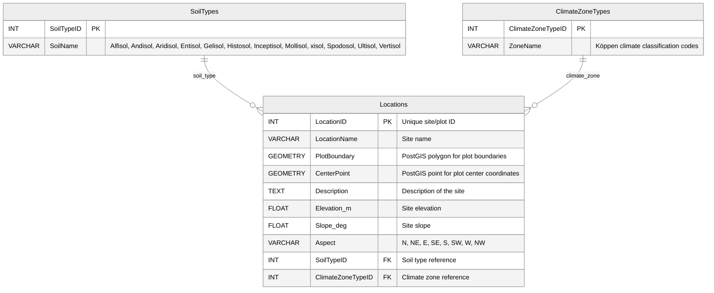
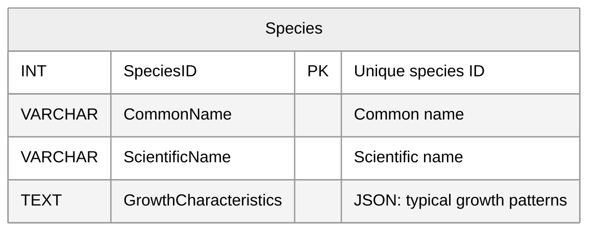
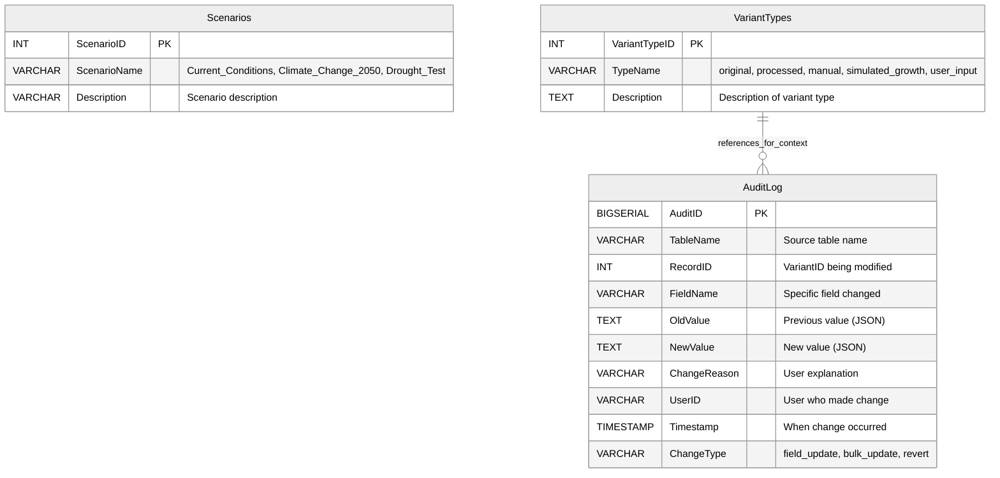
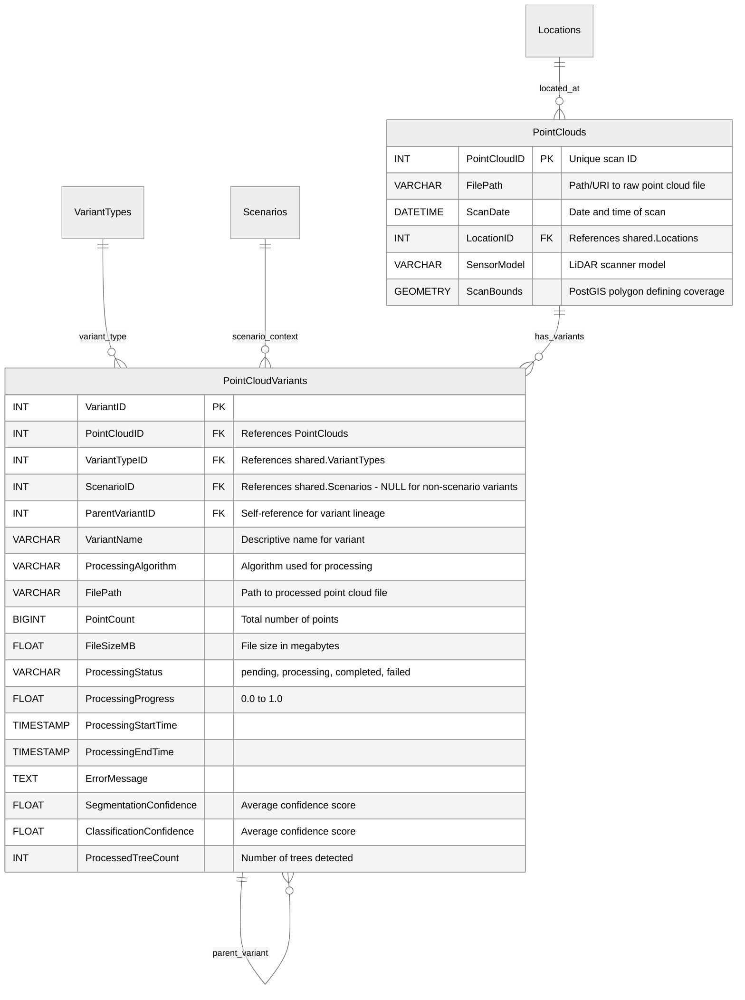
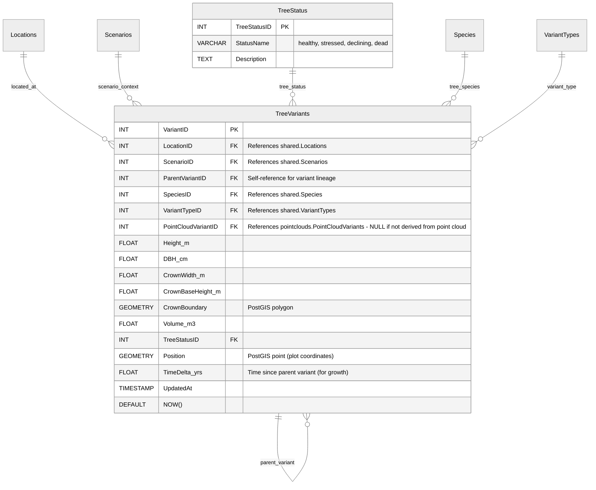
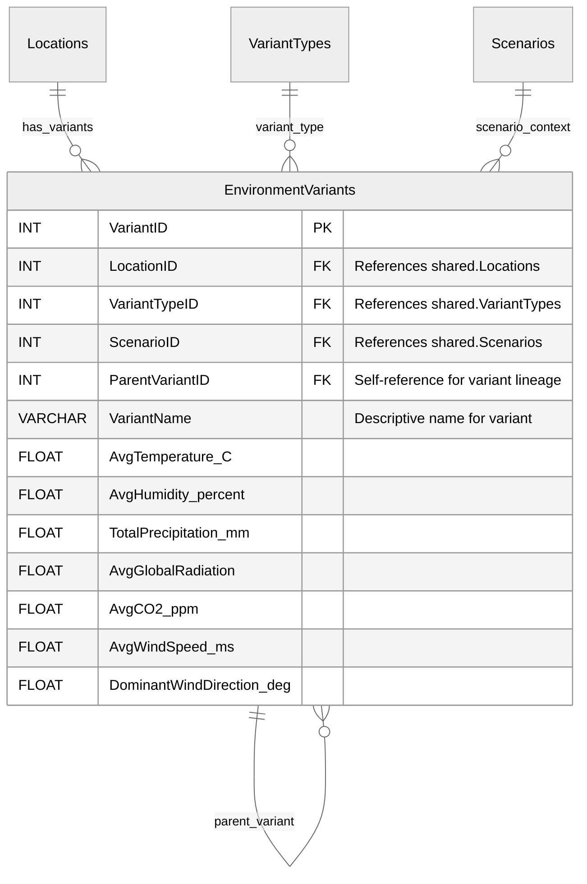

# Database Design - XR Future Forests Lab

## Unified Database Design with Schema Organization

This design uses PostgreSQL schemas (`shared`, `pointclouds`, `trees`, `monitoring`, `environments`) to organize a unified forest monitoring database. The design supports efficient time-series sensor data storage with file references managed as simple file paths within the variant and base tables.

## Schema Overview

```mermaid
graph LR
    subgraph shared ["Shared Schema"]
        SL[Locations]
        SS[Species]
        SC[Scenarios]
        SVT[VariantTypes]
        SAL[AuditLog]
    end
    
    subgraph pointclouds ["Point Clouds Schema"]
        PC[PointClouds]
        PCV[PointCloudVariants]
    end
    
    subgraph trees ["Trees Schema"]
        TV[TreeVariants]
    end
    
    subgraph monitoring ["Monitoring Schema"]
        S[Sensors]
        SR[SensorReadings]
    end
    
    subgraph environments ["Environments Schema"]
        EV[EnvironmentVariants]
    end
    
    %% Cross-schema relationships
    SL --> PC
    SL --> TV
    SL --> S
    SL --> EV
    SS --> TV
    SC --> PCV
    SC --> TV
    SC --> SR
    SC --> EV
    SVT --> PCV
    SVT --> TV
    SVT --> EV
    SVT --> SAL
    
    %% Within-schema relationships
    PC --> PCV
    S --> SR

    classDef sharedNodes fill:#F4EFA9,stroke:#c7bb1a,stroke-width:2px,color:#242424
    classDef pointcloudsNodes fill:#e8e8e8,stroke:#4f4f4f,stroke-width:2px,color:#242424
    classDef treesNodes fill:#5CB89C,stroke:#19392f,stroke-width:2px,color:#19392f
    classDef monitoringNodes fill:#AD5643,stroke:#673428,stroke-width:2px,color:#e8e8e8
    classDef environmentsNodes fill:#566b8a,stroke:#181d26,stroke-width:2px,color:#e8e8e8
    
    classDef sharedSubgraph fill:#F4EFA9,fill-opacity:0.3,stroke:#c7bb1a,stroke-width:2px
    classDef pointcloudsSubgraph fill:#e8e8e8,fill-opacity:0.3,stroke:#4f4f4f,stroke-width:2px
    classDef treesSubgraph fill:#5CB89C,fill-opacity:0.3,stroke:#19392f,stroke-width:2px
    classDef monitoringSubgraph fill:#eeb896,fill-opacity:0.3,stroke:#673428,stroke-width:2px
    classDef environmentsSubgraph fill:#566b8a,fill-opacity:0.3,stroke:#181d26,stroke-width:2px
    
    class SL,SS,SC,SVT,SAL sharedNodes
    class PC,PCV pointcloudsNodes
    class TV treesNodes
    class S,SR monitoringNodes
    class EV environmentsNodes
    
    class shared sharedSubgraph
    class pointclouds pointcloudsSubgraph
    class trees treesSubgraph
    class monitoring monitoringSubgraph
    class environments environmentsSubgraph

    linkStyle 0,1,2,3,4,5,6,7,8,9,10,11,12,13,14,15 stroke:#313D4F,stroke-width:2px
```

### Shared Schema

Contains reference tables used across all domains, providing consistent data definitions and relationships throughout the forest monitoring system.

#### Location and Environmental Context



#### Species Reference



#### Scenarios and Variant Types



#### Field-Level Change Tracking

The AuditLog table provides granular change tracking for individual field modifications across all variant tables without creating full variants.

**Key Features**:

- **API-Level Tracking**: All changes go through REST API endpoints to ensure audit logging
- **Granular Logging**: Each field change creates a separate audit entry with full before/after context
- **Revert Capability**: Changes can be undone using audit log data without creating new variants
- **User Attribution**: All changes tracked to specific authenticated users
- **Reason Codes**: Optional explanations provide context for change decisions

**Implementation Strategy**:

1. **Single Field Updates**: Modify variant record directly, log change in AuditLog
2. **Multiple Field Updates**: Option to create micro-variant or log individual changes  
3. **Major Changes**: Continue using full variant system for significant modifications
4. **Revert Operations**: Use audit log to restore previous values with new audit entries

### Point Clouds Schema

Manages LiDAR scan data and processing variants, supporting different processing algorithms and results while maintaining links to the original scan data.



### Trees Schema

Manages tree measurement and simulation data through variants. Each tree variant represents a specific measurement, simulation state, or modeling result that can reference point cloud variants for detection context.



### Monitoring Schema

Manages sensor hardware installations and time-series sensor readings. Base tables contain sensor metadata and installation info, while readings tables contain actual sensor measurements optimized for time-series queries.


### Environments Schema

Manages environmental variants that can be derived from sensor combinations, user input, or hybrid approaches for modeling and analysis context.



