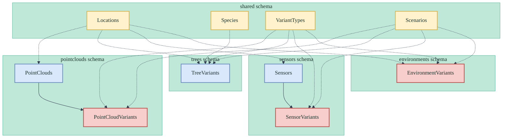
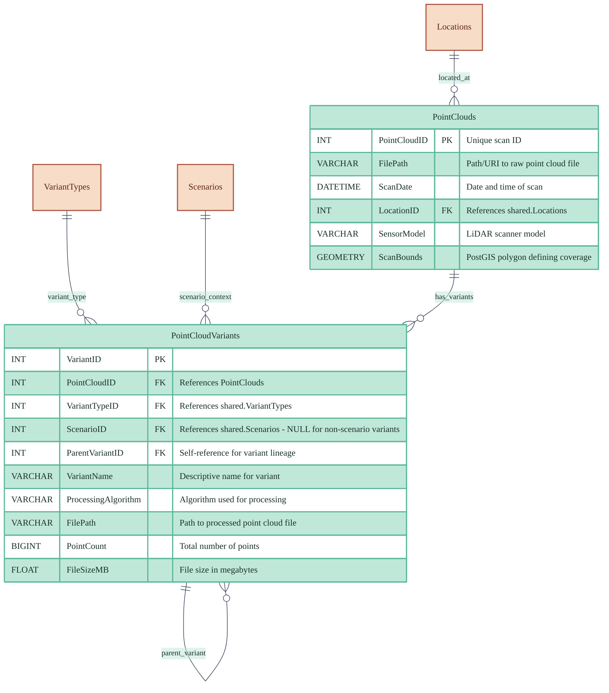
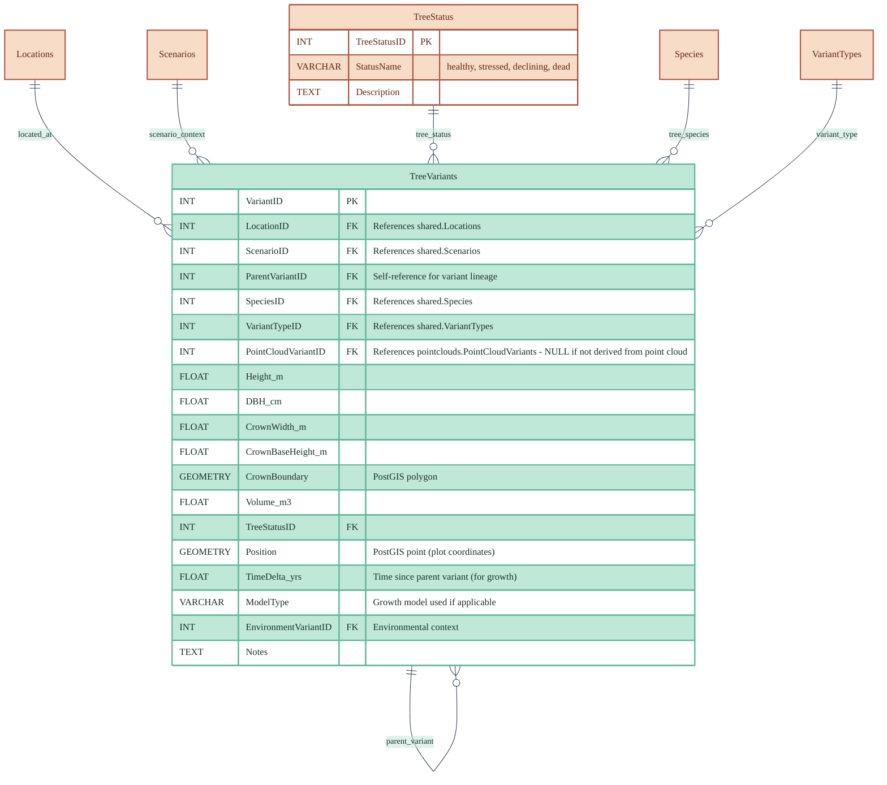
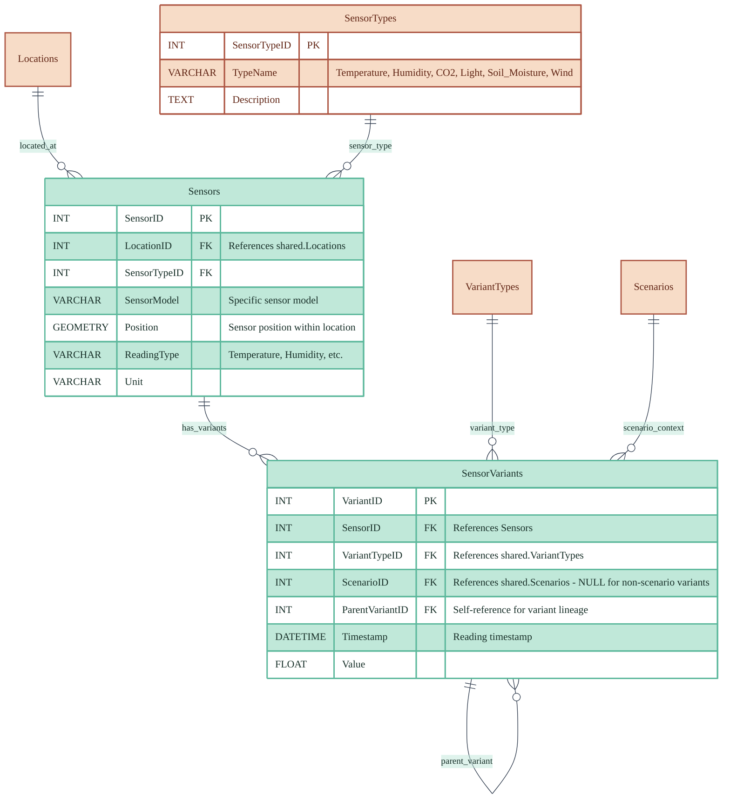
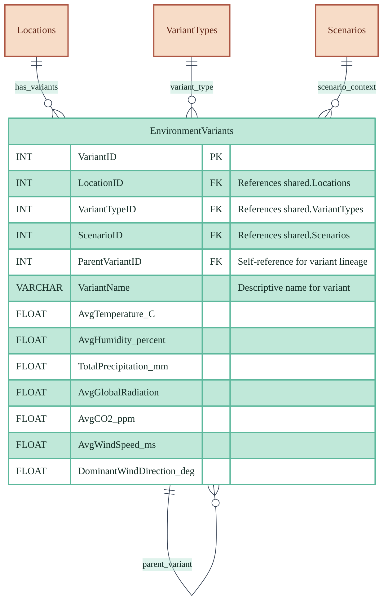

# Database Design - XR Future Forests Lab

## Unified Database Design with Schema Organization

This design uses PostgreSQL schemas (`shared`, `pointclouds`, `trees`, `environments`) to organize a unified forest monitoring database. Each domain follows a consistent variant pattern where base entities can have multiple variants representing different processing results, temporal states, or user modifications.

## Schema Overview

### Shared Schema

Contains reference tables used across all domains, providing consistent data definitions and relationships throughout the forest monitoring system.

### Point Clouds Schema

Manages LiDAR scan data and processing variants, supporting different processing algorithms and results while maintaining links to the original scan data.

### Trees Schema

Manages tree measurement and simulation data through variants. Each tree variant represents a specific measurement, simulation state, or modeling result that can reference point cloud variants for detection context.

### Sensors Schema

Manages sensor hardware installations (base tables) and sensor readings/data (variant tables). Base tables contain sensor metadata and installation info, while variants contain actual sensor readings and measurements.

### Environments Schema

Manages environmental variants that can be derived from sensor combinations, user input, or hybrid approaches for modeling and analysis context.

