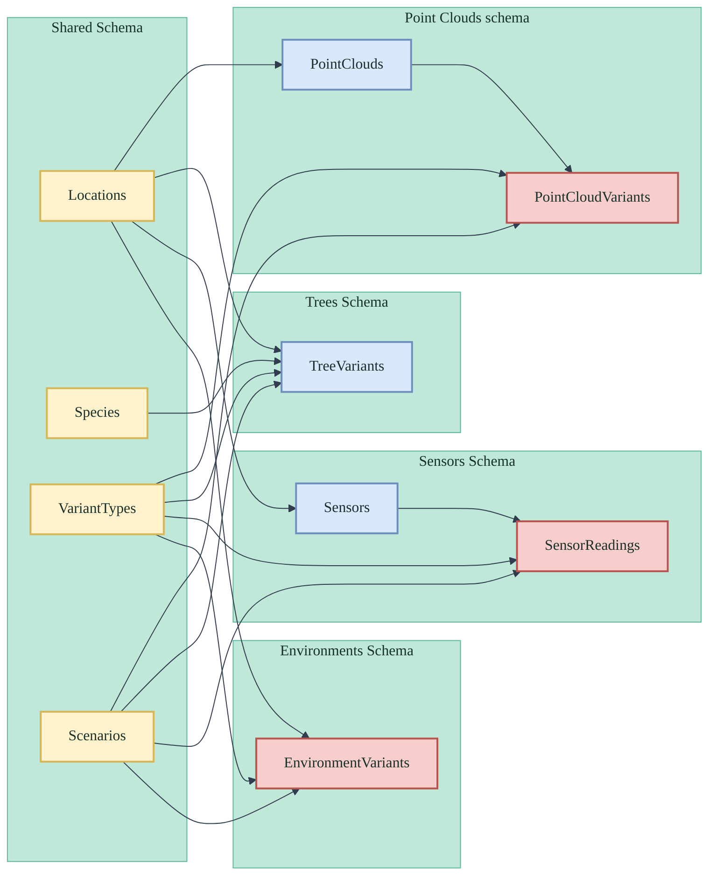
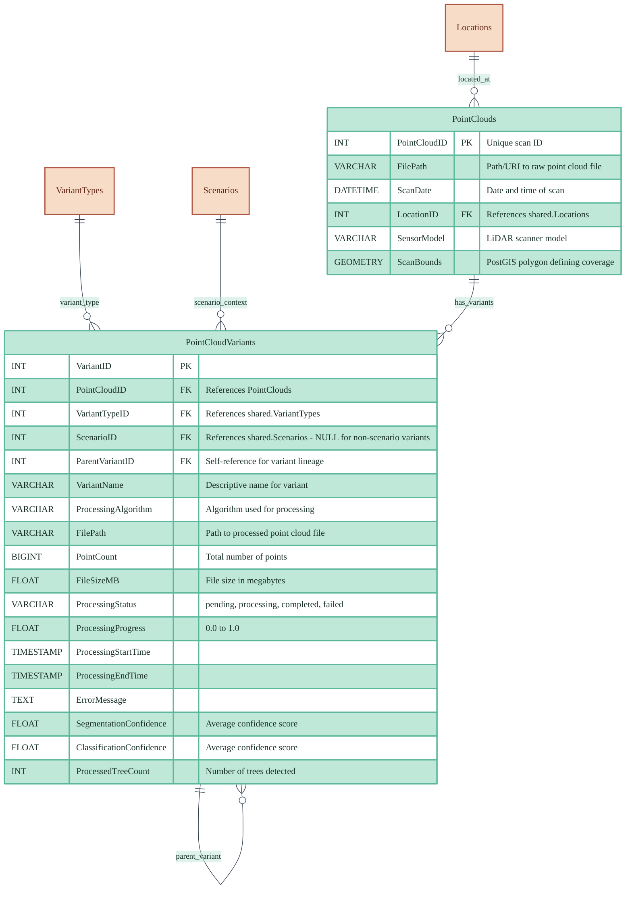
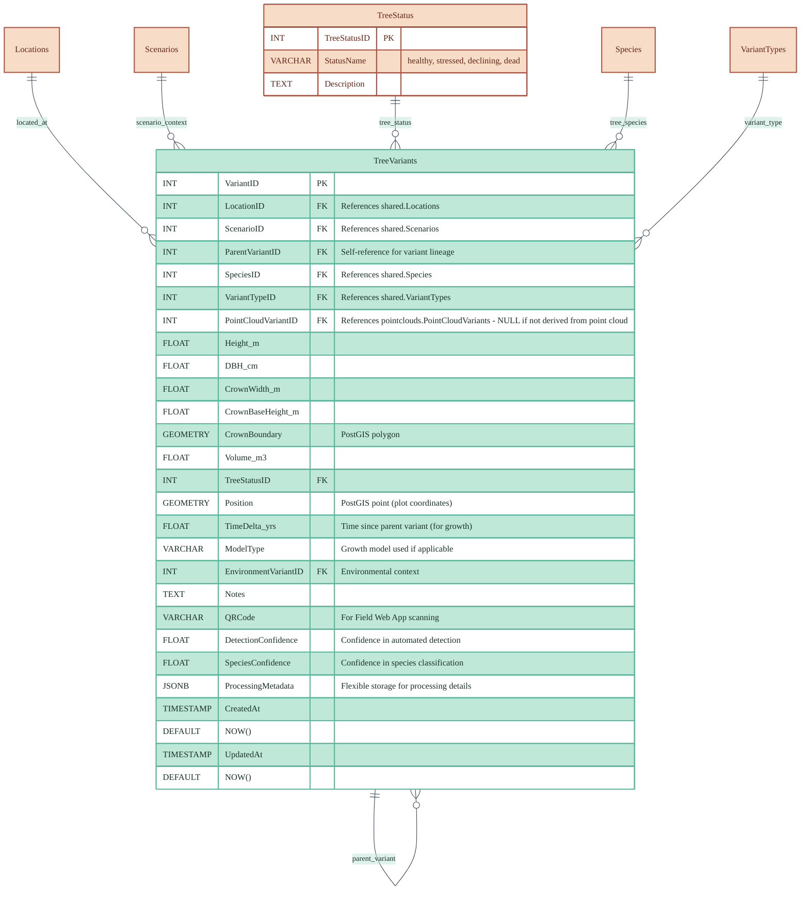
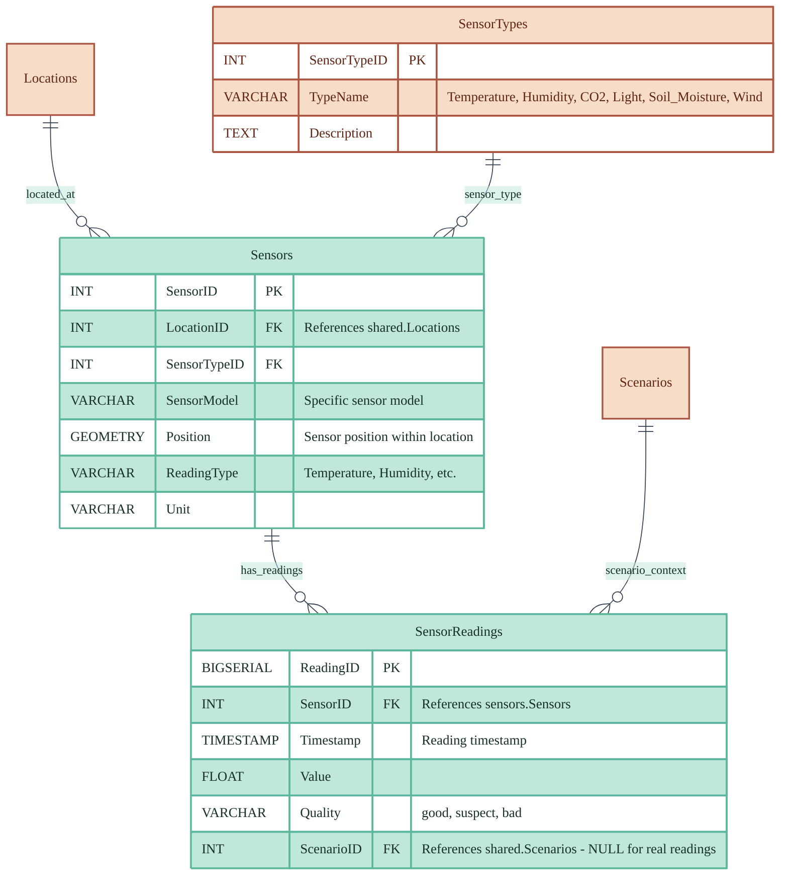
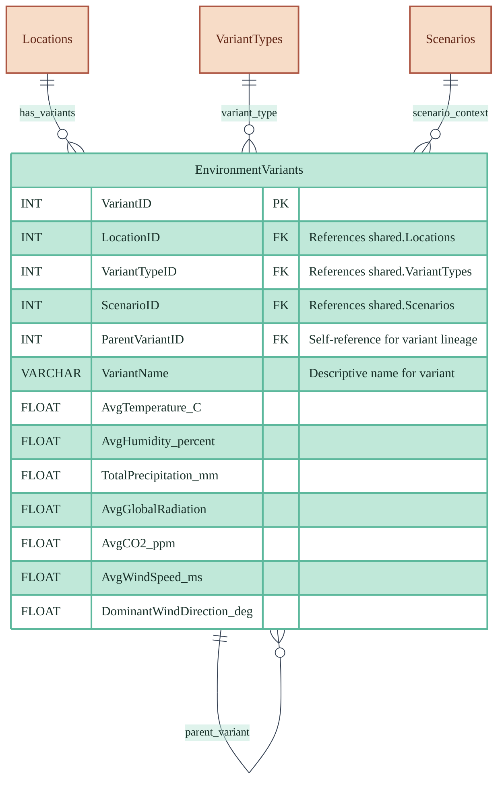

# Database Design - XR Future Forests Lab

## Unified Database Design with Schema Organization

This design uses PostgreSQL schemas (`shared`, `pointclouds`, `trees`, `environments`) to organize a unified forest monitoring database. Each domain follows a consistent variant pattern where base entities can have multiple variants representing different processing results, temporal states, or user modifications.

## Schema Overview



### Shared Schema

Contains reference tables used across all domains, providing consistent data definitions and relationships throughout the forest monitoring system.

```mermaid
%%{
  init: {
    'theme': 'base',
    'themeVariables': {
      'background': '#FFFFFF',
      'fontFamily': 'verdana',
      'lineColor': '#313d4f',
      'primaryColor': '#d2d2d2',
      'primaryTextColor': '#0f0f0f',
      'primaryBorderColor': '#505050',
      'secondaryColor': '#8e8e8e',
      'secondaryTextColor': '#0f0f0f',
      'secondaryBorderColor': '#505050',
      'tertiaryColor': '#e6e6e6',
      'tertiaryTextColor': '#0f0f0f',
      'tertiaryBorderColor': '#8e8e8e'
    }
  }
}%%
erDiagram
    Locations {
        INT LocationID PK "Unique site/plot ID"
        VARCHAR LocationName "Site name"
        GEOMETRY PlotBoundary "PostGIS polygon for plot boundaries"
        GEOMETRY CenterPoint "PostGIS point for plot center coordinates"
        TEXT Description "Description of the site"
        FLOAT Elevation_m "Site elevation"
        FLOAT Slope_deg "Site slope"
        VARCHAR Aspect "N, NE, E, SE, S, SW, W, NW"
        INT SoilTypeID FK "Soil type reference"
        INT ClimateZoneTypeID FK "Climate zone reference"
    }

    Species {
        INT SpeciesID PK "Unique species ID"
        VARCHAR CommonName "Common name"
        VARCHAR ScientificName "Scientific name"
        TEXT GrowthCharacteristics "JSON: typical growth patterns"
    }

    VariantTypes {
        INT VariantTypeID PK
        VARCHAR TypeName "Original, Processing_Result, Temporal_State, User_Modification"
        TEXT Description "Variant type description"
    }

    Scenarios {
        INT ScenarioID PK
        VARCHAR ScenarioName "Current_Conditions, Climate_Change_2050, Drought_Test"
        VARCHAR Description "Scenario description"
    }

    SoilTypes {
        INT SoilTypeID PK
        VARCHAR SoilName "Alfisol, Andisol, Aridisol, Entisol, Gelisol, Histosol, Inceptisol, Mollisol, xisol, Spodosol, Ultisol, Vertisol"
    }

    ClimateZoneTypes {
        INT ClimateZoneTypeID PK
        VARCHAR ZoneName "Köppen climate classification codes"
    }

    SoilTypes ||--o{ Locations : soil_type
    ClimateZoneTypes ||--o{ Locations : climate_zone

    %% Table coloring
    classDef refTable fill:#f7dcc7,stroke:#ad5643,stroke-width:2px,color:#612515
    
    class Locations,Species,VariantTypes,Scenarios,SoilTypes,ClimateZoneTypes refTable
```



### Point Clouds Schema

Manages LiDAR scan data and processing variants, supporting different processing algorithms and results while maintaining links to the original scan data.



### Trees Schema

Manages tree measurement and simulation data through variants. Each tree variant represents a specific measurement, simulation state, or modeling result that can reference point cloud variants for detection context.



### Sensors Schema

Manages sensor hardware installations and time-series sensor readings. Base tables contain sensor metadata and installation info, while readings tables contain actual sensor measurements optimized for time-series queries.



### Environments Schema

Manages environmental variants that can be derived from sensor combinations, user input, or hybrid approaches for modeling and analysis context.



## Database Design Issues and Recommendations

Based on the architecture description, several adjustments are needed to properly support the envisioned functionality:

### **Critical Issues Identified:**

1. **Missing Processing Workflow Support**: The Logic Tier's point cloud processing pipeline requires tracking of processing jobs, status, and intermediate results
2. **Inefficient Sensor Data Storage**: The current sensor readings approach could be further optimized for time-series performance
3. **Missing QR Code Support**: Field Web App functionality requires QR code identifiers for trees
4. **Limited Processing Results Storage**: Segmentation and classification confidence scores need dedicated storage
5. **Missing File Management**: Point cloud file paths and processing result files need better organization

### **Recommended Schema Adjustments:**

#### **1. Point Clouds Schema - Add Processing Support**

```sql
-- Add to PointCloudVariants table:
ALTER TABLE pointclouds.PointCloudVariants ADD COLUMN ProcessingStatus VARCHAR(50); -- 'pending', 'processing', 'completed', 'failed'
ALTER TABLE pointclouds.PointCloudVariants ADD COLUMN ProcessingProgress FLOAT; -- 0.0 to 1.0
ALTER TABLE pointclouds.PointCloudVariants ADD COLUMN ProcessingStartTime TIMESTAMP;
ALTER TABLE pointclouds.PointCloudVariants ADD COLUMN ProcessingEndTime TIMESTAMP;
ALTER TABLE pointclouds.PointCloudVariants ADD COLUMN ErrorMessage TEXT;
ALTER TABLE pointclouds.PointCloudVariants ADD COLUMN SegmentationConfidence FLOAT; -- Average confidence score
ALTER TABLE pointclouds.PointCloudVariants ADD COLUMN ClassificationConfidence FLOAT; -- Average confidence score
ALTER TABLE pointclouds.PointCloudVariants ADD COLUMN ProcessedTreeCount INT; -- Number of trees detected
```

#### **2. Trees Schema - Add QR and Processing Support**

```sql
-- Add to TreeVariants table:
ALTER TABLE trees.TreeVariants ADD COLUMN QRCode VARCHAR(100) UNIQUE; -- For Field Web App scanning
ALTER TABLE trees.TreeVariants ADD COLUMN DetectionConfidence FLOAT; -- Confidence in automated detection
ALTER TABLE trees.TreeVariants ADD COLUMN SpeciesConfidence FLOAT; -- Confidence in species classification
ALTER TABLE trees.TreeVariants ADD COLUMN ProcessingMetadata JSONB; -- Flexible storage for processing details
ALTER TABLE trees.TreeVariants ADD COLUMN CreatedAt TIMESTAMP DEFAULT NOW();
ALTER TABLE trees.TreeVariants ADD COLUMN UpdatedAt TIMESTAMP DEFAULT NOW();
```

#### **3. Sensors Schema - Optimize for Time-Series Data**

Replace the variant-based approach with a more efficient time-series design:

```sql
-- Replace SensorVariants with:
CREATE TABLE sensors.SensorReadings (
    ReadingID BIGSERIAL PRIMARY KEY,
    SensorID INT REFERENCES sensors.Sensors(SensorID),
    Timestamp TIMESTAMP NOT NULL,
    FLOAT Value NOT NULL,
    Quality VARCHAR(20) DEFAULT 'good', -- 'good', 'suspect', 'bad'
    ScenarioID INT REFERENCES shared.Scenarios(ScenarioID), -- NULL for real readings
    INDEX (SensorID, Timestamp), -- For time-series queries
    INDEX (Timestamp), -- For temporal queries across sensors
    PARTITION BY RANGE (Timestamp) -- For large-scale time-series performance
);

-- Aggregate table for faster queries:
CREATE TABLE sensors.SensorReadingsHourly (
    SensorID INT REFERENCES sensors.Sensors(SensorID),
    HourTimestamp TIMESTAMP NOT NULL,
    AvgValue FLOAT,
    MinValue FLOAT,
    MaxValue FLOAT,
    ReadingCount INT,
    PRIMARY KEY (SensorID, HourTimestamp)
);
```

#### **4. Add Processing Jobs Tracking**

```sql
-- New table to support Processing API:
CREATE TABLE shared.ProcessingJobs (
    JobID BIGSERIAL PRIMARY KEY,
    JobType VARCHAR(50) NOT NULL, -- 'segmentation', 'classification', 'attribute_extraction'
    PointCloudID INT REFERENCES pointclouds.PointClouds(PointCloudID),
    Status VARCHAR(50) NOT NULL, -- 'queued', 'running', 'completed', 'failed'
    Progress FLOAT DEFAULT 0.0,
    StartTime TIMESTAMP,
    EndTime TIMESTAMP,
    ErrorMessage TEXT,
    Parameters JSONB, -- Processing parameters
    Results JSONB, -- Processing results and metadata
    CreatedAt TIMESTAMP DEFAULT NOW()
);
```

### **Schema Organization Recommendations:**

#### **Rename `sensors` to `monitoring`**

The current sensors schema should be renamed to better reflect its role in environmental monitoring:

- `monitoring.Sensors` → Hardware installations
- `monitoring.SensorReadings` → Time-series data
- `monitoring.SensorTypes` → Sensor type reference

#### **Add File Management Schema**

```sql
CREATE SCHEMA files;

CREATE TABLE files.FileStorage (
    FileID BIGSERIAL PRIMARY KEY,
    FilePath VARCHAR(500) NOT NULL,
    FileType VARCHAR(50) NOT NULL, -- 'point_cloud', 'processed_cloud', 'model'
    FileSize BIGINT,
    CheckSum VARCHAR(64),
    StorageLocation VARCHAR(100), -- 'local', 's3', 'azure_blob'
    CreatedAt TIMESTAMP DEFAULT NOW(),
    AccessedAt TIMESTAMP
);

-- Link files to point clouds
ALTER TABLE pointclouds.PointClouds ADD COLUMN FileID BIGINT REFERENCES files.FileStorage(FileID);
ALTER TABLE pointclouds.PointCloudVariants ADD COLUMN FileID BIGINT REFERENCES files.FileStorage(FileID);
```

### **Updated API Mapping:**

- **Point Cloud API**: Reads from `pointclouds.PointClouds` and `pointclouds.PointCloudVariants`
- **Tree API**: Reads from `trees.TreeVariants` with QR code support
- **Processing API**: Manages `shared.ProcessingJobs` and processing status in variants
- **Sensor API**: Reads from `monitoring.SensorReadings` with efficient time-series queries
- **Environment API**: Reads from `environments.EnvironmentVariants`
- **Tree Lookup API**: Uses QR codes in `trees.TreeVariants`
- **Simulation API**: Creates new variants in `trees.TreeVariants` with simulation metadata

These changes will properly support the architecture's vision while maintaining performance and data integrity.

## **Summary**

The current database design provides a solid foundation but requires several enhancements to fully support the envisioned XR Future Forests Lab architecture:

**✅ **What Works Well:**

- Variant-based pattern for temporal tracking
- Spatial data support with PostGIS
- Clear schema separation
- Flexible scenario modeling

**⚠️ **Critical Adjustments Needed:**

- Add processing workflow tracking for the Logic Tier
- Implement QR code support for Field Web App
- Optimize sensor data storage for time-series performance
- Add file management for point cloud and processing results
- Include confidence scores for processing results

**🚀 **Performance Benefits:**

- Time-series optimization will handle millions of sensor readings efficiently
- Processing job tracking enables real-time status updates
- File management schema supports scalable storage solutions

With these adjustments, the database will fully support the three-tier architecture while providing the performance and flexibility needed for the XR Future Forests Lab's ambitious vision.
