# Database Design - XR Future Forests Lab

## Digital Twin System Overview

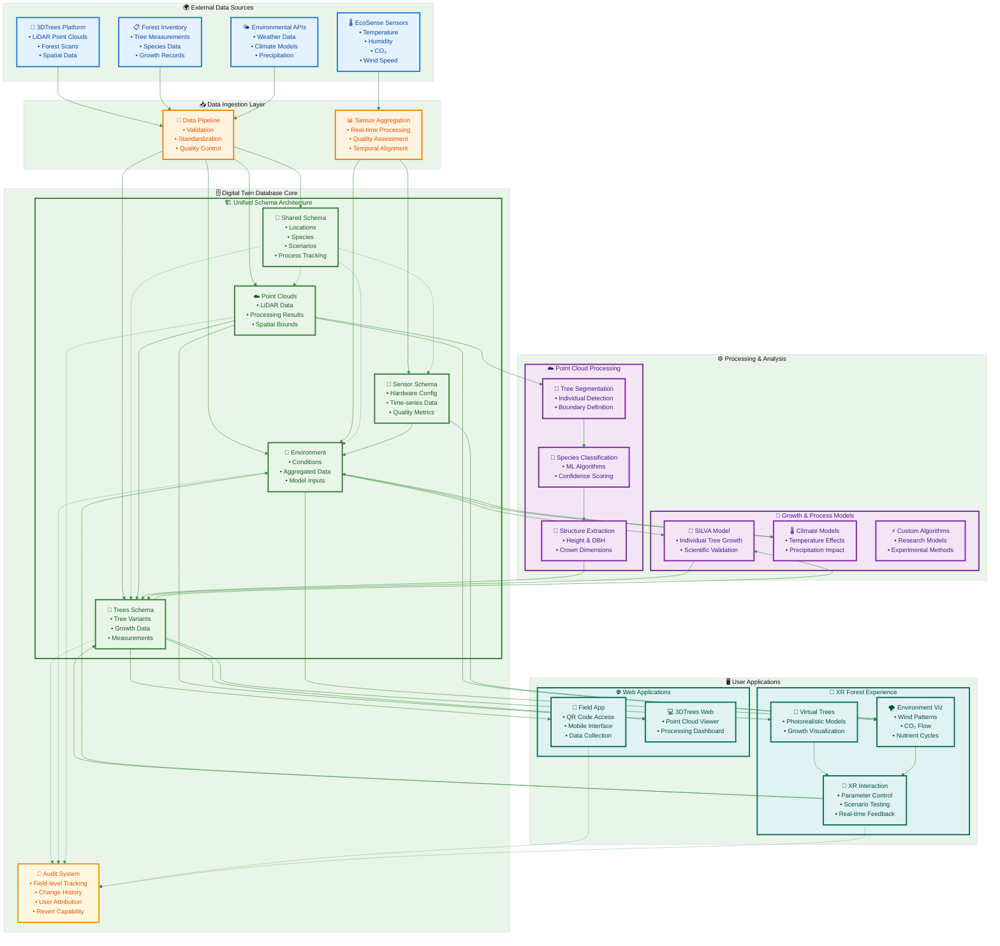

## Unified Database Design with Schema Organization

This design uses PostgreSQL schemas (`shared`, `pointclouds`, `trees`, `sensor`, `environments`) to organize a unified forest monitoring database. The design supports efficient time-series sensor data storage with file references managed as simple file paths within the variant and base tables.

> **📊 Complete ERD Available**: For a comprehensive view of the entire database structure in a single diagram, see the complete ERD files:
>
> - **Visual ERD**: [`xr_forests_complete_erd.dbml`](./xr_forests_complete_erd.dbml) - Use with [dbdiagram.io](https://dbdiagram.io/) for interactive visualization
> - **SQL Schema**: [`xr_forests_complete_schema.sql`](./xr_forests_complete_schema.sql) - Ready-to-execute PostgreSQL DDL
> - **Usage Guide**: [`README_ERD.md`](./README_ERD.md) - How to use the ERD files

## Schema Overview

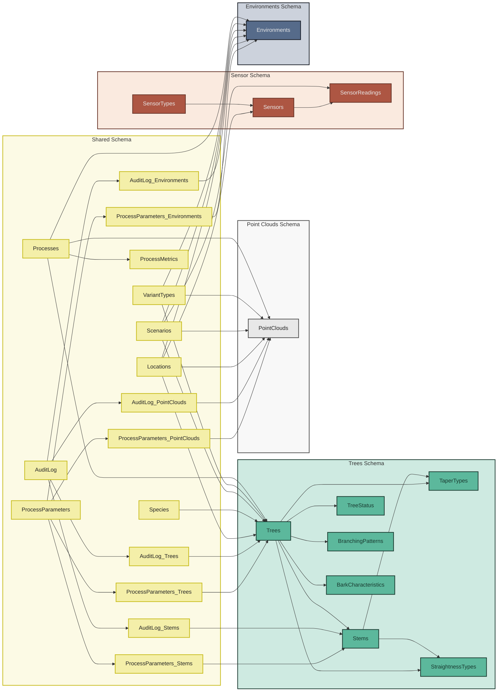

### Shared Schema

Contains reference tables used across all domains, providing consistent data definitions and relationships throughout the forest monitoring system.

#### Location and Environmental Context

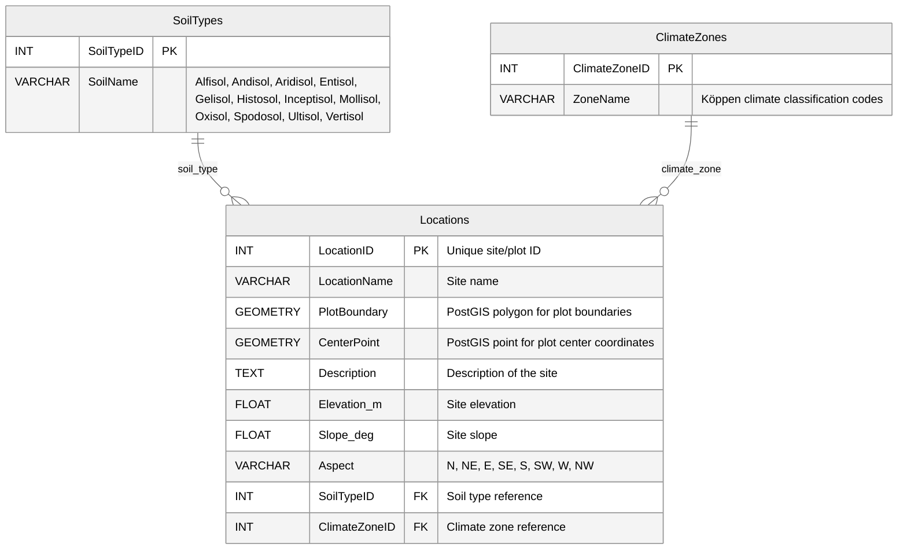

#### Species Reference

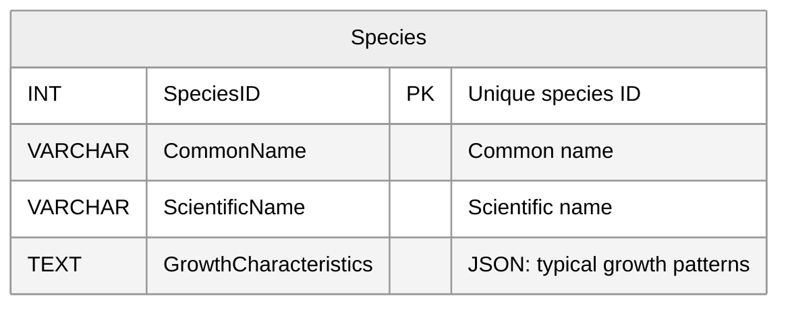

#### Scenarios and Variant Types

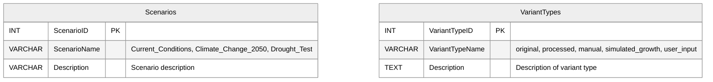

#### Process Management and Algorithm Tracking

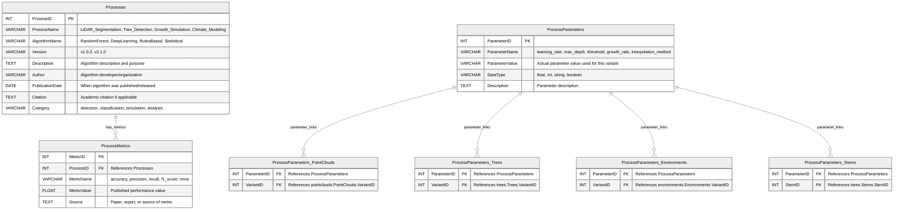

**Junction Table Design**: Process parameters use explicit junction tables to link with domain-specific variants, providing clear foreign key relationships while maintaining flexibility for cross-schema operations.

#### Field-Level Change Tracking

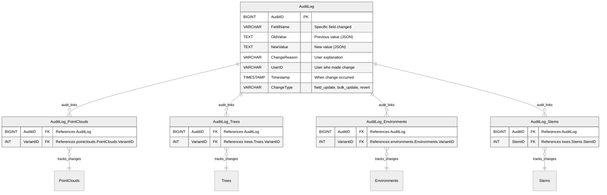

The AuditLog system provides granular change tracking for individual field modifications across all variant tables through explicit junction tables.

**Key Features**:

- **Junction Table Design**: Explicit relationships through dedicated junction tables (AuditLog_PointClouds, AuditLog_Trees, etc.)
- **API-Level Tracking**: All changes go through REST API endpoints to ensure audit logging
- **Granular Logging**: Each field change creates a separate audit entry with full before/after context
- **Revert Capability**: Changes can be undone using audit log data without creating new variants
- **User Attribution**: All changes tracked to specific authenticated users
- **Reason Codes**: Optional explanations provide context for change decisions

**Implementation Strategy**:

1. **Single Field Updates**: Modify variant record directly, create AuditLog entry with junction table link
2. **Multiple Field Updates**: Option to create micro-variant or log individual changes through junction tables
3. **Major Changes**: Continue using full variant system for significant modifications
4. **Revert Operations**: Use audit log to restore previous values with new audit entries

### Point Clouds Schema

Manages LiDAR scan data and processing variants through a unified variant-based approach. Original scans and processed variants are stored in the same table, with variant types determining the relationship and processing status.

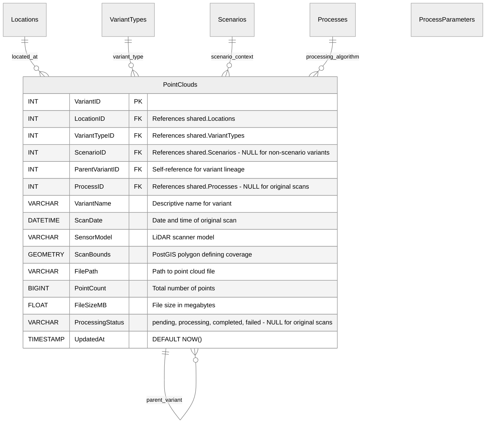

### Trees Schema

Manages tree measurement and simulation data through variants. Each tree variant represents a specific measurement, simulation state, or modeling result that can reference point cloud variants for detection context.

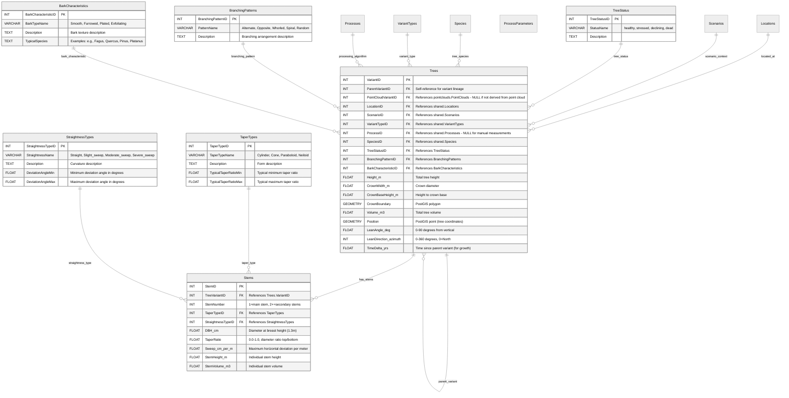

### Sensor Schema

Manages sensor hardware installations and time-series sensor readings. Base tables contain sensor metadata and installation info, while readings tables contain actual sensor measurements optimized for time-series queries.

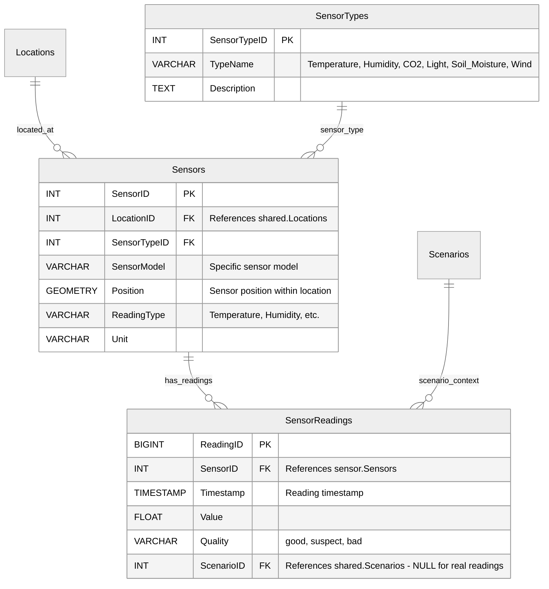

### Environments Schema

Manages environmental variants that can be derived from sensor combinations, user input, or hybrid approaches for modeling and analysis context.

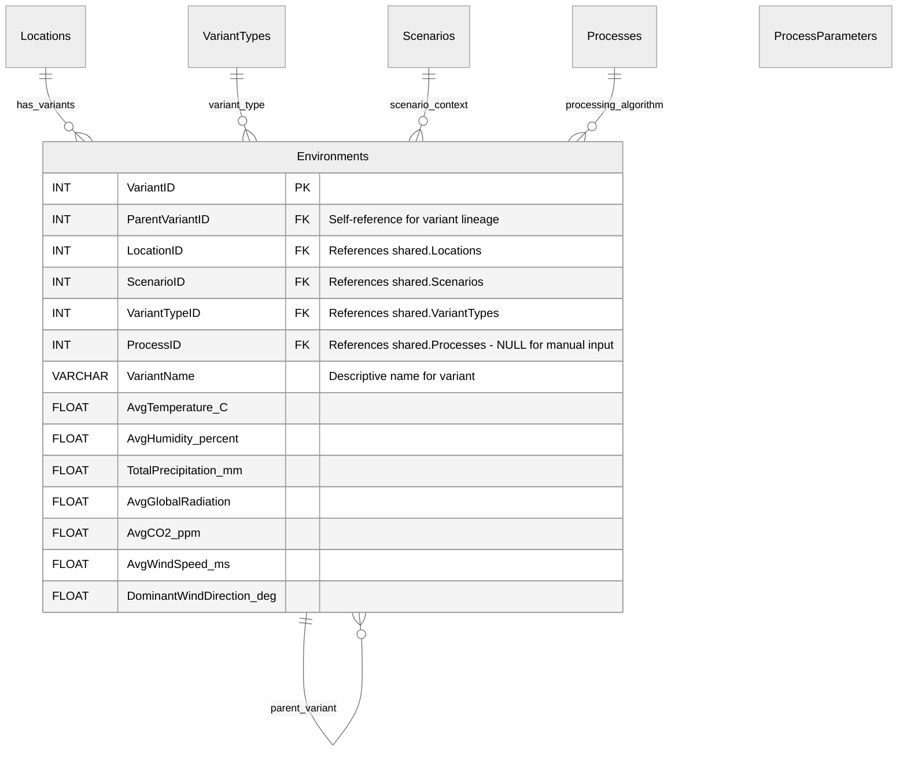
