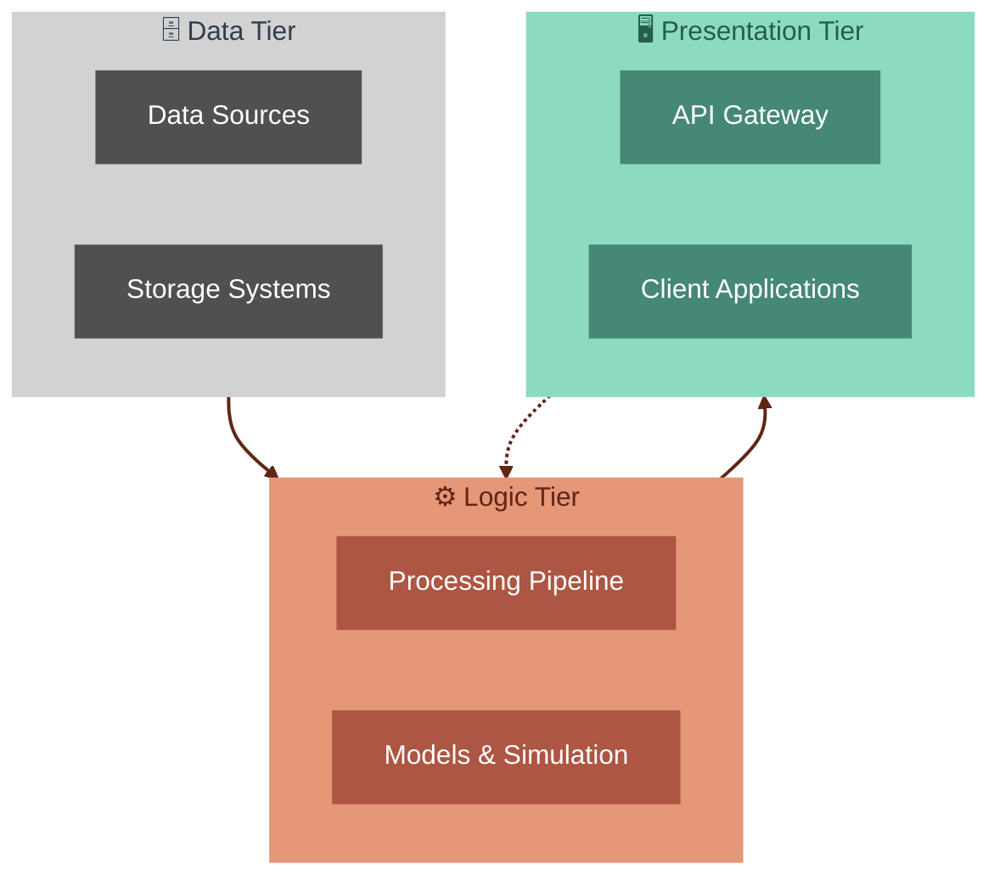
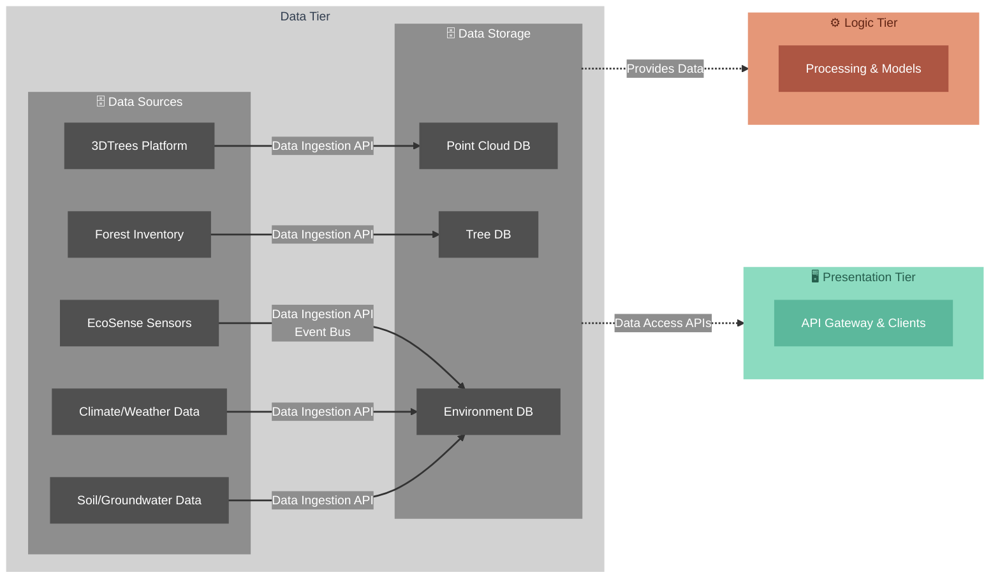
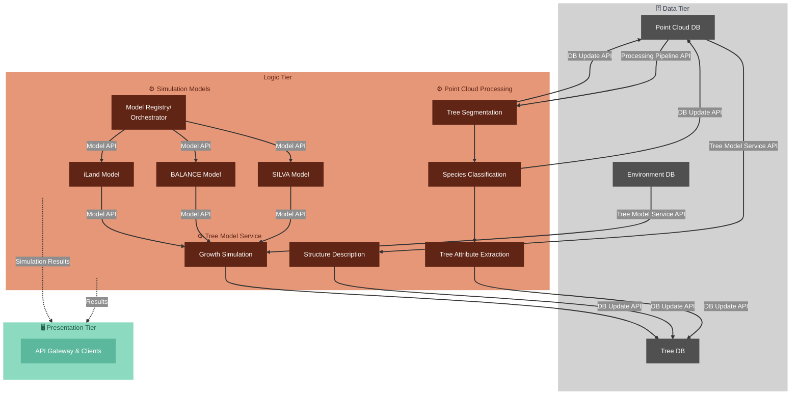
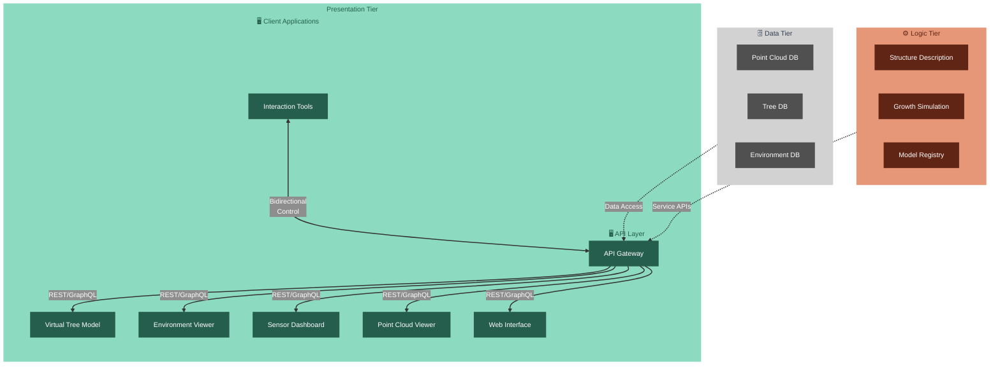

# Architecture

> **Related Documentation**: [Database Design](./database_design.md) | [Data Contracts & APIs](./data_contracts_and_apis.md)

This document describes the system architecture of the XR Future Forests Lab, focusing on component design, responsibilities, and interconnections. For detailed API specifications and data contracts, see the [Data Contracts & APIs](./data_contracts_and_apis.md) document. For database schema details, see the [Database Design](./database_design.md) document.

## System Overview

The XR Future Forests Lab architecture follows a three-tier approach that separates concerns across data storage, business logic, and presentation layers. This design enables scalable processing of forest data, sophisticated modeling capabilities, and immersive user experiences through XR interfaces.

The **Data Tier** handles ingestion and storage of diverse forest-related datasets including LiDAR point clouds, environmental sensor data, and traditional forest inventory. The **Logic Tier** processes this data through automated pipelines and executes sophisticated forest growth models. The **Presentation Tier** provides user interfaces ranging from immersive XR experiences to web-based dashboards, all coordinated through a central API gateway.

---

## Data Tier Architecture

The Data Tier serves as the foundation for all forest data management, handling both the ingestion of diverse data sources and the storage of processed information. This tier consists of multiple specialized data sources feeding into dedicated storage systems optimized for different data types.

### Data Sources

The system integrates five primary data sources, each providing specialized forest-related information:

#### 3DTrees Platform

Primary provider of high-resolution terrestrial or airborne LiDAR point cloud data, capturing detailed 3D structure of forest plots. This component handles raw point cloud file uploads and streams, supporting formats like LAS and LAZ for comprehensive spatial analysis and modeling.

#### EcoSense Sensors

Network of environmental sensors providing real-time measurements including temperature, humidity, soil moisture, and other environmental parameters. This distributed sensor network enables continuous environmental monitoring with both real-time streaming and batch data collection capabilities.

#### Climate/Weather Data

External and internal sources providing climate variables such as rainfall, temperature, and wind patterns essential for forest growth modeling. This component manages periodic batch imports and API integrations with weather services to maintain comprehensive climate datasets.

#### Soil/Groundwater Data

Datasets and live feeds describing soil composition, moisture levels, and groundwater conditions essential for simulating tree and ecosystem health. This component processes both uploaded historical datasets and continuous sensor streams from soil monitoring equipment.

#### Forest Inventory

Traditional field survey data including tree measurements like DBH, height, and species identification used for ground-truthing, validation, and model calibration. This component supports multiple input formats including CSV uploads, Excel files, and mobile application-based data collection.

### Data Storage Systems

Three specialized databases provide optimized storage for different data types and access patterns:

#### Point Cloud DB

Spatial database optimized for storage, indexing, and retrieval of massive 3D point cloud datasets. This system provides efficient spatial queries, supports point cloud processing workflows, and maintains metadata for all scanning sessions and their derived products.

#### Tree DB

Comprehensive database for individual tree records, supporting scenario-based modeling, variant management, and detailed structural representations. This system enables both traditional attribute queries and advanced spatial analysis while maintaining complete lineage of all tree variants and modifications.

#### Environment DB

Time-series database for environmental sensor data, weather records, and aggregated environmental snapshots. This system supports both high-frequency sensor data storage and model-ready environmental summaries essential for growth simulation and scenario analysis.

---

## Logic Tier Architecture

The Logic Tier transforms raw data into actionable insights through sophisticated processing pipelines and simulation models. This tier bridges the gap between data storage and user presentation, implementing the core business logic of forest analysis and modeling.

### **Point Cloud Processing**

The Point Cloud Processing subsystem implements a sophisticated pipeline that transforms raw LiDAR data into structured forest information through three sequential stages:

#### **Tree Segmentation**

**Description:**  
First stage of the processing pipeline that identifies and isolates individual trees from the point cloud data using advanced clustering and geometric algorithms.

- **Data In:**  
  Raw point cloud data from **Point Cloud DB**.
- **API:**  
  **Processing Pipeline API**  
  `POST /api/process/segment` (start segmentation job)  
  `GET /api/process/segment/{job_id}/status` (check job status)

**Data Contract:** See [Point Cloud Processing APIs](./data_contracts.md#point-cloud-processing-apis) in Data Contracts documentation.

- **Data Out:**  
  Segmented tree point clouds back to **Point Cloud DB**; flows to **Species Classification**.

#### **Species Classification**

**Description:**  
Second stage that analyzes segmented tree point clouds to identify species using machine learning models trained on morphological features.

- **Data In:**  
  Segmented tree point clouds from **Tree Segmentation**.
- **API:**  
  **Processing Pipeline API**  
  `POST /api/process/classify` (start classification job)

**Data Contract:** See [Point Cloud Processing APIs](./data_contracts.md#point-cloud-processing-apis) in Data Contracts documentation.

- **Data Out:**  
  Species identification data to **Point Cloud DB**; flows to **Tree Attribute Extraction**.

#### **Tree Attribute Extraction**

**Description:**  
Final stage that derives biometric measurements (height, DBH, crown dimensions) and health indicators from classified tree point clouds.

- **Data In:**  
The Logic Tier transforms raw data into actionable insights through sophisticated processing pipelines and simulation models. This tier bridges the gap between data storage and user presentation, implementing the core business logic of forest analysis and modeling.

### Point Cloud Processing

The Point Cloud Processing subsystem implements a sophisticated pipeline that transforms raw LiDAR data into structured forest information through three sequential stages:

#### Tree Segmentation

First stage of the processing pipeline that identifies and isolates individual trees from point cloud data using advanced clustering and geometric algorithms. This component processes raw point cloud data and produces segmented tree point clouds, enabling downstream species classification and attribute extraction.

#### Species Classification

Second stage that analyzes segmented tree point clouds to identify species using machine learning models trained on morphological features. This component leverages the segmented output from tree segmentation and applies trained classification models to determine species with confidence scores.

#### Tree Attribute Extraction

Final stage that derives biometric measurements (height, DBH, crown dimensions) and health indicators from classified tree point clouds. This component processes classified tree segments and extracts quantitative measurements that feed into the Tree Database for modeling and analysis.

### Simulation Models

The simulation model subsystem provides sophisticated forest growth and ecosystem modeling capabilities through multiple specialized engines:

#### Model Registry/Orchestrator

Central service that manages and coordinates the execution of different forest simulation models, providing a unified interface for model selection and orchestration. This component handles model lifecycle management, simulation job scheduling, and result aggregation across multiple modeling engines.

#### SILVA Model

Specialized forest growth simulation engine focused on individual tree growth dynamics and stand development under various management scenarios. This model provides detailed tree-level growth predictions and supports management scenario analysis for forest planning and optimization.

#### BALANCE Model

Ecosystem-level simulation engine that models nutrient cycles, carbon dynamics, and ecological interactions within forest systems. This model provides landscape-scale ecosystem analysis and environmental impact assessment capabilities essential for comprehensive forest management.

#### iLand Model

Landscape-scale forest dynamics model that simulates individual tree competition, growth, mortality, and regeneration across large spatial extents. This model integrates climate effects and disturbance processes to provide long-term forest development scenarios under changing environmental conditions.

### Tree Model Service

The Tree Model Service provides comprehensive tree modeling capabilities, supporting both structural representation and growth simulation:

#### Structure Description

Component that generates and maintains detailed 3D structural representations of individual trees based on point cloud analysis. This service processes point cloud data to create accurate 3D tree models, supporting both data-driven approaches (QSM) and generative modeling techniques (L-systems, DeepTree).

#### Growth Simulation

Service component that simulates individual tree growth over time, incorporating environmental factors, management scenarios, and input from multiple simulation models. This component integrates outputs from SILVA, BALANCE, and iLand models to provide comprehensive growth predictions and scenario analysis.

---

## Presentation Tier Architecture

The Presentation Tier provides user-facing interfaces and coordinates all client interactions with the system. It serves as the bridge between users and the underlying data and logic tiers, supporting both immersive XR experiences and traditional web interfaces through a centralized API gateway that coordinates access to all backend services.

### API Layer

#### API Gateway

Central entry point that routes all client requests to backend services, handles authentication, rate limiting, and aggregates responses for the presentation layer. This component provides a unified interface for all client applications, manages cross-cutting concerns like security and monitoring, and abstracts the complexity of the underlying microservices architecture.

### Client Applications

The system supports multiple specialized client applications, each optimized for different user needs and interaction patterns:

#### Virtual Tree Model

Immersive XR application providing 3D visualization and interaction with individual tree models. This application supports both VR and AR experiences, enabling users to explore detailed tree structure, observe growth simulations, and interact with forest data in an intuitive 3D environment.

#### Environment Viewer

Specialized visualization client for environmental data and sensor networks. This application provides real-time environmental monitoring, historical trend analysis, and spatial visualization of environmental conditions across forest sites.

#### Sensor Dashboard

Real-time monitoring interface for sensor network status and data streams. This application provides system administrators and researchers with comprehensive oversight of sensor health, data quality, and network performance.

#### Point Cloud Viewer

High-performance visualization client for large-scale 3D point cloud data. This application supports interactive exploration of LiDAR datasets, segmentation visualization, and processing result analysis with optimized rendering for massive point datasets.

#### Web Interface

Traditional web-based interface providing comprehensive system access through standard browsers. This application serves as the primary administrative interface and provides access to all system functions for users who prefer traditional web interfaces.

#### Interaction Tools

Advanced control interface enabling sophisticated system manipulation and scenario analysis. This application provides researchers and forest managers with tools for model control, scenario creation, parameter adjustment, and comparative analysis across different modeling scenarios.

### Communication Patterns

The Presentation Tier employs multiple communication patterns to support different user experience requirements:

- **Request-Response**: Standard HTTP-based communication for typical data retrieval and manipulation operations
- **Real-time Streaming**: WebSocket-based communication for live sensor data, processing updates, and collaborative interactions
- **Event-driven Updates**: Asynchronous notification system for system state changes, completion of long-running processes, and multi-user coordination

---

## System Integration and Event Management

### Event Bus Architecture

The system implements a sophisticated event-driven architecture using an Event Bus that coordinates asynchronous communication between components:

#### Event Bus Components

**Message Broker**: Apache Kafka or RabbitMQ providing reliable message delivery with persistence and guaranteed ordering

**Event Topics**:

- `sensor-readings`: Real-time environmental sensor data streams
- `processing-jobs`: Point cloud processing job status updates  
- `tree-updates`: Tree data modifications and variant changes
- `simulation-progress`: Growth model execution progress and results
- `system-alerts`: Error conditions, maintenance notifications, and system health
- `user-interactions`: XR interface interactions and collaborative editing

**Event Schemas**: Standardized message formats ensuring consistent data contracts across all event types

#### Event-Driven Workflows

**Point Cloud Processing Pipeline**:

1. Point cloud upload triggers `processing-job-submitted` event
2. Segmentation completion publishes `segmentation-completed` event  
3. Classification service subscribes to segmentation events
4. Results publish `classification-completed` events for downstream consumers

**Real-time Sensor Integration**:

1. EcoSense sensors publish readings to `sensor-readings` topic
2. Data validation service consumes and validates readings
3. Environmental snapshot service aggregates readings
4. XR clients subscribe to processed environmental updates

**Simulation Coordination**:

1. Simulation requests trigger `simulation-started` events
2. Multiple model services (SILVA, BALANCE, iLand) process independently
3. Results aggregation service combines outputs from all models
4. Completed simulations publish `simulation-completed` events

### Cross-Tier Communication

The three-tier architecture enables clear separation of concerns while maintaining efficient data flow and system integration:

**Data Flow Patterns**:

- Raw data flows from external sources through the Data Tier to the Logic Tier for processing
- Processed results flow back to the Data Tier for storage and then to the Presentation Tier for visualization
- User interactions flow from the Presentation Tier through the Logic Tier to update data in the Data Tier
- Real-time sensor data creates continuous streams from the Data Tier through the Logic Tier to the Presentation Tier

**Processing Workflows**:

- Point cloud processing follows a sequential pipeline from ingestion through segmentation, classification, and attribute extraction
- Growth simulation integrates data from multiple sources and models to produce comprehensive growth predictions
- Scenario analysis combines user-defined parameters with historical data to generate comparative assessments

### Scalability and Performance

The architecture supports horizontal scaling at each tier:

**Data Tier**: Database sharding and read replicas support growing data volumes and query loads
**Logic Tier**: Microservices architecture enables independent scaling of processing and modeling components
**Presentation Tier**: Stateless API gateway and client-side rendering support increasing user loads

### Quality Assurance and Monitoring

The system incorporates comprehensive monitoring and quality assurance capabilities:

**Data Quality**: Automated validation, quality scoring, and anomaly detection throughout the data pipeline
**Processing Monitoring**: Real-time tracking of processing jobs, resource utilization, and error detection
**User Experience**: Performance monitoring, error tracking, and usage analytics across all client applications
