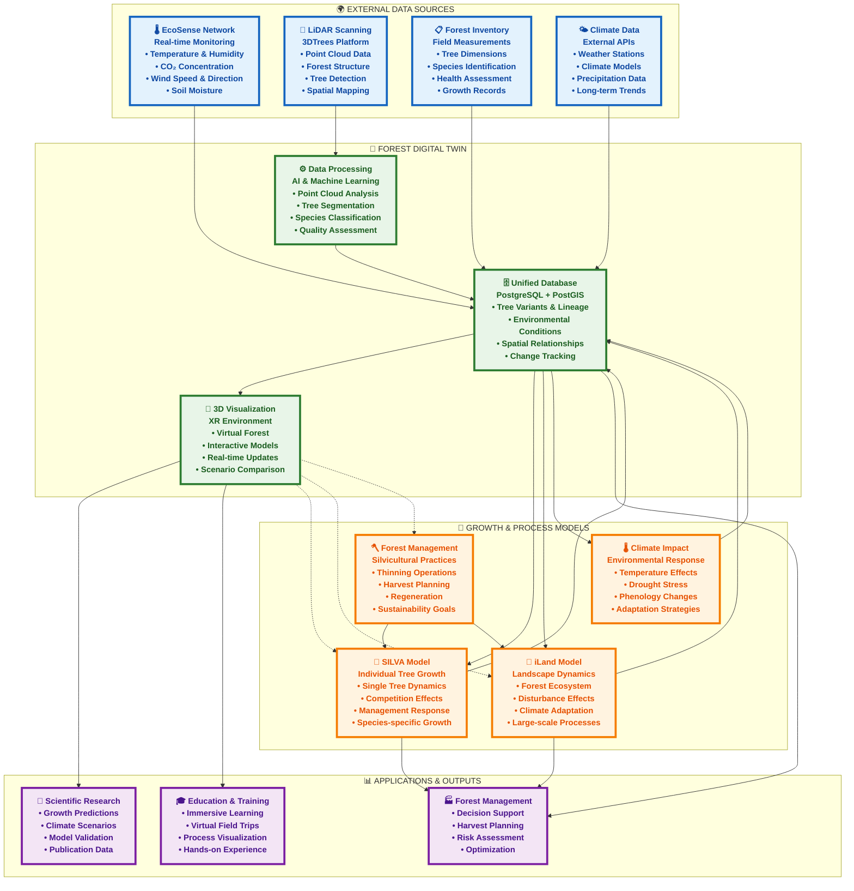
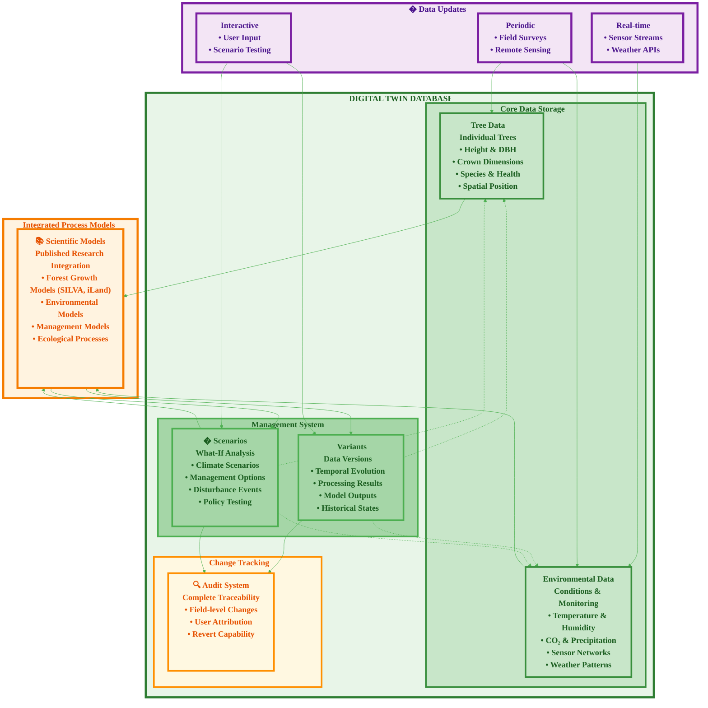

# Digital Twin System Overview - Scientific Poster

## Simplified Architecture for Forest Digital Twin

## System Components

### 🌍 External Data Sources

The digital twin integrates multiple real-world data streams to create a comprehensive forest representation:

- **Environmental Sensors**: Continuous monitoring of microclimate conditions
- **LiDAR Technology**: High-resolution 3D forest structure capture
- **Field Measurements**: Traditional forestry data collection and validation
- **Climate Networks**: Regional and global environmental context

### 🌲 Digital Twin Core

The central system processes and stores all forest information:

- **Unified Database**: Spatially-aware storage with complete change tracking
- **AI Processing**: Automated analysis and pattern recognition
- **3D Visualization**: Immersive forest exploration and interaction

### 🌱 Growth & Process Models

Scientific models predict forest development and management outcomes:

- **SILVA**: Individual tree growth with detailed physiological processes
- **iLand**: Landscape-scale forest dynamics and ecosystem interactions  
- **Management**: Silvicultural practice modeling and optimization
- **Climate**: Environmental impact assessment and adaptation strategies

### 📊 Applications

The digital twin enables diverse forest science and management applications:

- **Research**: Data-driven forest science and model development
- **Management**: Evidence-based decision support for forest operations
- **Education**: Interactive learning experiences for forestry training

## Key Innovation: Bidirectional Integration

Unlike traditional forest models, this digital twin enables **bidirectional data flow** between virtual and real forests:

- Real-world data continuously updates virtual models
- Virtual experiments inform real-world management decisions
- Interactive scenarios test "what-if" questions safely
- Immersive visualization makes complex processes accessible

This integration creates a living laboratory where forest science, technology, and management practice converge to advance sustainable forestry.

## Digital Twin Database Architecture

