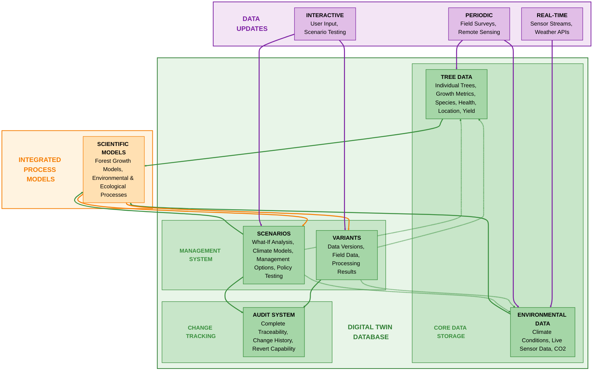

```mermaid
flowchart TB
    subgraph DATABASE[" "]
        DB_SPACER["DIGITAL TWIN DATABASE"]
        subgraph CORE_DATA[" "]
            CD_SPACER["CORE DATA STORAGE"]
            TREES["<b>TREE DATA</b><br/>Individual Trees, Growth Metrics, Species, Health, Location, Yield"]
            ENVIRONMENT["<b>ENVIRONMENTAL DATA</b><br/>Climate Conditions, Live Sensor Data, CO2"]
        end
        
        subgraph MANAGEMENT_SYSTEM[" "]
            MS_SPACER["MANAGEMENT SYSTEM"]
            SCENARIOS["<b>SCENARIOS</b><br/>What-If Analysis, Climate Models, Management Options, Policy Testing"]
            VARIANTS["<b>VARIANTS</b><br/>Data Versions, Field Data, Processing Results"]
        end
        
        subgraph AUDIT_SYSTEM[" "]
            AS_SPACER["CHANGE TRACKING"]
            AUDIT["<b>AUDIT SYSTEM</b><br/>Complete Traceability, Change History, Revert Capability"]
        end
    end
    
    subgraph PROCESS_MODELS[" "]
        PM_SPACER["INTEGRATED PROCESS MODELS"]
        MODELS["<b>SCIENTIFIC MODELS</b><br/>Forest Growth Models, Environmental & Ecological Processes"]
    end
    
    subgraph UPDATE_SOURCES[" "]
        US_SPACER["DATA UPDATES"]
        REAL_TIME["<b>REAL-TIME</b><br/>Sensor Streams, Weather APIs"]
        PERIODIC["<b>PERIODIC</b><br/>Field Surveys, Remote Sensing"]
        INTERACTIVE["<b>INTERACTIVE</b><br/>User Input, Scenario Testing"]
    end

    TREES ==> MODELS
    ENVIRONMENT ==> MODELS
    SCENARIOS ==> MODELS
    MODELS ==> VARIANTS
    MODELS ==> SCENARIOS
    
    REAL_TIME ==> ENVIRONMENT
    PERIODIC ==> TREES
    PERIODIC ==> ENVIRONMENT
    INTERACTIVE ==> SCENARIOS
    INTERACTIVE ==> VARIANTS
    
    VARIANTS ==> AUDIT
    SCENARIOS ==> AUDIT
    
    VARIANTS -.-> TREES
    VARIANTS -.-> ENVIRONMENT
    SCENARIOS -.-> TREES
    SCENARIOS -.-> ENVIRONMENT

    classDef databaseCore fill:#E8F5E8,stroke:#2E7D32,stroke-width:3px,color:#000000,font-size:24px
    classDef coreData fill:#C8E6C9,stroke:#388E3C,stroke-width:2px,color:#000000,font-size:20px
    classDef coreDataContent fill:#A5D6A7,stroke:#388E3C,stroke-width:2px,color:#000000,font-size:24px
    classDef managementSystem fill:#C8E6C9,stroke:#388E3C,stroke-width:2px,color:#000000,font-size:20px
    classDef managementSystemContent fill:#A5D6A7,stroke:#388E3C,stroke-width:2px,color:#000000,font-size:24px
    classDef auditSystem fill:#C8E6C9,stroke:#388E3C,stroke-width:2px,color:#000000,font-size:20px
    classDef auditSystemContent fill:#A5D6A7,stroke:#388E3C,stroke-width:2px,color:#000000,font-size:24px
    classDef processModels fill:#FFF3E0,stroke:#F57C00,stroke-width:3px,color:#000000,font-size:20px
    classDef processModelsContent fill:#FFE0B2,stroke:#F57C00,stroke-width:2px,color:#000000,font-size:24px
    classDef updateSources fill:#F3E5F5,stroke:#7B1FA2,stroke-width:3px,color:#000000,font-size:20px
    classDef updateSourcesContent fill:#E1BEE7,stroke:#7B1FA2,stroke-width:2px,color:#000000,font-size:24px
    classDef dbTitleBox fill:#E8F5E8,stroke:#E8F5E8,stroke-width:0px,color:#2E7D32,font-size:28px,font-weight:bold
    classDef cdTitleBox fill:#C8E6C9,stroke:#C8E6C9,stroke-width:0px,color:#388E3C,font-size:24px,font-weight:bold
    classDef msTitleBox fill:#C8E6C9,stroke:#C8E6C9,stroke-width:0px,color:#388E3C,font-size:24px,font-weight:bold
    classDef asTitleBox fill:#C8E6C9,stroke:#C8E6C9,stroke-width:0px,color:#388E3C,font-size:24px,font-weight:bold
    classDef pmTitleBox fill:#FFF3E0,stroke:#FFF3E0,stroke-width:0px,color:#F57C00,font-size:28px,font-weight:bold
    classDef usTitleBox fill:#F3E5F5,stroke:#F3E5F5,stroke-width:0px,color:#7B1FA2,font-size:28px,font-weight:bold

    class DATABASE databaseCore
    class CORE_DATA coreData
    class TREES,ENVIRONMENT coreDataContent
    class MANAGEMENT_SYSTEM managementSystem
    class SCENARIOS,VARIANTS managementSystemContent
    class AUDIT_SYSTEM auditSystem
    class AUDIT auditSystemContent
    class PROCESS_MODELS processModels
    class MODELS processModelsContent
    class UPDATE_SOURCES updateSources
    class REAL_TIME,PERIODIC,INTERACTIVE updateSourcesContent
    class DB_SPACER dbTitleBox
    class CD_SPACER cdTitleBox
    class MS_SPACER msTitleBox
    class AS_SPACER asTitleBox
    class PM_SPACER pmTitleBox
    class US_SPACER usTitleBox

    linkStyle 0 stroke:#388E3C,stroke-width:4px
    linkStyle 1 stroke:#388E3C,stroke-width:4px
    linkStyle 2 stroke:#388E3C,stroke-width:4px
    linkStyle 3 stroke:#F57C00,stroke-width:4px
    linkStyle 4 stroke:#F57C00,stroke-width:4px
    linkStyle 5 stroke:#7B1FA2,stroke-width:4px
    linkStyle 6 stroke:#7B1FA2,stroke-width:4px
    linkStyle 7 stroke:#7B1FA2,stroke-width:4px
    linkStyle 8 stroke:#7B1FA2,stroke-width:4px
    linkStyle 9 stroke:#7B1FA2,stroke-width:4px
    linkStyle 10 stroke:#388E3C,stroke-width:4px
    linkStyle 11 stroke:#388E3C,stroke-width:4px
    linkStyle 12 stroke:#388E3C,stroke-width:4px
    linkStyle 13 stroke:#388E3C,stroke-width:4px
    linkStyle 14 stroke:#388E3C,stroke-width:4px
    linkStyle 15 stroke:#388E3C,stroke-width:4px
```
