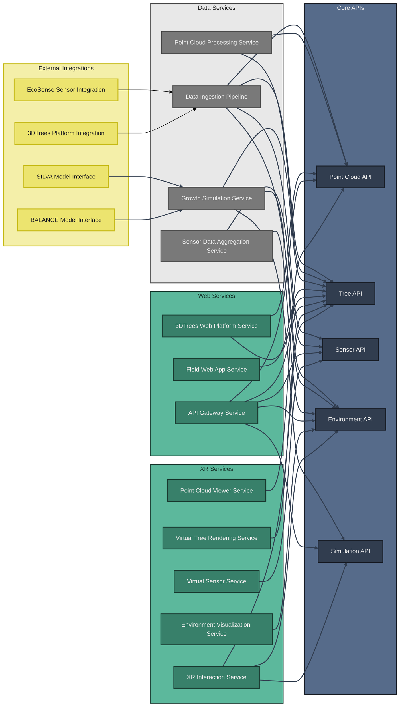

# System Services Architecture

The XR Future Forests Lab is composed of multiple interconnected services that provide specialized functionality across the three-tier architecture. These services consume the core APIs to deliver comprehensive forest monitoring, analysis, and visualization capabilities.

## Service Overview

## Data Services

### Data Ingestion Pipeline Service

**Purpose**: Orchestrates the collection, validation, and initial processing of data from diverse forest monitoring sources.

**Key Functionality**:

- **File Monitoring**: Continuously monitors 3DTrees Platform and Forest Inventory systems for new data uploads
- **API Integration**: Maintains real-time connections to EcoSense sensors and external environmental data sources
- **Data Validation**: Ensures incoming data meets quality standards and format requirements
- **Format Standardization**: Converts diverse data formats into consistent internal representations
- **Temporal Alignment**: Synchronizes timestamps across different data sources for coherent analysis
- **Schema Routing**: Directs validated data to appropriate database schemas through Core APIs

**API Dependencies**: Point Cloud API, Tree API, Sensor API, Environment API

### Point Cloud Processing Service

**Purpose**: Transforms raw LiDAR data into structured forest information through automated analysis pipelines.

**Key Functionality**:

- **Tree Segmentation**: Identifies individual trees within point cloud data using advanced algorithms
- **Species Classification**: Applies machine learning models to classify tree species based on geometric characteristics
- **Structural Analysis**: Extracts precise measurements (height, DBH, crown dimensions) from segmented trees
- **Processing Status Management**: Tracks analysis progress and maintains processing lineage
- **Confidence Scoring**: Provides reliability metrics for segmentation and classification results
- **Variant Management**: Creates and manages PointCloudVariants representing different processing stages

**API Dependencies**: Point Cloud API, Tree API

### Growth Simulation Service

**Purpose**: Orchestrates forest growth modeling using external scientific models and user-defined scenarios.

**Key Functionality**:

- **Model Integration**: Interfaces with external growth models (SILVA, BALANCE) through standardized protocols
- **Scenario Management**: Creates and manages simulation scenarios with varying environmental conditions
- **Parameter Preparation**: Formats current tree and environmental data for specific model requirements
- **Simulation Orchestration**: Coordinates execution of growth models with appropriate input parameters
- **Result Processing**: Converts model outputs into TreeVariants with temporal progression tracking
- **Interactive Simulation**: Supports real-time parameter modification from XR interfaces

**API Dependencies**: Tree API, Environment API, Simulation API

### Sensor Data Aggregation Service

**Purpose**: Processes high-frequency sensor data into meaningful environmental context for forest analysis.

**Key Functionality**:

- **Real-time Processing**: Handles continuous streams of sensor readings with low-latency processing
- **Data Quality Assessment**: Identifies and flags suspect or invalid sensor readings
- **Temporal Aggregation**: Creates time-averaged environmental summaries from raw sensor data
- **Spatial Correlation**: Associates sensor readings with specific forest locations and tree populations
- **Environment Variant Creation**: Generates EnvironmentVariants from aggregated sensor data
- **Alert Generation**: Monitors sensor health and environmental thresholds for anomaly detection

**API Dependencies**: Sensor API, Environment API

## Web Services

### Field Web App Service

**Purpose**: Provides mobile-optimized forest inventory access for field researchers and forest managers.

**Key Functionality**:

- **QR Code Scanning**: Enables instant tree identification through QR code recognition
- **Tree Information Display**: Shows comprehensive tree data including growth history and predictions
- **Offline Capability**: Maintains functionality in areas with limited network connectivity
- **Data Collection Interface**: Allows field workers to update tree measurements and observations
- **Photo Integration**: Supports image capture and association with tree records
- **GPS Integration**: Automatically captures location data for new measurements

**API Dependencies**: Tree API

### 3DTrees Web Platform Service

**Purpose**: Delivers browser-based visualization and management of point cloud data and processing results.

**Key Functionality**:

- **Point Cloud Visualization**: Renders interactive 3D point clouds in web browsers using WebGL
- **Processing Result Overlay**: Displays segmentation and classification results as visual overlays
- **Upload Management**: Handles point cloud file uploads with progress tracking and validation
- **Processing Status Dashboard**: Shows real-time status of point cloud processing jobs
- **Virtual Tree Models**: Generates simplified 3D tree representations from processed data
- **Export Functionality**: Enables download of processed data in various formats

**API Dependencies**: Point Cloud API, Tree API

### API Gateway Service

**Purpose**: Provides unified access point for all system APIs with security, routing, and monitoring capabilities.

**Key Functionality**:

- **Request Routing**: Directs API calls to appropriate backend services based on endpoints
- **Authentication**: Manages user authentication and session handling across all APIs
- **Authorization**: Enforces role-based access control for different user types and data access levels
- **Rate Limiting**: Prevents API abuse through intelligent throttling mechanisms
- **Monitoring & Analytics**: Tracks API usage patterns and performance metrics
- **Caching**: Implements intelligent caching strategies for frequently accessed data

**API Dependencies**: All Core APIs (Point Cloud, Tree, Sensor, Environment, Simulation)

## XR Services

### Virtual Tree Rendering Service

**Purpose**: Creates photorealistic 3D tree models for immersive XR forest experiences.

**Key Functionality**:

- **Procedural Generation**: Creates detailed tree models based on measured structural parameters
- **Species-Specific Rendering**: Applies appropriate visual characteristics for different tree species
- **Temporal Visualization**: Shows tree growth progression through time-lapse visualization
- **Level-of-Detail Management**: Optimizes rendering performance based on user proximity and hardware capabilities
- **Interactive Elements**: Enables user interaction with individual trees for data exploration
- **Real-time Updates**: Synchronizes with database changes to reflect current tree states

**API Dependencies**: Tree API

### Environment Visualization Service

**Purpose**: Transforms abstract environmental data into visible, interactive phenomena within XR environments.

**Key Functionality**:

- **Atmospheric Rendering**: Visualizes wind patterns, humidity, and temperature variations
- **Particle Systems**: Creates dynamic representations of CO₂ flow and nutrient cycling
- **Weather Simulation**: Renders precipitation, seasonal changes, and climate effects
- **Sensor Visualization**: Shows virtual representations of environmental monitoring equipment
- **Data Overlay**: Displays real-time environmental measurements as contextual information
- **Scenario Comparison**: Enables side-by-side visualization of different environmental conditions

**API Dependencies**: Environment API

### Point Cloud Viewer Service

**Purpose**: Provides immersive visualization of raw and processed LiDAR data within XR environments.

**Key Functionality**:

- **High-Performance Rendering**: Efficiently displays millions of 3D points in real-time
- **Processing Overlay**: Shows segmentation and classification results as colored point groupings
- **Interactive Exploration**: Allows users to navigate through point clouds at various scales
- **Measurement Tools**: Provides virtual tools for distance and volume measurements
- **Comparison Views**: Enables comparison between raw scans and processed results
- **Educational Annotations**: Displays contextual information about LiDAR technology and forest structure

**API Dependencies**: Point Cloud API

### XR Interaction Service

**Purpose**: Manages user interactions and parameter modifications within XR forest environments.

**Key Functionality**:

- **Gesture Recognition**: Interprets hand gestures and controller inputs for natural interaction
- **Environmental Manipulation**: Allows users to modify environmental parameters in real-time
- **Tree Management**: Enables addition, removal, or modification of trees within scenarios
- **Simulation Control**: Provides interfaces for starting, pausing, and configuring growth simulations
- **Data Input**: Captures user-defined parameters and scenario modifications
- **Feedback Systems**: Provides haptic and visual feedback for user actions

**API Dependencies**: Tree API, Environment API, Simulation API

### Virtual Sensor Service

**Purpose**: Creates interactive digital representations of environmental monitoring equipment within XR spaces.

**Key Functionality**:

- **Sensor Modeling**: Renders 3D models of various sensor types with accurate visual representation
- **Installation Simulation**: Allows users to virtually deploy sensors and understand placement strategies
- **Data Visualization**: Shows real-time sensor readings as floating displays or color-coded indicators
- **Educational Interaction**: Enables users to learn about sensor functionality through virtual manipulation
- **Network Visualization**: Displays sensor network topology and data flow patterns
- **Maintenance Simulation**: Provides virtual training for sensor installation and maintenance procedures

**API Dependencies**: Sensor API

## External Integrations

### SILVA Model Interface

**Purpose**: Provides standardized integration with the SILVA individual tree growth model.

**Key Functionality**:

- **Model Communication**: Handles data exchange protocols specific to SILVA requirements
- **Parameter Translation**: Converts internal tree data formats to SILVA input specifications
- **Result Processing**: Interprets SILVA growth predictions and converts to internal TreeVariant format
- **Version Management**: Maintains compatibility with different SILVA model versions
- **Performance Optimization**: Manages batch processing for efficient model execution

### BALANCE Model Interface

**Purpose**: Enables integration with the BALANCE stand-level forest growth model.

**Key Functionality**:

- **Stand Aggregation**: Prepares stand-level input data from individual tree measurements
- **Model Execution**: Manages BALANCE model runs with appropriate environmental parameters
- **Result Distribution**: Distributes stand-level predictions back to individual tree variants
- **Scenario Processing**: Handles multiple scenario runs for comparative analysis
- **Quality Assurance**: Validates model outputs and handles error conditions

### EcoSense Sensor Integration

**Purpose**: Manages real-time data collection from EcoSense environmental monitoring networks.

**Key Functionality**:

- **Protocol Management**: Implements EcoSense-specific communication protocols
- **Data Streaming**: Handles high-frequency sensor data streams with minimal latency
- **Device Management**: Monitors sensor health and configuration status
- **Calibration Support**: Manages sensor calibration data and adjustment procedures
- **Error Handling**: Implements robust error recovery for network and sensor failures

### 3DTrees Platform Integration

**Purpose**: Facilitates seamless data exchange with the 3DTrees point cloud platform.

**Key Functionality**:

- **File Monitoring**: Watches for new point cloud uploads and metadata changes
- **Download Management**: Handles secure download of point cloud files from 3DTrees
- **Metadata Synchronization**: Maintains consistency between 3DTrees and internal metadata
- **Authentication**: Manages secure API access to 3DTrees platform services
- **Progress Tracking**: Monitors upload and processing status on the 3DTrees platform

## Service Deployment Considerations

### Scalability Requirements

- **Data Services**: Must handle variable processing loads and large file transfers
- **Web Services**: Require horizontal scaling for multiple concurrent users
- **XR Services**: Need high-performance computing resources for real-time rendering
- **External Integrations**: Should implement queue-based processing for reliability

### Performance Optimization

- **Caching**: Implement distributed caching for frequently accessed data
- **Load Balancing**: Use intelligent routing for optimal resource utilization
- **Resource Management**: Monitor and manage CPU, memory, and storage usage
- **Network Optimization**: Minimize latency for real-time XR interactions

### Reliability & Monitoring

- **Health Checks**: Implement comprehensive service health monitoring
- **Error Recovery**: Design robust error handling and automatic recovery mechanisms
- **Logging**: Maintain detailed logs for debugging and performance analysis
- **Backup Strategies**: Ensure data resilience and service continuity
