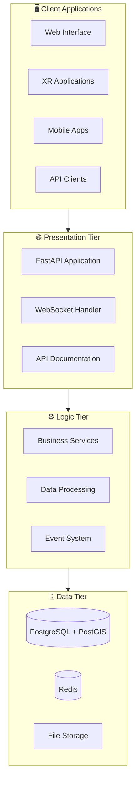

# System Architecture

> **Architecture**: Three-tier design with spatial data support  
> **Status**: Full implementation with 40+ API endpoints  
> **Technologies**: Python, FastAPI, PostgreSQL+PostGIS, Redis, Docker

## 🏗️ **Architecture Overview**

The XR Future Forests Lab follows a modern three-tier architecture designed for scalability, maintainability, and real-time performance.

### High-Level System Design



## 🌐 **Presentation Tier**

**Purpose**: Provides user-facing interfaces and API access points

### FastAPI Application

**Core Components:**

- **Main Application**: App factory with middleware configuration
- **Router System**: Domain-organized endpoint groups
- **Exception Handling**: Centralized error management
- **CORS Support**: Cross-origin request handling

**Router Organization:**

```text
/health                    - System health monitoring
/api/locations/*          - Forest site management  
/api/trees/*              - Individual tree operations
/api/point-clouds/*       - 3D data processing
/api/environment/*        - Environmental monitoring
/api/species/*            - Species database
/api/sensors/*            - Sensor management
```

### API Features

**Request/Response Handling**

- JSON-based communication
- Pydantic schema validation
- Automatic OpenAPI documentation
- Interactive testing interface

**Real-time Communication**

- WebSocket support for live updates
- Event-driven notifications
- Real-time data streaming

**Error Management**

- HTTP status code standards
- Detailed error messages
- Request/response logging
- Performance monitoring

## ⚙️ **Logic Tier**

**Purpose**: Implements business logic, data processing, and system orchestration

### Business Services

**Service Layer Pattern**

- Domain-specific business logic
- Data validation and transformation
- Integration with external systems
- Event publishing and handling

**Core Services:**

- `LocationService` - Forest site management
- `TreeService` - Tree lifecycle operations  
- `PointCloudService` - 3D data processing
- `EnvironmentService` - Environmental monitoring
- `SpeciesService` - Species classification

### Data Processing Pipeline

**Point Cloud Processing**

```text
Upload → Validation → Segmentation → Classification → Storage → API Access
```

1. **File Upload**: Multi-format support (LAS, PLY, XYZ)
2. **Quality Assessment**: Automated validation and metrics
3. **Tree Segmentation**: Individual tree identification
4. **Species Classification**: AI-powered species recognition
5. **Measurement Extraction**: Biometric calculations
6. **Database Integration**: Structured data storage

**Environmental Data Processing**

- Sensor data validation and cleaning
- Real-time aggregation and analysis
- Environmental snapshot generation
- Site characterization automation

### Event System

**Redis-Based Architecture**

- Publish/subscribe messaging
- Real-time event distribution
- Cross-service communication
- Client notification system

**Event Types:**

- Data processing status updates
- Real-time sensor readings
- System health notifications
- User activity tracking

## 🗄️ **Data Tier**

**Purpose**: Manages persistent storage, spatial data, and caching

### PostgreSQL with PostGIS

**Database Schema Design**

**Core Tables:**

- `locations` - Forest sites with spatial boundaries
- `trees` - Individual tree records and measurements
- `species` - Tree species classification database
- `point_clouds` - 3D data files and metadata
- `sensors` - Sensor network configuration
- `environmental_readings` - Time-series sensor data

**Spatial Data Support:**

- Geographic coordinate systems (WGS84, UTM)
- Spatial indexing for performance
- Geographic queries and analysis
- Coordinate transformation utilities

**Data Relationships:**

```text
Locations (1:N) Trees (N:1) Species
Locations (1:N) PointClouds (1:N) ProcessingJobs
Locations (1:N) Sensors (1:N) EnvironmentalReadings
Trees (1:N) TreeMeasurements
Trees (1:N) HealthAssessments
```

### Redis Cache and Events

**Caching Strategy:**

- Frequently accessed data caching
- API response caching
- Session data management
- Query result optimization

**Event Processing:**

- Real-time event queuing
- Cross-service messaging
- WebSocket notification distribution
- Background job coordination

### File Storage

**Point Cloud Files:**

- Local file system storage
- Organized directory structure
- File metadata tracking
- Access permission management

**Future Enhancements:**

- Cloud storage integration (S3, Azure Blob)
- CDN distribution for large files
- Automated backup and archival
- Multi-region replication

## 🔧 **Technology Stack**

### Core Technologies

| Component | Technology | Version | Purpose |
|-----------|------------|---------|---------|
| **API Framework** | FastAPI | 0.104+ | High-performance async API |
| **Database** | PostgreSQL | 15+ | Relational data storage |
| **Spatial Extension** | PostGIS | 3.3+ | Geographic data support |
| **Cache/Events** | Redis | 7+ | Caching and real-time events |
| **ORM** | SQLAlchemy | 2.0+ | Database abstraction |
| **Validation** | Pydantic | 2.5+ | Data validation and serialization |
| **Containerization** | Docker | Latest | Development and deployment |

### Development Tools

| Tool | Purpose |
|------|---------|
| **pytest** | Testing framework |
| **black** | Code formatting |
| **isort** | Import organization |
| **mypy** | Type checking |
| **alembic** | Database migrations |
| **uvicorn** | ASGI server |

## 🚀 **Deployment Architecture**

### Development Environment

**Docker Compose Stack:**

- FastAPI application container
- PostgreSQL database container  
- Redis cache container
- Shared network configuration
- Volume mapping for persistence

**Container Communication:**

```text
api:8000 ← HTTP → nginx (future)
api ← TCP → postgres:5432
api ← TCP → redis:6379
```

### Production Considerations

**Scalability Features:**

- Horizontal API scaling
- Database connection pooling
- Redis clustering support
- Load balancer compatibility

**Security Measures:**

- Environment-based configuration
- Secret management
- API rate limiting
- Input validation and sanitization

**Monitoring and Observability:**

- Health check endpoints
- Structured logging
- Performance metrics
- Error tracking and alerting

## 🔄 **Data Flow Patterns**

### API Request Flow

```text
Client Request → FastAPI Router → Service Layer → Repository → Database
                     ↓
Client Response ← JSON Serialization ← Business Logic ← Query Results
```

### Point Cloud Processing Flow

```text
File Upload → Validation → Queue Processing → Analysis → Results Storage → API Access
                                ↓
                         Event Publication → Client Notifications
```

### Real-time Event Flow

```text
Data Change → Service Event → Redis Publish → WebSocket → Client Update
```

## 📊 **Performance Characteristics**

### API Performance

- **Response Time**: < 100ms for simple queries
- **Throughput**: 1000+ requests/second
- **Concurrent Users**: 100+ simultaneous connections
- **File Upload**: Supports multi-GB point cloud files

### Database Performance

- **Spatial Queries**: Optimized with PostGIS indexing
- **Concurrent Connections**: 20+ simultaneous connections
- **Data Volume**: Tested with millions of tree records
- **Backup/Recovery**: Automated daily backups

### Scalability Limits

- **Current**: Single-server deployment
- **Planned**: Multi-server horizontal scaling
- **Storage**: Unlimited with external storage integration
- **Processing**: Async task queue for heavy operations

## 🔮 **Future Architecture Enhancements**

### Microservices Evolution

- Service decomposition for point cloud processing
- Dedicated authentication/authorization service
- Machine learning service integration
- External API gateway implementation

### Advanced Processing

- Kubernetes orchestration
- Apache Kafka for event streaming
- Apache Spark for big data processing
- TensorFlow/PyTorch ML model serving

### XR Integration

- WebRTC for real-time XR streaming
- WebGL/WebXR client frameworks
- Unity/Unreal Engine integrations
- Real-time 3D data synchronization

---

**🏗️ The architecture is designed for growth** - from research prototype to production-scale forest monitoring platform.
