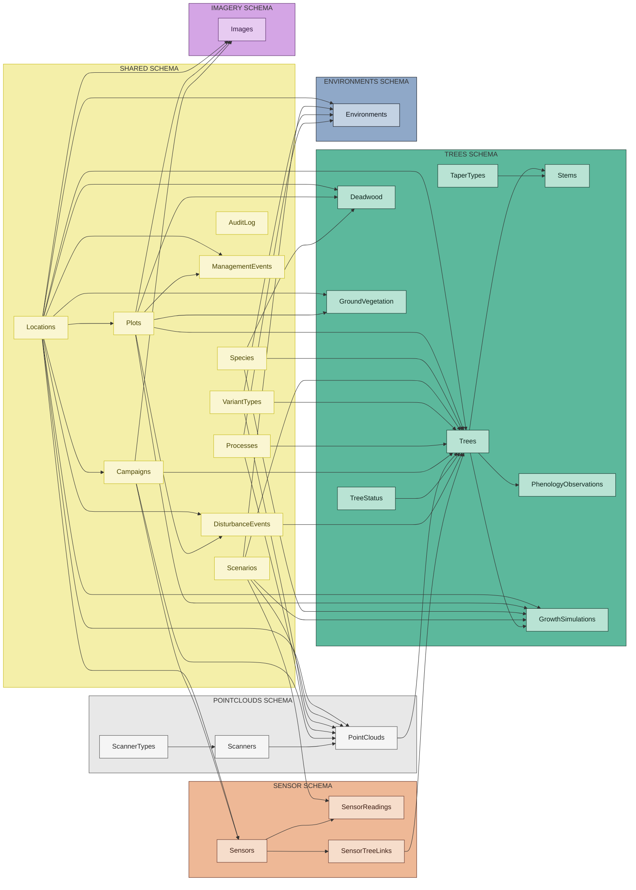
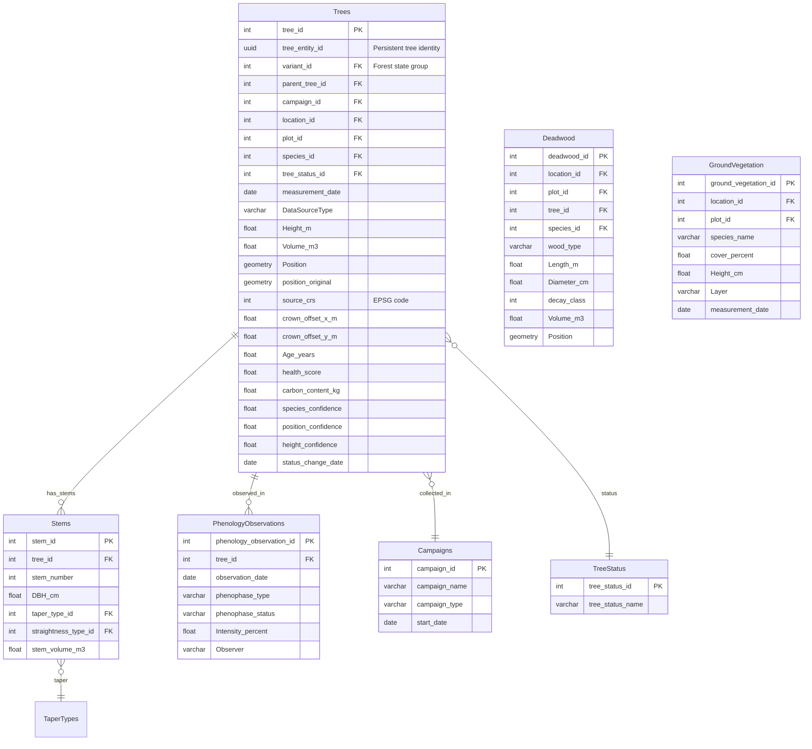
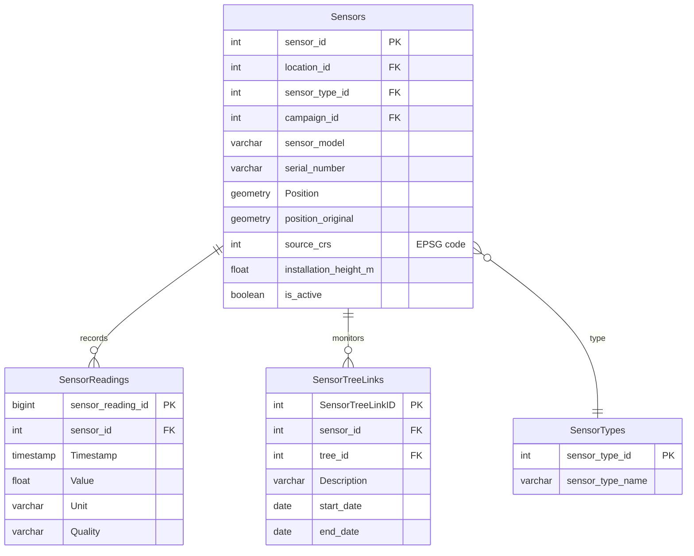
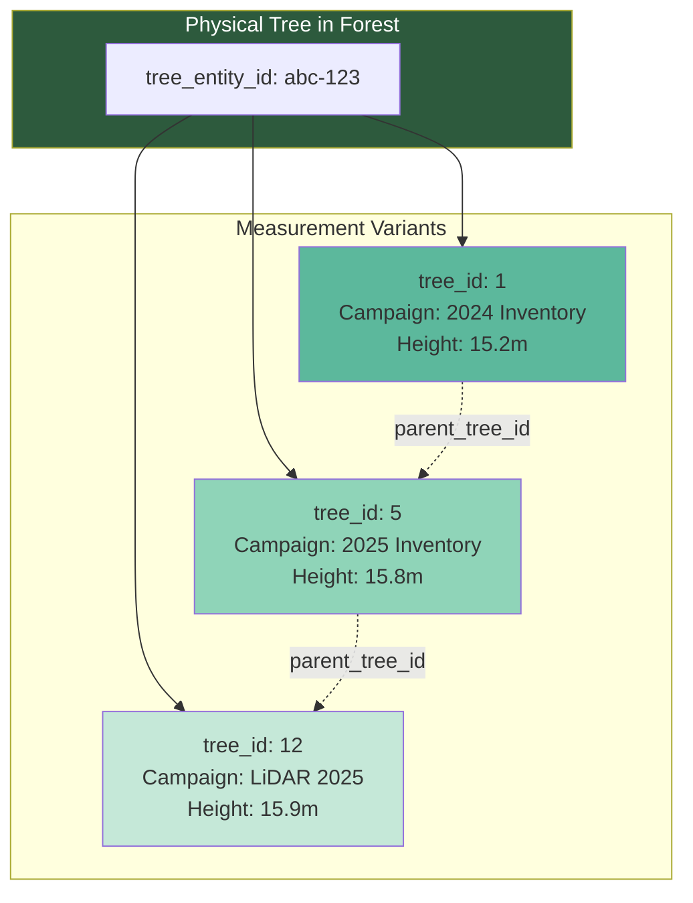
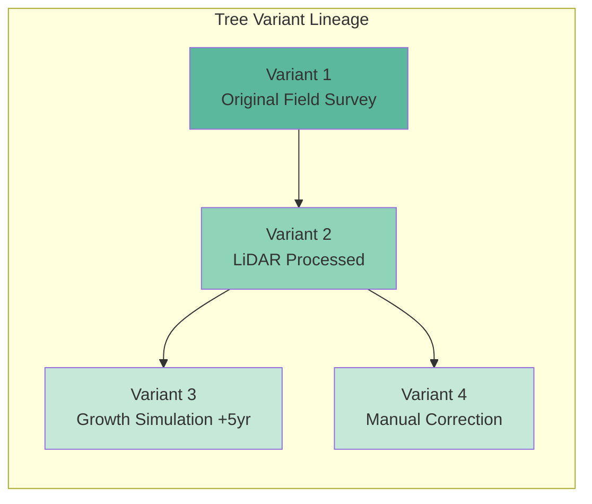
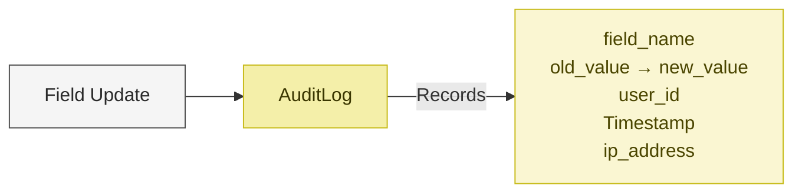
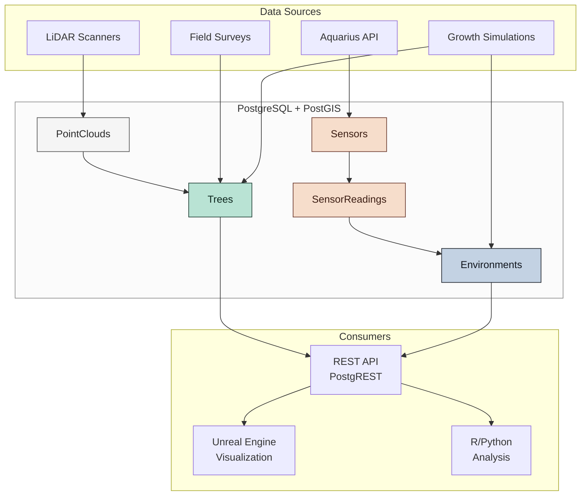

# Digital Forest Twin - Database Overview

**XR Future Forests Lab** | Database Architecture Summary

---

## Executive Summary

The Digital Forest Twin is a PostgreSQL-based spatial database for forest research, designed to integrate LiDAR point clouds, tree measurements, environmental sensor data, and climate simulations into a unified data platform.

**Key Capabilities:**

- Multi-stem tree modeling with morphological attributes
- Temporal versioning via variant-based lineage
- Real-time sensor integration with external APIs (Aquarius)
- PostGIS spatial queries and coordinate transformations
- Field-level audit trail for reproducible science

---

## Schema Architecture

The database is organized into **6 schemas**, each handling a specific domain:



**Schema colour key:**

| | Schema | Domain |
|---|---|---|
| 🟨 | `shared` | Reference & audit tables used across all domains |
| ⬜ | `pointclouds` | LiDAR scans and scanner hardware |
| 🟩 | `trees` | Tree inventory, stems, morphology, phenology |
| 🟧 | `sensor` | Environmental sensors and time-series readings |
| 🟦 | `environments` | Aggregated environmental conditions |
| 🟪 | `imagery` | Aerial and ground imagery |

---

## Schema Details

### 1. 🟨 Shared Schema

Central reference tables used across all domains.

| Table | Purpose |
|-------|---------|
| **Locations** | Research sites (`ecosense`, `mathisle`) with PostGIS boundaries, elevation, slope, soil type |
| **Plots** | Named monitoring sub-areas within a location (e.g. `douglas_fir_plot`, tree subplots) |
| **Species** | Tree species (common name, scientific name, growth characteristics, is_deciduous) |
| **Scenarios** | Location-scoped management regimes (Location → Scenario → Variant); e.g. `natural_growth` per site |
| **VariantTypes** | How a variant's data was produced: original, processed, manual, simulated_growth, user_input, sensor_derived, model_output, repeat_measurement |
| **Campaigns** | Data collection events (LiDAR flights, field inventories) with methodology |
| **Processes** | Algorithm/processing metadata with citations |
| **AuditLog** | Field-level change tracking with user attribution |
| **ManagementEvents** | Forest management activities (thinning, planting, harvesting) |
| **DisturbanceEvents** | Natural disturbance events (storms, fire, insects, drought) |

### 2. ⬜ PointClouds Schema

LiDAR scan data and processing variants with scanner hardware tracking.

**Scanner Reference Tables:**

| Table | Purpose |
|-------|---------|
| **ScannerTypes** | LiDAR scanner type classifications (Terrestrial_TLS, Aerial_ALS, Mobile_MLS, UAV_ULS) with manufacturers |
| **Scanners** | Individual scanner hardware instances with serial numbers, acquisition and calibration dates |

**PointClouds Table:**

| Field | Description |
|-------|-------------|
| point_cloud_id | Unique row identifier |
| parent_point_cloud_id | Links to source point cloud for processing lineage |
| campaign_id | Links scan to data collection campaign |
| scanner_id | Physical scanner hardware used for this scan |
| scan_date | Acquisition timestamp |
| file_path | S3/storage reference |
| source_crs | EPSG code of original coordinate reference system |
| platform_type | Scanning platform: terrestrial, aerial, mobile, UAV |
| flight_altitude_m | Flight altitude above ground (for aerial/UAV) |
| flight_speed_ms | Platform speed during scanning in m/s |
| scan_angle_deg | Scanner field of view angle in degrees |
| Overlap_percent | Swath overlap percentage (for aerial scans) |
| point_count | Number of points |
| point_density_per_m2 | Average point density in points per square meter |
| processing_status | pending, processing, completed, failed, cancelled |

### 3. 🟩 Trees Schema

Individual tree measurements with multi-stem support.



**New Fields for Data Quality:**

| Field | Description |
|-------|-------------|
| `tree_entity_id` | Persistent UUID identifying the physical tree across all variants |
| `campaign_id` | Links measurement to data collection campaign |
| `plot_id` | Sub-plot within the location where the tree is located |
| `measurement_date` | Actual field measurement date (vs. import date) |
| `DataSourceType` | How data was collected: lidar, field, photogrammetry, estimated, simulated |
| `source_crs` | EPSG code of original coordinate reference system for position_original |
| `CrownOffsetX/Y_m` | Crown asymmetry (offset from trunk position) |
| `species_confidence` | 0-1 confidence in species identification |
| `position_confidence` | 0-1 confidence in position accuracy |
| `height_confidence` | 0-1 confidence in height measurement |
| `status_change_date` | Date when tree status changed (e.g., mortality date) |

**Morphology Lookup Tables:**

- `TaperTypes`: Cylinder, Cone, Paraboloid, Neiloid
- `StraightnessTypes`: Straight, Slight_sweep, Moderate_sweep, Severe_sweep
- `BranchingPatterns`: Alternate, Opposite, Whorled, Spiral
- `BarkCharacteristics`: Smooth, Furrowed, Plated, Exfoliating

**Additional Trees Schema Tables:**

| Table | Purpose |
|-------|---------|
| **PhenologyObservations** | Tree phenology observations tracking seasonal development phases (bud_break, leaf_out, flowering, fruit_set, leaf_color, leaf_fall, dormancy) |
| **Deadwood** | Dead wood inventory including standing dead, fallen logs, stumps, and branches with decay classification (1-5) |
| **GroundVegetation** | Ground vegetation survey records by plot and layer (herb, shrub, moss, litter, fern, grass) |
| **GrowthSimulations** | Per-tree dimensional projections from external growth simulators (SILVA, FVS, iLand, manual) at discrete future years, keyed by `run_id` and `tree_entity_id`; powers the Unreal Time Machine feature |

### 4. 🟧 Sensor Schema

Environmental monitoring hardware and time-series data.



**Sensor Types:** Temperature, Humidity, CO2, Light, Soil_Moisture, Wind, Stem_Radial_Variation, Sap_Flow

**New Sensor Columns:**

| Field | Description |
|-------|-------------|
| `campaign_id` | Deployment campaign this sensor was installed during |
| `source_crs` | EPSG code of original coordinate reference system for position_original |
| `installation_height_m` | Height of sensor installation above ground in meters |

**SensorTreeLinks** now includes `start_date` and `end_date` fields to track the temporal validity of sensor-to-tree relationships.

**External Integration:** `external_id` and `ExternalMetadata` columns enable synchronization with the Aquarius API for automated data ingestion.

### 5. 🟦 Environments Schema

Aggregated environmental conditions per location/time period.

| Field | Description |
|-------|-------------|
| avg_temperature_c | Mean temperature |
| avg_humidity_percent | Mean humidity |
| total_precipitation_mm | Precipitation total |
| avg_soil_moisture_percent | Soil moisture |
| stress_factor | 0.0-1.0 combined stress indicator |
| nutrient_nitrogen_mg_kg | Soil nitrogen content |

---

## Key Design Patterns

### Persistent Tree Identity

The `tree_entity_id` (UUID) provides a stable identifier for physical trees across all measurement variants:



### Campaign-Based Data Collection

Campaigns track data collection events with full methodology:

| Campaign Type | Example |
|---------------|---------|
| `lidar_flight` | Annual LiDAR acquisition flight |
| `field_inventory` | Ground-based tree measurements |
| `sensor_deployment` | Installation of environmental sensors |
| `drone_survey` | UAV-based photogrammetry |
| `manual_update` | Individual tree corrections |

**Workflow:**

1. Create Campaign record with dates, methodology, equipment
2. Import data with `campaign_id` reference
3. Set `variant_type_id` = "repeat_measurement" for follow-up surveys
4. Link to parent tree row via `parent_tree_id` using `tree_entity_id` matching

### Variant-Based Lineage

All core entities (PointClouds, Trees, Environments) use a parent-child versioning pattern:



**Benefits:**

- Full temporal history of measurements
- Compare different processing algorithms
- Reproducible simulation scenarios
- Non-destructive updates

### Data Quality Tracking

Per-field confidence scores enable quality-aware analysis:

```sql
-- Find trees with uncertain species identification
SELECT tree_entity_id, species_id, species_confidence
FROM trees.trees
WHERE species_confidence < 0.8
ORDER BY species_confidence;

-- Compare LiDAR vs field measurements
SELECT tree_entity_id, DataSourceType, Height_m, height_confidence
FROM trees.trees
WHERE tree_entity_id = 'abc-123'
ORDER BY measurement_date;
```

### Spatial Data (PostGIS)

All positions stored as PostGIS geometries:

```sql
Position         -- WGS84 (EPSG:4326) for standardized queries
position_original -- Original CRS preserved (e.g., EPSG:32632)
Boundary         -- Polygon geometries for locations
```

### Audit Trail

Every data modification is tracked:



Junction tables link audit entries to specific variants:

- `AuditLog_Trees`
- `AuditLog_PointClouds`
- `AuditLog_Environments`
- `AuditLog_Stems`

---

## Data Flow



---

## Technology Stack

| Component | Technology |
|-----------|------------|
| Database | PostgreSQL 15 + PostGIS |
| Infrastructure | Self-hosted Supabase |
| REST API | PostgREST (auto-generated) |
| Edge Functions | Deno (TypeScript) |
| Data Import | Python scripts |
| Visualization | Unreal Engine 5 |

---

## Access Patterns

### REST API (Port 8000)

```bash
# Get trees with species info
GET /rest/v1/trees?select=*,species(common_name)

# Filter by location
GET /rest/v1/trees?location_id=eq.4

# Spatial query (via RPC)
POST /rest/v1/rpc/trees_within_radius
```

### Direct SQL

```sql
-- Trees with stems at location
SELECT t.*, s.dbh_cm, sp.common_name
FROM trees.trees t
JOIN trees.stems s ON t.tree_id = s.tree_id
JOIN shared.species sp ON t.species_id = sp.species_id
WHERE t.location_id = 4;

-- Sensor readings for tree correlation
SELECT sr.timestamp, sr.value, stl.tree_id
FROM sensor.sensorreadings sr
JOIN sensor.sensor_tree_links stl ON sr.sensor_id = stl.sensor_id
WHERE sr.timestamp > NOW() - INTERVAL '30 days';
```

---

## Summary

The Digital Forest Twin database provides:

1. **Unified spatial model** for LiDAR, tree measurements, and sensors
2. **Temporal versioning** through variant lineage
3. **Multi-stem support** with detailed morphological attributes
4. **External API integration** for automated sensor data ingestion
5. **Field-level auditing** for scientific reproducibility
6. **Auto-generated REST API** for application integration

For detailed schema definitions, see [database_schema.md](database_schema.md) and [database-erd.dbml](database-erd.dbml).
