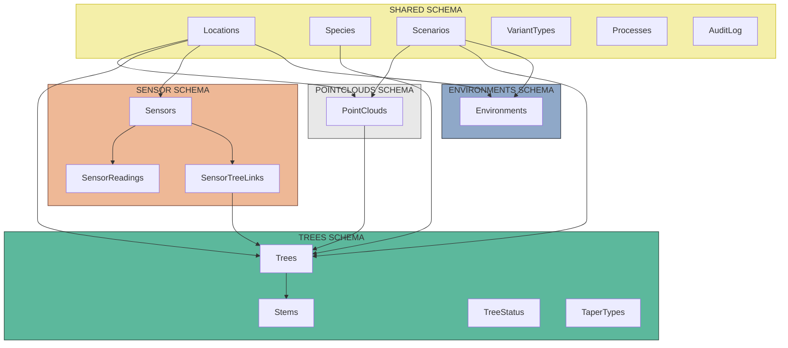
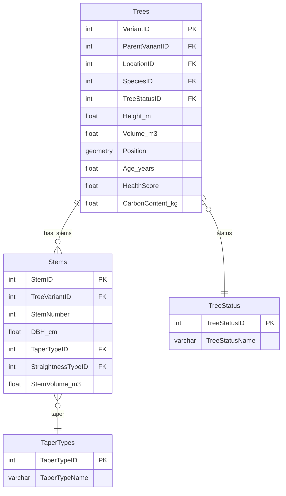
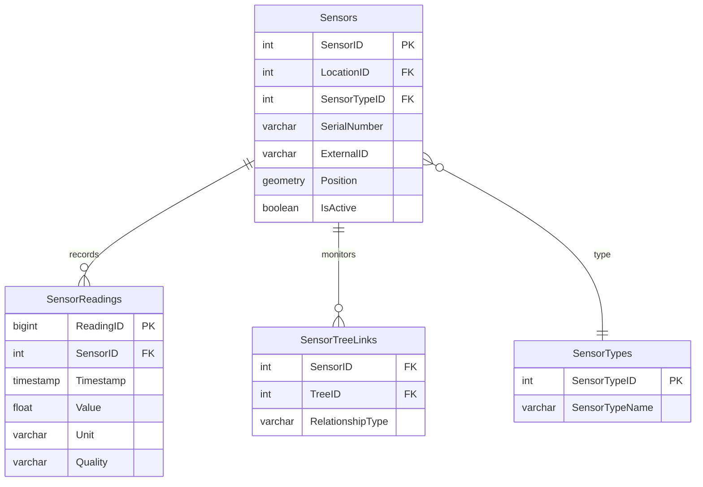
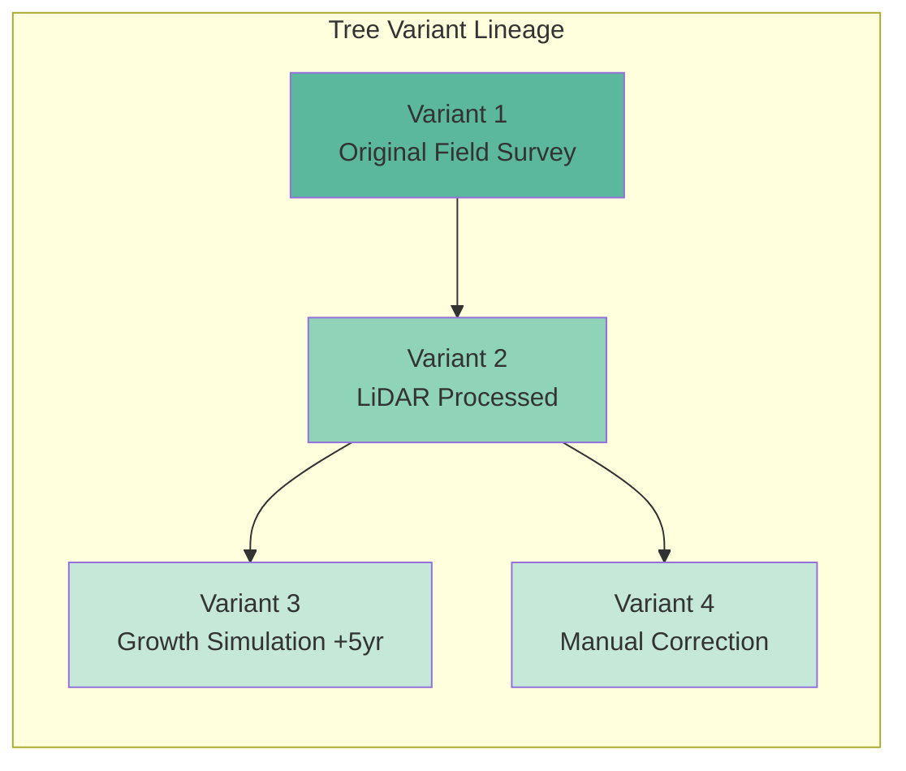
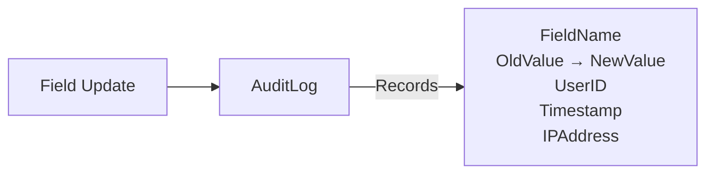
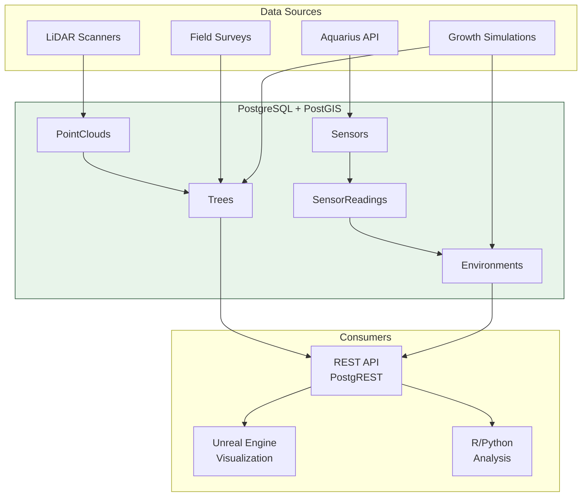

# Digital Forest Twin - Database Overview

**XR Future Forests Lab** | Database Architecture Summary

---

## Executive Summary

The Digital Forest Twin is a PostgreSQL-based spatial database for forest research, designed to integrate LiDAR point clouds, tree measurements, environmental sensor data, and climate simulations into a unified data platform.

**Key Capabilities:**

- Multi-stem tree modeling with morphological attributes
- Temporal versioning via variant-based lineage
- Real-time sensor integration with external APIs (Aquarius)
- PostGIS spatial queries and coordinate transformations
- Field-level audit trail for reproducible science

---

## Schema Architecture

The database is organized into **5 schemas**, each handling a specific domain:



---

## Schema Details

### 1. Shared Schema

Central reference tables used across all domains.

| Table | Purpose |
|-------|---------|
| **Locations** | Forest plots with PostGIS boundaries, elevation, slope, soil type |
| **Species** | Tree species (common name, scientific name, growth characteristics) |
| **Scenarios** | Named analysis variants (Current_Conditions, Climate_Change_2050) |
| **VariantTypes** | Version types: original, processed, simulated, manual, repeat_measurement |
| **Processes** | Algorithm/processing metadata with citations |
| **AuditLog** | Field-level change tracking with user attribution |

### 2. PointClouds Schema

LiDAR scan data and processing variants.

| Field | Description |
|-------|-------------|
| VariantID | Unique version identifier |
| ParentVariantID | Links to source variant |
| ScanDate | Acquisition timestamp |
| FilePath | S3/storage reference |
| PointCount | Number of points |
| ProcessingStatus | pending, processing, completed, failed |

### 3. Trees Schema

Individual tree measurements with multi-stem support.



**Morphology Lookup Tables:**

- `TaperTypes`: Cylinder, Cone, Paraboloid, Neiloid
- `StraightnessTypes`: Straight, Slight_sweep, Moderate_sweep, Severe_sweep
- `BranchingPatterns`: Alternate, Opposite, Whorled, Spiral
- `BarkCharacteristics`: Smooth, Furrowed, Plated, Exfoliating

### 4. Sensor Schema

Environmental monitoring hardware and time-series data.



**Sensor Types:** Temperature, Humidity, CO2, Light, Soil_Moisture, Wind

**External Integration:** `ExternalID` and `ExternalMetadata` columns enable synchronization with the Aquarius API for automated data ingestion.

### 5. Environments Schema

Aggregated environmental conditions per location/time period.

| Field | Description |
|-------|-------------|
| AvgTemperature_C | Mean temperature |
| AvgHumidity_percent | Mean humidity |
| TotalPrecipitation_mm | Precipitation total |
| AvgSoilMoisture_percent | Soil moisture |
| StressFactor | 0.0-1.0 combined stress indicator |
| NutrientNitrogen_mg_kg | Soil nitrogen content |

---

## Key Design Patterns

### Variant-Based Lineage

All core entities (PointClouds, Trees, Environments) use a parent-child versioning pattern:



**Benefits:**

- Full temporal history of measurements
- Compare different processing algorithms
- Reproducible simulation scenarios
- Non-destructive updates

### Spatial Data (PostGIS)

All positions stored as PostGIS geometries:

```sql
Position         -- WGS84 (EPSG:4326) for standardized queries
PositionOriginal -- Original CRS preserved (e.g., EPSG:32632)
Boundary         -- Polygon geometries for locations
```

### Audit Trail

Every data modification is tracked:



Junction tables link audit entries to specific variants:

- `AuditLog_Trees`
- `AuditLog_PointClouds`
- `AuditLog_Environments`
- `AuditLog_Stems`

---

## Data Flow



---

## Technology Stack

| Component | Technology |
|-----------|------------|
| Database | PostgreSQL 15 + PostGIS |
| Infrastructure | Self-hosted Supabase |
| REST API | PostgREST (auto-generated) |
| Edge Functions | Deno (TypeScript) |
| Data Import | Python scripts |
| Visualization | Unreal Engine 5 |

---

## Access Patterns

### REST API (Port 8000)

```bash
# Get trees with species info
GET /rest/v1/trees?select=*,species(commonname)

# Filter by location
GET /rest/v1/trees?locationid=eq.4

# Spatial query (via RPC)
POST /rest/v1/rpc/trees_within_radius
```

### Direct SQL

```sql
-- Trees with stems at location
SELECT t.*, s.dbh_cm, sp.commonname
FROM trees.trees t
JOIN trees.stems s ON t.variantid = s.treevariantid
JOIN shared.species sp ON t.speciesid = sp.speciesid
WHERE t.locationid = 4;

-- Sensor readings for tree correlation
SELECT sr.timestamp, sr.value, stl.treeid
FROM sensor.sensorreadings sr
JOIN sensor.sensortreelinks stl ON sr.sensorid = stl.sensorid
WHERE sr.timestamp > NOW() - INTERVAL '30 days';
```

---

## Summary

The Digital Forest Twin database provides:

1. **Unified spatial model** for LiDAR, tree measurements, and sensors
2. **Temporal versioning** through variant lineage
3. **Multi-stem support** with detailed morphological attributes
4. **External API integration** for automated sensor data ingestion
5. **Field-level auditing** for scientific reproducibility
6. **Auto-generated REST API** for application integration

For detailed schema definitions, see [database-schema.md](database-schema.md) and [database-erd.dbml](database-erd.dbml).
