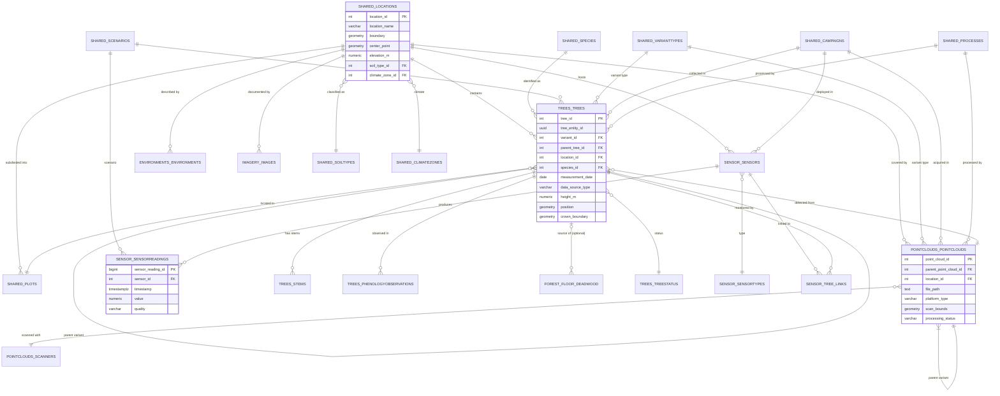
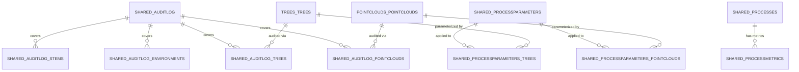

# Database Schema: Digital Forest Twin Database

**Document Version:** 1.0
**Date:** 2026-05-11
**Status:** Active

<!-- DOC_KIND: reference -->
<!-- DOC_ROLE: canonical -->
<!-- READ_WHEN: Read when you need entities, relationships, constraints, column types, or migration-facing schema facts. -->
<!-- SKIP_WHEN: Skip when you only need endpoint contracts or deployment steps. -->
<!-- PRIMARY_SOURCES: docker/volumes/db/init/10-baseline-schema.sql, supabase/migrations/ -->

<!-- SCOPE: Database schema (ER diagrams, table definitions, data dictionary, indexes, constraints, migrations, normalization) ONLY. -->
<!-- DO NOT add here: API endpoints → api-spec.md, Tech stack versions → architecture.md, Deployment → deployment-guide.md, Docker setup → docs/docker/ -->

## Quick Navigation

- [Docs Hub](README.md)
- [Architecture](architecture.md)
- [API Spec](api-spec.md)
- [Deployment Guide](deployment-guide.md)
- [Existing DB Overview](database-overview.md)
- [Existing DB ERD (DBML)](database-erd.dbml)

## Agent Entry

| Signal | Value |
|--------|-------|
| Purpose | Documents entities, relationships, indexes, constraints, and migration-facing schema details. |
| Read When | You need exact database structure, column types, integrity rules, or schema lineage. |
| Skip When | You only need API contracts or operational commands. |
| Canonical | Yes |
| Next Docs | [Architecture](architecture.md), [API Spec](api-spec.md), [DB Overview](database-overview.md) |
| Primary Sources | `docker/volumes/db/init/10-baseline-schema.sql`, `supabase/migrations/` |

---

## 1. Introduction

### 1.1 Purpose

This document specifies the database schema, entity relationships, and data dictionary for the Digital Forest Twin Database. The database stores field measurements, LiDAR scan data, sensor time-series, environmental conditions, and imagery for forest plot management and VR digital twin generation.

### 1.2 Database System

**PostgreSQL 15** with **PostGIS 3** (geometry types in the `extensions` schema, aliased as `extensions.GEOMETRY`). All spatial columns use WGS84 (EPSG:4326). The deployment runs via Docker — see `docker/docker-compose.yml`.

### 1.3 Schema Organization

The database is organized into **seven domain schemas** plus `public` (PostgREST-facing views):

| Schema | Purpose | Primary Tables |
|--------|---------|----------------|
| `shared` | Reference and cross-domain data | Locations, Species, Scenarios, Campaigns, Plots, Processes, AuditLog, ManagementEvents, DisturbanceEvents |
| `trees` | Tree measurements, variants, and simulator output | Trees, Stems, PhenologyObservations, GrowthSimulations, morphology lookups |
| `forest_floor` | Plot/site-level surveys, not tied to a single tree | Deadwood, GroundVegetation |
| `pointclouds` | LiDAR scan data and processing lineage | PointClouds, ScannerTypes, Scanners |
| `sensor` | Environmental sensor hardware and time-series | SensorTypes, Sensors, SensorReadings, sensor_tree_links |
| `environments` | Environmental condition variants | Environments |
| `imagery` | Aerial and ground-based images | Images |
| `public` | PostgREST API views (mirrors above schemas) | Views only — no data |

### 1.4 Normalization

Third Normal Form (3NF) throughout. Selective use of JSONB (`external_metadata` on `sensor.Sensors`, `input_data`/`output_data` on `shared.ProcessingJobs`) for semi-structured external system payloads. All spatial data uses PostGIS geometry columns rather than separate lat/lon columns.

---

## 2. Entity Relationship Diagram

### 2.1 Core Domain ER Diagram



### 2.2 Audit and Process ER Diagram



---

## 3. Data Dictionary

### 3.1 `shared.Locations`

**Description:** Forest plot locations with spatial boundaries, elevation, soil, and climate context. Central reference table — all domain data links back to a Location.

| Column | Type | Null | Default | Constraints | Description |
|--------|------|------|---------|-------------|-------------|
| `location_id` | SERIAL | NO | auto | PRIMARY KEY | Unique location identifier |
| `location_name` | VARCHAR(200) | NO | — | UNIQUE | Human-readable location name |
| `Boundary` | GEOMETRY(Polygon, 4326) | YES | NULL | GIST index | PostGIS polygon defining plot boundary in WGS84 |
| `center_point` | GEOMETRY(Point, 4326) | YES | NULL | GIST index | Plot center point in WGS84 |
| `Description` | TEXT | YES | NULL | — | Free-text description |
| `Elevation_m` | NUMERIC(8,2) | YES | NULL | — | Site elevation in meters |
| `Slope_deg` | NUMERIC(5,2) | YES | NULL | 0–90 | Slope in degrees |
| `Aspect` | VARCHAR(3) | YES | NULL | N/NE/E/SE/S/SW/W/NW | Cardinal aspect direction |
| `soil_type_id` | INTEGER | YES | NULL | FK → `shared.SoilTypes` | USDA soil classification |
| `climate_zone_id` | INTEGER | YES | NULL | FK → `shared.ClimateZones` | Köppen climate zone |
| `created_at` | TIMESTAMPTZ | NO | NOW() | — | Record creation timestamp |
| `updated_at` | TIMESTAMPTZ | YES | NULL | auto-updated by trigger | Last update timestamp |
| `created_by` / `updated_by` | VARCHAR(200) | YES | NULL | — | User attribution |

**Indexes:** `GIST(Boundary)`, `GIST(center_point)`, `(soil_type_id)`, `(climate_zone_id)`

---

### 3.2 `shared.Species`

**Description:** Tree species reference with growth characteristics and GBIF validation.

| Column | Type | Null | Constraints | Description |
|--------|------|------|-------------|-------------|
| `species_id` | SERIAL | NO | PRIMARY KEY | — |
| `scientific_name` | VARCHAR(200) | NO | UNIQUE | Binomial scientific name |
| `common_name` | VARCHAR(200) | YES | — | Common name |
| `max_height_m` | NUMERIC(6,2) | YES | — | Maximum typical height (m) |
| `max_dbh_cm` | NUMERIC(6,2) | YES | — | Maximum DBH (cm) |
| `typical_lifespan_years` | INTEGER | YES | — | Typical lifespan (years) |
| `growth_rate` | VARCHAR(20) | YES | very_slow / slow / moderate / fast / very_fast | Growth rate classification |
| `shade_tolerance` | VARCHAR(20) | YES | very_low / low / moderate / high / very_high | Shade tolerance level |
| `is_deciduous` | BOOLEAN | YES | — | Deciduous (true) or evergreen (false) |
| `gbif_key` | INTEGER | YES | — | GBIF taxon key for validation |
| `gbif_accepted_name` | VARCHAR(200) | YES | — | GBIF accepted scientific name |

**Lookup data source:** `data/lookups/species.csv`

---

### 3.3 `shared.Campaigns`

**Description:** Data collection campaigns grouping related field work (LiDAR flights, field inventories, sensor deployments).

| Column | Type | Null | Constraints | Description |
|--------|------|------|-------------|-------------|
| `campaign_id` | SERIAL | NO | PRIMARY KEY | — |
| `campaign_name` | VARCHAR(200) | NO | UNIQUE | Unique campaign name |
| `campaign_type` | VARCHAR(50) | NO | lidar_flight / field_inventory / sensor_deployment / drone_survey / manual_update | Campaign type |
| `location_id` | INTEGER | YES | FK → `shared.Locations` ON DELETE SET NULL | Associated location |
| `start_date` | DATE | NO | — | Campaign start date |
| `end_date` | DATE | YES | ≥ start_date | Campaign end date |
| `Methodology` | TEXT | YES | — | Data collection methodology |
| `Equipment` | TEXT | YES | — | Equipment used |

---

### 3.4 `trees.Trees`

**Description:** Tree measurement and simulation rows. Each row is one physical-tree record within a specific forest state (Variant). `tree_entity_id` is the stable identity across all rows. `variant_id` groups all rows belonging to the same time step / scenario snapshot.

| Column | Type | Null | Constraints | Description |
|--------|------|------|-------------|-------------|
| `tree_id` | SERIAL | NO | PRIMARY KEY | Unique row identifier |
| `tree_entity_id` | UUID | NO | DEFAULT gen_random_uuid() | Persistent ID for the physical tree across all rows |
| `variant_id` | INTEGER | YES | FK → `shared.Variants` ON DELETE SET NULL | Forest state group (one time step in a scenario) |
| `parent_tree_id` | INTEGER | YES | FK → `trees.Trees` ON DELETE SET NULL | Parent row in lineage chain |
| `point_cloud_id` | INTEGER | YES | FK → `pointclouds.PointClouds` ON DELETE SET NULL | Source LiDAR scan |
| `campaign_id` | INTEGER | YES | FK → `shared.Campaigns` | Data collection campaign |
| `location_id` | INTEGER | NO | FK → `shared.Locations` ON DELETE CASCADE | Plot location |
| `plot_id` | INTEGER | YES | FK → `shared.Plots` ON DELETE SET NULL | Sub-plot within location |
| `scenario_id` | INTEGER | YES | FK → `shared.Scenarios` ON DELETE SET NULL | Simulation scenario |
| `variant_type_id` | INTEGER | NO | FK → `shared.VariantTypes` | original / processed / simulated_growth / etc. |
| `species_id` | INTEGER | YES | FK → `shared.Species` | Tree species |
| `tree_status_id` | INTEGER | YES | FK → `trees.TreeStatus` | healthy / stressed / declining / dead / harvested / missing |
| `measurement_date` | DATE | YES | — | Field measurement date |
| `DataSourceType` | VARCHAR(50) | YES | lidar / field / photogrammetry / estimated / simulated | How data was acquired |
| `Height_m` | NUMERIC(6,2) | YES | 0–200 | Total tree height (m) |
| `crown_width_m` | NUMERIC(6,2) | YES | 0–100 | Crown diameter (m) |
| `crown_base_height_m` | NUMERIC(6,2) | YES | ≤ Height_m | Height to crown base (m) |
| `Volume_m3` | NUMERIC(10,3) | YES | ≥ 0 | Total tree volume (m³) |
| `Position` | GEOMETRY(Point, 4326) | NO | NOT NULL, GIST index | Tree location in WGS84 |
| `crown_boundary` | GEOMETRY(Polygon, 4326) | YES | GIST index | Crown extent polygon |
| `lean_angle_deg` | NUMERIC(5,2) | YES | 0–90 | Stem lean angle (degrees) |
| `lean_direction_azimuth` | INTEGER | YES | 0–359 | Lean direction (azimuth) |
| `Age_years` | INTEGER | YES | 0–5000 | Estimated tree age |
| `health_score` | NUMERIC(3,2) | YES | 0–1 | Health score (0=dead, 1=optimal) |
| `Biomass_kg` | NUMERIC(12,2) | YES | ≥ 0 | Above-ground biomass (kg) |
| `carbon_content_kg` | NUMERIC(12,2) | YES | ≥ 0 | Carbon content (kg) |
| `species_confidence` | NUMERIC(3,2) | YES | 0–1 | Species ID confidence |
| `position_confidence` | NUMERIC(3,2) | YES | 0–1 | Position accuracy confidence |
| `height_confidence` | NUMERIC(3,2) | YES | 0–1 | Height measurement confidence |
| `tree_number` | INTEGER | YES | — | Local tree ID within location/plot |
| `sensor_ref` | VARCHAR(100) | YES | — | Source-agnostic reference to the sensor cluster on this tree; matches the prefix of `sensor.Sensors.serial_number` so all of a tree's sensors resolve from it. Carries no provider semantics (for current Ecosense data the value is the external name prefix, e.g. `Beech_Mixed_8`). NULL if not instrumented. See §3.9 linking notes. |
| `crown_class_id` | INTEGER | YES | FK → `trees.CrownClasses` | Crown competitive/social position (dominant/co_dominant/intermediate/overtopped/open_grown) — FIA `CCLCD` / NEON `canopyPosition` analog |
| `damage_agent_id` | INTEGER | YES | FK → `trees.DamageAgents` | Primary agent responsible for observed damage or decline — FIA `AGENTCD` analog |
| `Defoliation_percent` | NUMERIC(5,2) | YES | 0–100 | ICP Forests-style defoliation assessment |
| `Discolouration_percent` | NUMERIC(5,2) | YES | 0–100 | ICP Forests-style foliage discolouration assessment |
| `CrownTransparency_percent` | NUMERIC(5,2) | YES | 0–100 | ICP Forests-style crown transparency assessment |

**Key computed functions:** `trees.calculate_basal_area(dbh_cm)`, `trees.calculate_crown_volume(crown_width_m, crown_height_m)`

---

### 3.5 `trees.Stems`

**Description:** Individual stem measurements for multi-stem trees. stem_number=1 is the main stem.

| Column | Type | Null | Constraints | Description |
|--------|------|------|-------------|-------------|
| `stem_id` | SERIAL | NO | PRIMARY KEY | — |
| `tree_id` | INTEGER | NO | FK → `trees.Trees` ON DELETE CASCADE | Parent tree row |
| `stem_number` | INTEGER | NO | ≥ 1, UNIQUE with tree_id | 1 = main stem |
| `taper_type_id` | INTEGER | YES | FK → `trees.TaperTypes` | Stem taper form |
| `straightness_type_id` | INTEGER | YES | FK → `trees.StraightnessTypes` | Stem straightness |
| `DBH_cm` | NUMERIC(6,2) | YES | 0–1000 | Diameter at breast height (1.3 m) in cm |
| `taper_ratio` | NUMERIC(4,3) | YES | 0–1 | Top/bottom diameter ratio |
| `Sweep_cm_per_m` | NUMERIC(5,2) | YES | ≥ 0 | Max horizontal deviation per meter |
| `stem_height_m` | NUMERIC(6,2) | YES | 0–200 | Stem height (m) |
| `stem_volume_m3` | NUMERIC(10,3) | YES | ≥ 0 | Stem volume (m³) |
| `bark_thickness_mm` | NUMERIC(5,2) | YES | 0–200 | Bark thickness (mm) |
| `wood_density_kg_m3` | NUMERIC(6,2) | YES | 100–2000 | Wood density (kg/m³) |

---

### 3.5a `trees.CrownClasses` and `trees.DamageAgents`

**Description:** Read-only reference tables added to align `trees.Trees` with variables standard across FIA, NEON, and ICP Forests inventory designs.

| Table | Key Column | Allowed Values |
|-------|-----------|-----------------|
| `trees.CrownClasses` | `crown_class_name` | dominant, co_dominant, intermediate, overtopped, open_grown |
| `trees.DamageAgents` | `damage_agent_name` | none, insect, disease, fire, wind, snow_ice, drought, mechanical, animal, human_activity, competition, unknown |

**Lookup data source:** `data/lookups/crown_classes.csv`, `data/lookups/damage_agents.csv`

### 3.6 `pointclouds.PointClouds`

**Description:** LiDAR point cloud records. Original scans and processed derivatives share the same table, linked via `parent_point_cloud_id`. File content is stored in S3; `file_path` holds the S3 URI.

| Column | Type | Null | Constraints | Description |
|--------|------|------|-------------|-------------|
| `point_cloud_id` | SERIAL | NO | PRIMARY KEY | — |
| `parent_point_cloud_id` | INTEGER | YES | FK → `pointclouds.PointClouds` | Parent in processing lineage |
| `location_id` | INTEGER | NO | FK → `shared.Locations` ON DELETE CASCADE | — |
| `campaign_id` | INTEGER | YES | FK → `shared.Campaigns` | Acquisition campaign |
| `scanner_id` | INTEGER | YES | FK → `pointclouds.Scanners` | Hardware used |
| `variant_type_id` | INTEGER | NO | FK → `shared.VariantTypes` | original / processed / etc. |
| `file_path` | TEXT | NO | CHECK s3://bucket/path.{las,laz,ply} | S3 URI to point cloud file |
| `platform_type` | VARCHAR(50) | YES | terrestrial / aerial / mobile / UAV | Scanning platform |
| `scan_bounds` | GEOMETRY(Polygon, 4326) | YES | GIST index | Coverage area in WGS84 |
| `scan_date` | TIMESTAMPTZ | YES | — | Date/time of scan |
| `point_count` | BIGINT | YES | ≥ 0 | Total number of points |
| `point_density_per_m2` | NUMERIC(10,2) | YES | ≥ 0 | Points per m² |
| `flight_altitude_m` | NUMERIC(8,2) | YES | > 0 | Flight altitude (aerial/UAV) |
| `processing_status` | VARCHAR(50) | YES | pending / processing / completed / failed / cancelled | NULL for original scans |
| `processing_progress` | NUMERIC(5,2) | YES | 0–100 | Processing completion % |
| `source_crs` | INTEGER | YES | — | EPSG code of source CRS |

**S3 helper functions:** `pointclouds.get_s3_bucket(file_path)`, `pointclouds.get_s3_key(file_path)`, `pointclouds.validate_s3_uri(file_path)`

---

### 3.7 `sensor.Sensors`

**Description:** Physical sensor installations with hardware metadata, spatial position, and generic external-source fields (source-agnostic; Aquarius is one of many possible providers).

| Column | Type | Null | Constraints | Description |
|--------|------|------|-------------|-------------|
| `sensor_id` | SERIAL | NO | PRIMARY KEY | — |
| `location_id` | INTEGER | NO | FK → `shared.Locations` ON DELETE CASCADE | Research site |
| `plot_id` | INTEGER | YES | FK → `shared.Plots` ON DELETE SET NULL | Named monitoring sub-area within the location |
| `source` | VARCHAR(50) | YES | — | External provider this data comes from, e.g. `aquarius` (one of many) |
| `sensor_type_id` | INTEGER | NO | FK → `sensor.SensorTypes` | Sensor classification |
| `campaign_id` | INTEGER | YES | FK → `shared.Campaigns` | Deployment campaign |
| `sensor_model` | VARCHAR(200) | NO | — | Hardware model name |
| `serial_number` | VARCHAR(100) | YES | — | Hardware serial number |
| `Position` | GEOMETRY(Point, 4326) | NO | NOT NULL, GIST index | Sensor location in WGS84 |
| `installation_date` | TIMESTAMPTZ | NO | NOW() | Installation timestamp |
| `installation_height_m` | NUMERIC(5,2) | YES | ≥ 0 | Height above ground (m) |
| `decommission_date` | TIMESTAMPTZ | YES | ≥ installation_date | Decommission timestamp |
| `sampling_interval_seconds` | INTEGER | NO | > 0 | Measurement frequency |
| `Unit` | VARCHAR(50) | YES | — | Measurement unit |
| `is_active` | BOOLEAN | NO | TRUE | Currently collecting data |
| `external_id` | VARCHAR(200) | YES | UNIQUE | Identifier within the source system (see `source`) |
| `external_metadata` | JSONB | YES | DEFAULT `{}` | Raw source-specific payload: `Label`, `Parameter`, `LocationIdentifier`, and (after enrichment) `Instrument`, `DataOwner`, `TypeOfMeasurement`, `GapTolerance` |

**Metadata enrichment.** `sensor_model` defaults to a generic `Ecosense Node` from the API sync. The [aquarius-connector](../../aquarius-connector) repo's `enrich_metadata.py` matches an Aquarius *Insitu DataUpload* `.xlsx` export by `external_id` and backfills the real instrument model (e.g. `SMT100`, `Implexx Sap Flow Sensor`, `FloraPulse_Tensiometer`) into `sensor_model`, plus `DataOwner` / `TypeOfMeasurement` / `GapTolerance` into `external_metadata`, via the `bulk_upsert_sensors` RPC. Re-run it **after** every Aquarius sync — the sync upsert resets these fields.

---

### 3.8 `sensor.SensorReadings`

**Description:** Time-series environmental measurements. High-volume table; composite index on `(sensor_id, Timestamp DESC)` supports all typical queries. Unique constraint on `(sensor_id, Timestamp)` enables idempotent bulk inserts.

| Column | Type | Null | Constraints | Description |
|--------|------|------|-------------|-------------|
| `ReadingID` | BIGSERIAL | NO | PRIMARY KEY | — |
| `sensor_id` | INTEGER | NO | FK → `sensor.Sensors` ON DELETE CASCADE | — |
| `Timestamp` | TIMESTAMPTZ | NO | UNIQUE with sensor_id | Measurement timestamp |
| `Value` | NUMERIC(12,4) | NO | — | Measured value |
| `Quality` | VARCHAR(50) | YES | good / suspect / bad / missing / calibration | Data quality flag |
| `scenario_id` | INTEGER | YES | FK → `shared.Scenarios` | NULL for real readings |
| `battery_voltage` | NUMERIC(4,2) | YES | — | Battery voltage at reading time |
| `signal_strength` | NUMERIC(6,2) | YES | — | Wireless signal strength (dBm) |

**Key indexes:** `(sensor_id, Timestamp DESC)` composite (covers all time-series queries), `(Quality)`, `(scenario_id)`

**Helper functions:** `sensor.get_latest_reading(sensor_id)`, `sensor.aggregate_readings(sensor_id, start_time, end_time, interval_minutes)`, `sensor.check_sensor_health(sensor_id, hours_back)`

---

### 3.9 `sensor.sensor_tree_links` — sensor ↔ tree

**Description:** Junction table linking each Ecosense sensor to the inventory tree its monitoring cluster is installed on. Exposed to the API via `public.sensor_tree_links` and consumed by `public.ue_sensors` (`linked_tree_*` fields).

| Column | Type | Null | Constraints | Description |
|--------|------|------|-------------|-------------|
| `SensorTreeLinkID` | SERIAL | NO | PRIMARY KEY | — |
| `sensor_id` | INTEGER | NO | FK → `sensor.Sensors` ON DELETE CASCADE, UNIQUE with tree_id | — |
| `tree_id` | INTEGER | NO | FK → `trees.Trees` ON DELETE CASCADE, UNIQUE with sensor_id | — |
| `description` | TEXT | YES | — | Link provenance |

**How links are created.** Aquarius names each sensor time-series with a per-species, per-plot-type sequence number (e.g. `Beech_Mixed_8`) that is *independent* of our inventory tree numbering (`plot_id` × `tree_number`), and Aquarius does not carry the inventory ID. The field-surveyed map `data/reference/ecosense_sensor_tree_map.csv` bridges the two. `scripts/import/link_sensors_to_trees.py`:

1. Backfills `trees.Trees.sensor_ref` (resolved by `plot_id` + `tree_number`).
2. Links every sensor whose `serial_number` prefix equals a tree's `sensor_ref` — the whole monitoring cluster (dendrometer, sap flow, stem water potential, and the surrounding soil moisture / soil temperature probes).

Run after tree and sensor data are imported; idempotent (`ON CONFLICT DO NOTHING`). The older `sensor.link_sensors_to_trees_by_pattern()` function is deprecated — it guessed the tree from the label number, which is ambiguous across plots.

---

### 3.9 `environments.Environments`

**Description:** Environmental condition variants — aggregated from sensor data or defined for simulation scenarios.

| Column | Type | Constraints | Description |
|--------|------|-------------|-------------|
| `variant_id` | SERIAL | PRIMARY KEY | — |
| `location_id` | INTEGER | FK → `shared.Locations` ON DELETE CASCADE | — |
| `variant_type_id` | INTEGER | FK → `shared.VariantTypes` | sensor_derived / model_output / etc. |
| `avg_temperature_c` | NUMERIC(6,2) | −50 to 60 | Average temperature (°C) |
| `avg_humidity_percent` | NUMERIC(5,2) | 0–100 | Average relative humidity (%) |
| `total_precipitation_mm` | NUMERIC(8,2) | ≥ 0 | Total precipitation (mm) |
| `avg_global_radiation_w_m2` | NUMERIC(8,2) | ≥ 0 | Average global radiation (W/m²) |
| `avg_co2_ppm` | NUMERIC(7,2) | 200–2000 | Average CO₂ concentration (ppm) |
| `avg_soil_moisture_percent` | NUMERIC(5,2) | 0–100 | Average soil moisture (%) |
| `soil_ph` | NUMERIC(4,2) | 3–10 | Soil pH |
| `stress_factor` | NUMERIC(3,2) | 0–1 | Environmental stress index (0=optimal, 1=severe) |
| `start_date` | TIMESTAMPTZ | — | Period start |
| `end_date` | TIMESTAMPTZ | ≥ start_date | Period end (NULL = ongoing) |

**Helper functions:** `environments.calculate_duration_days(start, end)`, `environments.is_active(start, end)`, `environments.create_from_sensor_data(location_id, start_time, end_time)`

---

### 3.10 `imagery.Images`

**Description:** Aerial and ground-based imagery with spatial metadata and camera parameters.

| Column | Type | Constraints | Description |
|--------|------|-------------|-------------|
| `image_id` | SERIAL | PRIMARY KEY | — |
| `location_id` | INTEGER | FK → `shared.Locations` ON DELETE CASCADE | — |
| `plot_id` | INTEGER | FK → `shared.Plots` ON DELETE SET NULL | Sub-plot |
| `campaign_id` | INTEGER | FK → `shared.Campaigns` ON DELETE SET NULL | — |
| `file_path` | TEXT | NOT NULL | Path or URI to image file |
| `file_format` | VARCHAR(20) | jpg / png / tiff / raw / geotiff | Image format |
| `Position` | GEOMETRY(Point, 4326) | GIST index | Camera capture position in WGS84 |
| `Altitude_m` | NUMERIC(8,2) | — | Camera altitude above ground (m) |
| `Heading_deg` | NUMERIC(5,2) | 0–359 | Camera heading (0=North, clockwise) |
| `Pitch_deg` | NUMERIC(5,2) | −90 to 90 | Camera pitch |
| `Roll_deg` | NUMERIC(5,2) | −180 to 180 | Camera roll |
| `ground_sample_distance_cm` | NUMERIC(8,4) | > 0 | GSD in cm/pixel |

---

### 3.11 `shared.AuditLog` (and junction tables)

**Description:** Field-level change tracking. Each change is one row in `shared.AuditLog`, linked to the affected domain entity via a junction table.

| Column | Type | Description |
|--------|------|-------------|
| `audit_id` | BIGSERIAL PK | — |
| `field_name` | VARCHAR(200) | Name of changed field |
| `old_value` | TEXT | Previous value (JSON text) |
| `new_value` | TEXT | New value (JSON text) |
| `change_reason` | TEXT | Why the change was made |
| `user_id` | VARCHAR(200) | User who made the change |
| `Timestamp` | TIMESTAMPTZ | Change timestamp |
| `change_type` | VARCHAR(50) | field_update / bulk_update / revert / insert / delete |
| `ip_address` | INET | Client IP |

**Junction tables:** `shared.AuditLog_Trees`, `shared.AuditLog_PointClouds`, `shared.AuditLog_Environments`, `shared.AuditLog_Stems`

---

### 3.12 `trees.GrowthSimulations`

**Description:** Per-tree dimensional projections produced by external forest growth simulators (SILVA, FVS, iLand, manual). One row = one tree entity at one projected year under one simulation run. Rows from the same run share a `run_id` UUID.

| Column | Type | Null | Description |
|--------|------|------|-------------|
| `growth_simulation_id` | BIGSERIAL | No | Surrogate PK |
| `run_id` | UUID | No | Groups all rows from a single simulator execution |
| `tree_entity_id` | UUID | No | Stable physical-tree identity (matches `trees.Trees.tree_entity_id`) |
| `base_tree_id` | INTEGER | Yes | FK → `trees.Trees.tree_id`; starting-point measurement row |
| `location_id` | INTEGER | Yes | FK → `shared.Locations` |
| `plot_id` | INTEGER | Yes | FK → `shared.Plots` |
| `scenario_id` | INTEGER | Yes | FK → `shared.Scenarios` |
| `species_id` | INTEGER | Yes | FK → `shared.Species` |
| `simulator_name` | VARCHAR(100) | No | One of: SILVA, FVS, iLand, manual, other |
| `simulator_version` | VARCHAR(50) | Yes | Simulator version string |
| `projection_year` | INTEGER | No | Target calendar year (1900–2300) |
| `time_delta_yrs` | NUMERIC(8,2) | Yes | Years since base variant measurement |
| `Height_m` | NUMERIC(6,2) | Yes | Projected tree height |
| `DBH_cm` | NUMERIC(6,2) | Yes | Projected diameter at breast height |
| `basal_area_m2` | NUMERIC(8,4) | Yes | Individual tree basal area |
| `crown_width_m` | NUMERIC(6,2) | Yes | Projected crown width |
| `crown_base_height_m` | NUMERIC(6,2) | Yes | Height to crown base (≤ Height_m) |
| `Volume_m3` | NUMERIC(10,3) | Yes | Stem volume |
| `Biomass_kg` | NUMERIC(12,2) | Yes | Total above-ground biomass |
| `carbon_content_kg` | NUMERIC(12,2) | Yes | Carbon equivalent |
| `health_score` | NUMERIC(3,2) | Yes | 0.0–1.0 vitality score |
| `Mortality` | BOOLEAN | No | True if tree dies in this projection step |
| `stand_basal_area_m2ha` | NUMERIC(8,4) | Yes | Stand-level basal area (same for all trees in run_id+Year) |
| `stand_volume_m3ha` | NUMERIC(10,3) | Yes | Stand-level volume |
| `stand_biomass_tha` | NUMERIC(10,3) | Yes | Stand-level biomass |
| `stand_stem_count_ha` | INTEGER | Yes | Stand-level stem density |
| `created_at` | TIMESTAMPTZ | No | Insert timestamp |
| `created_by` | VARCHAR(200) | Yes | Script or user that wrote the row |

**Public API views:** `public.growth_simulations` (flat view with resolved scenario and species names) and `public.simulation_runs` (one row per run — for run selectors). Both are read-only via the API; writes use `scripts/silva/silva_writeback.py` with the service_role key.

---

### 3.13 `shared.Processes` and `shared.ProcessParameters`

**Description:** Algorithm/process registry with academic attribution and versioning. Parameters are stored separately and linked to variant records via junction tables.

| Table | Key Columns | Description |
|-------|------------|-------------|
| `shared.Processes` | `(process_name, Version)` UNIQUE | Algorithm registry with citation and metrics |
| `shared.ProcessParameters` | `parameter_name`, `parameter_value`, `data_type` | Individual parameter name/value pairs |
| `shared.ProcessMetrics` | `metric_name` in (accuracy/precision/recall/f1_score/rmse/mae/r_squared) | Published performance metrics |
| `shared.ProcessingJobs` | `external_job_id` UNIQUE, `Status`, `input_data` JSONB, `output_data` JSONB | External workflow tracking |

**Parameter junction tables:** `shared.ProcessParameters_Trees`, `shared.ProcessParameters_PointClouds`, `shared.ProcessParameters_Environments`, `shared.ProcessParameters_Stems`

---

## 4. Database Constraints

### 4.1 Key Foreign Key Patterns

| Child Table | Column | Parent Table | On Delete |
|------------|--------|-------------|-----------|
| `shared.Plots` | `location_id` | `shared.Locations` | CASCADE |
| `trees.Trees` | `location_id` | `shared.Locations` | CASCADE |
| `trees.Trees` | `variant_id` | `shared.Variants` | SET NULL |
| `trees.Trees` | `parent_tree_id` | `trees.Trees` | SET NULL |
| `trees.Trees` | `point_cloud_id` | `pointclouds.PointClouds` | SET NULL |
| `trees.Stems` | `tree_id` | `trees.Trees` | CASCADE |
| `sensor.Sensors` | `location_id` | `shared.Locations` | CASCADE |
| `sensor.SensorReadings` | `sensor_id` | `sensor.Sensors` | CASCADE |
| `sensor.SensorTreeLinks` | `sensor_id` | `sensor.Sensors` | CASCADE |
| `sensor.SensorTreeLinks` | `tree_id` | `trees.Trees` | CASCADE |
| `pointclouds.PointClouds` | `location_id` | `shared.Locations` | CASCADE |
| `imagery.Images` | `location_id` | `shared.Locations` | CASCADE |

### 4.2 Key Check Constraints

| Table | Constraint | Description |
|-------|-----------|-------------|
| `trees.Trees` | `DataSourceType IN (lidar, field, photogrammetry, estimated, simulated)` | Valid data source values |
| `trees.Trees` | `Height_m > 0 AND Height_m <= 200` | Plausible tree height range |
| `trees.Trees` | `crown_base_height_m <= Height_m` | Physical constraint |
| `pointclouds.PointClouds` | `file_path ~ '^s3://...(las|laz|ply)$'` | S3 URI format validation |
| `sensor.SensorReadings` | `Quality IN (good, suspect, bad, missing, calibration)` | Valid quality flags |
| `sensor.SensorReadings` | UNIQUE `(sensor_id, Timestamp)` | Idempotent bulk insert support |
| `shared.Locations` | `Slope_deg BETWEEN 0 AND 90` | Valid slope range |
| `shared.Campaigns` | `end_date >= start_date` | Valid date range |

---

## 5. Indexes Strategy

### 5.1 Spatial Indexes (PostGIS GIST)

All geometry columns use GIST indexes:

| Table | Column | Purpose |
|-------|--------|---------|
| `shared.Locations` | `Boundary`, `center_point` | Spatial queries on plot extent |
| `shared.Plots` | `Boundary`, `center_point` | Sub-plot spatial queries |
| `trees.Trees` | `Position`, `crown_boundary` | Tree position and crown overlap queries |
| `sensor.Sensors` | `Position` | Sensor proximity queries |
| `pointclouds.PointClouds` | `scan_bounds` | Point cloud coverage queries |
| `imagery.Images` | `Position` | Camera position queries |
| `forest_floor.Deadwood` | `Position` | Deadwood position queries |

### 5.2 Time-Series Indexes

| Table | Index | Purpose |
|-------|-------|---------|
| `sensor.SensorReadings` | `(sensor_id, Timestamp DESC)` composite | Primary time-series access pattern |
| `sensor.SensorReadings` | `(Timestamp DESC)` | Cross-sensor time range queries |
| `pointclouds.PointClouds` | `(scan_date DESC)` | Latest scan retrieval |
| `trees.Trees` | `(measurement_date DESC)` | Latest measurement retrieval |

### 5.3 Lineage Indexes

`parent_tree_id`, `parent_point_cloud_id`, and `parent_environment_id` are indexed on their respective tables to support recursive lineage traversal. `trees.Trees.variant_id` is indexed to support fast tree-catalogue queries (`GET /ue_trees?variant_id=eq.X`).

---

## 6. Database Migrations

### 6.1 Migration Tool

Schema history lives in `supabase/migrations/` (Supabase CLI). `docker/volumes/db/init/` holds what the Docker image bakes for fresh deployments; its files are applied in numeric order by the PostgreSQL Docker initialization process on first container startup.

### 6.2 Migration Files

| File | Description |
|------|-------------|
| `10-baseline-schema.sql` | Consolidated schema baseline (2026-07-17) — all custom schemas, tables, views, functions, RLS policies, and role-tier grants in one pass. Replaces the former `10-29` and `32-37` init files, which had accreted into a replay-history problem (later files restructured objects earlier ones created). Verified via structural diff against the live database before adoption. |
| `30-load-lookup-tables.sql` | Seeds lookup tables from `data/lookups/*.csv` |
| `31-refresh-lookup-functions.sql` | Functions to refresh lookup data |

### 6.3 Migration Strategy

Migrations run automatically when the Docker container initializes for the first time. To reset the database and rerun all migrations:

```shell
python scripts/admin/reset_database.py
```

For new schema changes: add a new timestamped file under `supabase/migrations/` (`npx supabase migration new <description>`), not a numbered file here. See `AGENTS.md` §"Schema Migrations" for the full workflow, including when and how to re-snapshot the baseline.


---

## 7. Data Types & Standards

### 7.1 Key Data Types

| Logical Type | PostgreSQL Type | Notes |
|-------------|----------------|-------|
| Identifiers | `SERIAL` / `BIGSERIAL` | Sequential integer PKs |
| Persistent entity ID | `UUID` | `gen_random_uuid()` default — stable across variants |
| Spatial geometry | `extensions.GEOMETRY(type, 4326)` | PostGIS; always WGS84 for stored data |
| Timestamps | `TIMESTAMPTZ` | UTC with timezone |
| Measurements | `NUMERIC(precision, scale)` | Exact numeric; no `FLOAT` for scientific data |
| Sensor values | `NUMERIC(12,4)` | High-precision measurement value |
| External metadata | `JSONB` | Semi-structured payloads from Aquarius API |
| S3 file paths | `TEXT` with CHECK constraint | Must match `s3://bucket/path.(las|laz|ply)` pattern |

### 7.2 Naming Conventions

| Element | Convention | Example |
|---------|-----------|---------|
| Tables | PascalCase singular | `Trees`, `SensorReadings` |
| Columns | PascalCase with unit suffix where applicable | `Height_m`, `DBH_cm`, `sampling_interval_seconds` |
| Primary keys | `{Table}ID` | `location_id`, `sensor_id` |
| Foreign keys | Match parent PK name | `location_id` referencing `shared.Locations.location_id` |
| Indexes | `idx_{table}_{column}` | `idx_trees_location`, `idx_sensor_readings_sensor_timestamp` |
| GIST indexes | `idx_{table}_{column}` | `idx_trees_position`, `idx_locations_boundary` |
| Schemas | lowercase | `shared`, `trees`, `sensor` |

---

## Maintenance

**Last Updated:** 2026-07-17

**Update Triggers:**
- New schema migration added to `supabase/migrations/`
- Schema changes to existing tables (columns, indexes, constraints)
- New public schema view added (update `api-spec.md` in parallel)
- RLS policy changes
- New junction table for audit or process parameters

**Verification:**
- [ ] All domain schema tables documented with column definitions
- [ ] ER diagram reflects current schema (check against `docker/volumes/db/init/` SQL files)
- [ ] Foreign key table matches actual `ON DELETE` behavior in SQL
- [ ] Migration file list matches files in `docker/volumes/db/init/`
- [ ] Check constraints table accurate against `20-rls-policies.sql` and table DDL

---
