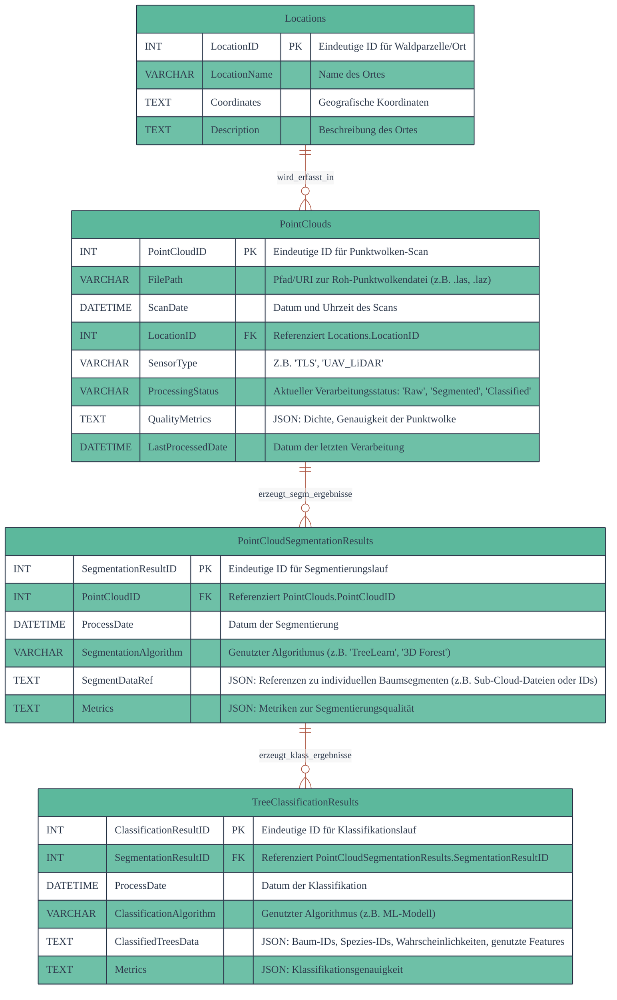
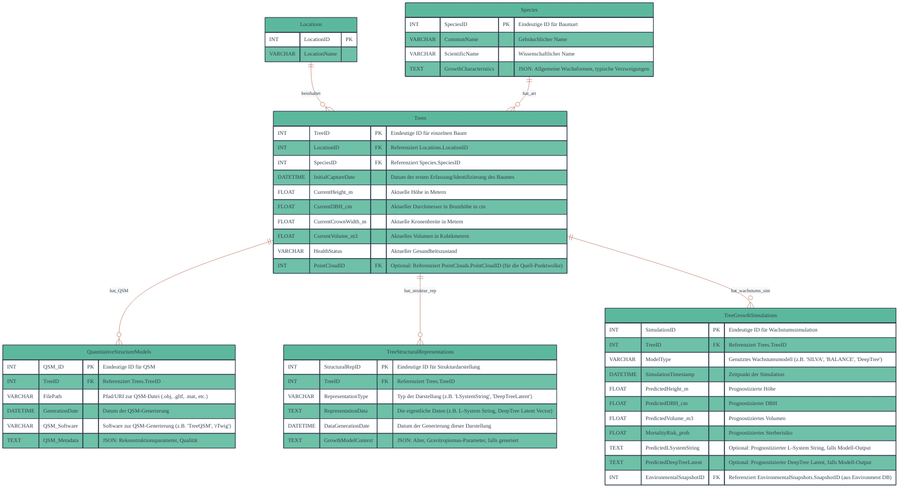
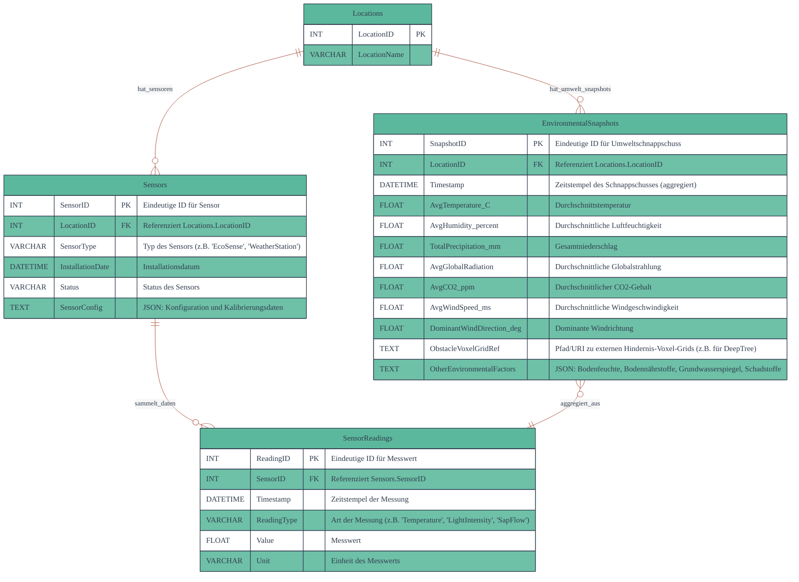

### 1. Punktwolken-Datenbank (Point Cloud DB)

Diese Datenbank dient der Speicherung von Metadaten und Ergebnissen, die aus der Verarbeitung von Punktwolkendaten stammen. Dies umfasst Verweise auf die Rohdaten, Segmentierungs- und Klassifikationsergebnisse.

**Zweck:** Speicherung von Roh- und verarbeiteten Punktwolkendaten sowie deren Metadaten und Analyseergebnissen, insbesondere Segmentierungs- und Klassifikationsergebnisse [379, Konversationsverlauf].

**Mermaid ER-Diagramm:**

**Inputs und Outputs der Punktwolken-Datenbank:**

- **Inputs:**
  - **Rohdaten:** Punktwolken, erfasst durch TLS (Terrestrial Laserscanning) oder Drohnen-LiDAR. Die Datenbank speichert typischerweise Dateipfade zu diesen großen Datensätzen.
  - **Verarbeitungsergebnisse:** Output von Algorithmen zur Segmentierung (z.B. **TreeLearn**, das individuelle Bäume aus Punktwolken segmentiert, oder **3D Forest** für Lidar-Datensegmentierung) und Klassifizierung (z.B. Speziesklassifikation mittels maschinellem Lernen). Diese Ergebnisse werden in `PointCloudSegmentationResults` und `TreeClassificationResults` gespeichert.
- **Outputs:**
  - **Baumattributsextraktion:** Segmentierte und klassifizierte Daten dienen als Input für die Ableitung quantitativer Baummetriken (Höhe, Kronenbreite, Volumen), die in die `Baumdatenbank` fließen.
  - **Strukturmodelle:** Punktwolken können als Input für die Erstellung von **Quantitative Strukturmodellen (QSMs)** mittels Tools wie **TreeQSM** dienen, deren Ergebnisse dann in die `Baumdatenbank` gelangen.
  - **Visualisierung in VR/Web:** Roh- oder verarbeitete Punktwolken können direkt für die Darstellung in XR-Anwendungen oder webbasierten Visualisierungstools genutzt werden.

---

### 2. Baumdatenbank (Tree DB)

Diese Datenbank ist das Herzstück für die Verwaltung der abgeleiteten Baumdaten und der für die VR-Darstellung sowie Wachstumsmodelle benötigten Informationen.

**Zweck:** Speicherung detaillierter Informationen über individuelle Bäume, einschließlich abgeleiteter Attribute, Strukturmodelle (QSMs, L-Systeme, DeepTree Latents) und Ergebnisse von Wachstumssimulationen [379, Konversationsverlauf].

**Mermaid ER-Diagramm:**

**Inputs und Outputs der Baumdatenbank:**

- **Inputs:**
  - **Baumattributsextraktion:** Quantitative Metriken (Höhe, Kronenbreite, Volumen) extrahiert aus Punktwolken werden in `Trees` aktualisiert.
  - **Forstinventur:** Traditionelle Messdaten (DBH, Höhe) dienen als Initialwerte oder zur Validierung in `Trees`.
  - **Quantitative Strukturmodelle (QSMs):** Modelle, die aus Punktwolken mittels **TreeQSM** oder **rTwig** erstellt wurden, werden in `QuantitativeStructureModels` gespeichert oder referenziert. `rTwig` verbessert die visuelle Realität und Volumenakkuratheit von QSMs.
  - **Baumwachstumsmodelle:** Ergebnisse von Modellen wie **SILVA** und **BALANCE** werden in `TreeGrowthSimulations` erfasst. Diese Modelle benötigen Baumdimensionen, Spezies, Standort- und Klimadaten als Input.
  - **Generative Modelle (L-Systeme/DeepTree):** `L-Systeme` als string-rewriting Systeme oder `DeepTree` als Deep-Learning-Modell, das Wachstumsregeln lernt, können Strukturdaten generieren, die in `TreeStructuralRepresentations` gespeichert werden. `Latent L-systems` ersetzen die manuelle Regelerstellung durch ein Transformer-Modell. `DeepTree` lernt aus dem "situated latent space" und kann Umwelteinflüsse kodieren.
  - **Nutzerinteraktion:** Werkzeuge zur Interaktion können Daten in `Trees` und `TreeGrowthSimulations` anpassen oder Szenarien simulieren.
- **Outputs:**
  - **VR-Darstellung:** Die `Trees`-Tabelle sowie `QuantitativeStructureModels` und `TreeStructuralRepresentations` liefern die notwendigen geometrischen und topologischen Informationen für die realitätsnahe Darstellung von Bäumen in VR als "Virtual Tree Model".
  - **Input für Wachstumsmodelle:** Die aktuellen Baumdaten aus `Trees` und `TreeStructuralRepresentations` dienen als Input für wiederkehrende Simulationen mit **SILVA**, **BALANCE** oder **DeepTree**.
  - **Szenarienanalyse:** Die kombinierten Daten können für Hypothesentests und die Simulation von Management-Szenarien genutzt werden.

---

### 3. Umgebungsdatenbank (Environment DB)

Diese Datenbank konzentriert sich auf die Erfassung und Verwaltung von Umweltdaten, die für die Baumwachstumsmodelle und die VR-Umgebungssimulation unerlässlich sind.

**Zweck:** Integration von Sensordaten und Umweltdaten (Klima, Wetter, Boden, Grundwasser) zur Unterstützung von Wachstumsmodellen und zur Simulation der Umgebung in VR [379, Konversationsverlauf].

**Mermaid ER-Diagramm:**

**Inputs und Outputs der Umgebungsdatenbank:**

- **Inputs:**
  - **Sensordaten:** Daten von **EcoSense-Sensoren** und anderen Quellen (Klima-, Wetter-, Boden-, Grundwasserdaten) werden in `SensorReadings` erfasst und in `EnvironmentalSnapshots` aggregiert.
  - **Umweltmodelle:** Ergebnisse von Umweltmodellen oder externe Datensätze (z.B. präzise Schadstoffdaten, die in `OtherEnvironmentalFactors` abgelegt werden können).
  - **Nutzerinteraktion:** Nutzer können Umweltdaten manuell anpassen, um Szenarien zu testen (z.B. Klimaszenarien für Wachstumsmodelle).
- **Outputs:**
  - **Wachstumsmodelle:** Die aggregierten Umweltschnappschüsse (`EnvironmentalSnapshots`) dienen als essentielle Input-Parameter für baum- und waldwachstumsmodelle wie **SILVA** und **BALANCE**, da diese Modelle die Reaktion der Bäume auf ihre Umgebung berücksichtigen.
  - **VR-Umgebungssimulation:** Die Umgebungsdaten sind entscheidend für die realitätsnahe Simulation der Waldumgebung in VR ("Environment Simulation") und die Visualisierung von Sensordaten in Echtzeit ("Sensor Data Visualization").

---

### Zusätzliche Überlegungen zur VR-Darstellung und Schnittstellen

Ihre Hauptaufgabe, die Informationen aus der Baumdatenbank für eine möglichst realitätsnahe VR-Darstellung aufzubereiten, wird durch dieses Design stark unterstützt:

- **Strukturmodelle (QSMs, L-Systeme, DeepTree):** Die explizite Speicherung dieser Modelle in `QuantitativeStructureModels` und `TreeStructuralRepresentations` ist entscheidend.
  - **QSMs** bieten eine hervorragende Grundlage, da sie die Holzstruktur realer Bäume als hierarchische Zylindersammlungen repräsentieren und detaillierte Geometrie liefern. Tools wie **TreeQSM** und **rTwig** ermöglichen die Rekonstruktion direkt aus Scandaten. Der `FilePath` in `QuantitativeStructureModels` würde direkt auf die exportierten 3D-Modellformate wie OBJ oder GLTF verweisen, die direkt in VR-Engines geladen werden können.
  - **L-Systeme** und **DeepTree** können als komplementäre Methoden eingesetzt werden, um die Bäume prozedural zu generieren oder zu vervollständigen, insbesondere wenn Scandaten unvollständig sind oder für die Erzeugung neuer Bäume, die gelernten Wachstumsformen folgen. Die `RepresentationData` (z.B. der L-String oder der Latent-Vektor) in `TreeStructuralRepresentations` dient als "Saat" für die Generierung des 3D-Modells in der VR-Anwendung.
- **Dynamische Anpassung in VR:** Durch die Verknüpfung von `TreeGrowthSimulations` mit `EnvironmentalSnapshots` können VR-Anwendungen nicht nur statische Bäume darstellen, sondern auch deren simuliertes Wachstum und ihre Reaktion auf Umwelteinflüsse über die Zeit visualisieren ("Temporal Dynamics").
- **Validierung:** Die in den Quellen genannten Validierungsmethoden (geometrische Vergleiche, perzeptuelle Metriken wie **ICTree**) sind essenziell, um die Realitätsnähe der generierten und dargestellten Bäume zu gewährleisten. Die `TreeDB` mit ihren Attributen und den `QuantitativeStructureModels` bietet die Datenbasis für solche Validierungen.

Diese Datenbankstruktur schafft eine robuste Grundlage für Ihr Projekt und ermöglicht eine effiziente Verwaltung und Integration der komplexen Baum- und Umweltdaten für Ihre VR-Anwendungen und Wachstumsmodelle.
