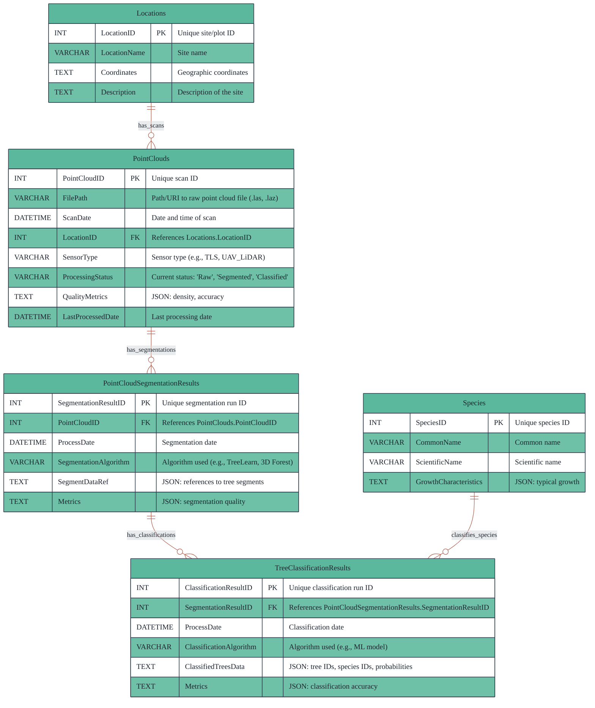
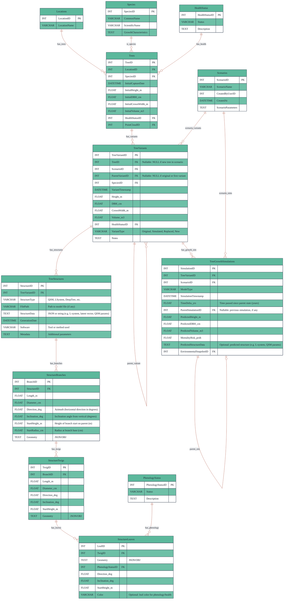
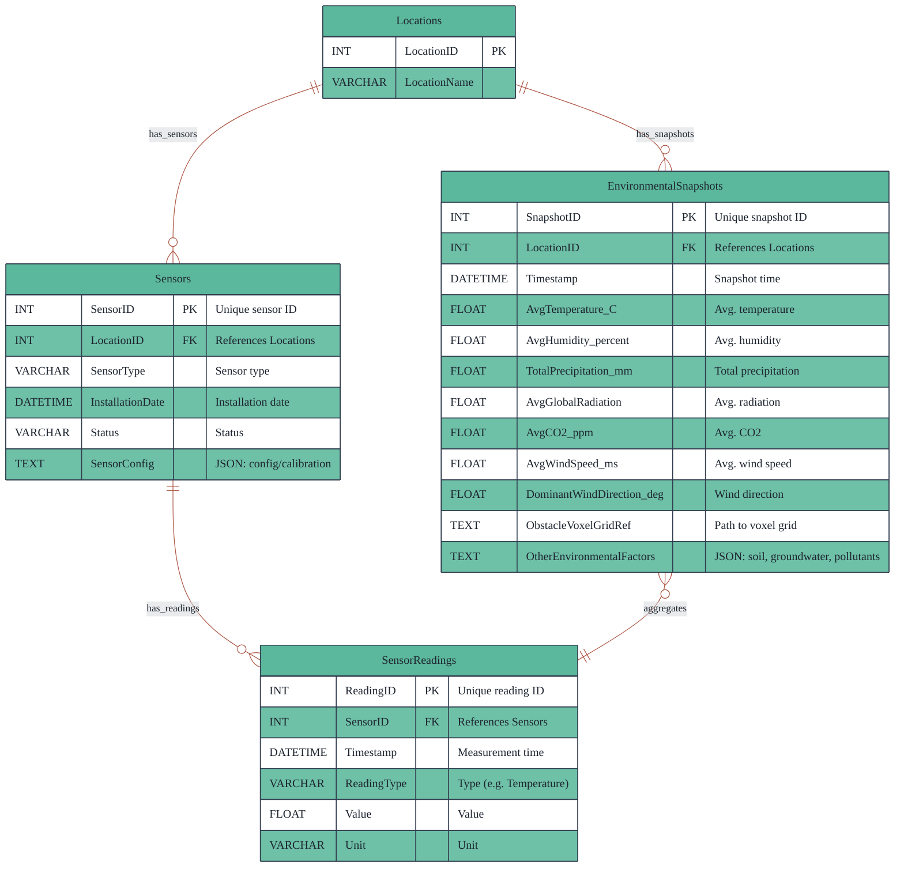

# Database Design

## 1. Point Cloud Database (Point Cloud DB)

**Purpose:**  
Stores metadata and results from the processing of point cloud data, including references to raw files, segmentation, and classification outputs. This is the primary storage for all spatial scan data and their derived products.

**Mermaid ER Diagram:**

**Inputs:**  

- Raw point cloud files (uploaded via Data Ingestion API)
- Segmentation/classification outputs (via Processing Pipeline API)

**Outputs:**  

- Segmented/classified tree data (to Tree DB via Processing Pipeline API)
- 3D data for visualization (to Presentation Tier via REST/GraphQL API)

---

## 2. Tree Database (Tree DB) – Scenario & Variant-Aware

Certainly! Here is the **updated Tree DB design and description** with a single unified structure table, and extended branch, twig, and leaf tables including features such as direction, height of starting point on parent, and angle. This design is ready for copy-paste into your documentation.

---
Here is the **updated Tree Database (Tree DB) design and description** reflecting your requirements for scenario/variant management, unified structure storage, and detailed growth simulation tracking. This version:

- Uses a single `TreeStructures` table for all structure types (QSM, L-System, DeepTree, etc.)
- Links all growth simulations to `TreeVariantID` (including base/original variants)
- Includes a `TimeDelta_yrs` field in `TreeGrowthSimulations` for time interval tracking
- Extends `StructureBranches`, `StructureTwigs`, and `StructureLeaves` with direction, height of starting point, and angle fields

---

## Tree Database (Tree DB)

**Purpose:**  
Central repository for all tree-related data, supporting scenario-based modeling, variant management, growth simulation, and detailed structural representation. This design enables both data-driven (QSM) and generative (L-system, DeepTree, etc.) models in a unified structure, and supports fine-grained modeling of branches, twigs, and leaves.

### Mermaid ER Diagram

### Table Descriptions

- **Locations, Species, HealthStatus, PhenologyStatus:**  
  Lookup/reference tables for spatial, biological, and status data.

- **Scenarios:**  
  User-defined scenario context (e.g., species replacement, climate change).

- **Trees:**  
  Immutable records of observed trees from scans or inventory.

- **TreeVariants:**  
  All versions (original, simulated, replaced, or new) of a tree, each linked to a scenario and (optionally) a parent variant.  
  - `TreeID` is NULL for new trees created only for a scenario.

- **TreeStructures:**  
  Unified table for all structural representations (QSM, L-system, DeepTree, etc.) for each tree variant.  
  - `StructureType` distinguishes the method/model used.
  - `StructureData` can store JSON, strings, or parameters as needed.

- **StructureBranches:**  
  Detailed branch data for each structure, including length, diameter, direction (azimuth), inclination (angle from vertical), starting height on parent, and geometry.

- **StructureTwigs:**  
  Fine-scale twig data, with similar geometric and positional attributes as branches.

- **StructureLeaves:**  
  Leaf data, including geometry, phenology status, direction, inclination, starting height, and optional color for health/phenology visualization.

- **TreeGrowthSimulations:**  
  Stores simulation results for each tree variant and scenario, including predicted dimensions, mortality risk, (optionally) predicted structure data, and a `TimeDelta_yrs` field for the time interval since the parent state. `ParentSimulationID` enables chaining for time series.

### API/Data Flow Mapping

- **Data Ingestion API:**  
  Adds observed trees and initial structures.
- **Processing Pipeline API:**  
  Generates and updates QSMs and other structure types.
- **Model/Simulation Control API:**  
  Creates variants, runs growth simulations, and generates procedural/generative structures.
- **Scenario/Model Control API:**  
  Manages scenario creation, variant management, and scenario-based edits.
- **Presentation Tier (REST/GraphQL):**  
  Queries structures, branches, twigs, and leaves for visualization.

---

## 3. Environment Database (Environment DB)

**Purpose:**  
Stores sensor readings, aggregated environmental snapshots, and metadata for all environmental data streams and sources. Essential for growth models, simulation, and real-time visualization.

**Mermaid ER Diagram:**

**Inputs:**

- Sensor data (EcoSense, weather, soil) via Data Ingestion API (batch or streaming)
- Aggregated/derived environmental snapshots (via Model/Simulation Control API)
- User modifications for scenario testing (via DB Update API)

**Outputs:**

- Environmental context for growth models (to Logic Tier)
- Real-time or historical data for presentation (to XR/Web)
- Data for scenario analysis and simulation

---

## **How the Design Supports Your Use Cases**

- **Original trees are never overwritten.** All simulated or replaced trees are stored as new TreeVariants, each linked to a scenario and (optionally) their parent variant.
- **Scenario-based replacement and creation:** New trees for scenarios are supported by TreeVariants with `TreeID = NULL`.
- **Growth results:** Growth simulations are always linked to the TreeVariant and Scenario, allowing side-by-side comparison of multiple scenarios.
- **Consistent lookup tables:** Species and HealthStatus ensure data integrity and interoperability.
- **Comprehensive data flow:** All data flows and API endpoints are mapped to the architecture, supporting ingestion, processing, simulation, scenario analysis, and visualization.
