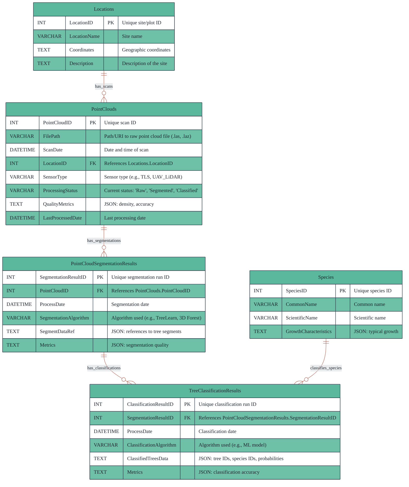
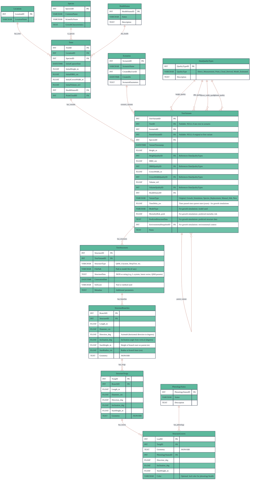
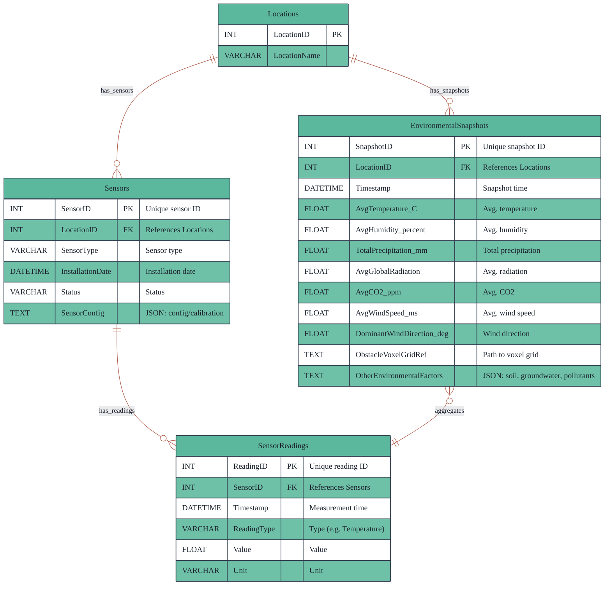

# Database Design

> **Related Documentation**: [Architecture](./architecture.md) | [Data Contracts & APIs](./data_contracts_and_apis.md)

This document defines the database schema for the XR Future Forests Lab system. The database architecture consists of three specialized databases, each optimized for different types of forest-related data and their specific access patterns.

---

## 1. Point Cloud Database (Point Cloud DB)

Stores metadata and processing results from LiDAR point cloud data, including references to raw files, segmentation outputs, and classification results. This database serves as the primary repository for all spatial scan data and their derived products, enabling efficient storage and retrieval of massive 3D datasets while maintaining processing lineage and quality metrics.

### Table Descriptions

**Locations**  
Master table storing geographic site information for all forest plots and monitoring locations across the system.

**PointClouds**  
Core table containing metadata for each LiDAR scan, including file references, sensor information, and processing status tracking.

**PointCloudSegmentationResults**  
Stores results from tree segmentation algorithms, maintaining references to the algorithms used and quality metrics for each segmentation run.

**TreeClassificationResults**  
Contains species classification outputs with confidence scores and accuracy metrics for each classified tree segment.

**Species**  
Reference table defining tree species information and their growth characteristics for classification and modeling purposes.

### Table Relationships

- **Locations** serve as the spatial foundation, with each location hosting multiple point cloud scans
- **PointClouds** represent individual scanning sessions, each producing segmentation results
- **PointCloudSegmentationResults** feed into classification processes, maintaining the processing pipeline lineage
- **TreeClassificationResults** link to **Species** for taxonomic validation and growth modeling
- The design ensures full traceability from raw scans through segmentation to final species classification

---

## 2. Tree Database (Tree DB)

Central repository for all tree-related data, supporting scenario-based modeling, variant management, growth simulation, and detailed structural representation. This database enables both data-driven (QSM) and generative (L-system, DeepTree, etc.) models in a unified structure, supports fine-grained modeling of branches, twigs, and leaves, and maintains complete history and lineage of all tree variants across different scenarios and time periods.

### Tree Database Table Descriptions

#### Reference Tables

- **Locations**: Shared spatial reference for all tree locations
- **Species**: Tree species definitions with growth characteristics for modeling
- **HealthStatus**: Standardized health condition classifications
- **PhenologyStatus**: Seasonal and developmental stage classifications
- **DataQualityTypes**: Measurement quality indicators (Direct_Measurement, Point_Cloud_Derived, Model_Estimated)

#### Core Tables

- **Scenarios**: User-defined scenario definitions for modeling and analysis
- **Trees**: Immutable base records of observed trees from scans or field inventory
- **TreeVariants**: All tree versions including original observations, growth simulations, species replacements, and manual edits; supports scenario-based modeling with parent-child relationships

#### Structural Detail Tables

- **TreeStructures**: Unified storage for all structural representations (QSM, L-system, DeepTree, etc.)
- **StructureBranches**: Detailed branch geometry, dimensions, and spatial positioning
- **StructureTwigs**: Fine-scale twig data with morphological attributes
- **StructureLeaves**: Individual leaf data including phenology status and spatial positioning

### Tree Database Table Relationships

- **Trees** maintain immutable baseline records while **TreeVariants** enable temporal and scenario-based variations
- **Scenarios** group related variants and enable comparative analysis across different modeling conditions
- **TreeStructures** provide multiple structural representations per variant, supporting both data-driven and generative modeling approaches
- **Parent-child relationships** in TreeVariants enable growth sequence tracking and variant lineage
- **Quality metadata** ensures scientific traceability from measurement source through modeling to visualization
- **Hierarchical structure detail** (branches → twigs → leaves) enables fine-grained 3D modeling and realistic visualization

---

## 3. Environment Database (Environment DB)

Stores sensor readings, aggregated environmental snapshots, and metadata for all environmental data streams and sources. This database supports real-time environmental monitoring, historical data analysis, and provides essential environmental context for growth models, simulation scenarios, and real-time visualization systems.

### Environment Database Table Descriptions

**Locations**  
Shared spatial reference table linking environmental data to specific forest plots and monitoring sites.

**Sensors**  
Inventory of all environmental monitoring equipment with configuration, status, and installation metadata.

**SensorReadings**  
Time-series data from individual sensors capturing real-time environmental measurements with full temporal resolution.

**EnvironmentalSnapshots**  
Aggregated environmental summaries providing consolidated environmental state for specific locations and time periods, essential for modeling and scenario analysis.

### Environment Database Table Relationships

- **Locations** serve as the spatial foundation linking environmental data to specific forest sites
- **Sensors** are deployed at locations and generate continuous streams of **SensorReadings**
- **SensorReadings** provide high-resolution temporal data that feeds into aggregated **EnvironmentalSnapshots**
- **EnvironmentalSnapshots** provide model-ready environmental context by aggregating multiple sensor readings and external data sources
- The design supports both real-time monitoring and historical analysis while maintaining data lineage from individual sensors to aggregated environmental context

---

## Design Principles and System Integration

### Data Quality and Traceability

The database design ensures scientific rigor through comprehensive data quality tracking and measurement lineage. Each measurement includes metadata indicating its source (direct field measurement, point cloud analysis, or model estimation), enabling researchers to assess data reliability and maintain reproducible scientific workflows.

### Scenario-Based Modeling Support

The unified TreeVariants approach enables sophisticated scenario analysis by maintaining all tree states and modifications within a single, coherent structure. This design supports comparative analysis across different management strategies, climate scenarios, and species composition changes while preserving the original observed data.

### Multi-Scale Integration

The three-database architecture supports analysis from individual leaf geometry to landscape-scale forest dynamics. Point cloud data provides detailed 3D structure, tree data enables individual-based modeling, and environmental data supplies the context for realistic growth simulation and ecosystem analysis.

### Temporal Analysis Capabilities

Parent-child relationships in TreeVariants combined with time-series environmental data enable comprehensive temporal analysis. Researchers can track individual tree growth, analyze environmental trends, and validate growth model predictions against observed changes over time.
