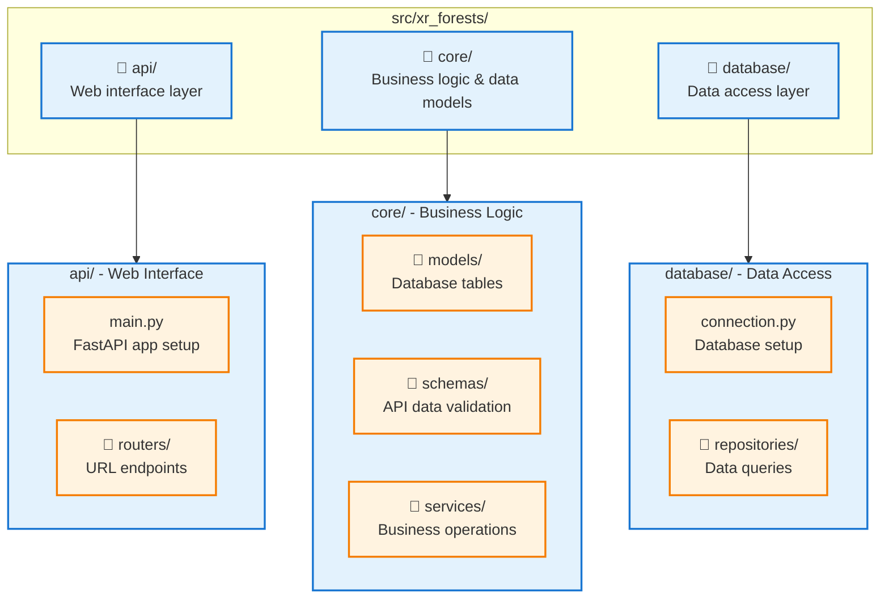
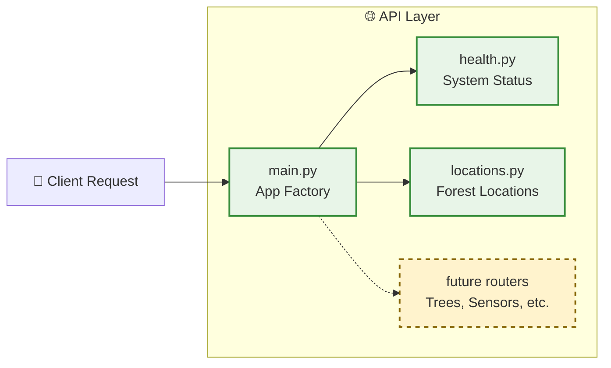

# XR Future Forests Lab - Developer Guide

> **A Complete Step-by-Step Guide to Understanding, Using, and Extending the System**  
> **Target Audience**: Developers new to the project  
> **Prerequisites**: Basic knowledge of Python, databases, and APIs  
> **Related Documentation**: [System Introduction](./system_introduction.md) | [Architecture](./architecture.md)

This guide will walk you through the entire project structure, explain why everything is organized the way it is, and show you how to develop new features step by step.

---

## 📋 **Table of Contents**

1. [Project Overview & Goals](#1-project-overview--goals)
2. [Understanding the Project Structure](#2-understanding-the-project-structure)
3. [Component Responsibilities](#3-component-responsibilities)
4. [Getting Started - First Steps](#4-getting-started---first-steps)
5. [Development Workflow](#5-development-workflow)
6. [Adding New Features](#6-adding-new-features)
7. [Testing and Debugging](#7-testing-and-debugging)
8. [Advanced Development Topics](#8-advanced-development-topics)

---

## 1. **Project Overview & Goals**

### **What Are We Building?**

The XR Future Forests Lab is building a **digital foundation for forest data management** that will eventually support:

- **🌲 Digital Forest Twins**: 3D representations of real forests
- **🥽 XR Applications**: Immersive forest exploration and research tools
- **📊 Advanced Analytics**: AI-powered forest analysis and modeling
- **📡 Real-time Monitoring**: Sensor networks and environmental tracking

### **Current MVP Status**

**What's Implemented Now**:

- ✅ FastAPI web application with REST endpoints
- ✅ PostgreSQL database with PostGIS spatial extensions
- ✅ Redis for event messaging (configured, ready to use)
- ✅ Docker containerization for easy development
- ✅ Basic CRUD operations for forest locations
- ✅ Database schema for trees, sensors, and point clouds

**What's Coming Next**:

- 🔄 Point cloud processing and tree segmentation
- 🔄 Real-time event publishing and WebSocket connections
- 🔄 Forest growth simulation models
- 🔄 XR client applications

### **Why This Architecture?**

The project uses a **three-tier architecture** because:

1. **Scalability**: Each layer can be scaled independently
2. **Maintainability**: Clear separation of concerns
3. **Testability**: Each component can be tested in isolation
4. **Future-proofing**: Easy to add new features without breaking existing ones

---

## 2. **Understanding the Project Structure**

Let's walk through the entire project structure and understand why each piece exists:

```
xr-future-forests-lab/
├── 📁 config/                    # Configuration management
├── 📁 data/                      # Data files (currently empty)
├── 📁 db/                        # Database initialization
├── 📁 docs/                      # Documentation (you are here!)
├── 📁 src/xr_forests/           # Main application code
├── 📁 tests/                     # Test files
├── 🐳 docker-compose.yml        # Container orchestration
├── 🐳 Dockerfile               # API container definition
├── 📄 pyproject.toml           # Python project configuration
├── 📄 README.md                # Project overview
└── 🔧 setup.sh                # Development setup script
```

### **2.1 Root Level Files**

#### **🐳 Docker Files**

```yaml
# docker-compose.yml - The main orchestration file
services:
  postgres:     # Database container
  redis:        # Event bus container  
  api:          # Your Python application
```

**Why Docker?**: Ensures everyone has the same development environment, regardless of their local setup.

#### **📄 Configuration Files**

- **`pyproject.toml`**: Modern Python project configuration (replaces setup.py)
- **`README.md`**: Project overview and quick start guide
- **`setup.sh`**: Automated development environment setup

### **2.2 The `src/xr_forests/` Directory**

This is where all your application code lives. Let's explore each subdirectory:



### **2.3 Configuration Directory**

```
config/
└── settings.py        # All application settings
```

**Purpose**: Centralizes all configuration in one place with environment variable support.

### **2.4 Database Directory**

```
db/
└── init/
    └── 01-init-schema.sql    # Database table creation
```

**Purpose**: Database initialization scripts that run when PostgreSQL starts.

### **2.5 Documentation Directory**

```
docs/
├── architecture.md           # System design overview
├── database_design.md       # Database schema details
├── data_contracts_and_apis.md   # API specifications
├── system_introduction.md    # Beginner-friendly introduction
└── developer_guide.md       # This file!
```

### **2.6 Tests Directory**

```
tests/
├── conftest.py              # Test configuration
├── simple_test.py           # Basic tests
├── integration/             # API integration tests
└── unit/                    # Unit tests (future)
```

---

## 3. **Component Responsibilities**

Let's understand what each component does and why it exists:

### **3.1 API Layer (`src/xr_forests/api/`)**



#### **`main.py` - The Application Factory**

```python
# What it does:
def create_app() -> FastAPI:
    app = FastAPI(title="XR Future Forests Lab API")
    
    # Add middleware (CORS, authentication, etc.)
    app.add_middleware(CORSMiddleware, ...)
    
    # Connect to external services
    # Redis connection setup
    
    # Register all routers
    app.include_router(health_router)
    app.include_router(locations_router)
    
    return app
```

**Responsibilities**:

- Configure the FastAPI application
- Set up middleware (CORS, authentication)
- Manage external connections (Redis, databases)
- Register all API routers

#### **Router Files (`routers/`)**

Each router handles a specific domain:

```python
# locations.py - Example router
from fastapi import APIRouter

router = APIRouter(prefix="/api/locations", tags=["locations"])

@router.get("/")                    # GET /api/locations/
async def get_locations(): ...

@router.post("/")                   # POST /api/locations/
async def create_location(): ...
```

**Why Separate Routers?**:

- **Organization**: Related endpoints stay together
- **Maintainability**: Easy to find and modify specific features
- **Team Development**: Different developers can work on different routers
- **Testing**: Can test individual routers independently

### **3.2 Core Layer (`src/xr_forests/core/`)**

This is the heart of your business logic, split into three key areas:

#### **Models (`core/models/`) - Database Structure**

```python
# location.py - Example model
class Location(Base, TimestampMixin):
    __tablename__ = "locations"
    
    id = Column(UUID, primary_key=True)
    location_name = Column(String(200), nullable=False)
    center_point = Column(Geometry("POINT", srid=4326))  # PostGIS spatial data
```

**Responsibilities**:

- Define database table structure
- Specify data types and constraints
- Handle relationships between tables
- Provide the "single source of truth" for data structure

#### **Schemas (`core/schemas/`) - API Data Validation**

```python
# location.py - Example schema
class LocationCreate(BaseModel):
    location_name: str = Field(..., max_length=200)
    latitude: Optional[float] = Field(None, ge=-90, le=90)
    longitude: Optional[float] = Field(None, ge=-180, le=180)
```

**Responsibilities**:

- Validate incoming API requests
- Define response formats
- Handle data serialization/deserialization
- Provide automatic API documentation

**Why Separate from Models?**:

- **Security**: API schemas can hide internal fields
- **Flexibility**: API can have different data formats than database
- **Validation**: API-specific validation rules

#### **Services (`core/services/`) - Business Logic**

```python
# location_service.py - Example service
class LocationService:
    def __init__(self):
        self.repository = LocationRepository()
    
    async def create_location(self, db: AsyncSession, location_data: LocationCreate):
        # Business logic here (validation, calculations, etc.)
        location_dict = location_data.dict()
        
        # Coordinate processing
        if location_data.latitude and location_data.longitude:
            location_dict["center_point"] = create_point_geometry(...)
        
        # Save to database
        location = await self.repository.create(db, location_dict)
        
        # Future: Publish events
        # await publish_event("location_created", location.id)
        
        return self._to_response(location)
```

**Responsibilities**:

- Implement business rules and logic
- Coordinate between different data sources
- Handle complex operations
- Manage transactions and error handling

### **3.3 Database Layer (`src/xr_forests/database/`)**

#### **Connection Management (`connection.py`)**

```python
# Creates database connections with proper configuration
engine = create_async_engine(
    settings.database_url,
    echo=settings.database_echo,      # SQL query logging
    pool_pre_ping=True,               # Connection health checks
    pool_recycle=300,                 # Connection recycling
)

async def get_db():
    """Dependency injection for database sessions"""
    async with AsyncSessionLocal() as session:
        yield session
```

**Responsibilities**:

- Manage database connection pool
- Provide database sessions to other components
- Handle connection configuration and health checks

#### **Repositories (`repositories/`) - Data Access**

```python
# location.py - Example repository
class LocationRepository(BaseRepository[Location]):
    async def get_by_name(self, db: AsyncSession, name: str) -> Optional[Location]:
        result = await db.execute(
            select(Location).where(Location.location_name == name)
        )
        return result.scalar_one_or_none()
```

**Responsibilities**:

- Execute database queries
- Abstract SQL complexity from business logic
- Handle database-specific operations
- Provide reusable query methods

---

## 4. **Getting Started - First Steps**

### **Step 1: Environment Setup**

1. **Clone and Navigate**:

   ```bash
   cd xr-future-forests-lab
   ```

2. **Run Setup Script**:

   ```bash
   ./setup.sh
   ```

   This script will:
   - Start Docker containers
   - Wait for services to be ready
   - Run basic health checks
   - Show you connection information

3. **Verify Everything Works**:

   ```bash
   # Check API health
   curl http://localhost:8000/health
   
   # View API documentation
   open http://localhost:8000/docs
   
   # Connect to database
   docker exec -it xr_forests_db psql -U forests_user -d xr_forests_lab
   ```

### **Step 2: Explore the Running System**

1. **API Documentation**:
   - Open `http://localhost:8000/docs`
   - Try the interactive API endpoints
   - Create a location, then retrieve it

2. **Database Exploration**:

   ```sql
   -- Connect to database
   docker exec -it xr_forests_db psql -U forests_user -d xr_forests_lab
   
   -- Explore tables
   \dt
   
   -- Look at sample data
   SELECT * FROM locations;
   SELECT * FROM species;
   ```

3. **Redis Connection**:

   ```bash
   # Connect to Redis
   docker exec -it xr_forests_redis redis-cli
   
   # Try some commands
   PING
   SET mykey "Hello World"
   GET mykey
   ```

### **Step 3: Code Exploration Path**

Follow this path to understand the codebase:

1. **Start with API entry point**: `src/xr_forests/api/main.py`
2. **Follow a request**: `src/xr_forests/api/routers/locations.py`
3. **See business logic**: `src/xr_forests/core/services/location_service.py`
4. **Database operations**: `src/xr_forests/database/repositories/location.py`
5. **Data models**: `src/xr_forests/core/models/location.py`
6. **API schemas**: `src/xr_forests/core/schemas/location.py`

---

## 5. **Development Workflow**

### **5.1 Daily Development Setup**

```bash
# Start your development environment
docker-compose up -d

# View logs (useful for debugging)
docker-compose logs -f api

# Stop when done
docker-compose down
```

### **5.2 Code Development Cycle**

1. **Make Code Changes**: Edit files in `src/xr_forests/`
2. **See Changes**: FastAPI auto-reloads on file changes
3. **Test Changes**: Use interactive API docs at `http://localhost:8000/docs`
4. **Debug Issues**: Check logs with `docker-compose logs api`

### **5.3 Database Development**

#### **Making Schema Changes**

1. **Edit SQL file**: `db/init/01-init-schema.sql`
2. **Recreate database**:

   ```bash
   docker-compose down
   docker volume rm xr-future-forests-lab_postgres_data
   docker-compose up -d
   ```

3. **Update models**: Edit files in `src/xr_forests/core/models/`

#### **Viewing Database Changes**

```bash
# Connect to database
docker exec -it xr_forests_db psql -U forests_user -d xr_forests_lab

# Useful SQL commands
\dt                    # List tables
\d locations           # Describe table structure
SELECT * FROM locations LIMIT 5;
```

---

## 6. **Adding New Features**

Let's walk through adding a complete new feature: **Tree Management**. This will show you the full development process.

### **Step 1: Plan the Feature**

**Goal**: Add API endpoints to manage tree records

**Endpoints Needed**:

- `GET /api/trees/` - List all trees
- `GET /api/trees/{tree_id}` - Get specific tree
- `POST /api/trees/` - Create new tree
- `PUT /api/trees/{tree_id}` - Update tree

### **Step 2: Create the Database Model**

The model already exists, but let's understand it:

```python
# src/xr_forests/core/models/tree.py
class Tree(Base, TimestampMixin):
    __tablename__ = "trees"
    
    id = Column(UUID(as_uuid=True), primary_key=True, default=uuid.uuid4)
    location_id = Column(UUID(as_uuid=True))  # Foreign key to locations
    tree_tag = Column(String(50))             # Field identification
    species_id = Column(UUID(as_uuid=True))   # Foreign key to species
    position = Column(Geometry("POINT", srid=4326))  # GPS coordinates
    discovery_date = Column(Date)
    discovery_method = Column(String(50))
```

### **Step 3: Create API Schemas**

```python
# src/xr_forests/core/schemas/tree.py
from pydantic import BaseModel, Field
from typing import Optional
from datetime import datetime, date

class TreeCreate(BaseModel):
    """Schema for creating a tree"""
    location_id: str
    tree_tag: Optional[str] = None
    species_id: str
    latitude: float = Field(..., ge=-90, le=90)
    longitude: float = Field(..., ge=-180, le=180)
    discovery_method: str = "field_survey"

class TreeResponse(BaseModel):
    """Schema for tree responses"""
    id: str
    location_id: str
    tree_tag: Optional[str]
    species_id: str
    discovery_date: date
    discovery_method: str
    created_at: datetime
    updated_at: datetime
    
    class Config:
        from_attributes = True
```

### **Step 4: Create Repository**

```python
# src/xr_forests/database/repositories/tree.py
from sqlalchemy.ext.asyncio import AsyncSession
from sqlalchemy import select
from typing import List, Optional
from uuid import UUID

from .base import BaseRepository
from ...core.models.tree import Tree

class TreeRepository(BaseRepository[Tree]):
    async def get_by_location(self, db: AsyncSession, location_id: UUID) -> List[Tree]:
        """Get all trees in a specific location"""
        result = await db.execute(
            select(Tree).where(Tree.location_id == location_id)
        )
        return result.scalars().all()
    
    async def get_by_species(self, db: AsyncSession, species_id: UUID) -> List[Tree]:
        """Get all trees of a specific species"""
        result = await db.execute(
            select(Tree).where(Tree.species_id == species_id)
        )
        return result.scalars().all()
```

### **Step 5: Create Service**

```python
# src/xr_forests/core/services/tree_service.py
from sqlalchemy.ext.asyncio import AsyncSession
from typing import List, Optional
from uuid import UUID

from ..schemas.tree import TreeCreate, TreeResponse
from ...database.repositories.tree import TreeRepository

class TreeService:
    def __init__(self):
        self.repository = TreeRepository()
    
    async def get_all_trees(self, db: AsyncSession) -> List[TreeResponse]:
        """Get all trees"""
        trees = await self.repository.get_all(db)
        return [self._to_response(tree) for tree in trees]
    
    async def get_tree_by_id(self, db: AsyncSession, tree_id: str) -> Optional[TreeResponse]:
        """Get tree by ID"""
        tree = await self.repository.get_by_id(db, UUID(tree_id))
        return self._to_response(tree) if tree else None
    
    async def create_tree(self, db: AsyncSession, tree_data: TreeCreate) -> TreeResponse:
        """Create a new tree"""
        tree_dict = tree_data.dict(exclude_unset=True)
        
        # Convert coordinates to PostGIS geometry
        if tree_data.latitude and tree_data.longitude:
            tree_dict["position"] = f"POINT({tree_data.longitude} {tree_data.latitude})"
            del tree_dict["latitude"]
            del tree_dict["longitude"]
        
        tree = await self.repository.create(db, tree_dict)
        return self._to_response(tree)
    
    def _to_response(self, tree) -> TreeResponse:
        """Convert model to response schema"""
        return TreeResponse(
            id=str(tree.id),
            location_id=str(tree.location_id),
            tree_tag=tree.tree_tag,
            species_id=str(tree.species_id),
            discovery_date=tree.discovery_date,
            discovery_method=tree.discovery_method,
            created_at=tree.created_at,
            updated_at=tree.updated_at,
        )
```

### **Step 6: Create Router**

```python
# src/xr_forests/api/routers/trees.py
from fastapi import APIRouter, Depends, HTTPException
from sqlalchemy.ext.asyncio import AsyncSession
from typing import List

from ...core.schemas.tree import TreeCreate, TreeResponse
from ...core.services.tree_service import TreeService
from ...database.connection import get_db

router = APIRouter(prefix="/api/trees", tags=["trees"])

@router.get("/", response_model=List[TreeResponse])
async def get_trees(
    db: AsyncSession = Depends(get_db),
    tree_service: TreeService = Depends(TreeService)
):
    """Get all trees"""
    return await tree_service.get_all_trees(db)

@router.get("/{tree_id}", response_model=TreeResponse)
async def get_tree(
    tree_id: str,
    db: AsyncSession = Depends(get_db),
    tree_service: TreeService = Depends(TreeService)
):
    """Get a specific tree"""
    tree = await tree_service.get_tree_by_id(db, tree_id)
    if not tree:
        raise HTTPException(status_code=404, detail="Tree not found")
    return tree

@router.post("/", response_model=TreeResponse)
async def create_tree(
    tree: TreeCreate,
    db: AsyncSession = Depends(get_db),
    tree_service: TreeService = Depends(TreeService)
):
    """Create a new tree"""
    return await tree_service.create_tree(db, tree)
```

### **Step 7: Register Router**

```python
# src/xr_forests/api/routers/__init__.py
from .locations import router as locations_router
from .health import router as health_router
from .trees import router as trees_router  # Add this line

__all__ = ["locations_router", "health_router", "trees_router"]  # Add trees_router
```

```python
# src/xr_forests/api/main.py
from .routers import health_router, locations_router, trees_router  # Add trees_router

def create_app() -> FastAPI:
    app = FastAPI(...)
    
    # Include routers
    app.include_router(health_router)
    app.include_router(locations_router)
    app.include_router(trees_router)  # Add this line
    
    return app
```

### **Step 8: Test Your Feature**

1. **Restart the API** (if needed):

   ```bash
   docker-compose restart api
   ```

2. **Test via API docs**:
   - Open `http://localhost:8000/docs`
   - Try the new `/api/trees/` endpoints

3. **Test via curl**:

   ```bash
   # Create a tree (you'll need valid location_id and species_id)
   curl -X POST http://localhost:8000/api/trees/ \
     -H "Content-Type: application/json" \
     -d '{
       "location_id": "your-location-id",
       "species_id": "your-species-id",
       "tree_tag": "T001",
       "latitude": 47.1234,
       "longitude": 8.5678
     }'
   
   # Get all trees
   curl http://localhost:8000/api/trees/
   ```

---

## 7. **Testing and Debugging**

### **7.1 Running Tests**

```bash
# Run all tests
python -m pytest

# Run specific test file
python -m pytest tests/integration/test_api_basic.py

# Run with verbose output
python -m pytest -v

# Run tests and see print statements
python -m pytest -s
```

### **7.2 Debugging Techniques**

#### **API Debugging**

```python
# Add logging to your code
import logging

logger = logging.getLogger(__name__)

async def create_location(self, db: AsyncSession, location_data: LocationCreate):
    logger.info(f"Creating location: {location_data.location_name}")
    # ... rest of function
```

#### **Database Debugging**

```python
# Enable SQL query logging in settings.py
class Settings(BaseSettings):
    database_echo: bool = True  # Shows all SQL queries
```

#### **Container Debugging**

```bash
# View API logs
docker-compose logs -f api

# View database logs
docker-compose logs -f postgres

# Execute commands inside containers
docker exec -it xr_forests_api bash
docker exec -it xr_forests_db psql -U forests_user -d xr_forests_lab
```

### **7.3 Common Issues and Solutions**

#### **Issue: "ModuleNotFoundError"**

```bash
# Solution: Restart the API container
docker-compose restart api
```

#### **Issue: Database connection errors**

```bash
# Check if database is running
docker exec -it xr_forests_db pg_isready -U forests_user

# Check connection string in config/settings.py
```

#### **Issue: API not reflecting code changes**

```bash
# Check if volume mounts are working
docker-compose down
docker-compose up -d
```

---

## 8. **Advanced Development Topics**

### **8.1 Adding Real-Time Events**

```python
# In your service, publish events
async def create_location(self, db: AsyncSession, location_data: LocationCreate):
    location = await self.repository.create(db, location_dict)
    
    # Publish event to Redis
    await redis_client.publish("location_events", {
        "event": "location_created",
        "location_id": str(location.id),
        "timestamp": datetime.now().isoformat()
    })
    
    return self._to_response(location)
```

### **8.2 Adding WebSocket Support**

```python
# src/xr_forests/api/routers/websocket.py
from fastapi import WebSocket, WebSocketDisconnect

@router.websocket("/ws")
async def websocket_endpoint(websocket: WebSocket):
    await websocket.accept()
    try:
        while True:
            # Listen for Redis events and forward to client
            data = await websocket.receive_text()
            await websocket.send_text(f"Echo: {data}")
    except WebSocketDisconnect:
        pass
```

### **8.3 Adding Background Tasks**

```python
from fastapi import BackgroundTasks

@router.post("/process-data/")
async def process_data(background_tasks: BackgroundTasks):
    background_tasks.add_task(process_point_cloud, file_path)
    return {"message": "Processing started"}

def process_point_cloud(file_path: str):
    # Long-running processing task
    pass
```

### **8.4 Environment Configuration**

```python
# config/settings.py - Add new settings
class Settings(BaseSettings):
    # Existing settings...
    
    # New feature settings
    enable_point_cloud_processing: bool = False
    max_file_upload_size_mb: int = 100
    external_api_key: Optional[str] = None
    
    class Config:
        env_file = ".env"
```

### **8.5 Database Migrations**

For schema changes in production:

1. **Create migration script**:

   ```sql
   -- migrations/002_add_tree_health.sql
   ALTER TABLE trees ADD COLUMN health_status VARCHAR(50) DEFAULT 'healthy';
   ```

2. **Apply migration**:

   ```bash
   docker exec -it xr_forests_db psql -U forests_user -d xr_forests_lab -f migrations/002_add_tree_health.sql
   ```

---

## 🎯 **Next Steps and Learning Path**

### **Immediate Next Steps**

1. **Get Familiar**: Follow the [Getting Started](#4-getting-started---first-steps) section
2. **Explore Code**: Walk through the codebase following the paths in Step 3
3. **Try Modifications**: Make small changes and see their effects
4. **Add Features**: Implement the tree management feature following Step 6

### **Future Development Areas**

1. **Point Cloud Processing**: Add file upload and LiDAR processing
2. **Real-time Events**: Implement WebSocket connections and Redis publishing
3. **Authentication**: Add user management and API security
4. **Testing**: Expand test coverage for all components
5. **Monitoring**: Add logging, metrics, and health checks
6. **XR Integration**: Build Unity/Unreal applications that consume the API

### **Learning Resources**

- **FastAPI**: [Official Documentation](https://fastapi.tiangolo.com/)
- **SQLAlchemy**: [Async Tutorial](https://docs.sqlalchemy.org/en/20/orm/extensions/asyncio.html)
- **PostGIS**: [Spatial SQL](https://postgis.net/workshops/postgis-intro/)
- **Redis**: [Python Redis Guide](https://redis.readthedocs.io/en/stable/)
- **Docker**: [Development Best Practices](https://docs.docker.com/develop/dev-best-practices/)

---

## 📚 **Summary**

This developer guide has shown you:

✅ **Project Structure**: Why everything is organized the way it is  
✅ **Component Responsibilities**: What each part does and why  
✅ **Development Workflow**: How to make changes and see results  
✅ **Feature Development**: Step-by-step process for adding new functionality  
✅ **Testing & Debugging**: How to find and fix issues  
✅ **Advanced Topics**: Patterns for complex features  

The XR Future Forests Lab codebase follows industry best practices and modern Python development patterns. Understanding this structure will help you build robust, maintainable features that integrate seamlessly with the existing system.

**Remember**: Start small, test frequently, and don't hesitate to refer back to this guide as you develop new features!
