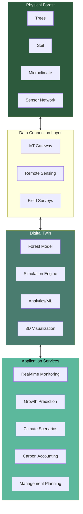
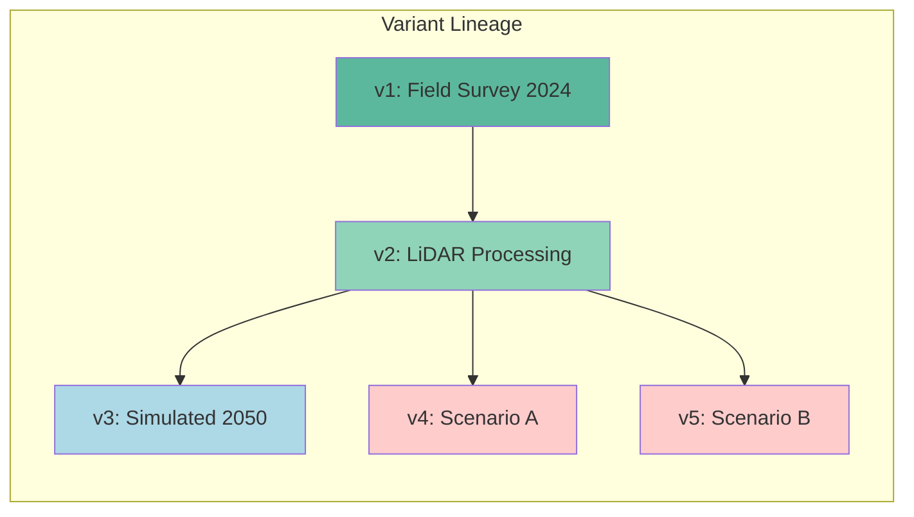
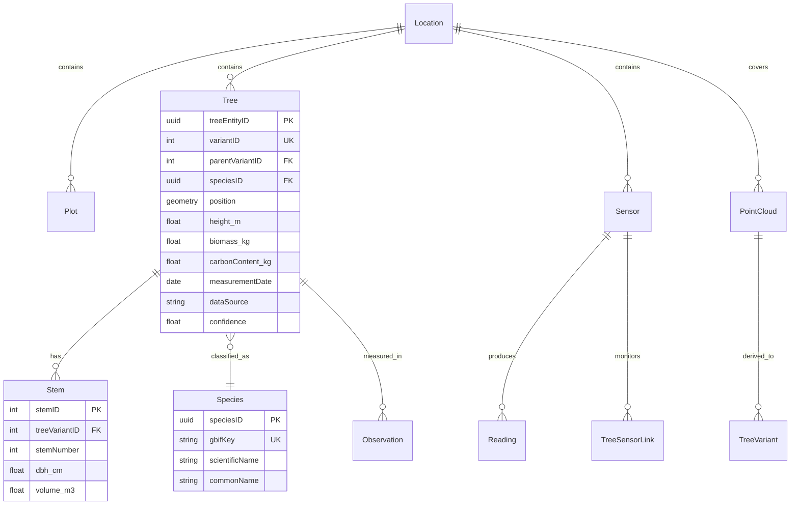
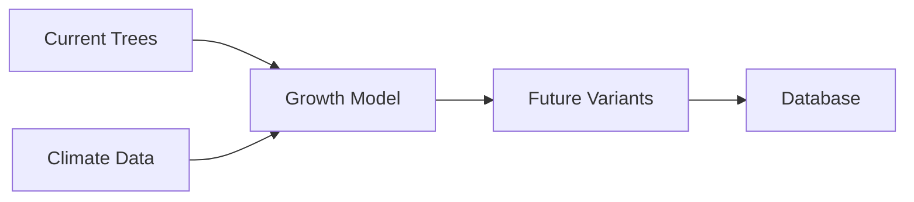

# Digital Forest Twin Concept & Standard Requirements

A proposal for standardizing digital forest twin implementations based on literature review and analysis of existing systems.

---

## Table of Contents

1. [Executive Summary](#executive-summary)
2. [What is a Forest Digital Twin?](#what-is-a-forest-digital-twin)
3. [Proposed Standard Architecture](#proposed-standard-architecture)
4. [Core Data Model Requirements](#core-data-model-requirements)
5. [Current Implementation Assessment](#current-implementation-assessment)
6. [Gap Analysis & Recommendations](#gap-analysis--recommendations)
7. [Implementation Roadmap](#implementation-roadmap)

---

## Executive Summary

A forest digital twin is a virtual representation of a physical forest ecosystem that mirrors its state in near real-time, enables simulation of future scenarios, and supports data-driven decision making. Based on analysis of ISO 23247, CityGML, OGC standards, and forest research literature, this document proposes requirements for a standardized forest digital twin architecture.

### Key Findings

| Aspect | Current Status | Standard Requirement | Gap Level |
|--------|---------------|---------------------|-----------|
| **Entity Model** | ✅ Excellent | Trees, stems, sensors, point clouds | Low |
| **Temporal Versioning** | ✅ Excellent | Variant-based lineage | Low |
| **Spatial Data** | ✅ Excellent | PostGIS geometry | Low |
| **Audit Trail** | ✅ Excellent | Field-level tracking | Low |
| **Sensor Integration** | ✅ Good | Real-time monitoring | Low |
| **Species Taxonomy** | ⚠️ Partial | GBIF/Darwin Core alignment | Medium |
| **Ontology/Semantics** | ❌ Missing | RDF/OWL semantic layer | High |
| **Carbon Accounting** | ⚠️ Partial | UNFCCC LULUCF compliance | Medium |
| **3D Visualization** | ⚠️ Partial | CityGML/3D Tiles export | Medium |
| **Simulation Engine** | ❌ Missing | Process-based growth models | High |
| **Climate Integration** | ❌ Missing | Climate scenario data | High |
| **Interoperability APIs** | ⚠️ Partial | OGC API compliance | Medium |

---

## What is a Forest Digital Twin?

### Definition

A **Forest Digital Twin** is a cyber-physical system comprising:

1. **Physical Entity** - The real forest ecosystem (trees, soil, atmosphere, fauna)
2. **Virtual Entity** - A digital representation mirroring the physical state
3. **Data Connection** - Bidirectional data flows between physical and virtual
4. **Services** - Analytics, simulation, and decision support capabilities

### Key Characteristics

Based on ISO 23247 and forest research literature:



### Four-Layer Architecture (per Sasaki & Abe 2025)

| Layer | Function | Components |
|-------|----------|------------|
| **Physical** | Data acquisition | Drones, IoT sensors, ground surveys |
| **Data** | Secure transmission | Data standards, validation, storage |
| **Intelligence** | AI-driven analysis | ML models, simulation, prediction |
| **Application** | User services | Dashboards, APIs, decision support |

---

## Proposed Standard Architecture

Based on analysis of ISO 23247, CityGML, OGC APIs, and forest research, a forest digital twin standard should address:

### 1. Entity Model Layer

#### 1.1 Tree Entity Requirements

A standard tree model must support:

| Attribute Category | Required Attributes | Standard Reference |
|--------------------|--------------------|--------------------|
| **Identity** | Persistent UUID, local identifier | ISO 23247 |
| **Taxonomy** | Species, GBIF ID, scientific name | Darwin Core |
| **Position** | Lat/lon, elevation, CRS | OGC SF |
| **Morphology** | Height, DBH, crown dimensions | CityGML Vegetation |
| **Stem Details** | Multi-stem support, taper, straightness | CityGML LOD4 |
| **Health** | Status, health score, stress indicators | - |
| **Carbon** | Biomass, carbon content, sequestration rate | IPCC Guidelines |
| **Provenance** | Measurement date, method, confidence | ISO 19115 |
| **Lifecycle** | Age, mortality date, growth history | - |

**Graph Structure (per Ambarwari et al. 2024):**

```
Tree
├── Root System (optional)
├── Trunk
│   ├── Multiple Stems (1:n)
│   └── Bark Characteristics
└── Crown
    ├── Branch Structure
    ├── Twigs
    └── Foliage
```

#### 1.2 Environmental Sensor Requirements

| Attribute | Description | Standard |
|-----------|-------------|----------|
| Sensor ID | Persistent identifier | ISO 23247 |
| Type | Temperature, humidity, CO2, etc. | OGC SensorThings |
| Location | Position with CRS | OGC SF |
| Reading | Value, unit, timestamp, quality | OGC SensorThings |
| Calibration | Date, parameters | - |

#### 1.3 Spatial Unit Requirements

| Entity | Required Attributes |
|--------|---------------------|
| **Forest Stand** | Boundary polygon, area, elevation, slope, aspect |
| **Plot** | Sub-division boundary, plot ID, area |
| **Point Cloud** | Bounds, point count, density, CRS |

### 2. Temporal Versioning Layer

Following ISO 23247 Digital Twin reference architecture:

#### 2.1 Variant Model



**Required Variant Metadata:**

| Field | Description |
|-------|-------------|
| VariantID | Unique identifier |
| ParentVariantID | Link to source variant |
| VariantType | original, processed, simulated, manual |
| ScenarioID | Climate/management scenario reference |
| ProcessID | Algorithm/method reference |
| Timestamp | Creation time |
| ValidFrom/ValidTo | Temporal validity |

#### 2.2 Scenario Support

| Scenario Type | Description | Example |
|---------------|-------------|---------|
| **Baseline** | Current observed state | Current_Conditions |
| **Climate** | Climate projection scenarios | RCP4.5_2050, RCP8.5_2100 |
| **Management** | Silvicultural alternatives | Thinning_2030, Harvest_2040 |
| **Disturbance** | Simulated events | Storm_Scenario, Fire_Risk |

### 3. Semantic Interoperability Layer

#### 3.1 Ontology Requirements

Based on CityGML and OWL best practices:

```
ForestOntology
├── Tree
│   ├── hasSpecies -> Species (GBIF aligned)
│   ├── hasLocation -> Point (GeoSPARQL)
│   ├── hasMeasurement -> Observation (SOSA/SSN)
│   └── hasCarbon -> CarbonStock (custom)
├── Sensor
│   ├── observes -> ObservableProperty (SOSA)
│   ├── madeObservation -> Observation
│   └── isHostedBy -> Platform
└── ForestStand
    ├── contains -> Tree (1:n)
    └── hasClimate -> ClimateData
```

**Recommended Ontologies:**

| Ontology | Use Case |
|----------|----------|
| **GeoSPARQL** | Spatial relationships |
| **SOSA/SSN** | Sensor observations |
| **Darwin Core** | Species taxonomy |
| **PROV-O** | Provenance |
| **TIME** | Temporal relations |

#### 3.2 Taxonomy Alignment

| Standard | Purpose | Integration |
|----------|---------|-------------|
| **GBIF Backbone** | Species validation | speciesKey lookup |
| **NCBI Taxonomy** | Genetic context | taxonID |
| **PLANTS Database** | Regional species | symbol codes |

### 4. Interoperability API Layer

#### 4.1 Required OGC APIs

| API | Function | Priority |
|-----|----------|----------|
| **OGC API - Features** | Tree/sensor CRUD operations | High |
| **OGC API - SensorThings** | Real-time sensor data | High |
| **OGC API - 3D GeoVolumes** | Point cloud access | Medium |
| **OGC API - Tiles** | Efficient 2D/3D tiling | Medium |
| **OGC API - Processes** | Simulation execution | Low |

#### 4.2 Data Exchange Formats

| Format | Use Case |
|--------|----------|
| **GeoJSON** | Simple features, trees, sensors |
| **CityJSON** | 3D city/forest models |
| **LAS/LAZ** | Point clouds |
| **COG** | Cloud-optimized rasters |
| **Parquet** | Time series data |

### 5. Simulation & Analytics Layer

#### 5.1 Growth Model Requirements

| Model Category | Examples | Output |
|----------------|----------|--------|
| **Empirical** | Site index curves, yield tables | Height, volume projections |
| **Process-based** | 3D-CMCC, iLand, FORMIND | Carbon flux, mortality |
| **Hybrid** | ML + process constraints | Calibrated predictions |

#### 5.2 Carbon Accounting

**IPCC Tier 3 Requirements:**

| Component | Calculation | Data Need |
|-----------|-------------|-----------|
| Above-ground biomass | Allometric equations | DBH, height, species |
| Below-ground biomass | Root:shoot ratios | Above-ground biomass |
| Dead organic matter | Decay models | Deadwood inventory |
| Soil organic carbon | Flux measurements | Soil sensors |

### 6. Audit & Provenance Layer

#### 6.1 Required Audit Information

| Field | Description | Standard |
|-------|-------------|----------|
| UserID | Who made change | ISO 27001 |
| Timestamp | When changed | ISO 8601 |
| FieldName | What changed | - |
| OldValue/NewValue | Before/after | - |
| ChangeReason | Why changed | - |
| IPAddress | Origin tracking | - |
| Method | How (manual, automated) | PROV-O |

---

## Core Data Model Requirements

### Minimum Viable Forest Digital Twin

A standards-compliant Forest Digital Twin MUST implement:



### Extended Forest Digital Twin

An advanced implementation SHOULD also include:

| Domain | Entities | Purpose |
|--------|----------|---------|
| **Phenology** | PhenologyObservations | Seasonal development |
| **Deadwood** | Deadwood | Carbon pools, biodiversity |
| **Understory** | GroundVegetation | Ecosystem composition |
| **Disturbance** | DisturbanceEvents | Event tracking |
| **Management** | ManagementEvents | Intervention history |
| **Imagery** | Images | Visual documentation |
| **Climate** | ClimateScenarios | Future projections |

---

## Current Implementation Assessment

### XR Future Forests Lab Database Analysis

Based on review of the database schema ([database-schema.md](database-schema.md)):

#### Strengths (Aligned with Standards)

| Requirement | Implementation | Assessment |
|-------------|----------------|------------|
| **Persistent Tree Identity** | `TreeEntityID` (UUID) | ✅ Excellent |
| **Variant Lineage** | `ParentVariantID`, `VariantTypeID` | ✅ Excellent |
| **Multi-Stem Support** | `Stems` table with stem numbers | ✅ Excellent |
| **Spatial Data** | PostGIS geometry, WGS84 + original CRS | ✅ Excellent |
| **Morphology Attributes** | Height, crown, taper, straightness, bark | ✅ Excellent |
| **Audit Trail** | Field-level AuditLog with junction tables | ✅ Excellent |
| **Sensor Integration** | Sensors, SensorReadings, SensorTreeLinks | ✅ Good |
| **Campaign Tracking** | Campaigns table with methodology | ✅ Excellent |
| **Data Provenance** | MeasurementDate, DataSourceType, confidence scores | ✅ Excellent |
| **Carbon Fields** | Biomass_kg, CarbonContent_kg | ✅ Good |
| **Environmental Data** | Environments with soil nutrients, climate | ✅ Good |
| **Point Cloud Management** | PointClouds with scanner metadata | ✅ Excellent |
| **Phenology** | PhenologyObservations table | ✅ Good |
| **Deadwood** | Deadwood table with decay classification | ✅ Good |
| **Ground Vegetation** | GroundVegetation table | ✅ Good |
| **Disturbance Events** | DisturbanceEvents with tree damage links | ✅ Excellent |
| **Management Events** | ManagementEvents table | ✅ Good |
| **Imagery** | Images table with camera metadata | ✅ Good |

#### Partial Implementation

| Requirement | Current State | Gap |
|-------------|---------------|-----|
| **Species Taxonomy** | Local SpeciesID, no GBIF key | Add GBIFKey column |
| **REST API** | PostgREST auto-generated | Add OGC API compliance |
| **3D Export** | Point clouds stored, no CityGML | Add CityJSON export |
| **Climate Scenarios** | Scenarios table exists, limited data | Integrate climate data |
| **Process-based Models** | Processes table for tracking | Implement growth engines |

#### Missing Components

| Requirement | Impact | Priority |
|-------------|--------|----------|
| **Semantic Layer (RDF/OWL)** | Limits interoperability with other systems | Medium |
| **OGC SensorThings API** | Standard sensor data access | High |
| **Growth Simulation Engine** | Cannot predict future states | High |
| **Climate Data Integration** | Cannot run climate scenarios | High |
| **Carbon Flux Calculation** | Limited carbon accounting | Medium |
| **CityGML/CityJSON Export** | 3D model interoperability | Medium |

---

## Gap Analysis & Recommendations

### Priority 1: High Impact, Lower Effort

#### 1.1 Add GBIF Species Key

**Current:** Species table with local IDs  
**Required:** GBIF backbone alignment for interoperability

```sql
ALTER TABLE shared.species 
ADD COLUMN gbif_key INTEGER,
ADD COLUMN gbif_match_confidence FLOAT;

-- Index for efficient lookups
CREATE INDEX idx_species_gbif ON shared.species(gbif_key);
```

**Benefit:** Enables species validation, global interoperability

#### 1.2 OGC SensorThings API

**Current:** Custom REST endpoints via PostgREST  
**Required:** Standardized sensor data access

**Options:**

- Deploy FROST-Server as SensorThings API
- Create database views matching SensorThings data model
- Add STAplus extension for additional features

#### 1.3 Carbon Calculation Functions

**Current:** Static Biomass_kg, CarbonContent_kg fields  
**Required:** Dynamic calculation based on allometric equations

```sql
CREATE OR REPLACE FUNCTION trees.calculate_biomass(
    species_id INTEGER,
    dbh_cm FLOAT,
    height_m FLOAT
) RETURNS FLOAT AS $$
DECLARE
    a FLOAT; b FLOAT; c FLOAT;
BEGIN
    -- Get species-specific allometric parameters
    SELECT biomass_a, biomass_b, biomass_c 
    INTO a, b, c
    FROM shared.species WHERE speciesid = species_id;
    
    -- Apply allometric equation: a * DBH^b * Height^c
    RETURN a * POWER(dbh_cm, b) * POWER(height_m, c);
END;
$$ LANGUAGE plpgsql;
```

### Priority 2: High Impact, Higher Effort

#### 2.1 Growth Simulation Engine

**Current:** ProcessID tracks algorithms, no execution  
**Required:** Process-based or empirical growth models

**Recommended Approach:**

1. Integrate with Python-based growth models (e.g., TreeGrowthSim)
2. Create Deno Edge Function for growth simulation
3. Store results as new tree variants with VariantType = 'simulated_growth'

**Data Flow:**



#### 2.2 Climate Data Integration

**Current:** ClimateZones reference table only  
**Required:** Time-series climate data for scenarios

**Schema Extension:**

```sql
CREATE TABLE shared.climate_scenarios (
    scenario_id SERIAL PRIMARY KEY,
    scenario_name VARCHAR(100) NOT NULL,  -- 'RCP4.5_2050', 'RCP8.5_2100'
    source VARCHAR(255),  -- 'CMIP6', 'Euro-CORDEX'
    location_id INTEGER REFERENCES shared.locations(locationid)
);

CREATE TABLE shared.climate_projections (
    projection_id SERIAL PRIMARY KEY,
    scenario_id INTEGER REFERENCES shared.climate_scenarios(scenario_id),
    year INTEGER NOT NULL,
    month INTEGER,
    temperature_c FLOAT,
    precipitation_mm FLOAT,
    co2_ppm FLOAT
);
```

#### 2.3 Semantic Layer (RDF/OWL)

**Current:** Relational model only  
**Required:** Semantic web interoperability

**Options:**

1. **Ontop** - Virtual RDF layer over PostgreSQL
2. **RML Mapping** - Transform DB to RDF on export
3. **GraphDB/Neo4j** - Parallel graph database

### Priority 3: Medium Impact

#### 3.1 CityGML/CityJSON Export

**Current:** No 3D model export  
**Required:** Standard 3D format for visualization

**Implementation:**

- Create PostgreSQL function generating CityJSON
- Map tree attributes to CityGML Vegetation LOD1-4
- Include point cloud references

#### 3.2 OGC API - Features Compliance

**Current:** PostgREST auto-generated API  
**Required:** Full OGC API compliance

**Options:**

1. **pygeoapi** - Python-based OGC API server
2. **ldproxy** - Java-based OGC API implementation
3. **Custom Kong plugins** - Extend existing API gateway

---

## Implementation Roadmap

### Phase 1: Foundation Enhancement (3-6 months)

| Task | Effort | Dependencies |
|------|--------|--------------|
| Add GBIF species key column | Low | None |
| Create biomass/carbon calculation functions | Low | None |
| Add allometric parameters to Species table | Low | None |
| Create basic growth projection function | Medium | Allometrics |
| Document OGC API mapping | Low | None |

**Deliverables:**

- Species table with GBIF validation
- Automated carbon stock calculations
- Simple empirical growth projections

### Phase 2: Standards Compliance (6-12 months)

| Task | Effort | Dependencies |
|------|--------|--------------|
| Deploy OGC SensorThings API | Medium | Sensor data |
| Create CityJSON export function | Medium | Tree data |
| Integrate climate scenario data | Medium | Data sources |
| Implement semantic mapping (RDF views) | High | Ontology design |

**Deliverables:**

- Standards-compliant sensor data API
- 3D model export capability
- Climate-aware scenario modeling

### Phase 3: Advanced Analytics (12-24 months)

| Task | Effort | Dependencies |
|------|--------|--------------|
| Process-based growth model integration | High | Climate data |
| Carbon flux calculation pipeline | High | Sensor data + models |
| Disturbance simulation engine | High | Growth models |
| Full OGC API suite | High | All layers |

**Deliverables:**

- Process-based forest dynamics simulation
- UNFCCC-compliant carbon reporting
- Complete OGC API ecosystem

---

## Conclusion

The XR Future Forests Lab database provides an **excellent foundation** for a standards-compliant forest digital twin, with strong implementations of:

- ✅ Persistent tree identity (TreeEntityID)
- ✅ Temporal versioning (variant lineage)
- ✅ Multi-stem tree model
- ✅ Comprehensive audit trail
- ✅ Spatial data management
- ✅ Sensor integration framework

Key gaps to address for full standards compliance:

1. **High Priority:** Growth simulation engine, climate data integration, OGC SensorThings API
2. **Medium Priority:** Semantic layer (RDF/OWL), CityGML export, carbon flux calculations
3. **Lower Priority:** Full OGC API suite, process-based modeling

The proposed roadmap provides a path from current state to a fully standards-compliant forest digital twin capable of:

- Real-time ecosystem monitoring
- Climate scenario simulation
- Carbon accounting for policy compliance
- Interoperable data exchange with global systems

---

## References

1. ISO 23247:2021 - Automation systems and integration — Digital twin framework for manufacturing
2. OGC CityGML 3.0 - <https://www.ogc.org/standard/citygml/>
3. OGC API - Features - <https://ogcapi.ogc.org/features/>
4. OGC SensorThings API - <https://www.ogc.org/standard/sensorthings/>
5. Darwin Core Standard - <https://dwc.tdwg.org/>
6. GBIF Backbone Taxonomy - <https://www.gbif.org/dataset/d7dddbf4-2cf0-4f39-9b2a-bb099caae36c>
7. IPCC Guidelines for National Greenhouse Gas Inventories - <https://www.ipcc-nggip.iges.or.jp/>

---

*Document Version: 1.0 | Created: February 2026*
