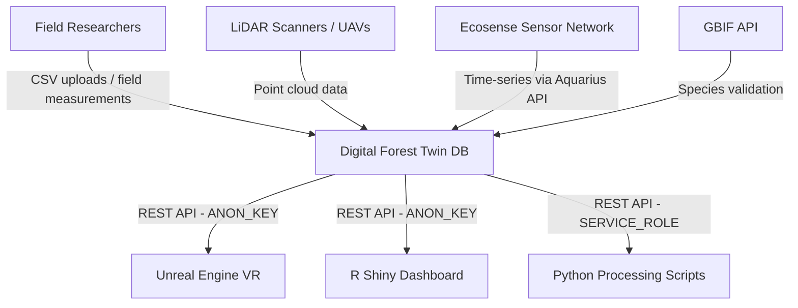
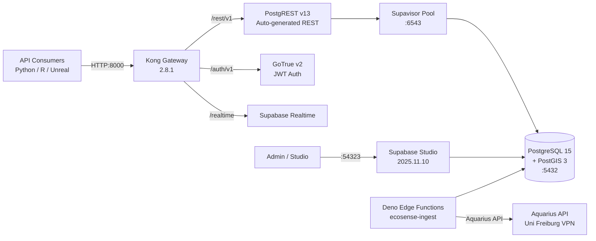
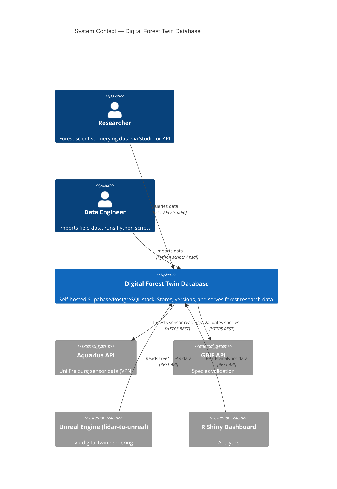
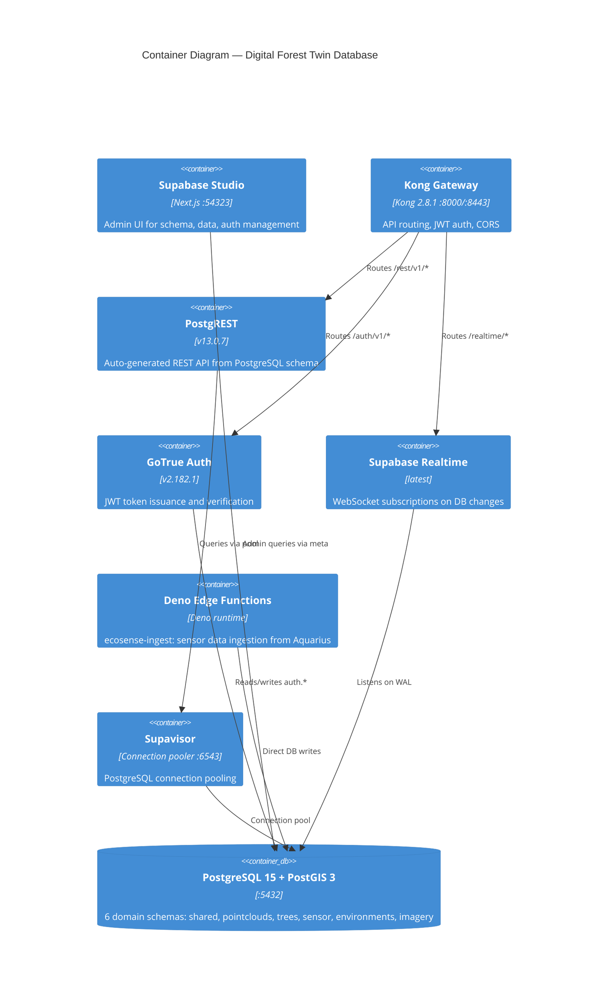
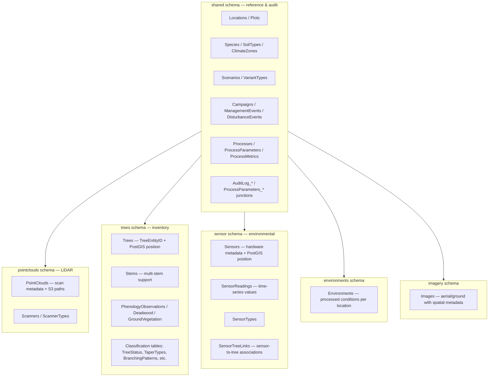
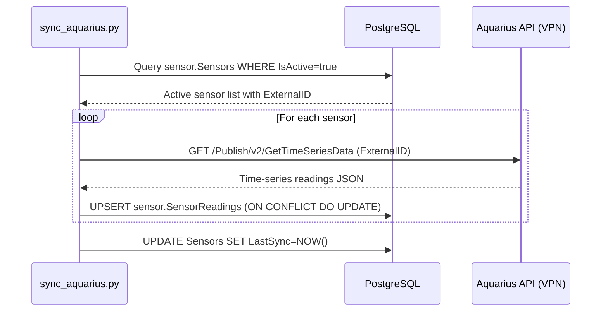
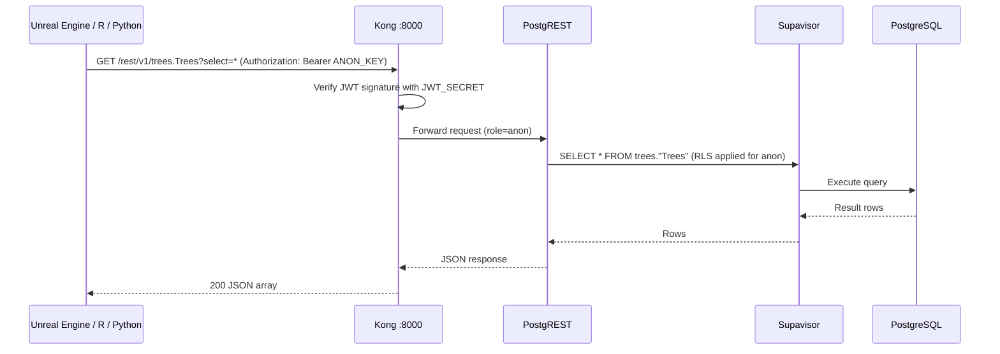
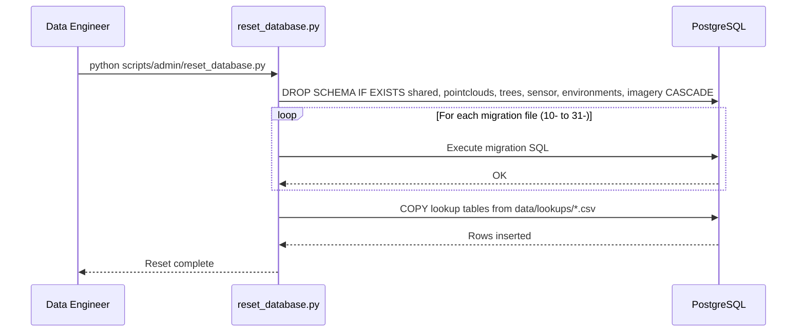

# Software Architecture Document: Digital Forest Twin Database

**Document Version:** 1.0
**Date:** 2026-05-11
**Status:** Active
**Architecture Framework:** arc42 (simplified)
**Standard Compliance:** ISO/IEC/IEEE 42010:2022

<!-- SCOPE: System architecture (arc42 structure), C4 diagrams (Context, Container, Component), runtime scenarios, crosscutting concepts (security, error handling, configuration), ADR references ONLY. -->
<!-- DOC_KIND: explanation -->
<!-- DOC_ROLE: canonical -->
<!-- READ_WHEN: Read when you need the system model, boundaries, runtime flow, or design rationale. -->
<!-- SKIP_WHEN: Skip when you only need operational steps or API/database lookup details. -->
<!-- PRIMARY_SOURCES: docs/project/requirements.md, docs/project/tech_stack.md, docs/ARCHITECTURE.md -->

<!-- DO NOT add here: Deployment procedures → docs/project/deployment-guide.md, Schema details → docs/database-schema.md, API specs → docs/api-quick-reference.md, Requirements → requirements.md, Tech stack versions → tech_stack.md -->

<!-- NO_CODE_EXAMPLES: Architecture documentation describes DECISIONS and CONTRACTS, not implementations.
     FORBIDDEN: Import statements, function bodies, code blocks > 5 lines
     ALLOWED: Component responsibility tables, Mermaid diagrams, method signatures (1 line), ADR links -->

## Quick Navigation

- [Docs Hub](../README.md)
- [Requirements](requirements.md)
- [Tech Stack](tech_stack.md)
- [Database Schema](../database-schema.md)
- [Patterns Catalog](../architecture/patterns_catalog.md)
- [Deployment Guide](deployment-guide.md)

## Agent Entry

| Signal | Value |
|--------|-------|
| Purpose | Explains system structure, container boundaries, runtime behavior, and architectural decisions for the Digital Forest Twin Database. |
| Read When | You need mental models, component boundaries, schema organization, or cross-cutting concerns. |
| Skip When | You only need endpoint lists, schema column lookup, or deployment commands. |
| Canonical | Yes |
| Next Docs | [Requirements](requirements.md), [Tech Stack](tech_stack.md), [Database Schema](../database-schema.md) |
| Primary Sources | `docs/project/requirements.md`, `docs/project/tech_stack.md`, `docs/ARCHITECTURE.md` |

---

## 1. Introduction and Goals

### 1.1 Requirements Overview

The Digital Forest Twin Database stores and exposes multi-temporal, multi-variant forest research data for the University of Freiburg XR Future Forests Lab (funded by Eva Mayr-Stihl Stiftung). Key requirements:

- Spatially-aware storage of trees, LiDAR point clouds, sensors, and imagery using PostGIS
- Variant-based lineage tracking to support multiple analysis scenarios and temporal versioning
- Auto-generated REST API (PostgREST) consumed by Unreal Engine, R dashboards, and Python scripts
- Automated ingestion of Aquarius sensor time-series data
- Row-level security separating read-only researcher access from admin/service operations

### 1.2 Quality Goals

| Priority | Quality Goal | Target |
|----------|-------------|--------|
| 1 | Data Integrity | Variant lineage and audit trail complete; no orphaned records |
| 2 | Spatial Accuracy | All geometry stored in original CRS + WGS84 reprojected form |
| 3 | Operational Simplicity | Single `docker compose up -d` brings full stack; one-command reset |
| 4 | API Reliability | PostgREST available within 60s of stack start; authenticated access enforced |
| 5 | Idempotent Operations | All import scripts safe to re-run without data duplication |

### 1.3 Stakeholders

| Stakeholder | Concern |
|-------------|---------|
| Forest Researchers (XR Future Forests Lab) | Data accuracy, query access, species/plot correctness |
| XR Future Forests Lab (Uni Freiburg) | System reliability, pipeline integration |
| Downstream Consumers | Stable REST API contracts, public view availability |
| Data Engineers | Import tooling, schema migrations, reset scripts |
| Max Sperlich (Technical Lead) | Architecture decisions, deployment, maintenance |

---

## 2. Constraints

### 2.1 Technical Constraints

| Constraint | Reason |
|------------|--------|
| PostgreSQL 15 + PostGIS 3 | Required for spatial data types and extensions used throughout |
| Self-hosted Supabase (Docker Compose) | Data sovereignty — no cloud egress of research data |
| Single-host deployment | Current project scale does not require horizontal scaling |
| Aquarius API VPN dependency | University network constraint for sensor data access |
| PascalCase table/column naming | Established convention across all existing schemas |

### 2.2 Organizational Constraints

| Constraint | Detail |
|------------|--------|
| University of Freiburg infrastructure | Data must remain on-premises |
| Small team | Operational complexity must be minimal |
| Research project lifecycle | Schema must support multi-campaign temporal evolution |

### 2.3 Conventions

| Area | Convention |
|------|-----------|
| SQL naming | PascalCase tables and columns, snake_case for schemas |
| Migrations | Ordered numeric prefix: `10-`, `11-`, ..., `31-` |
| Spatial data | Always store `SourceCRS` (EPSG code) alongside geometry |
| Variant IDs | UUID type; `VariantID` is the record key; `ParentVariantID` links to previous version |
| Audit trail | All write operations trigger `shared.AuditLog_*` inserts |
| Secrets | Never committed; managed via `docker/.env` (git-ignored) |

---

## 3. Context and Scope

### 3.1 Business Context

The Digital Forest Twin Database sits at the center of the XR Future Forests pipeline, receiving data from field instruments and LiDAR scanners, and serving it to visualization and analysis consumers.

**Business Context Diagram:**

**External Interfaces:**

| System | Direction | Protocol | Purpose |
|--------|-----------|----------|---------|
| Aquarius API (Uni Freiburg) | Inbound | HTTPS REST | Sensor time-series ingestion |
| GBIF API | Outbound | HTTPS REST | Species name validation |
| Unreal Engine (lidar-to-unreal) | Outbound | REST API | LiDAR and tree data for VR |
| R Shiny Dashboard | Outbound | REST API | Forest analytics and visualization |
| Python scripts (growpy, pylometree) | Outbound | REST API / psql | Tree growth simulation and volume calculation |

### 3.2 Technical Context

---

## 4. Solution Strategy

### 4.1 Technology Decisions

| Decision | Choice | Rationale |
|----------|--------|-----------|
| Database | PostgreSQL 15 + PostGIS | ACID compliance, native spatial types, mature ecosystem |
| API layer | PostgREST (auto-generated) | Zero-code REST from schema; schema changes automatically reflected |
| API gateway | Kong 2.8.1 | JWT key-auth, CORS, routing, rate limiting without custom middleware |
| Auth | GoTrue (Supabase Auth) | JWT issuance, RLS integration, standard OAuth2 flow |
| Containerization | Docker Compose | Single-host simplicity; Supabase official self-hosting method |
| Edge Functions | Deno (TypeScript) | Sensor ingestion logic close to database; Supabase native |
| Connection pooling | Supavisor | Handles high connection counts from PostgREST and scripts |

### 4.2 Top-Level Decomposition

**Three-layer architecture:**

1. **Gateway layer** — Kong routes and authenticates all external traffic
2. **Service layer** — PostgREST, GoTrue, Realtime, Edge Functions (stateless, auto-scaling within Docker)
3. **Data layer** — PostgreSQL 15 + PostGIS, 6 domain schemas, migrations-based schema management

### 4.3 Approach to Quality Goals

| Quality Goal | Mechanism |
|-------------|-----------|
| Data Integrity | `VariantID`/`ParentVariantID` chain + audit triggers + FK constraints |
| Spatial Accuracy | PostGIS geometry columns + `SourceCRS` tracking on all spatial tables |
| Operational Simplicity | Docker Compose single command; numbered migration files; reset script |
| API Reliability | Kong health checks; PostgREST schema cache; Supavisor pooling |
| Idempotency | Upsert-based import scripts; ON CONFLICT DO UPDATE patterns |

---

## 5. Building Block View

### 5.1 Level 1: System Context (C4 Model)

The Digital Forest Twin Database is a black-box data service within the XR Future Forests ecosystem.

### 5.2 Level 2: Container Diagram (C4 Model)

### 5.3 Level 3: Component Diagram — PostgreSQL Schema Layer

**Key Components:**

| Component | Responsibility | Key Tables |
|-----------|---------------|------------|
| `shared` schema | Reference data and audit infrastructure used by all domains | `Locations`, `Species`, `Scenarios`, `AuditLog_*` |
| `pointclouds` schema | LiDAR scan metadata, file paths, variant tracking | `PointClouds`, `Scanners` |
| `trees` schema | Individual tree inventory, multi-stem, morphology, phenology | `Trees`, `Stems`, `PhenologyObservations` |
| `sensor` schema | Sensor hardware and time-series readings; Aquarius integration | `Sensors`, `SensorReadings`, `SensorTreeLinks` |
| `environments` schema | Processed environmental conditions per location/variant | `Environments` |
| `imagery` schema | Aerial and ground imagery with spatial metadata | `Images` |
| Import scripts | CSV ingestion for trees and sensors; GBIF validation | `scripts/import/` |
| Admin scripts | Database reset, lookup refresh | `scripts/admin/` |
| Edge Functions | Deno TypeScript for Aquarius sensor ingestion | `docker/volumes/functions/` |

---

## 6. Runtime View

### 6.1 Scenario: Sensor Data Ingestion (Aquarius Sync)

### 6.2 Scenario: REST API Data Query (Downstream Consumer)

### 6.3 Scenario: Database Reset and Migration

---

## 7. Crosscutting Concepts

### 7.1 Security Concept

| Concern | Mechanism |
|---------|-----------|
| API Authentication | JWT signed with `JWT_SECRET`; verified by Kong on every request |
| Role separation | `anon` role (read-only via RLS), `service_role` (full access) |
| Row-Level Security | RLS policies in `docker/volumes/db/init/20-rls-policies.sql` applied per-table |
| Secret management | All secrets in `docker/.env` (git-ignored); `.env.example` shows structure only |
| VPN-gated integration | Aquarius API only reachable on Uni Freiburg network |

### 7.2 Error Handling Concept

| Context | Mechanism |
|---------|-----------|
| Edge Function API calls | Exponential backoff via `docker/volumes/functions/_shared/retry.ts` `withRetry()` |
| Import script failures | Python `try/except` with rollback; idempotent upserts prevent partial state |
| Database errors | PostgreSQL constraint violations surface as PostgREST 4xx responses |
| Migration errors | Numbered migration files applied in order; reset script re-runs from scratch |

### 7.3 Configuration Management

| Concern | Mechanism |
|---------|-----------|
| Environment variables | `docker/.env` (local); `docker/.env.example` (template in Git) |
| Schema exposure | `PGRST_DB_SCHEMAS` env var controls which schemas PostgREST serves |
| Connection pooling | `POOLER_DEFAULT_POOL_SIZE=20`, `POOLER_MAX_CLIENT_CONN=100` in `.env` |
| Port configuration | Kong: 8000/8443; Supavisor: 6543; Studio: 54323; PostgreSQL: 5432 |

### 7.4 Data Access Pattern

| Pattern | Detail |
|---------|--------|
| REST via PostgREST | Schema-driven, auto-generated; no custom controllers |
| Direct psql | Admin operations, migrations, reset — authenticated via `POSTGRES_PASSWORD` |
| Python scripts | `psycopg2` for bulk imports; `supabase-py` for REST API operations |
| R clients | `RPostgres` / `DBI` for direct DB access; `httr` for REST API |
| Variant pattern | All queryable data versions accessed by `VariantID`; parent chain via `ParentVariantID` |

---

## 8. Architecture Decisions (ADRs)

Formal ADRs are in `docs/reference/adrs/`. Key decisions:

| ADR | Decision | Rationale Summary |
|-----|----------|-------------------|
| [ADR-001](../reference/adrs/adr-001-postgresql-postgis.md) | PostgreSQL 15 + PostGIS 3 | Spatial query support, PostgREST compatibility, open source |
| [ADR-002](../reference/adrs/adr-002-supabase-auth.md) | GoTrue JWT auth | JWT-native PostgREST integration; no session storage |
| [ADR-003](../reference/adrs/adr-003-self-hosted-supabase.md) | Self-hosted Supabase | Data sovereignty; university network; offline capability |
| [ADR-004](../reference/adrs/adr-004-kong-api-gateway.md) | Kong declarative gateway | Supabase-native; declarative config; single entry point |
| [ADR-005](../reference/adrs/adr-005-supavisor-pooler.md) | Supavisor connection pooler | Multi-tenant; already in Supabase stack; replaces PgBouncer |

Additional implicit decisions not yet formalized as ADRs:

| Decision | Choice | Rationale |
|----------|--------|-----------|
| PascalCase naming | PascalCase for all tables/columns | Established in earliest migrations; consistent with initial schema design |
| Variant lineage pattern | `VariantID`/`ParentVariantID` on data tables | Supports multi-scenario forest simulation and temporal analysis |

---

## 9. Quality Requirements

### 9.1 Quality Tree

| Dimension | Goal | Approach |
|-----------|------|---------|
| Data Integrity | No orphaned variants; complete audit trail | FK constraints + audit triggers + numbered migrations |
| Spatial Accuracy | Geometry stored with original + WGS84 CRS | `SourceCRS` column + PostGIS reprojection at query time |
| Maintainability | Reset in < 5 minutes; migrations easy to extend | Numbered SQL files; single reset script |
| API Stability | REST schema stable across script versions | PostgREST versioning; public views decouple consumers from internal schema |
| Resilience | Sensor sync survives transient Aquarius failures | Exponential backoff retry in Edge Function and Python sync scripts |

### 9.2 Quality Scenarios

| ID | Scenario | Expected Outcome |
|----|----------|-----------------|
| QS-1 | Researcher queries `trees.Trees` for a location | Returns correct rows; RLS prevents access to other roles' data |
| QS-2 | Aquarius API times out during sync | `withRetry` retries up to 3× with exponential backoff; error logged |
| QS-3 | Data engineer re-runs `import_trees.py` on existing data | No duplicate rows; existing records updated via upsert |
| QS-4 | Admin runs `reset_database.py` | Full stack reset in < 5 minutes with all lookups populated |
| QS-5 | New schema migration added (`32-*.sql`) | Applied in correct order on next reset; no conflicts with existing tables |

---

## 10. Risks and Technical Debt

### 10.1 Known Technical Risks

| Risk | Severity | Detail |
|------|----------|--------|
| Single-host deployment | Medium | No failover; disk failure = data loss without backup |
| Aquarius API coupling | Medium | VPN dependency; API changes break sensor ingestion |
| PascalCase quoting | Low | Every SQL query must double-quote identifiers; error-prone for new contributors |

### 10.2 Technical Debt

| Item | Impact | Recommendation |
|------|--------|---------------|
| No automated backup | High data-loss risk | Add `pg_dump` cron job to Docker setup |
| No migration framework (e.g., Flyway) | Manual ordering fragile | Adopt Flyway or Supabase CLI migrations |
| Implicit ADRs | Onboarding friction | Formalize top 5 decisions as ADR documents in `docs/reference/adrs/` |
| Deno functions not versioned independently | Deployment coupling | Tag function versions in `deno.json` |

---

## 11. Glossary

| Term | Definition |
|------|------------|
| arc42 | Architecture documentation framework (ISO/IEC/IEEE 42010:2022 compliant) |
| C4 Model | Context, Container, Component, Code — hierarchical architecture diagram model |
| Container | Deployable/runnable unit in C4 Model (NOT a Docker container specifically) |
| Variant | A versioned data record linked to its parent via `ParentVariantID` |
| PostGIS | PostgreSQL spatial extension providing geometry types and spatial functions |
| PostgREST | Middleware auto-generating REST API from PostgreSQL schema |
| GoTrue | Supabase authentication service (JWT issuance and verification) |
| Supavisor | Supabase connection pooler (replaces PgBouncer) |
| RLS | Row-Level Security — PostgreSQL feature enforcing per-row access control |
| WAL | Write-Ahead Log — PostgreSQL mechanism enabling Realtime subscriptions |
| Campaign | Named data collection event grouping measurements taken together |
| TreeEntityID | Persistent UUID identifying a physical tree across measurement campaigns |

---

## 12. References

1. arc42 Architecture Template v8.2 — https://arc42.org/
2. C4 Model for Visualizing Software Architecture — https://c4model.com/
3. ISO/IEC/IEEE 42010:2022 — Architecture description
4. Supabase Self-Hosting Docs — https://supabase.com/docs/guides/self-hosting/docker
5. PostgREST Documentation — https://postgrest.org/
6. Digital Forest Twin Database Architecture Overview — [docs/ARCHITECTURE.md](../ARCHITECTURE.md)
7. Digital Forest Twin Database Requirements — [docs/project/requirements.md](requirements.md)

---

## Maintenance

**Last Updated:** 2026-05-11

**Update Triggers:**
- New schemas or tables added (update Section 5 Component diagram)
- New external system integrations (update Section 3 Context diagram)
- New Docker containers added to `docker-compose.yml` (update Section 5.2 Container diagram)
- Formal ADRs created (link in Section 8)
- Architecture decisions change

**Verification:**
- [x] C4 diagrams (Context, Container, Component) consistent with `docker-compose.yml`
- [x] Runtime scenarios cover main use cases
- [x] All external systems documented
- [x] No placeholder values remain

---

## Revision History

| Version | Date | Author | Changes |
|---------|------|--------|---------|
| 1.0 | 2026-05-11 | ln-112-project-core-creator | Initial version |
