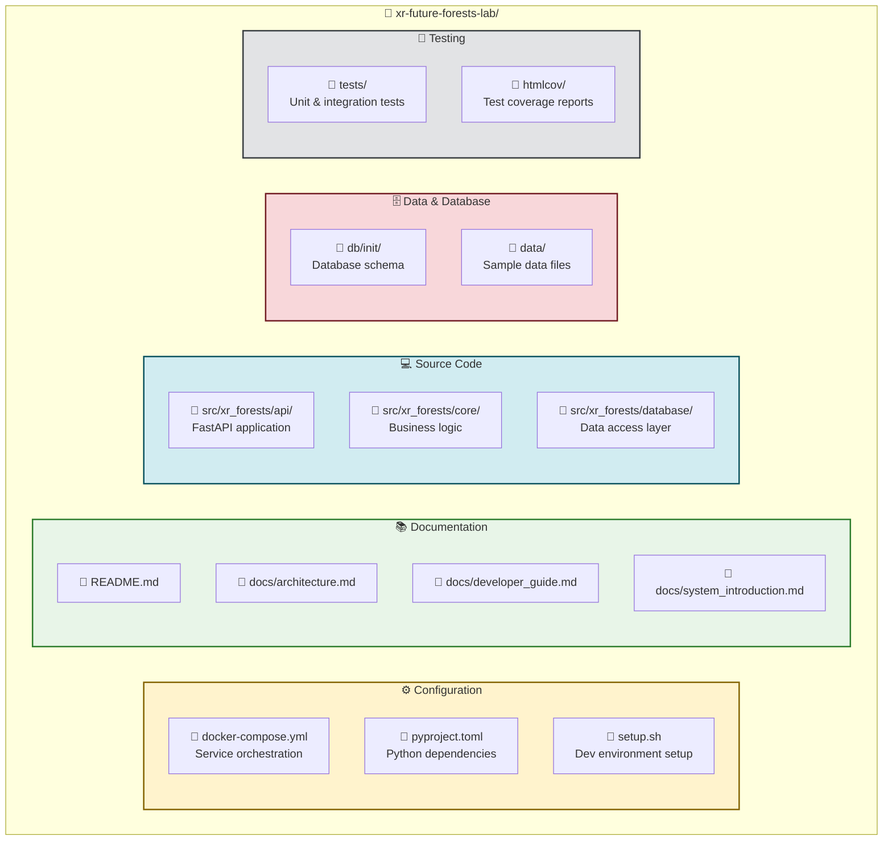
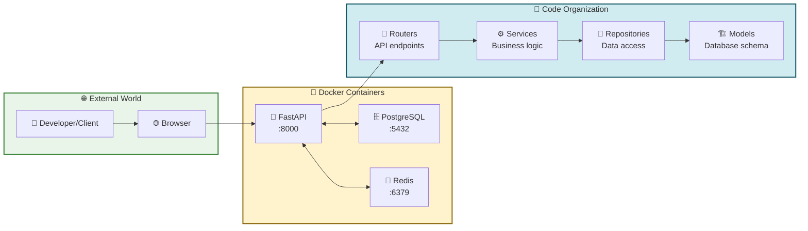
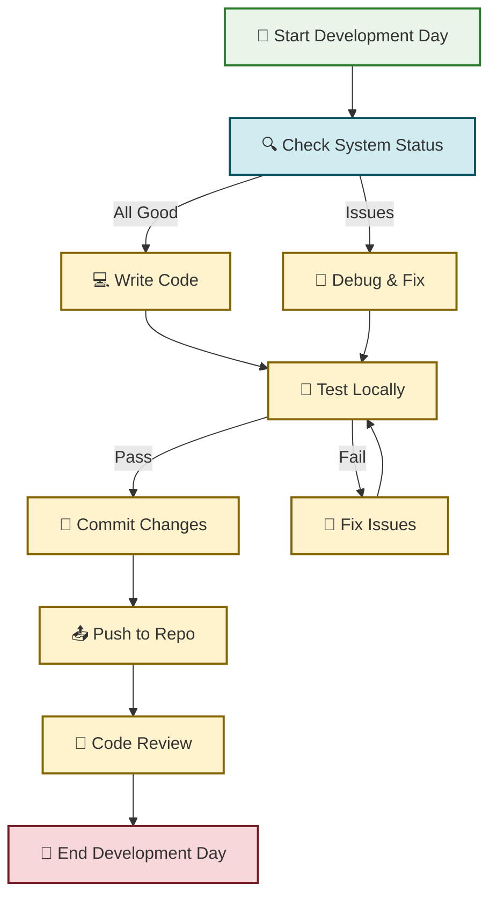
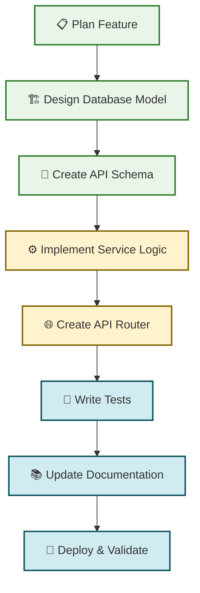

# XR Future Forests Lab - Project Structure & Development Workflow

> **Focus**: Visual project structure understanding and practical development workflow  
> **Target Audience**: New developers joining the project  
> **Complements**: [Developer Guide](./developer_guide.md) and [System Introduction](./system_introduction.md)

This document provides a visual overview of the project structure and a practical development workflow for new team members.

## 🏗️ **Project Architecture Overview**

### **Physical Project Structure**



### **Component Interaction Flow**



## 🚀 **Development Workflow**

### **Daily Development Cycle**



### **Feature Development Process**



## 🛠️ **Essential Development Commands**

### **Environment Setup**

```bash
# Initial setup
git clone <repository-url>
cd xr-future-forests-lab
./setup.sh

# Start development environment
docker-compose up -d

# Check all services are running
docker-compose ps
```

### **Daily Development Commands**

```bash
# Check system health
curl http://localhost:8000/health

# View logs (when debugging)
docker-compose logs api
docker-compose logs postgres

# Database access
docker exec -it xr_forests_db psql -U forests_user -d xr_forests_lab

# Run tests
python -m pytest tests/

# Restart services (when making changes)
docker-compose restart api
```

### **Development Tools Access**

| Tool | URL/Command | Purpose |
|------|-------------|---------|
| **API Documentation** | <http://localhost:8000/docs> | Interactive API testing |
| **Database** | `docker exec -it xr_forests_db psql -U forests_user -d xr_forests_lab` | Direct database access |
| **Redis CLI** | `docker exec -it xr_forests_redis redis-cli` | Event bus debugging |
| **Test Coverage** | `open htmlcov/index.html` | View test coverage reports |

## 📁 **Key File Locations**

### **For API Development**

```bash
src/xr_forests/api/
├── main.py                 # FastAPI app factory & configuration
├── routers/
│   ├── __init__.py        # Router registration
│   ├── health.py          # Health check endpoints
│   └── locations.py       # Location CRUD endpoints
```

### **For Business Logic**

```bash
src/xr_forests/core/
├── models/                # Database table definitions
│   ├── location.py        # Location model
│   ├── tree.py           # Tree model
│   └── ...
├── schemas/               # API request/response schemas
│   ├── location.py        # Location API schemas
│   └── ...
└── services/              # Business logic
    ├── location_service.py # Location operations
    └── ...
```

### **For Database Management**

```bash
db/init/
└── 01-init-schema.sql     # Database schema initialization

src/xr_forests/database/
├── connection.py          # Database connection management
└── repositories/          # Data access patterns
```

## 🔄 **Common Development Scenarios**

### **Adding a New API Endpoint**

1. **Define the database model** in `src/xr_forests/core/models/`
2. **Create API schemas** in `src/xr_forests/core/schemas/`
3. **Implement service logic** in `src/xr_forests/core/services/`
4. **Create router endpoints** in `src/xr_forests/api/routers/`
5. **Register router** in `src/xr_forests/api/routers/__init__.py`
6. **Include router** in `src/xr_forests/api/main.py`
7. **Write tests** in `tests/`

### **Debugging Issues**

1. **Check service logs**: `docker-compose logs [service-name]`
2. **Verify database connection**: `docker exec -it xr_forests_db pg_isready`
3. **Test API endpoints**: Use <http://localhost:8000/docs>
4. **Check data integrity**: Connect to database and inspect tables

### **Performance Testing**

1. **Load test API**: Use curl, Postman, or automated tools
2. **Monitor database**: Check query performance with EXPLAIN
3. **Redis monitoring**: Use `redis-cli monitor` for event tracking

## 🎯 **Next Steps for New Developers**

1. **✅ Complete the setup**: Follow the commands above
2. **📖 Read the comprehensive guides**:
   - [Developer Guide](./developer_guide.md) - In-depth development instructions
   - [System Introduction](./system_introduction.md) - Technology explanations
3. **🧪 Try creating a new feature**: Start with a simple endpoint
4. **🤝 Join the development workflow**: Start contributing to the project

## 📚 **Additional Resources**

- **[README.md](../README.md)**: Project overview and quick start
- **[Architecture Documentation](./architecture.md)**: Detailed system design
- **[Database Design](./database_design.md)**: Schema and data modeling
- **[API Documentation](http://localhost:8000/docs)**: Live API interface (when running)

---

**💡 Pro Tip**: Keep this visual guide open alongside your code editor for quick reference to project structure and development workflows!
