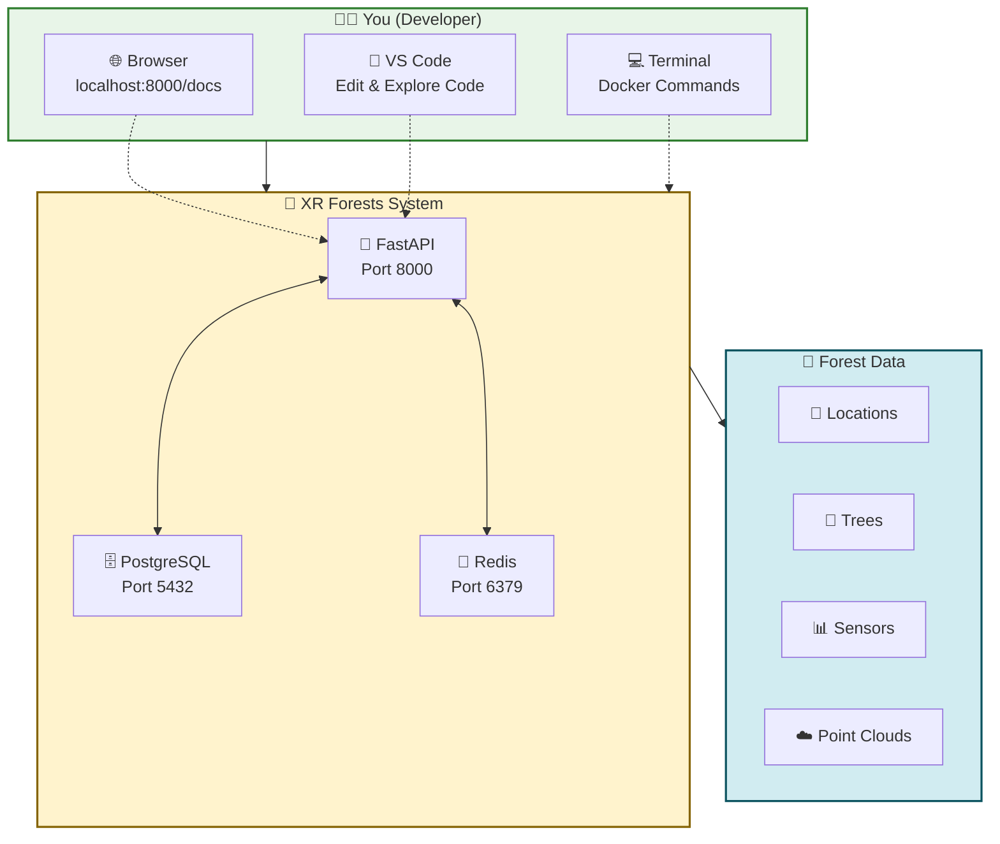
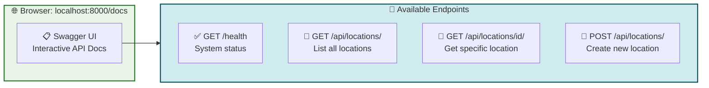
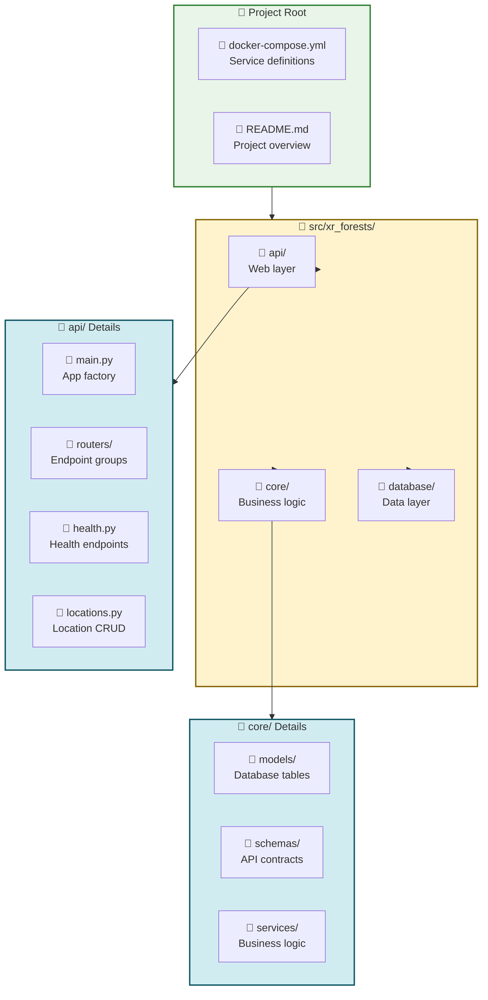

# XR Future Forests Lab - Visual Quick Start Guide

> **Perfect for**: Developers who want to dive in quickly and understand by doing  
> **Time to complete**: 15-20 minutes  
> **Related docs**: [README.md](../README.md) | [Developer Guide](./developer_guide.md) | [System Introduction](./system_introduction.md)

This guide provides a visual, hands-on approach to getting started with the XR Future Forests Lab project.

---

## 🚀 **60-Second Project Overview**



**What you'll learn**: How to interact with a real forest data management system through APIs, databases, and modern web technologies.

---

## 🎯 **Step 1: Launch the System (2 minutes)**

### **Start Everything**

```bash
# Clone the repository (if not done already)
git clone <repository-url>
cd xr-future-forests-lab

# Start all services with one command
docker-compose up -d

# Verify everything is running
docker-compose ps
```

### **Expected Output**

```bash
NAME                 IMAGE                    PORTS
xr_forests_api       xr_forests_api:latest    0.0.0.0:8000->8000/tcp
xr_forests_db        postgis/postgis:15-3.3   0.0.0.0:5432->5432/tcp
xr_forests_redis     redis:7-alpine           0.0.0.0:6379->6379/tcp
```

✅ **Success check**: All three containers should show "Up" status.

---

## 🔍 **Step 2: Explore the API (5 minutes)**

### **Quick Health Check**

```bash
curl http://localhost:8000/health
```

**Expected Response**:

```json
{
  "status": "healthy",
  "service": "XR Future Forests Lab API",
  "version": "1.0.0"
}
```

### **Interactive API Documentation**

1. **Open your browser**: <http://localhost:8000/docs>
2. **You'll see**: Interactive Swagger UI with all available endpoints



### **Try Your First API Call**

1. Click on **GET /api/locations/**
2. Click **"Try it out"**
3. Click **"Execute"**
4. See the response (should be an empty list initially)

---

## 🗄️ **Step 3: Understand the Database (3 minutes)**

### **Connect to Database**

```bash
# Connect using Docker
docker exec -it xr_forests_db psql -U forests_user -d xr_forests_lab

# Or connect using any PostgreSQL client:
# Host: localhost, Port: 5432
# Database: xr_forests_lab
# Username: forests_user
# Password: forests_password
```

### **Explore the Schema**

```sql
-- See all tables
\dt

-- Look at the locations table structure
\d locations

-- Check if there's any data
SELECT COUNT(*) FROM locations;

-- Exit
\q
```

**What you'll see**: Tables for locations, trees, sensors, point_clouds, and species - the foundation for forest data management.

---

## 🧪 **Step 4: Create Your First Forest Location (5 minutes)**

### **Using the API Documentation (Recommended)**

1. **Go to**: <http://localhost:8000/docs>
2. **Find**: POST /api/locations/
3. **Click**: "Try it out"
4. **Replace the example** with this test data:

```json
{
  "location_name": "Test Forest Plot A1",
  "description": "My first test forest location for learning the API",
  "plot_boundary": {
    "type": "Polygon",
    "coordinates": [[
      [7.8516, 48.0089],
      [7.8520, 48.0089],
      [7.8520, 48.0092],
      [7.8516, 48.0092],
      [7.8516, 48.0089]
    ]]
  },
  "center_point": {
    "type": "Point",
    "coordinates": [7.8518, 48.0090]
  }
}
```

5. **Click**: "Execute"
6. **See**: Your created location with a generated UUID

### **Using cURL (Alternative)**

```bash
curl -X POST "http://localhost:8000/api/locations/" \
  -H "Content-Type: application/json" \
  -d '{
    "location_name": "Test Forest Plot A1",
    "description": "My first test forest location",
    "plot_boundary": {
      "type": "Polygon", 
      "coordinates": [[[7.8516,48.0089],[7.8520,48.0089],[7.8520,48.0092],[7.8516,48.0092],[7.8516,48.0089]]]
    },
    "center_point": {
      "type": "Point",
      "coordinates": [7.8518, 48.0090]
    }
  }'
```

### **Verify Your Data**

1. **API**: Go back to GET /api/locations/ and execute - you should see your location
2. **Database**: Connect to database and run `SELECT * FROM locations;`

---

## 📁 **Step 5: Explore the Code Structure (5 minutes)**



### **Key Files to Explore**

1. **`src/xr_forests/api/main.py`** - FastAPI app setup
2. **`src/xr_forests/api/routers/locations.py`** - Location endpoints  
3. **`src/xr_forests/core/models/location.py`** - Database model
4. **`src/xr_forests/core/schemas/location.py`** - API schemas
5. **`docker-compose.yml`** - Service configuration

**Quick exploration path**:

```bash
# Look at the main app structure
cat src/xr_forests/api/main.py

# See how location endpoints are defined
cat src/xr_forests/api/routers/locations.py

# Understand the database model
cat src/xr_forests/core/models/location.py
```

---

## 🎓 **What You've Learned**

✅ **System Architecture**: Three-tier architecture with FastAPI, PostgreSQL, and Redis  
✅ **API Interaction**: How to create and retrieve forest location data  
✅ **Database Structure**: Spatial data storage for forest management  
✅ **Development Tools**: Docker for consistent development environment  
✅ **Code Organization**: Clean separation between API, business logic, and data layers

---

## 🚀 **Next Steps**

### **Immediate Next Actions**

1. **Read**: [Developer Guide](./developer_guide.md) for in-depth development workflow
2. **Explore**: [System Introduction](./system_introduction.md) for technology deep-dive
3. **Try**: Creating different types of forest data (trees, sensors, point clouds)

### **Development Challenges**

1. **Add a new endpoint**: Try creating a GET /api/locations/search endpoint
2. **Database exploration**: Add sample tree data linked to your location
3. **Real-time features**: Experiment with Redis for event publishing

### **Learning Resources**

- **FastAPI Documentation**: <https://fastapi.tiangolo.com/>
- **PostGIS Spatial Queries**: <https://postgis.net/documentation/>
- **Docker Compose**: <https://docs.docker.com/compose/>

---

## 🔧 **Troubleshooting**

### **Common Issues**

**🚨 Container won't start**:

```bash
# Check logs
docker-compose logs api
docker-compose logs postgres

# Restart services
docker-compose down
docker-compose up -d
```

**🚨 API returns 500 error**:

```bash
# Check database connection
docker exec -it xr_forests_db pg_isready -U forests_user

# Check API logs
docker-compose logs api
```

**🚨 Can't connect to database**:

```bash
# Verify database is running
docker-compose ps postgres

# Try connecting directly
docker exec -it xr_forests_db psql -U forests_user -d xr_forests_lab
```

### **Getting Help**

- Check the [Developer Guide](./developer_guide.md) for detailed troubleshooting
- Review [System Introduction](./system_introduction.md) for architecture understanding
- Look at container logs: `docker-compose logs [service-name]`

---

**🎉 Congratulations!** You now have a working understanding of the XR Future Forests Lab system and can start exploring and developing with confidence!
