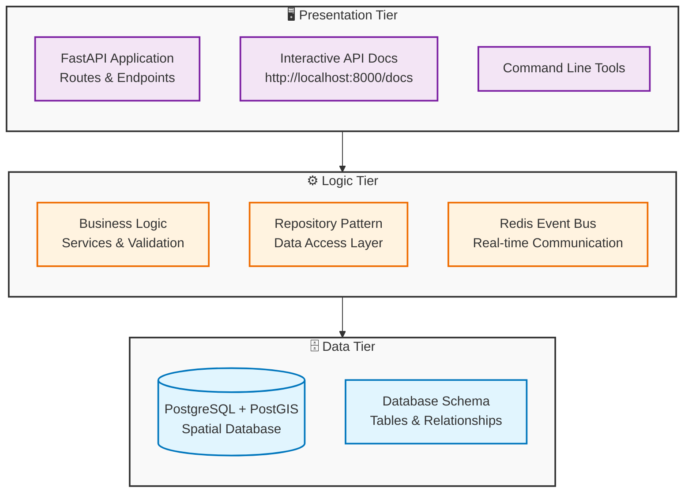
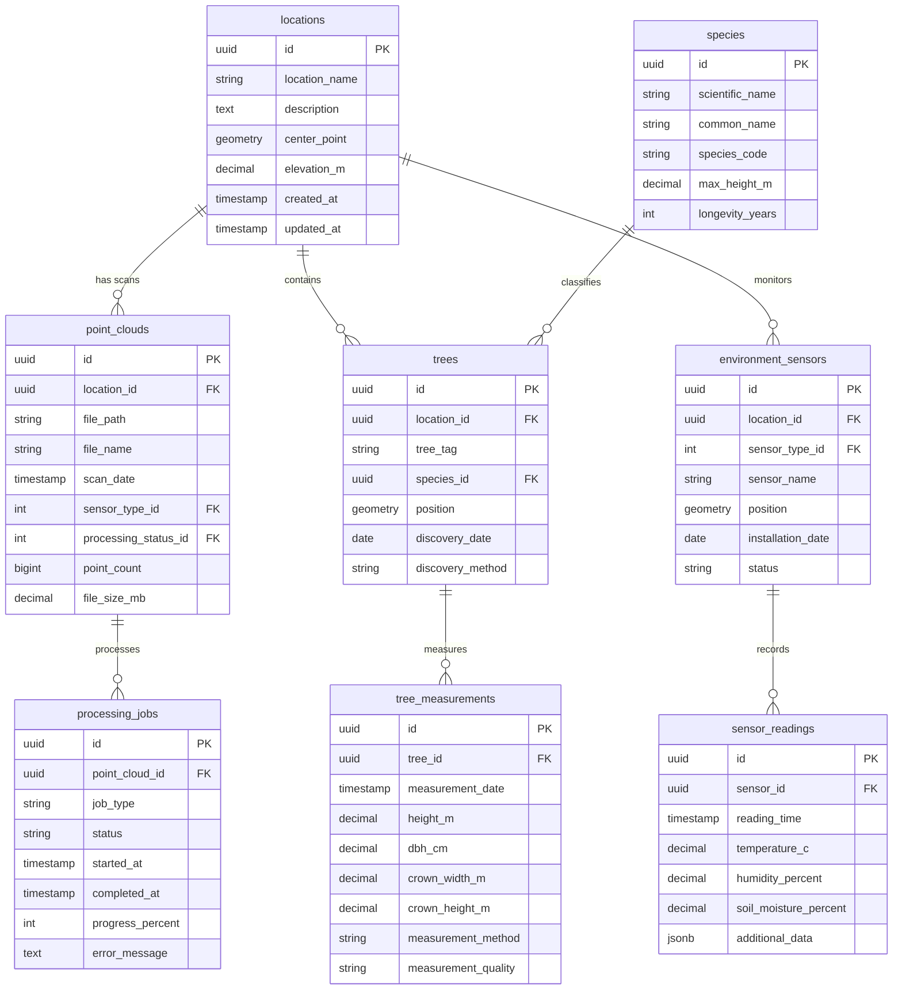
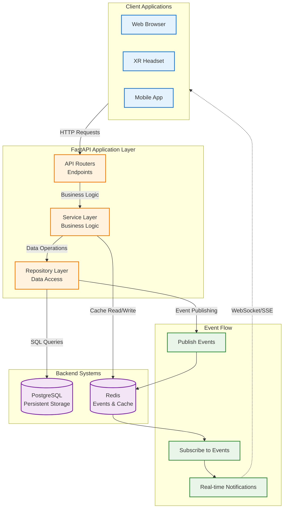
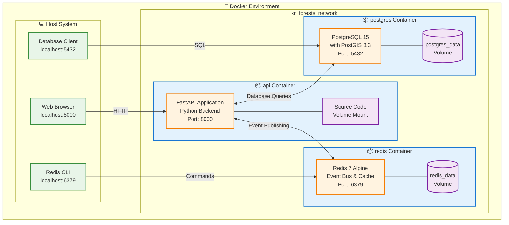
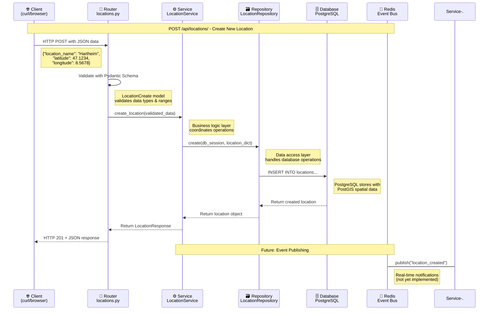

# Technology Stack and Data Flow Introduction

> **For newcomers to APIs, databases, and messaging systems**  
> **Related Documentation**: [Architecture](./architecture.md) | [Database Design](./database_design.md) | [Event Bus Alternatives](./event_bus_alternatives.md)

This document provides a beginner-friendly introduction to the key technologies in your XR Future Forests Lab system, explaining what they do, how they work together, and how data flows through the entire system.

---

## 🎯 **What Are We Building?**

Your XR Future Forests Lab is a system that:

1. **Collects** forest data from multiple sources:
   - **Point Cloud Data**: LiDAR scan metadata and processing status
   - **Tree Records**: Individual tree measurements and spatial positioning
   - **Environmental Data**: Sensor readings and environmental monitoring
   - **Forest Inventory**: Traditional field survey measurements

2. **Processes** this data through API-driven pipelines:
   - Tree data management with spatial queries using PostGIS
   - Environmental data aggregation and time-series storage
   - Background job processing for data workflows

3. **Presents** results through REST API interfaces:
   - RESTful API endpoints for data access and manipulation
   - Real-time event communication via Redis
   - Database-driven spatial queries and analytics

Think of it like a digital foundation for forest data management that can support future XR applications and advanced analytics.

**Current MVP Implementation**: The system currently includes a working FastAPI application with PostgreSQL/PostGIS database, Redis for events, and basic CRUD operations for locations and trees. You can explore the actual code to understand these concepts hands-on.

---

## 🧩 **Key Technologies Explained**

The XR Future Forests Lab follows a **three-tier architecture** that separates concerns across different layers:

- **🗄️ Data Tier**: Handles data storage and ingestion
- **⚙️ Logic Tier**: Processes data and runs simulations  
- **🖥️ Presentation Tier**: Provides user interfaces and visualization



Let's explore the key technologies in each tier:

### **Databases: Your Data Storage (Data Tier)**

A **database** is like a super-organized filing cabinet that can instantly find any piece of information you need.

#### **PostgreSQL** - Your Main Database

- **What it is**: A powerful, reliable database that stores structured data in tables (like Excel spreadsheets)
- **What it stores in your system**:
  - Tree information (species, location, measurements)
  - Sensor data (environmental readings, scan metadata)
  - Processing job status and results
  - User information and permissions

```
Think of it like this:
📊 Excel Spreadsheet = Database Table
📋 Row in Excel = Record in Database  
📝 Column in Excel = Field in Database
🗂️ Multiple Excel files = Multiple Database Tables
```

#### **Your Current MVP Database Structure**

The system currently implements a unified database with tables representing the three logical database concepts:



**Key Database Concepts Demonstrated**:

1. **Point Cloud Tables**: Stores LiDAR scan metadata and processing job tracking
   - `point_clouds`: File references, scan metadata, processing status
   - `processing_jobs`: Background job tracking for data processing workflows

2. **Tree Tables**: Stores individual tree records and measurements
   - `trees`: Individual tree records with spatial positioning using PostGIS
   - `tree_measurements`: Biometric measurements over time with quality indicators
   - `species`: Tree species reference data with growth characteristics

3. **Environment Tables**: Stores sensor readings and environmental data
   - `environment_sensors`: Sensor device inventory and positioning
   - `sensor_readings`: Time-series environmental measurements
   - `locations`: Shared spatial reference table with PostGIS geometry support

**Hands-on Learning**: You can explore the complete database schema in `db/init/01-init-schema.sql` and see how PostGIS handles spatial data types.

### **APIs: How Different Parts Talk to Each Other (Logic + Presentation Tier)**

An **API** (Application Programming Interface) is like a waiter in a restaurant - it takes your order, goes to the kitchen, and brings back your food. It's how different software components communicate.

The current MVP implements a **FastAPI application** that demonstrates core concepts:

- **REST API endpoints**: Standardized HTTP-based data access
- **Database connection management**: Async PostgreSQL connections with connection pooling
- **Data validation**: Pydantic schemas for request/response validation
- **Dependency injection**: Clean separation of concerns with FastAPI's dependency system

#### **REST APIs** - Your Main Communication Method

- **What they are**: A standardized way for software to request and receive data
- **How they work**: Using HTTP requests (the same technology that loads web pages)

**Current MVP API endpoints** (you can try these now!):

```http
GET /health                    → "Check if the API is running" 
GET /api/locations            → "Get all forest locations"
GET /api/locations/{id}       → "Get a specific location" 
POST /api/locations           → "Create a new forest location"
```

**Hands-on Learning**:

- Explore the API code in `src/xr_forests/api/main.py`
- See router implementations in `src/xr_forests/api/routers/`
- Try the interactive API docs at `http://localhost:8000/docs` when running

#### **Data Contracts** - The Rules for Communication

Think of these as "conversation rules" that ensure everyone speaks the same language.

**Example - Creating a new forest location (actual MVP implementation):**

```json
{
  "location_name": "Hartheim Research Plot",
  "description": "University of Freiburg forest research site",
  "latitude": 47.1234,
  "longitude": 8.5678,
  "elevation_m": 305.2
}
```

**What you get back:**

```json
{
  "id": "d4f89e7c-123a-4567-8901-234567890abc",
  "location_name": "Hartheim Research Plot", 
  "description": "University of Freiburg forest research site",
  "elevation_m": 305.2,
  "center_point": null,
  "created_at": "2025-06-13T14:30:00Z",
  "updated_at": "2025-06-13T14:30:00Z"
}
```

**Hands-on Learning**: Check out the Pydantic schemas in `src/xr_forests/core/schemas/location.py` to see how data validation works.

### **Current MVP API Architecture**

The current implementation demonstrates key API concepts through a focused set of endpoints:

#### **Key Elements You Can Explore Now**

- **Endpoints**: URLs in `src/xr_forests/api/routers/` (locations.py, health.py)
- **Methods**: GET, POST operations implemented with FastAPI decorators
- **Request/Response Formats**: JSON schemas defined with Pydantic models
- **Dependency Injection**: Database sessions and services injected via FastAPI's Depends()
- **Status Codes**: Automatic HTTP status handling by FastAPI

#### **Current Implemented API Patterns**

#### **1. Health Check API** - System Status

**File**: `src/xr_forests/api/routers/health.py`

**Purpose**: Simple endpoint to verify the API is running

```python
@router.get("/health")
async def health_check():
    return {"status": "healthy", "service": "XR Future Forests Lab API", "version": "1.0.0"}
```

#### **2. CRUD API Pattern** - Location Management

**File**: `src/xr_forests/api/routers/locations.py`

**Purpose**: Demonstrates Create, Read operations for forest locations

**Current Endpoints**:

```http
GET /api/locations/           → List all locations
GET /api/locations/{id}       → Get specific location  
POST /api/locations/          → Create new location
```

**What you can learn**:

- Async database operations with SQLAlchemy
- Request/response validation with Pydantic
- Dependency injection for database sessions
- Service layer pattern for business logic

#### **Understanding FastAPI Routers**

**What is a Router?**

A **router** in FastAPI is like a mini-application that groups related endpoints together. Think of it as organizing your API into logical sections - like having different departments in a company.

```mermaid
flowchart LR
    subgraph MAIN["FastAPI Main Application"]
        APP[main.py<br/>App Configuration]
    end
    
    subgraph ROUTERS["Router Modules"]
        HEALTH[health_router<br/>/health]
        LOCATIONS[locations_router<br/>/api/locations/*]
        FUTURE[future_router<br/>/api/trees/*<br/>/api/sensors/*]
    end
    
    subgraph ENDPOINTS["Generated Endpoints"]
        E1[GET /health]
        E2[GET /api/locations/]
        E3[GET /api/locations/{id}]
        E4[POST /api/locations/]
        E5[GET /api/trees/]
        E6[GET /api/sensors/]
    end
    
    APP --> HEALTH
    APP --> LOCATIONS
    APP --> FUTURE
    
    HEALTH --> E1
    LOCATIONS --> E2
    LOCATIONS --> E3
    LOCATIONS --> E4
    FUTURE -.-> E5
    FUTURE -.-> E6
    
    classDef mainApp fill:#e8f5e8,stroke:#2e7d2e,stroke-width:2px
    classDef router fill:#fff3cd,stroke:#856404,stroke-width:2px
    classDef endpoint fill:#f8d7da,stroke:#721c24,stroke-width:2px
    classDef future fill:#d1ecf1,stroke:#0c5460,stroke-width:2px,stroke-dasharray: 5 5
    
    class APP mainApp
    class HEALTH,LOCATIONS router
    class FUTURE future
    class E1,E2,E3,E4,E5,E6 endpoint
```

**Why Use Routers?**

1. **Organization**: Keep related endpoints together (all location operations in one file)
2. **Modularity**: Easy to add/remove feature sets without affecting other parts
3. **Reusability**: Routers can be included in multiple applications
4. **Maintainability**: Smaller, focused files are easier to understand and modify

**How Routers Work in the Current MVP**:

```python
# File: src/xr_forests/api/routers/locations.py
from fastapi import APIRouter

# Create a router with common settings for all location endpoints
router = APIRouter(
    prefix="/api/locations",  # All endpoints start with /api/locations
    tags=["locations"]        # Groups endpoints in API documentation
)

@router.get("/")              # Becomes GET /api/locations/
async def get_locations():
    # Handle getting all locations
    pass

@router.get("/{location_id}") # Becomes GET /api/locations/{location_id}
async def get_location(location_id: str):
    # Handle getting specific location
    pass
```

**Router Registration in Main App**:

```python
# File: src/xr_forests/api/main.py
from .routers import health_router, locations_router

app = FastAPI(title="XR Future Forests Lab API")

# Include routers - like plugging in modules
app.include_router(health_router)        # Adds /health endpoint
app.include_router(locations_router)     # Adds /api/locations/* endpoints
```

**Benefits You Can See**:

- **Clean URLs**: Automatic prefix handling (`/api/locations/` + `{id}` = `/api/locations/{id}`)
- **Automatic Documentation**: Each router's endpoints appear grouped in `/docs`
- **Dependency Sharing**: Common dependencies (like database sessions) can be shared across router endpoints
- **Easy Testing**: You can test individual routers independently

**Hands-on Learning**:

- Explore `src/xr_forests/api/routers/locations.py` to see a complete router implementation
- Check `src/xr_forests/api/main.py` to see how routers are registered
- Visit `http://localhost:8000/docs` to see how routers organize the API documentation

#### **API Type Comparison**

| API Type | Purpose | When to Use | Example |
|----------|---------|-------------|---------|
| **Data Ingestion** | Import new data | Uploading files, sensor data | Upload LiDAR scans |
| **Processing Pipeline** | Manage background jobs | Heavy computation tasks | Tree identification |
| **Database Update** | Modify stored data | Data corrections, updates | Fix tree measurements |
| **Simulation Control** | Run forest models | Scientific modeling | Growth predictions |
| **Event Bus** | Real-time notifications | Live updates, monitoring | Sensor alerts |
| **REST/GraphQL** | General data access | Web/mobile apps, XR clients | Display tree data |

### **Event Buses: Real-Time Communication**

An **event bus** is like a notification system that tells different parts of your system when something important happens.

#### **Redis** - Your Event Bus (MVP Implementation)

**What is Redis?**

Redis (**RE**mote **DI**ctionary **S**erver) is an in-memory data structure store that can be used as:

- **Database**: Store key-value pairs
- **Cache**: Fast temporary storage
- **Message Broker**: Send messages between different parts of your system

**Why Do You Need Redis (or Similar Event Systems)?**

In modern applications, different components need to communicate **asynchronously**:

1. **Decoupling**: Services don't need to know about each other directly
2. **Scalability**: Multiple services can process events simultaneously
3. **Reliability**: Messages can be queued if a service is temporarily down
4. **Real-time Updates**: Instant notifications to users without constant polling

**Real-World Example**:

```text
Without Event Bus (Polling):
XR Client → "Are there new trees?" → API → Database → "No" (every 5 seconds)

With Event Bus:
Database Update → Redis Event → WebSocket → XR Client → "New tree found!"
```

#### **How Redis Integrates with FastAPI and PostgreSQL**



**1. The Three-Component Architecture**:

```text
PostgreSQL    ←→    FastAPI    ←→    Redis
(Persistent)      (Logic Layer)    (Real-time Events)
```

**2. Current MVP Integration**:

**FastAPI ↔ Redis Connection** (`src/xr_forests/api/main.py`):

```python
import redis.asyncio as redis

# Global Redis connection
redis_client = None

@asynccontextmanager
async def lifespan(app: FastAPI):
    global redis_client
    # Startup: Connect to Redis
    redis_client = redis.from_url(settings.redis_url)
    yield
    # Shutdown: Close Redis connection
    if redis_client:
        await redis_client.close()
```

**3. When and How Each System is Used**:

| **System** | **When Used** | **Example in Forest System** |
|------------|---------------|-------------------------------|
| **PostgreSQL** | Permanent data storage | Store tree measurements, locations |
| **Redis** | Real-time events, temporary data | "New tree detected", cache search results |
| **FastAPI** | Business logic, API endpoints | Validate data, coordinate between systems |

**4. Event Flow in Practice**:

```python
# Example: Location created event
async def create_location(location_data):
    # 1. Save to PostgreSQL (permanent storage)
    location = await save_to_database(location_data)
    
    # 2. Publish event to Redis (real-time notification)
    await redis_client.publish("location_events", {
        "event": "location_created",
        "location_id": location.id,
        "timestamp": datetime.now()
    })
    
    # 3. Return to API client
    return location
```

**5. Why This Architecture Works**:

- **PostgreSQL**: Ensures data is never lost, handles complex queries, spatial operations
- **Redis**: Provides instant notifications, handles temporary data (sessions, cache)
- **FastAPI**: Coordinates between both systems, handles business logic

**Current MVP Status**:

✅ **Configured**: Redis is running and connected  
✅ **Ready**: Connection management in place  
🔄 **Next Step**: Add event publishing when data changes  

**In the current implementation**:

- Redis connection is set up in `src/xr_forests/api/main.py`
- Configuration managed via `config/settings.py`
- Docker service running and health-checked

**Future event examples**:

```text
"New location created" → Notify monitoring systems
"Database updated" → Trigger cache refresh
"Processing job completed" → Update user interface
"System alert" → Notify administrators
```

**Hands-on Learning**:

- Redis is running at `localhost:6379`
- Connect with: `docker exec -it xr_forests_redis redis-cli`
- Try Redis commands: `SET mykey "Hello"` then `GET mykey`
- Explore Redis configuration in `docker-compose.yml`
- Monitor Redis activity: `docker exec -it xr_forests_redis redis-cli MONITOR`

### **Docker: Packaging Your Software**

**Docker** is like shipping containers for software - it packages everything needed to run a piece of software into a portable container.

#### **Docker Compose** - Running Multiple Containers



**What Docker Compose Does**:

- **In your system**: Runs PostgreSQL, Redis, your API server, and other services together
- **Networking**: All containers can communicate using service names
- **Data Persistence**: Volumes ensure data survives container restarts
- **Development**: Code changes are reflected immediately via volume mounts

---

## 🌊 **Data Flow Through Your Current MVP**

Let's trace how data moves through the current implementation with a real example:

### **Scenario: Creating and Retrieving a Forest Location**



#### **Step 1: API Request**

```bash
curl -X POST http://localhost:8000/api/locations/ \
  -H "Content-Type: application/json" \
  -d '{
    "location_name": "Hartheim Research Plot",
    "description": "University research forest site",
    "latitude": 47.1234,
    "longitude": 8.5678,
    "elevation_m": 305.2
  }'
```

#### **Step 2: Data Validation (Pydantic)**

**File**: `src/xr_forests/core/schemas/location.py`

```python
class LocationCreate(BaseModel):
    location_name: str = Field(..., max_length=200)
    description: Optional[str] = None
    latitude: Optional[float] = Field(None, ge=-90, le=90)
    longitude: Optional[float] = Field(None, ge=-180, le=180)
    elevation_m: Optional[float] = None
```

#### **Step 3: Business Logic (Service Layer)**

**File**: `src/xr_forests/core/services/location_service.py`

```python
async def create_location(self, db: AsyncSession, location_data: LocationCreate) -> LocationResponse:
    location_dict = location_data.dict(exclude_unset=True)
    # Convert coordinates to PostGIS geometry
    location = await self.repository.create(db, location_dict)
    return self._to_response(location)
```

#### **Step 4: Database Storage (SQLAlchemy + PostGIS)**

**File**: `src/xr_forests/core/models/location.py`

```python
class Location(Base, TimestampMixin):
    __tablename__ = "locations"
    id = Column(UUID(as_uuid=True), primary_key=True, default=uuid.uuid4)
    location_name = Column(String(200), nullable=False)
    center_point = Column(Geometry("POINT", srid=4326))  # PostGIS spatial data
```

#### **Step 5: Database Query Execution**

```sql
INSERT INTO locations (id, location_name, description, center_point, elevation_m, created_at, updated_at)
VALUES (
    'a1b2c3d4-e5f6-7890-1234-567890abcdef',
    'Hartheim Research Plot',
    'University research forest site',
    ST_SetSRID(ST_MakePoint(8.5678, 47.1234), 4326),
    305.2,
    NOW(),
    NOW()
);
```

#### **Step 6: Response Formation**

```json
{
  "id": "a1b2c3d4-e5f6-7890-1234-567890abcdef",
  "location_name": "Hartheim Research Plot",
  "description": "University research forest site", 
  "elevation_m": 305.2,
  "center_point": null,
  "created_at": "2025-06-13T14:30:00Z",
  "updated_at": "2025-06-13T14:30:00Z"
}
```

---

## 🔄 **System Communication Patterns in the MVP**

### **Current Implementation Patterns**

#### **FastAPI Request Cycle**

1. **HTTP Request** → Router (`src/xr_forests/api/routers/locations.py`)
2. **Dependency Injection** → Database session + Service layer
3. **Pydantic Validation** → Request/response schemas  
4. **Service Layer** → Business logic (`src/xr_forests/core/services/`)
5. **Repository Pattern** → Database operations (`src/xr_forests/database/repositories/`)
6. **SQLAlchemy ORM** → Database queries via async sessions
7. **HTTP Response** → JSON with validated schemas

#### **Key Learning Components**

**1. Async Database Connections**
**File**: `src/xr_forests/database/connection.py`

```python
# Async engine with connection pooling
engine = create_async_engine(
    settings.database_url,
    echo=settings.database_echo,
    pool_pre_ping=True,
    pool_recycle=300
)
```

**2. Dependency Injection**
**File**: `src/xr_forests/api/routers/locations.py`

```python
@router.get("/", response_model=List[LocationResponse])
async def get_locations(
    db: AsyncSession = Depends(get_db),  # Database session injection
    location_service: LocationService = Depends(LocationService)  # Service injection
):
```

**3. Configuration Management**
**File**: `config/settings.py`

```python
class Settings(BaseSettings):
    database_url: str = "postgresql+asyncpg://..."
    redis_url: str = "redis://localhost:6379/0"
    api_host: str = "0.0.0.0"
    
    class Config:
        env_file = ".env"  # Loads from environment variables
```

- **Storage**: PostgreSQL database
- **Examples**: Current tree measurements, active processing jobs
- **Access pattern**: Direct SQL queries through APIs

#### **Warm Data** (Occasionally Accessed)

- **Storage**: File system with database references
- **Examples**: 3D point cloud files, processed imagery
- **Access pattern**: Database metadata + file system retrieval

#### **Cold Data** (Archive/Historical)

- **Storage**: Cloud storage or archive systems
- **Examples**: Old scans, historical measurements
- **Access pattern**: Database pointers + cloud/archive retrieval

---

## 🔧 **Technology Stack Summary**

### **Your System Uses:**

| Component | Technology | Purpose |
|-----------|------------|---------|
| **Database** | PostgreSQL | Store structured data (trees, measurements, jobs) |
| **Event Bus** | Redis Streams | Real-time messaging between components |
| **API Framework** | FastAPI (Python) | Handle HTTP requests and responses |
| **3D Visualization** | Three.js / WebGL | Render 3D forest models in browsers/XR |
| **Containerization** | Docker + Docker Compose | Package and run all services together |
| **Processing** | Python + AI/ML libraries | Analyze point clouds and identify trees |

### **Why These Choices?**

1. **PostgreSQL**: Excellent for complex queries, handles spatial data (forest locations)
2. **Redis**: Super fast for real-time notifications, perfect for XR responsiveness  
3. **FastAPI**: Python-based, automatic API documentation, async support
4. **Docker**: Consistent environment across development and production

---

## 🚀 **Next Steps**

Now that you understand the basics:

1. **Explore the code**: Look at the FastAPI endpoints in your API server
2. **Check the database**: Use a tool like pgAdmin to browse your PostgreSQL tables
3. **Monitor events**: Use Redis CLI or Redis Commander to see events flowing
4. **Test APIs**: Use tools like Postman or curl to make API calls

---

## 💡 **Key Takeaways from the Current MVP**

### **What You Can Learn Hands-On**

| **Concept** | **File to Explore** | **What You'll Learn** |
|-------------|--------------------|-----------------------|
| **FastAPI Application** | `src/xr_forests/api/main.py` | Modern Python web framework with async support |
| **Database Models** | `src/xr_forests/core/models/` | SQLAlchemy ORM with PostGIS spatial data |
| **API Endpoints** | `src/xr_forests/api/routers/` | RESTful API design patterns |
| **Data Validation** | `src/xr_forests/core/schemas/` | Pydantic for request/response validation |
| **Configuration** | `config/settings.py` | Environment-based configuration with Pydantic |
| **Database Schema** | `db/init/01-init-schema.sql` | PostgreSQL with PostGIS spatial extensions |
| **Docker Orchestration** | `docker-compose.yml` | Multi-service containerized applications |
| **Redis Integration** | `src/xr_forests/api/main.py` | Event bus setup and connection management |

### **Core Technology Stack Demonstrated**

- **FastAPI**: Modern, async Python web framework with automatic API documentation
- **PostgreSQL + PostGIS**: Spatial database for forest location data
- **SQLAlchemy**: Python ORM with async support for database operations
- **Pydantic**: Data validation and settings management with type hints
- **Redis**: In-memory data store configured for future event messaging
- **Docker Compose**: Multi-container orchestration for development

### **Architecture Patterns You Can Study**

1. **Three-Tier Architecture**: Clear separation of data, logic, and presentation layers
2. **Repository Pattern**: Database access abstraction in `src/xr_forests/database/repositories/`
3. **Service Layer Pattern**: Business logic separation in `src/xr_forests/core/services/`
4. **Dependency Injection**: Clean component isolation using FastAPI's dependency system
5. **Configuration Management**: Environment-based settings with validation

### **Next Steps for Learning**

1. **Run the system**: `docker-compose up -d` and explore the API at `http://localhost:8000/docs`
2. **Study the code**: Start with `src/xr_forests/api/main.py` and follow the request flow
3. **Database exploration**: Connect to PostgreSQL and examine the spatial data schema
4. **Add features**: Implement new endpoints following the existing patterns
5. **Event integration**: Add Redis publishing when locations are created/updated

The current MVP provides a solid foundation demonstrating production-ready patterns for modern web APIs with spatial data support!
